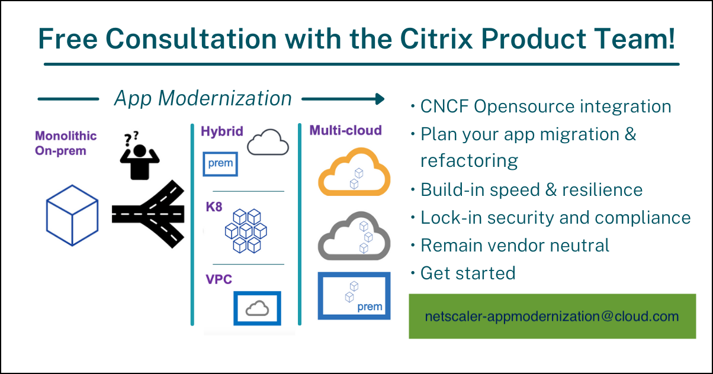

[](https://quay.io/repository/netscaler/netscaler-k8s-ingress-controller)
[](./license/LICENSE)
[](https://github.com/netscaler/netscaler-k8s-ingress-controller/stargazers)
[](http://hits.dwyl.com/netscaler/netscaler-k8s-ingress-controller)
[](https://artifacthub.io/packages/search?repo=netscaler)
---

# NetScaler Ingress Controller

## Description

This repository contains the NetScaler ingress controller built around [Kubernetes Ingress](https://kubernetes.io/docs/concepts/services-networking/ingress/).
### Participate:

   You can reach out for any questions via our email: **netscaler-appmodernization@cloud.com**.

   To enhance our understanding of your Kubernetes/microservices application deployment architecture and provide you with the latest NetScaler capabilities, we kindly request you to fill out [Requirement Gathering Questionnaire](https://docs.google.com/forms/d/e/1FAIpQLSd9ueKkfgk-oy8TR1G5cp5HexFwU03kkwx_CvDyOFVFweuXOw/viewform). Your valuable insights will enable us to better serve your specific needs. Thank you for taking the time to contribute to our understanding and improvement efforts.

## What is an ingress controller?

An Ingress Controller is a [controller](https://kubernetes.io/docs/concepts/architecture/controller/) that watches the Kubernetes API server for updates to the Ingress resource and reconfigures the Ingress load balancer accordingly.

## What is the NetScaler ingress controller?

NetScaler provides an ingress controller for NetScaler MPX (hardware), NetScaler VPX (virtualized), and NetScaler CPX (containerized) for [bare metal](https://github.com/netscaler/netscaler-k8s-ingress-controller/tree/master/deployment/baremetal) and [cloud](https://github.com/netscaler/netscaler-k8s-ingress-controller/tree/master/deployment) deployments. It is built around Kubernetes [Ingress](https://kubernetes.io/docs/concepts/services-networking/ingress/) and automatically configures NetScaler based on the Ingress resource configuration.

The NetScaler ingress controller can be deployed either by directly using [yamls](https://github.com/netscaler/netscaler-k8s-ingress-controller/tree/master/deployment/baremetal) or by [helm charts](https://github.com/netscaler/netscaler-k8s-ingress-controller/tree/master/charts).

## Features

Features supported by the NetScaler ingress controller can be found [here](https://github.com/netscaler/netscaler-k8s-ingress-controller/tree/master/deployment).
The NetScaler API Gateway features can be found [here](https://github.com/netscaler/netscaler-k8s-ingress-controller/blob/master/docs/deploy/citrix-api-gateway.md).

## Supported platforms and deployments

Click [here](docs/support-matrix.md) for detailed list of supported platforms and deployments.

## Documentation

For detailed documentation, see the [Netscaler ingress controller Live Documentation](https://docs.netscaler.com/en-us/netscaler-k8s-ingress-controller/).

## Deployment solutions

You can deploy the NetScaler ingress controller in many platforms. For detailed information, see [Deployment Architecture](https://github.com/netscaler/netscaler-k8s-ingress-controller/tree/master/deployment).

## Examples

Deploy the Guestbook application and use the [NetScaler CPX](https://docs.netscaler.com/en-us/cpx/current-release/about.html) to provide the Ingress:

-  [Quick Deploy using YAML](./example)
-  [Quick Deploy using Helm](https://github.com/netscaler/netscaler-helm-charts/tree/master/examples/netscaler-cpx-with-ingress-controller)
-  [Quick Deploy using Kops](./docs/deploy/deploy-cic-kops.md)
-  [Deployment in Google Cloud](https://github.com/netscaler/netscaler-k8s-ingress-controller/blob/master/deployment/gcp)
-  [Deployment in Azure Cloud](https://github.com/netscaler/netscaler-k8s-ingress-controller/tree/master/deployment/azure)

## Release notes

Click [here](https://github.com/netscaler/netscaler-k8s-ingress-controller/releases) for the release notes of the latest NetScaler ingress controller release.

## Questions and support

For questions and support the following channels are available:

   - [NetScaler Discussion Forum](https://community.citrix.com/forums/forum/8-microservices/)

To enhance our understanding of your Kubernetes/microservices application deployment architecture and provide you with the latest NetScaler capabilities, we kindly request you to fill out [Requirement Gathering Questionnaire.](https://docs.google.com/forms/d/e/1FAIpQLSd9ueKkfgk-oy8TR1G5cp5HexFwU03kkwx_CvDyOFVFweuXOw/viewform). Your valuable insights will enable us to better serve your specific needs. Thank you for taking the time to contribute to our understanding and improvement efforts.

For more information about NetScaler cloud native solutions, you can reach out to the NetScaler product team at: **netscaler-appmodernization@cloud.com**



### NetScaler `kubectl` plugin
NetScaler offers a convenient [kubectl plugin](https://github.com/netscaler/modern-apps-toolkit/blob/main/netscaler-plugin/README.md) designed to inspect NetScaler Ingress controller deployments and conduct troubleshooting operations. This feature is available from CIC version 1.32.7 onwards. Utilize the various subcommands provided by this plugin to streamline your troubleshooting process and gain valuable insights into your Ingress controller setup. We encourage you to explore the capabilities of this plugin for a more effective and efficient management of your deployments.

## Issues

Describe issues in detail, collect logs, and use the [discussion forum](https://community.citrix.com/forums/forum/8-microservices/) to report issues.

Use the following command to collect logs:

```
Get Logs: kubectl logs netscaler-k8s-ingress-controller > log_file
```

To facilitate a more efficient troubleshooting process and identify the issue, we recommend utilizing the [CIC Diagnostic tool](https://github.com/netscaler/modern-apps-toolkit/tree/main/cic_diagnostics_tool). This tool will gather deployment logs and other essential details that are crucial for our analysis.

You can report any issues using the following forum:
`https://community.citrix.com/forums/forum/8-microservices/`

For information on how to troubleshoot some of the common issues that you may encounter while using NetScaler CPX, see the
[NetScaler CPX documentation](https://docs.netscaler.com/en-us/cpx/current-release/cpx-troubleshooting.html).

## Code of Conduct

This project adheres to the [Kubernetes Community Code of Conduct](https://github.com/kubernetes/community/blob/master/code-of-conduct.md). By participating in this project you agree to abide by its terms.

## License

[Apache License 2.0](./license/LICENSE)
