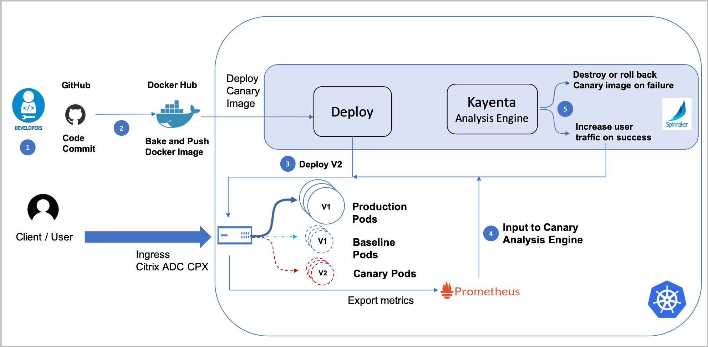

# Deploy Citrix ADC-Integrated Canary Deployment Solution

Canary release is a technique to reduce the risk of introducing a new software version in production by first rolling out the change to a small subset of users. After the user validation, the application is rolled out to the larger set of users.

Citrix provides the following options for canary deployment using the Citrix ingress controller.

- [Deploy canary using the Canary CRD](#deploy-canary-using-the-canary-crd)
- [Deploy canary using Ingress annotations](#simplified-canary-deployment-using-ingress-annotations)

In a deployment using the Canary CRD, canary configuration is applied using a Kubernetes CRD. Citrix also supports a much simpler option for canary deployment using Ingress annotations.

## Deploy canary using the Canary CRD

This section provides information about how to perform Canary deployment using the Canary CRD.

Citrix ADC-Integrated Canary Deployment solution stitches together all components of continuous delivery (CD) and makes canary deployment easier for the application developers. This solution uses [Spinnaker](https://www.spinnaker.io/) as the continuous delivery platform and [Kayenta](https://github.com/spinnaker/kayenta) as the Spinnaker plug-in for canary analysis. Kayenta is an open-source canary analysis service that fetches user-configured metrics from their sources, runs statistical tests, and provides an aggregate score for the canary. The score from statistical tests and counters along with the success criteria is used to promote or fail the canary.

Citrix ADC comes with a rich application-centric configuration module and provides complete visibility to application traffic and health of application instances. The capabilities of Citrix ADC to generate accurate performance statistics can be leveraged for Canary analysis to take better decisions about the Canary deployment. In this solution, Citrix ADC is integrated with the Spinnaker platform and acts as a source for providing accurate metrics for analyzing Canary deployment using Kayenta.

 [Citrix ADC Metrics Exporter](https://github.com/citrix/citrix-adc-metrics-exporter) exports the application performance metrics to the open-source monitoring system Prometheus and you can configure Kayenta to fetch the metrics for canary deployment. Traffic distribution to the canary version can be regulated using the Citrix ADC policy infrastructure. If you want to divert a specific kind of traffic from production to baseline and canary, you can use match expressions to redirect traffic to baseline and canary leveraging the rich Citrix ADC policy infrastructure.

For example, you can divert traffic from production to canary and baseline using the match expression HTTP.REQ.URL.CONTAINS("citrix india"). The traffic which matches the expression is diverted to canary and baseline and the remaining traffic goes to production.

The components which are part of the Citrix-Integrated Canary Deployment Solution and their functionalities are explained as follows:

-  [GitHub](https://github.com/): GitHub offers all the distributed version control and source code management functionalities provided by Git and has extra features.
GitHub has many utilities available for integrating with other tools that form part of your CI/CD pipeline like Docker Hub and Spinnaker.

-  [Docker Hub](https://hub.docker.com/): Docker Hub is a cloud-based repository service provided by Docker for sharing and finding Docker images. You can integrate GitHub with Docker Hub to automatically build images from the source code in GitHub and push the built image to Docker Hub.

-  [Spinnaker](https://www.spinnaker.io/): Spinnaker is an open source, multi-cloud continuous delivery platform for releasing software changes with high velocity and reliance. You can use Spinnaker’s application deployment features to construct and manage continuous delivery workflows. The key deployment management construct in Spinnaker is known as a pipeline. Pipelines in Spinnaker consist of a sequence of actions, known as stages. Spinnaker provides various stages for deploying an application, running a script, performing canary analysis, removing the deployment, and so on. You can integrate Spinnaker with many third-party tools to support many extra functionalities.

-  [Prometheus](https://prometheus.io/): Prometheus is an open-source systems monitoring and alerting toolkit. Prometheus is a monitoring system which can maintain a huge amount of data in a time series database. Citrix ADC Metrics exposes the performance metrics to Spinnaker through Prometheus.

-  [Jenkins](https://jenkins.io/): Jenkins is an open source automation server which helps to automate all sorts of tasks related to building, testing, and delivering or deploying software. Jenkins also supports running custom scripts as part of your deployment cycle.

-  [Citrix ingress controller](https://developer-docs.citrix.com/projects/citrix-k8s-ingress-controller/en/latest/): Citrix provides an Ingress Controller for Citrix ADC MPX (hardware), Citrix ADC VPX (virtualized), and Citrix ADC CPX (containerized) for bare metal and cloud deployments. The Citrix ingress controller is built around Kubernetes Ingress and automatically configures one or more Citrix ADCs based on the Ingress resource configuration.

**Software Requirements**

Following Citrix software versions are required for Citrix-Integrated Canary Deployment Solution:

-  Citrix ingress controller build/version: `quay.io/citrix/citrix-k8s-ingress-controller:1.24.4`.
-  Citrix ADC CPX version: `quay.io/citrix/citrix-k8s-cpx-ingress:13.0-83.27`.
-  Citrix ADC Metrics Exporter version: `quay.io/citrix/netscaler-metrics-exporter:1.4.0`.

### Workflow of a Spinnaker pipeline for Citrix ADC-Integrated Canary Deployment Solution

The following diagram explains the workflow of a Spinnaker pipeline for Citrix ADC-Integrated Canary Deployment Solution.

)

The following steps explain the workflow specified in the diagram.

1.  Developers maintain the source code in GitHub, make changes whenever required, and commit the changes to GitHub.
2.  A webhook is configured in GitHub to listen for the source code changes. Whenever the source code is checked in to GitHub, the webhook is triggered and informs Docker Hub to build the image with the new source code. Once the docker image is created, a separate webhook configured in Docker Hub triggers a Spinnaker pipeline.
3.  Once the Spinnaker pipeline is triggered, canary and baseline versions of the image are deployed.
4.  Once the canary and baseline versions are deployed, some percentage of traffic from production is diverted to the canary and baseline versions. Citrix ADC collects the performance statistics and exports the statistics to Prometheus with the help of Citrix ADC Metrics Exporter. Prometheus feeds these statistics to Kayenta for canary analysis.
1.	Kayenta performs a canary analysis based on the performance statistics and generates a score. Based on the score, the canary deployment is termed as success or failure and the image is rolled out or rolled back.

### Deploy the Citrix ADC-Integrated Canary Deployment Solution in Google Cloud Platform

This section contains information on setting up Spinnaker, how to create a Spinnaker pipeline, and a sample canary deployment.

#### Deploy Spinnaker in Google Cloud Platform

This topic contains information about deploying Spinnaker and how to integrate plug-ins with Spinnaker for canary deployment on Google Cloud Platform(GCP).

Perform the following steps to deploy Spinnaker and integrate plug-ins in GCP.

1.  Set up the environment and create a GKE cluster using the following commands.

        export GOOGLE_CLOUD_PROJECT=[PROJECT_ID] 
        gcloud config set project $GOOGLE_CLOUD_PROJECT 
        gcloud config set compute/zone us-central1-f
        gcloud services enable container.googleapis.com
        gcloud beta container clusters create kayenta-tutorial 
        --machine-type=n1-standard-2 --enable-stackdriver-kubernetes

2.  Install the plug-in for integrating Prometheus with Stackdriver using the following command.

        kubectl apply --as=admin --as-group=system:masters -f \
        https://storage.googleapis.com/stackdriver-prometheus-documentation/rbac-setup.yml
        curl -sS "https://storage.googleapis.com/stackdriver-prometheus-documentation/prometheus-service.yml" | 
        \sed "s/_stackdriver_project_id:.*/_stackdriver_project_id: $GOOGLE_CLOUD_PROJECT/" | 
        \sed "s/_kubernetes_cluster_name:.*/_kubernetes_cluster_name: kayenta-tutorial/" | 
        \sed "s/_kubernetes_location:.*/_kubernetes_location: us-central1-f/" | 
        \kubectl apply -f -

3.  Deploy Spinnaker in the GKE cluster using the following steps.

    1.  Download the ``quick-install.yml`` file for Spinnaker from [Spinnaker](https://www.spinnaker.io/downloads/kubernetes/quick-install.yml) website.
    2.  Update the ``quick-install.yml`` file to integrate different components starting with Docker Hub. To integrate Spinnaker with Docker Hub, update the values of address, user name, password, email, and repository under ConfigMap in ``quick-install.yml`` file.
   
            dockerRegistry:
                        enabled: true
                        accounts:
                        - name: my-docker-registry
                        requiredGroupMembership: []
                        providerVersion: V1
                        permissions: {}
                        address: https://index.docker.io
                        username: <username>
                        password: <password>
                        email: <mail-id>
                        cacheIntervalSeconds: 30
                        clientTimeoutMillis: 60000
                        cacheThreads: 1
                        paginateSize: 100
                        sortTagsByDate: false
                        trackDigests: false
                        insecureRegistry: false
                        repositories:- <repository-name>
                        primaryAccount: my-docker-registry


    3. (Optional) Perform the following steps to set up Jenkins.

            sudo apt-get update
            sudo apt-get upgrade
            sudo apt-get install openjdk-8-jdk
            wget -q -O - https://jenkins-ci.org/debian/jenkins-ci.org.key |       
            sudo apt-key add -
            sudo sh -c 'echo deb http://pkg.jenkins-ci.org/debian binary/ > /etc/apt/sources.list.d/jenkins.list'
            sudo apt-get update
            sudo apt-get install jenkins git
            sudo apt-get install software-properties-common python-software-properties apt-transport-https
            sudo add-apt-repository https://dl.bintray.com/spinnaker-releases/debians

          >**Note:**
          >If Jenkins is installed in one of the nodes of Kubernetes, you must update the firewall rules for that node for public access.

    4.  Update the following values in the ``quick-install.yml`` file for integrating Jenkins with Spinnaker.

                data:igor.yml: |
            enabled: true
            skipLifeCycleManagement: false
                ci:jenkins:
            enabled: true
              masters: 
            - name: master
                  address: <endpoint>
                username: <username>
              password: <password>

    1.  To set up Prometheus and [Grafana](https://grafana.com/), see the Prometheus and Grafana Integration section in [Citrix ADC Metrics Exporter](https://github.com/citrix/citrix-adc-metrics-exporter) and perform the steps.

    1.  To integrate Prometheus with Spinnaker, update the following values in the ``quick-install.yml`` file.

            data:
             config: | 
              deploymentConfigurations:
               canary:
              enabled: true
          serviceIntegrations:
                - name: prometheus
            enabled: true
          accounts: 
            - name: my-prometheus
          endpoint:
                baseUrl: <prometheus-endpoint>
               supportedTypes:
          - METRICS_STORE
            data:
             config: |
              deploymentConfigurations:
               metricStores:
                prometheus:
                 enabled: true
                 add_source_metalabels: true
                stackdriver:
            enabled: true
               period: 30
               enabled: true
               
    1.  To integrate Slack for notification with Spinnaker, update the following values in the ``quick-install.yml`` file.


            data:
             config: |
              deploymentConfigurations:	
               notifications:
                slack:
                 enabled: true
                  botName: <BotName>
                  token: <token>
    1.  Once all the required components are integrated, deploy Spinnaker by performing the following step.
   
            kubectl apply -f quick-install.yaml


    1.  Verify the progress of the deployment using the following command. Once the deployment is complete, this command outputs all the pods as Ready x/x. 

            watch kubectl -n spinnaker get pods

1.  Once you deploy Spinnaker, you can test the deployment using the following steps:

    1.  Enable Spinnaker access by forwarding a local port to the deck component of Spinnaker using the following command:
   
            DECK_POD=$(kubectl -n spinnaker get pods -l \
            cluster=spin-deck,app=spin \
            -o=jsonpath='{.items[0].metadata.name}')
            kubectl -n spinnaker port-forward $DECK_POD 8080:9000 >/dev/null &

    1.  To access Spinnaker, in the Cloud Shell, click the **Web Preview icon** and select **Preview on port 8080**.

        !!! note "Note"  
            You can access Spinnaker securely or via HTTP. To expose Spinnaker securely, use the [spin-ingress-ssl.yaml](https://github.com/citrix/citrix-k8s-ingress-controller/blob/master/canary/manifest/spin-ingress-ssl.yaml) file to deploy the Ingress.
            Once the Spinnaker application is publicly exposed, you can use the domain assigned for Spinnaker or the IP address of the Ingress to access it.

#### Create a Spinnaker pipeline and configure automated canary deployment

Once you deploy Spinnaker, create a Spinnaker pipeline for an application and configure the automated canary deployment.

1. Create an [application in Spinnaker](https://www.spinnaker.io/guides/user/applications/create/).
2. Create a [Spinnaker pipeline](https://www.spinnaker.io/guides/user/pipeline/managing-pipelines/#create-a-pipeline). You can edit the pipeline as a JSON file using the sample file provided in [Sample JSON files](#A-sample-JSON-file-for-Spinnaker-pipeline-configuration).
3. Create an automated canary configuration in Spinnaker for [automated canary analysis](https://www.spinnaker.io/guides/user/canary/). You can use the configuration provided in the JSON file as a sample for automated canary configuration [Sample JSON files](#A-sample-JSON-file-for-automated-canary-configuration).


#### Deploy a sample application for canary

This example shows how to run the canary deployment of a sample application using Citrix ADC-Integrated Canary Deployment Solution. In this example, Citrix ADC CPX, MPX, or VPX is deployed as an Ingress device for a GKE cluster. Citrix ADC generates the performance metrics required for canary analysis.

**Prerequisites**

You must complete the following step before deploying the sample application.

- Install Spinnaker and the required plug-ins in Google cloud platform using [Deploy Spinnaker in Google Cloud Platform](#Deploy-Spinnaker-in-Google-Cloud-Platform).

#### Deploy the sample application

Perform the following steps to deploy a sample application as a canary release.

1. Create the necessary RBAC rules for Citrix ADC by deploying the [rbac.yaml](https://github.com/citrix/citrix-k8s-ingress-controller/blob/master/canary/manifest/rbac.yaml) file.
   
        kubectl apply -f rbac.yaml 

1. You can either deploy the Citrix ingress controller as a sidecar with Citrix ADC CPX or as a standalone pod which controls Citrix ADC VPX or MPX.

    Use the [cpx-with-cic-sidecar.yml](https://github.com/citrix/citrix-k8s-ingress-controller/blob/master/canary/manifest/cpx-with-cic-sidecar.yml) file to deploy the Citrix ingress controller as a sidecar with Citrix ADC CPX. It also deploys Citrix ADC Metrics Exporter on the same pod.
    
        kubectl apply -f cpx-with-cic-sidecar.yml 
    
    
     To deploy the Citrix ingress controller as a stand-alone pod for Citrix ADC VPX or MPX use the [cic-vpx.yaml](https://github.com/citrix/citrix-k8s-ingress-controller/blob/master/canary/manifest/cic-vpx.yaml) file. In this deployment, you should use the [exporter.yaml](https://github.com/citrix/citrix-k8s-ingress-controller/blob/master/canary/manifest/exporter.yaml) file to deploy Citrix ADC Metrics Exporter.


        kubectl apply -f cic-vpx.yaml
        kubectl apply -f exporter.yaml

    !!! note "Note"
        Depending on how you are deploying the Citrix ingress controller, you must edit the YAML file for Citrix ingress controller deployment and modify values for the environmental variables as provided in [deploying Citrix ingress controller](https://developer-docs.citrix.com/projects/citrix-k8s-ingress-controller/en/latest/deploy/deploy-cic-yaml/#deploy-citrix-ingress-controller-as-a-pod).

1.  Deploy the Ingress for securely exposing Spinnaker using the [spin-ingress-ssl.yaml](https://github.com/citrix/citrix-k8s-ingress-controller/blob/master/canary/manifest/spin-ingress-ssl.yaml) file.


        kubectl apply -f spin-ingress-ssl.yaml 

    !!! note "Note"
        For more information on creating a TLS certificate for Ingress, see [TLS certificates in Citrix Ingress Controller](https://developer-docs.citrix.com/projects/citrix-k8s-ingress-controller/en/latest/certificate-management/tls-certificate-handling/).

1. Once Spinnaker is exposed using Citrix ADC, access Spinnaker and perform the steps in [Create a Spinnaker pipeline and configure automated canary deployment](#Create-a-Spinnaker-pipeline-and-configure-automated-canary-deployment) if the steps are not already done. 
 
1. Deploy the production version of the application using the [production.yaml](https://github.com/citrix/citrix-k8s-ingress-controller/blob/master/canary/manifest/production.yaml) file.
   
        kubectl apply -f production.yaml 

1. Create the Ingress resource rule to expose traffic from outside the cluster to services inside the cluster using the [ingress.yaml](https://github.com/citrix/citrix-k8s-ingress-controller/blob/master/canary/manifest/ingress.yaml) file.
   
        kubectl apply -f ingress.yaml 

1.  Create a Kubernetes service for the application that needs canary deployment using the [service.yaml](https://github.com/citrix/citrix-k8s-ingress-controller/blob/master/canary/manifest/service.yaml) file.

        kubectl apply -f service.yaml

1.  Deploy the canary CRD that defines the canary configuration using the [canary-crd-class.yaml](https://github.com/citrix/citrix-k8s-ingress-controller/blob/master/canary/manifest/canary-crd-class.yaml) file.

        kubectl apply -f canary-crd-class.yaml


    !!! note "Note"
        Once you create the CRD, wait for 10 seconds before you apply the CRD object.

9. Create a CRD object [canary-crd-object.yaml](https://github.com/citrix/citrix-k8s-ingress-controller/blob/master/canary/manifest/canary-crd-object.yaml) based on the canary CRD for customizing the canary configuration.

        kubectl apply -f canary-crd-object.yaml

    The following table explains the fields in the canary CRD object.

  
      | Field               | Description                                                                                                                                                                                                                                                                                                                        |
      |---------------------|------------------------------------------------------------------------------------------------------------------------------------------------------------------------------------------------------------------------------------------------------------------------------------------------------------------------------------|
      | serviceNames         |  List of services on which this CRD has to be applied                                                                                                                                                                                                                                                                              |
      | deployment          | Specifies the deployment strategy as Kayenta.                                                                                                                                                                                                                                                                                      |
      | percentage          | Specifies the percentage of traffic to be diverted from production to baseline and canary.                                                                                                                                                                                                                                         |
      | matchExpression (optional)    | Any Citrix ADC supported policy that can be used to define the subset of users to be directed to canary and baseline versions. If x percentage of traffic is configured, then from within subset of users which matches the matchExpression only x percentage of users are diverted to baseline and canary. Remaining users are diverted to production. |
      |  Spinnaker   | Specifies the Spinnaker pipeline configurations you want to apply for your services.   |
      | domain              |  IP address or domain name of the Spinnaker gate.                                                                                        |                                                            
      | port                |  Port number of the Spinnaker gate.                                                                                                                                                                                                                                                                                                |
      | applicationName    | The name of the application in Spinnaker.                                                                                                                                                                                                                                                                                               |
      | pipelineName     |  The name of the pipeline under the Spinnaker application.                                                                                                                                                                                                                                                                        |
      | serviceName|  Specifies the name of the service to which you want to apply the Spinnaker configuration.|
                        


10. Deploy canary and baseline versions of the application.

    !!! note "Note"
        If you are fully automating the canary deployment, deploy canary and baseline versions using the [Deploy (Manifest) stage](https://www.spinnaker.io/guides/user/kubernetes-v2/deploy-manifest/) in Spinnaker pipeline and there is no need to perform this step.

    For manually deploying canary and baseline versions, use [canary.yaml](https://github.com/citrix/citrix-k8s-ingress-controller/blob/master/canary/manifest/canary.yaml) and [baseline.yaml](https://github.com/citrix/citrix-k8s-ingress-controller/blob/master/canary/manifest/baseline.yaml) files.

        kubectl apply -f canary.yaml
        kubectl apply -f baseline.yaml

### Troubleshooting

For troubleshooting the deployment, perform the following steps.

1.  Check the pod logs for the respective components like Spinnaker, Prometheus, Kayenta, Citrix ADC CPX, Citrix ADC Metrics Exporter, Citrix ingress controller.
2.  Check the pod logs of the Citrix ingress controller for any configuration-related errors while configuring the Citrix proxy.
3.  Search for the ``exception/Exception`` keyword in the Citrix ingress controller pod logs to narrow down the issues.
4.  Check for the logs preceding the search. Check for the configuration that failed and caused the issue.
5.  Check for the reason of failures during configuration.
6.  If the failure happened because of incorrect configuration, correct the configuration.

### Sample JSON files

This topic contains sample JSON files for Spinnaker pipeline configuration and automated canary configuration. These files can be used as a reference while creating Spinnaker pipeline and automated canary configuration.

**A sample JSON file for Spinnaker pipeline configuration**

```JSON
{
  "appConfig": {},
  "description": "This pipeline deploys a canary version of the application, and a baseline (identical to production) version.\nIt compares them, and if the canary is OK, it triggers the production deployment pipeline.",
  "executionEngine": "v2",
  "expectedArtifacts": [
    {
      "defaultArtifact": {
        "kind": "custom"
      },
      "id": "ac842617-988f-48dc-a7a4-7f020d93cc42",
      "matchArtifact": {
        "kind": "docker",
        "name": "index.docker.io/sample/demo",
        "type": "docker/image"
      },
      "useDefaultArtifact": false,
      "usePriorExecution": false
    }
  ],
  "keepWaitingPipelines": false,
  "lastModifiedBy": "anonymous",
  "limitConcurrent": true,
  "parallel": true,
  "parameterConfig": [],
  "stages": [
    {
      "account": "my-kubernetes-account",
      "cloudProvider": "kubernetes",
      "kinds": [
        "Deployment",
        "ConfigMap"
      ],
      "labelSelectors": {
        "selectors": [
          {
            "key": "version",
            "kind": "EQUALS",
            "values": [
              "canary"
            ]
          }
        ]
      },
      "location": "default",
      "name": "Delete Canary",
      "options": {
        "cascading": true
      },
      "refId": "12",
      "requisiteStageRefIds": [
        "19",
        "26"
      ],
      "type": "deleteManifest"
    },
    {
      "account": "my-kubernetes-account",
      "cloudProvider": "kubernetes",
      "kinds": [
        "Deployment"
      ],
      "labelSelectors": {
        "selectors": [
          {
            "key": "version",
            "kind": "EQUALS",
            "values": [
              "baseline"
            ]
          }
        ]
      },
      "location": "default",
      "name": "Delete Baseline",
      "options": {
        "cascading": true
      },
      "refId": "13",
      "requisiteStageRefIds": [
        "19",
        "26"
      ],
      "type": "deleteManifest"
    },
    {
      "name": "Successful deployment",
      "preconditions": [],
      "refId": "14",
      "requisiteStageRefIds": [
        "12",
        "13"
      ],
      "type": "checkPreconditions"
    },
    {
      "application": "sampleapplicaion",
      "expectedArtifacts": [
        {
          "defaultArtifact": {
            "kind": "custom"
          },
          "id": "9185c756-c6cd-49bc-beee-e3f7118f3412",
          "matchArtifact": {
            "kind": "docker",
            "name": "index.docker.io/sample/demo",
            "type": "docker/image"
          },
          "useDefaultArtifact": false,
          "usePriorExecution": false
        }
      ],
      "failPipeline": true,
      "name": "Deploy to Production",
      "pipeline": "7048e5ac-2464-4557-a05a-bec8bdf868fc",
      "refId": "19",
      "requisiteStageRefIds": [
        "25"
      ],
      "stageEnabled": {
        "expression": "\"${ #stage('Canary Analysis')['status'].toString() == 'SUCCEEDED'}\"",
        "type": "expression"
      },
      "type": "pipeline",
      "waitForCompletion": true
    },
    {
      "account": "my-kubernetes-account",
      "cloudProvider": "kubernetes",
      "manifestArtifactAccount": "embedded-artifact",
      "manifests": [
        {
          "apiVersion": "apps/v1",
          "kind": "Deployment",
          "metadata": {
            "labels": {
              "name": "sampleapplicaion-prod",
              "version": "baseline"
            },
            "name": "sampleapplicaion-baseline-deployment",
            "namespace": "default"
          },
          "spec": {
            "replicas": 4,
            "strategy": {
              "rollingUpdate": {
                "maxSurge": 10,
                "maxUnavailable": 10
              },
              "type": "RollingUpdate"
            },
            "template": {
              "metadata": {
                "labels": {
                  "name": "sampleapplicaion-prod"
                }
              },
              "spec": {
                "containers": [
                  {
                    "image": "index.docker.io/sample/demo:v1",
                    "imagePullPolicy": "Always",
                    "name": "sampleapplicaion-prod",
                    "ports": [
                      {
                        "containerPort": 8080,
                        "name": "port-8080"
                      }
                    ]
                  }
                ]
              }
            }
          }
        }
      ],
      "moniker": {
        "app": "sampleapplicaion"
      },
      "name": "Deploy Baseline",
      "refId": "20",
      "relationships": {
        "loadBalancers": [],
        "securityGroups": []
      },
      "requisiteStageRefIds": [],
      "source": "text",
      "type": "deployManifest"
    },
    {
      "account": "my-kubernetes-account",
      "cloudProvider": "kubernetes",
      "manifestArtifactAccount": "embedded-artifact",
      "manifests": [
        {
          "apiVersion": "apps/v1",
          "kind": "Deployment",
          "metadata": {
            "labels": {
              "name": "sampleapplicaion-prod",
              "version": "canary"
            },
            "name": "sampleapplicaion-canary-deployment",
            "namespace": "default"
          },
          "spec": {
            "replicas": 4,
            "strategy": {
              "rollingUpdate": {
                "maxSurge": 10,
                "maxUnavailable": 10
              },
              "type": "RollingUpdate"
            },
            "template": {
              "metadata": {
                "labels": {
                  "name": "sampleapplicaion-prod"
                }
              },
              "spec": {
                "containers": [
                  {
                    "image": "index.docker.io/sample/demo",
                    "imagePullPolicy": "Always",
                    "name": "sampleapplicaion-prod",
                    "ports": [
                      {
                        "containerPort": 8080,
                        "name": "port-8080"
                      }
                    ]
                  }
                ]
              }
            }
          }
        }
      ],
      "moniker": {
        "app": "sampleapplicaion"
      },
      "name": "Deploy Canary",
      "refId": "21",
      "relationships": {
        "loadBalancers": [],
        "securityGroups": []
      },
      "requiredArtifactIds": [
        "ac842617-988f-48dc-a7a4-7f020d93cc42"
      ],
      "requisiteStageRefIds": [],
      "source": "text",
      "type": "deployManifest"
    },
    {
      "analysisType": "realTime",
      "canaryConfig": {
        "beginCanaryAnalysisAfterMins": "2",
        "canaryAnalysisIntervalMins": "",
        "canaryConfigId": "7bdb4ab4-f933-4a41-865f-6d3e9c786351",
        "combinedCanaryResultStrategy": "LOWEST",
        "lifetimeDuration": "PT0H5M",
        "metricsAccountName": "my-prometheus",
        "scopes": [
          {
            "controlLocation": "default",
            "controlScope": "k8s-sampleapplicaion.default.80.k8s-sampleapplicaion.default.8080.svc-baseline",
            "experimentLocation": "default",
            "experimentScope": "k8s-sampleapplicaion.default.80.k8s-sampleapplicaion.default.8080.svc-canary",
            "extendedScopeParams": {},
            "scopeName": "default"
          }
        ],
        "scoreThresholds": {
          "marginal": "0",
          "pass": "70"
        },
        "storageAccountName": "kayenta-minio"
      },
      "name": "Canary Analysis",
      "refId": "25",
      "requisiteStageRefIds": [
        "20",
        "21"
      ],
      "type": "kayentaCanary"
    },
    {
      "continuePipeline": false,
      "failPipeline": true,
      "job": "NJob",
      "master": "master",
      "name": "Auto Cleanup:  GCR Image and code revert",
      "parameters": {},
      "refId": "26",
      "requisiteStageRefIds": [
        "25"
      ],
      "stageEnabled": {
        "type": "expression"
      },
      "type": "jenkins"
    }
  ],
  "triggers": [
    {
      "account": "my-docker-registry",
      "enabled": true,
      "expectedArtifactIds": [
        "ac842617-988f-48dc-a7a4-7f020d93cc42"
      ],
      "organization": "sample",
      "payloadConstraints": {},
      "registry": "index.docker.io",
      "repository": "sample/demo",
      "source": "dockerhub",
      "type": "webhook"
    }
  ],
  "updateTs": "1553144362000"
}
```


### A sample JSON file for automated canary configuration

Following is a sample JSON file for automated canary configuration.

```JSON
{
  "applications": [
    "sampleapplicaion"
  ],
  "classifier": {
    "groupWeights": {
      "Group 1": 70,
      "Group 2": 30
    },
    "scoreThresholds": {
      "marginal": 75,
      "pass": 95
    }
  },
  "configVersion": "1",
  "createdTimestamp": 1552650414234,
  "createdTimestampIso": "2019-03-15T11:46:54.234Z",
  "description": "Canary Config",
  "judge": {
    "judgeConfigurations": {},
    "name": "NetflixACAJudge-v1.0"
  },
  "metrics": [
    {
      "analysisConfigurations": {
        "canary": {
          "direction": "increase"
        }
      },
      "groups": [
        "Group 1"
      ],
      "name": "Server Response Errors - 5XX",
      "query": {
        "customFilterTemplate": "tot_requests",
        "metricName": "netscaler_lb_vserver_svr_busy_err_rate",
        "serviceType": "prometheus",
        "type": "prometheus"
      },
      "scopeName": "default"
    },
    {
      "analysisConfigurations": {
        "canary": {
          "direction": "either",
          "nanStrategy": "replace"
        }
      },
      "groups": [
        "Group 2"
      ],
      "name": "Server Response Latency - TTFB",
      "query": {
        "customFilterTemplate": "ttfb",
        "metricName": "netscaler_lb_vserver_hits_total",
        "serviceType": "prometheus",
        "type": "prometheus"
      },
      "scopeName": "default"
    }
  ],
  "name": "canary-config",
  "templates": {
    "tot_requests": "lb_vserver_name = \"${scope}\"",
    "ttfb": "lb_vserver_name = \"${scope}\""
  },
  "updatedTimestamp": 1553098513495,
  "updatedTimestampIso": "2019-03-20T16:15:13.495Z"
}
```

## Simplified canary deployment using Ingress annotations

This topic provides information about the simplified Canary deployment using Ingress annotations. While Citrix provides multiple options to support canary deployment, this is a simpler type of Canary deployment.

Canary using Ingress annotations is a rule based canary deployment. In this approach, you need to define an additional Ingress object with specific annotations to indicate that the application request needs to be served based on the rule based canary deployment strategy. In the Citrix solution, Canary based traffic routing at the Ingress level can be achieved by defining various sets of rules as follows:

- Applying the canary rules based on weight
- Applying the canary rules based on the HTTP request header
- Applying the canary rules based on the HTTP header value

The order of precedence of the canary rules is as follows:

Canary by HTTP request header value --> canary by HTTP request header --> canary by weight

### Canary deployment based on weight

Weight based canary deployment is a widely used canary deployment approach. In this approach, you can set the weight as a range from 0 to 100 which decides the percentage of traffic to be directed to the canary version and the production version of an application.

Following is the workflow for the weight based canary deployment:

- Initially the weight can be set to zero which indicates that the traffic is not forwarded to the canary version.

- Once you decide to start canary deployment, change the weight to the required percentage to make sure the traffic is directed to canary version as well.

- Finally, when you determine that the canary version is ready to be released, change the weight to 100 to ensure that all the traffic is being directed to the canary version.

For deploying weight based canary using the Citrix ingress controller, create a new Ingress with a canary annotation `ingress.citrix.com/canary-weight:` and specify the percentage of traffic to be directed to the canary version.

### Canary deployment based on the HTTP request header

You can configure canary deployment based on the HTTP request header which is controlled by clients. The request header notifies the Ingress to route the request to the service specified in the canary Ingress. When the request header contains the value mentioned in the Ingress annotation `ingress.citrix.com/canary-by-header:`, the request is routed to the service specified in the canary Ingress.

### Canary deployment based on the HTTP request header value

You can also configure canary deployment based on the value of the HTTP request header which is an extension of canary by header. In this deployment, along with the `ingress.citrix.com/canary-by-header:` annotation, you also specify the `ingress.citrix.com/canary-by-header-value:` annotation. When the request header value matches with the value specified in the Ingress annotation `ingress.citrix.com/canary-by-header-value:` the request is routed to the service specified in the canary Ingress.  

### Configure canary deployment using Ingress annotations

Perform the following steps to deploy a sample application as a canary release.

1. Deploy the Citrix ingress controller using the steps in [deploy the Citrix ingress controller](https://developer-docs.citrix.com/projects/citrix-k8s-ingress-controller/en/latest/deploy/deploy-cic-yaml/). You can either deploy the Citrix ingress controller as a sidecar with Citrix ADC CPX or as a standalone pod which controls Citrix ADC VPX or MPX.

2. Deploy the `Guestbook` application using the [guestbook-deploy.yaml](https://github.com/citrix/citrix-k8s-ingress-controller/blob/master/example/simple-canary/guestbook-deploy.yaml) file.

        kubectl apply -f guestbook-deploy.yaml
 
3. Deploy a service to expose the `Guestbook` application using the [guestbook-service.yaml](https://github.com/citrix/citrix-k8s-ingress-controller/blob/master/example/simple-canary/guestbook-service.yaml) file.

        kubectl apply -f guestbook-service.yaml


4. Deploy the Ingress object for the `Guestbook` application using the [guestbook-ingress.yaml](https://github.com/citrix/citrix-k8s-ingress-controller/blob/master/example/simple-canary/guestbook-ingress.yaml) file.

          kubectl apply -f  guestbook-ingress.yaml

5. Deploy a canary version of the `Guestbook` application using the [canary-deployment.yaml](https://github.com/citrix/citrix-k8s-ingress-controller/blob/master/example/simple-canary/canary-deployment.yaml) file.
   
            kubectl apply –f canary-deployment.yaml

6. Deploy a service to expose the canary version of the `Guestbook` application using the [canary-service.yaml](https://github.com/citrix/citrix-k8s-ingress-controller/blob/master/example/simple-canary/canary-service.yaml) file.

            kubectl apply –f canary-service.yaml       

7. Deploy an Ingress object with annotations for the canary version of the `Guestbook` application using the [canary-ingress.yaml](https://github.com/citrix/citrix-k8s-ingress-controller/blob/master/example/simple-canary/canary-ingress.yaml) file.


            kubectl apply –f canary-ingress.yaml
            
            

              ```yml
              apiVersion: networking.k8s.io/v1
              kind: Ingress
              metadata:
                annotations:
                  ingress.citrix.com/canary-weight: "10"
                  kubernetes.io/ingress.class: citrix
                name: canary-by-weight
              spec:
                rules:
                - host: webapp.com
                  http:
                    paths:
                    - backend:
                        service:
                          name: guestbook-canary
                          port:
                            number: 80
                      path: /
                      pathType: Prefix
              ```

    Here, the annotation `ingress.citrix.com/canary-weight: “10”` is the annotation for the weight based canary. This annotation specifies the Citrix ingress controller to configure the Citrix ADC in such a way that 10 percent of the total requests destined to  `webapp.com` is sent to the `guestbook-canary` service. This is the service for the canary version of the `Guestbook` application.

For deploying the HTTP header based canary using the Citrix ingress controller, replace the canary annotation `ingress.citrix.com/canary-weight:` with the `ingress.citrix.com/canary-by-header:`  annotation in the `canary-ingress.yaml` file.

For deploying the HTTP header value based canary using the Citrix ingress controller, replace the `ingress.citrix.com/canary-weight:` annotation with the `ingress.citrix.com/canary-by-header:` and `ingress.citrix.com/canary-by-header-value:` annotations in the `canary-ingress.yaml` file.
