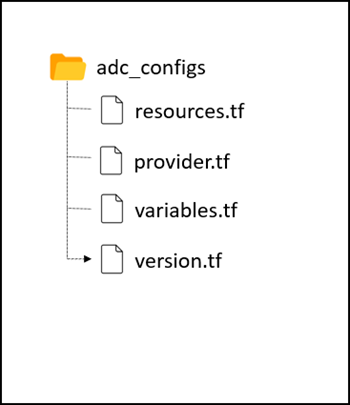

# Blue-green deployment using Citrix ADC VPX and Azure pipelines

Blue-green deployment is a technique that reduces downtime and risk by running two identical production environments called blue and green. At any time, only one of the environments is live that serves all the production traffic. The basis of the blue-green method is side-by-side deployments of two separate but identical environments. Deploying an application in both the environments can be fully automated by using jobs and tasks. This approach enforces duplication of every resource of an application. However, there are many different ways blue-green deployments can be carried out in various continuous deployment tools. This topic provides information on how to achieve the blue green deployment of an application (non cloud-native applications) using Citrix ADC with Azure pipelines. [Azure pipelines](https://docs.microsoft.com/en-us/azure/devops/pipelines/create-first-pipeline) are a cloud service provided by Azure DevOps which allows you to automatically run builds, perform tests, and deploy code to various development and production environments.

In this solution, Citrix ADC VPX is deployed on the Azure platform to enable load balancing of an application and achieve blue green deployment using Citrix ADC VPX. For more information on how to deploy Citrix ADC on Microsoft Azure, see the [Citrix documentation](https://docs.citrix.com/en-us/citrix-adc/current-release/deploying-vpx/deploy-vpx-on-azure.html).

## Why blue-green deployment?

The following are the major benefits of adopting Blue green deployment strategy in the application life cycle.

- seamless switch between the blue and green version of applications
- zero-downtime upgrade for an existing application
- easier rollback mechanism, implementation, and disaster recovery

## Blue-green deployment using Citrix ADC

Blue-green deployment of an application can be achieved using Citrix ADC by adjusting the traffic split percentage of the application end points (blue and green versions) to zero and 100. Initially, the traffic split percentage of an application with blue version is set to 100 and post validation of the green version, you change the traffic split percentage of the blue version to zero and set the green version to 100. At this stage, the green version is promoted to the live environment as a blue version and further upcoming versions of the application are treated as the new green versions.

Here, you are using the content switching (CS) policy in Citrix ADC for each application version. You can achieve the blue green deployment by adjusting the traffic weight and priority of the CS policy to switch the traffic between blue and green versions of the application.

## Blue-green deployment using Citrix ADC with Azure pipelines

Citrix proposes a solution for blue-green deployment using Citrix ADC with Azure pipelines for any virtual machine based application as depicted in the following topology.

For information on how to create and configure agent pools on Azure, see the [Azure documentation](https://docs.microsoft.com/en-us/azure/devops/pipelines/agents/pools-queues?view=azure-devops&tabs=yaml%2Cbrowser).

In this solution, there are three configuration directories:

- `adc_configs`
- `deployment_configs`
- `pipeline_configs`

### adc_configs

This directory includes the template based Terraform scripts which are responsible for pushing application(version) specific Citrix ADC configuration such as back-end services, traffic weight. The Citrix ADC configurations include creating content switching virtual server, load balancing virtual server, and a content switching policy with the appropriate priority set for each version of the application.

### deployment_configs

This directory includes the `setup_config` and `teardown_config` JSON files that specify the version of the application to be deployed or brought down respectively during blue-green deployment. This directory also includes configuration files with back-end service IP addresses.

### pipeline_configs

This directory includes the Azure pipeline script and the python script which reads the user configurations and triggers the pipeline based on the user request to introduce a new version or switch the traffic between blue and green version of the application or teardown a version of an application.

## Deploying a sample application using blue-green mode in Azure Pipelines

This procedure shows the steps to deploy an application using blue-green mode in Azure pipelines. 

**Pre-requisites**

Ensure that:
- Citrix ADC VPX is deployed on the Azure platform
- Back end services are running on the virtual machine and the corresponding IP addresses are available to set up the continuous delivery. 

Perform the following steps:

1. Clone the GitHub repository and go to the directory `cd/blue-green`.

1. Review and update the Citrix ADC configurations in the Terraform files under the `adc_configs` directory.

1. Create two Azure pipelines using the existing YAML files, `deploy.yaml` and `teardown.yaml`, for deploying and tearing down the applications. See, [Azure pipelines](https://docs.microsoft.com/en-us/azure/devops/pipelines/create-first-pipeline) for creating a pipeline.

1. Update the subscription details and agent pool details in the pipeline YAML and then save the pipeline.

1. Create `v1.conf` under the `deployment_configs` directory as follows:

       backend_service_ip = "<IP of backend service with version v1>"

       priority = 101 
       /*This configuration is used to set the priority of the traffic to be served by Citrix ADC when you introduce a new version of the application in production environment.*/

1. Update the `setup_config.json` file with version and traffic weight percentage.

       {
        "TRAFFIC_WEIGHT": "100",
        "ADC_CONFIG": "cd/blue-green/deployment_configs/v1.conf",
        "DEPLOYMENT_VERSION": "v1"
        }

1. Commit `setup_config.json` and `v1.conf` files using Git to trigger the pipeline to deploy the v1 version of the application.

1. Access the application through Citrix ADC. 

1. Introduce the v2 version of the application by creating the `v2.conf` file.

        backend_service_ip = "<IP of backend service with version v2>"

        priority = 100 /* This configuration should be lesser than the v1 version of application, in order to set the higher priority to the traffic served by version v2.*/
    
1. Deploy the version v2 of the application by updating `setup_config.json`.

        {
        "TRAFFIC_WEIGHT": "0",
        "ADC_CONFIG": "cd/blue-green/deployment_configs/v2.conf",
        "DEPLOYMENT_VERSION": "v2"
        }
    At this point, the traffic is served by version v1 of the application because the traffic weight is set as zero for version v2.

1. Update the traffic weight for version v2 to 100 by updating the `setup_config.json` file.

           {
           "TRAFFIC_WEIGHT": "100",
            "ADC_CONFIG": "cd/blue-green/deployment_configs/v2.conf",
            "DEPLOYMENT_VERSION": "v2"
            }

1. Since the traffic is switched to version v2, you can tear down the version v1 by updating the file `deployment_configs/teardown_config.json` as follows:

           {
            "DEPLOYMENT_VERSION": "v1"
           }

 
   Once the pipeline build is completed, version v1 of the deployment is torn down and only version v2 is running.

   **Note:** You can continue introducing newer versions by following the same steps as followed for version v2.

## Canary deployment

Blue-green solution can be also used to achieve canary deployment for your application and the steps remains same as in the blue-green deployment.

To achieve the canary deployment, you need to set the `TRAFFIC_WEIGHT` to the desired traffic percentage that you want to route to the v2 version of the application. 
For example, as per the following configuration 20 percentage of the traffic goes to the v2 version of application and the remaining 80 percentage of the traffic continues to get routed to the older version (v1) of the application without any manual intervention.

          {
           "TRAFFIC_WEIGHT": "20",
           "ADC_CONFIG": "cd/blue-green/deployment_configs/v2.conf",
           "DEPLOYMENT_VERSION": "v2"
          }

