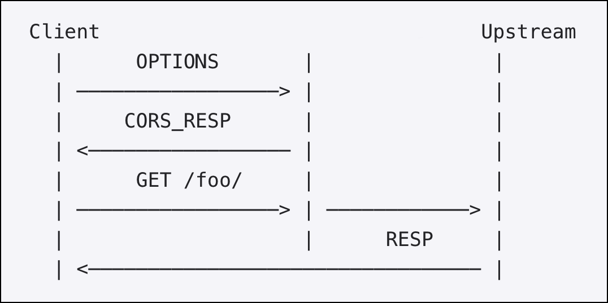

# Configure cross-origin resource sharing policies with Citrix ingress controller

Citrix provides a Custom Resource Definition (CRD) called the CORS CRD for Kubernetes. You can use the CORS CRD to configure the cross-origin resource sharing (CORS) policies with Citrix ingress controller on the Citrix ADC.

## What is CORS

Cross-Origin resource sharing is a mechanism that allows the browser to determine whether a specific web application can share resources with another web application from a different origin. It allows users request resources (For example, images, fonts, and videos) from domains outside the original domain.

## CORS pre-flight

Before a web browser allowing Javascript to issue a POST to a URL, it performs a `pre-flight` request. A pre-flight request is a simple request to the server with the same URL using the method OPTIONS rather than POST. The web browser checks the HTTP headers for CORS related headers to determine if POST operation on behalf of the user is allowed.

  

## CORS CRD definition

The CORS CRD is available in the Citrix ingress controller GitHub repo at: [cors-crd.yaml](https://raw.githubusercontent.com/citrix/citrix-k8s-ingress-controller/master/crd/cors/cors-crd.yaml). The CORS CRD provides attributes for the various options that are required to define the CORS policy on the Ingress Citrix ADC that acts as an API gateway. The required attributes include: `servicenames`, `allow_origin`, `allow_methods`, and `allow_headers`.

The following are the attributes provided in the CORS CRD:

| Attribute | Description |
| --------- | ----------- |
| `servicenames` | Specifies the list of Kubernetes services to which you want to apply the CORS policies.|
| `allow_origin` | Specifies the list of allowed origins. Incoming origin is screened against this list.|
|`allow_methods`| Specifies the list of allowed methods as part of the CORS protocol.|
| `allow_headers`| Specifies the list of allowed headers as part of the CORS protocol.|
|`max_age`| Specifies the number of seconds the information provided by the `Access-Control-Allow-Methods` and `Access-Control-Allow-Headers` headers can be cached. The default value is 86400.|
| `allow_credentials` |Specifies whether the response can be shared when the credentials mode of the request is "include". The default value is 'true'.|

## Deploy the CORS CRD

Perform the following to deploy the CORS CRD:

1.  Download the [CORS CRD](https://github.com/citrix/citrix-k8s-ingress-controller/blob/master/crd/cors/cors-crd.yaml).

2.  Deploy the CORS CRD using the following command:

        kubectl create -f cors-crd.yaml

    For example:

        $ kubectl create -f cors-crd.yaml
        customresourcedefinition.apiextensions.k8s.io/corspolicies.citrix.com created
        $ kubectl get crd
        NAME                         CREATED AT
        corspolicies.citrix.com      2021-05-21T20:01:13Z

### How to write a CORS policy configuration

After you have deployed the CORS CRD provided by Citrix in the Kubernetes cluster, you can define the CORS policy configuration in a `.yaml` file. In the `.yaml` file, use `corspolicy` in the kind field and in the `spec` section add the CORS CRD attributes based on your requirement for the policy configuration.

The following YAML file applies the configured policy to the services listed in the servicenames field. Citrix ADC responds with a 200 OK response code for the pre-flight request if the origin is one of the `allow_origins` ["random1234.com", "hotdrink.beverages.com"]. The response includes configured `allow_methods`, `allow_headers`, and `max_age`.

```yml
apiVersion: citrix.com/v1beta1
kind: corspolicy
metadata:
  name: corspolicy-example
spec:
  servicenames:
   - "cors-service"
  allow_origin:
   - "random1234.com"
   - "hotdrink.beverages.com"
  allow_methods:
   - "POST"
   - "GET"
   - "OPTIONS"
  allow_headers:
   - "Origin"
   - "X-Requested-With"
   - "Content-Type"
   - "Accept"
   - "X-PINGOTHER"
  max_age: 86400
  allow_credentials: true
```
After you have defined the policy configuration, deploy the `.yaml` file using the following commands:

    user@master:~/cors$ kubectl create -f corspolicy-example.yaml
    corspolicy.citrix.com/corspolicy-example created

The Citrix ingress controller applies the policy configuration on the Ingress Citrix ADC device.