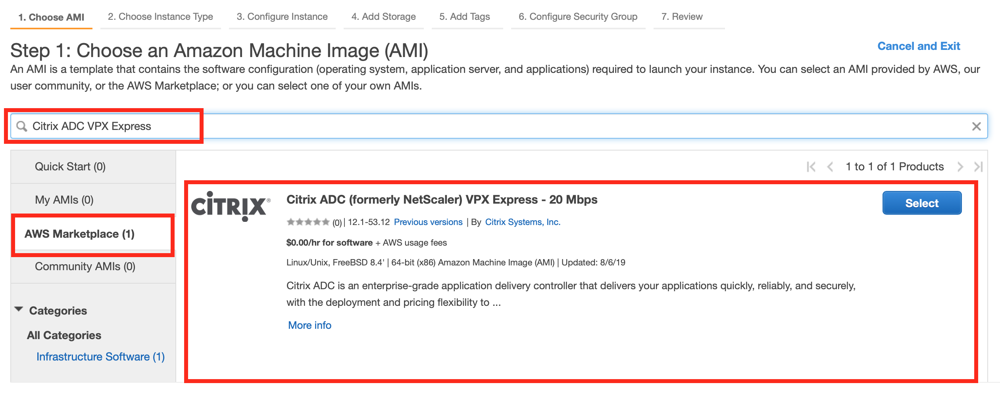
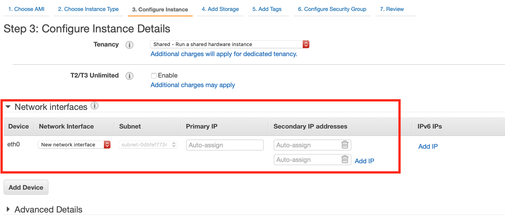

# Quick Deploy Citrix Ingress Controller in EKS with Citrix ADC VPX

This guide details the steps to deploy Citrix Ingress Controller in EKS with Citrix ADC VPX.

## Pre-requisites:

   * [AWS CLI](https://docs.aws.amazon.com/cli/latest/userguide/cli-chap-install.html)
   * [EKSCTL](https://docs.aws.amazon.com/eks/latest/userguide/getting-started-eksctl.html)
   * [KUBECTL](https://kubernetes.io/docs/tasks/tools/install-kubectl/)

## Topology:


## Create a AWS managed Kubernetes cluster (EKS) with Citrix ADC VPX

To create a AWS managed Kubenetes cluster, we will use EKSCTL.

Please make sure to configure (`aws configure`) the AWS CLI with the Access Key, Secret and Region.

```
eksctl create cluster --name quick-cic-vpx-deploy --region ap-south-1
```

When the cluster creation is done, please note the VPC-ID in which the nodes are deployed using the below command

```
$ eksctl get cluster quick-cic-vpx-deploy -r ap-south-1
NAME			VERSION	STATUS	CREATED			VPC			SUBNETS									SECURITYGROUPS
quick-cic-vpx-deploy	1.12	ACTIVE	2019-08-08T06:09:02Z	vpc-id	subnet-ids	security-group-id
```

## Create a Citrix ADC VPX instance from AWS Marketplace

Create a Citrix ADC VPX from the AWS Marketplace. For this guide, we will use the Citrix ADC VPX Express which does not have any software charges.

Launch the Citrix ADC Instance from the AWS marketplace according to the snapshot below




Assign two secondary IPs when creating the Citrix ADC VPX



**Important points to consider when creating the Citrix ADC VPX**

   * Create the Citrix ADC VPX with a single interface (NIC/ENI)
   * Create the Citrix ADC VPX in the same VPC and subnet as that of the EKS nodes. The VPC ID and the subnet IDs of the EKS nodes can be got from the `eksctl get cluster quick-cic-vpx-deploy -r ap-south-1` command.
   * Assign two secondary IPs (one for SNIP and another for VIP). See above snapshot.
   * Configure the security group of the Citrix ADC VPX to allow ports 22, 80 and 443.
   * [Disable Source and Destination Check](https://docs.aws.amazon.com/vpc/latest/userguide/VPC_NAT_Instance.html#EIP_Disable_SrcDestCheck) on the ENI of the Citrix ADC VPX instance
   * Assign an Elastic IP for the Primary IP of the Citrix ADC VPX. This would be the Management IP of the Citrix ADC VPX.
   * Assign an Elastic IP to one of the secondary IP of the Citrix ADC VPX. This would the public facing VIP for data traffic.
   * Make sure you modify the security groups of the EKS nodes to allow traffic from the Citrix ADC VPX. This can be done by adding an inbound rule of the security groups to the EKS nodes to allow traffic from the security group of the Citrix ADC VPX.

***The instructions provided above are just for this illustration. Actual deployment may vary according to your requirement***


## Deploy Citrix Ingress Controller


#### Create Citrix ADC VPX login credentials using Kubernetes secret

```
kubectl create secret  generic nslogin --from-literal=username='nsroot' --from-literal=password='<instance-id-of-vpx>'
```

The Citrix ADC VPX password is usually the instance-id of the VPX if you have not changed it.


#### Configure SNIP in the Citrix ADC VPX

SSH to the Citrix ADC VPX and configure a SNIP, which is the secondary IP of the VPX to which no Elastic IP is assigned

```
add ns ip 192.168.84.93 255.255.224.0
```

This is required for Citrix ADC to interact with the pods inside the Kubernetes cluster.


#### Update the Citrix ADC VPX management IP and VIP in the Citrix Ingress controller manifest

```
wget https://raw.githubusercontent.com/citrix/citrix-k8s-ingress-controller/master/deployment/aws/quick-deploy-cic/manifest/cic-vpx-all-in-one.yaml
```

Update the Citrix ADC VPX's primary IP in the `cic-vpx-all-in-one.yaml` in the below field

```
# Set NetScaler NSIP/SNIP, SNIP in case of HA (mgmt has to be enabled) 
- name: "NS_IP"
  value: "X.X.X.X"
```

Update the Citrix ADC VPX VIP in the `cic-vpx-all-in-one.yaml` in the below field. This is the private IP to which you have assigned an EIP.

```
# Set NetScaler VIP for the data traffic
- name: "NS_VIP"
  value: "X.X.X.X"
```

#### Create the Citrix Ingress Controller

Now that we have configure the Citrix Ingress controller with the required values, let's deploy it.

```
kubectl create -f cic-vpx-all-in-one.yaml
```

This is an all in one manifest that would create a example microservice, Citrix ingress controller and the ingress resource.

## Test your deployment

To validate your deployment, send a curl to the Elastic IP of the VIP of the Citrix ADC VPX.

```
$ curl --resolve citrix-ingress.com:80:<EIP-of-VIP> http://citrix-ingress.com
<html><body><h1>It works!</h1></body></html>
```

The response received is from example microservice which is inside the Kubernetes cluster. Citrix ADC VPX being an ingress has load-balanced the request.

