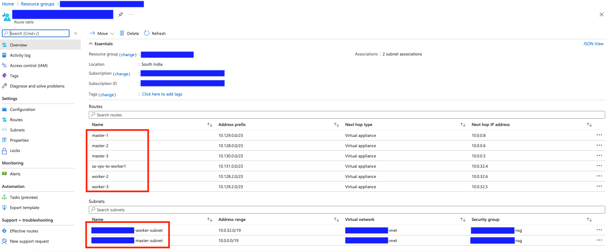

# Configuring Azure to Connect Netscaler VPX with OpenShift deployment

This guide provides the steps to configure Azure Networking to connect the Netscaler VPX with OpenShift deployment in Azure.

### Prerequisites

1. Ensure that the Netscaler VPX is deployed in any of these modes: Standalone, HA, or HA INC in Azure
2. Ensure that OpenShift is deployed using OpenShift installer in Azure

## Configure Network Security Groups of Netscaler for application traffic

Netscaler VPX can be deployed to load balance public facing applications or private applications. 

In case of public facing applications, configure the Client Subnet's Network Security Group (if Citrix is deployed in Multi NIC mode) of Netscaler VPX to allow traffic from external world to respective destination application ports like 80, 443, and so on.

Also, to configure the Netscaler VPX using SSH or the Netscaler configuration utlity, configure the Management Subnet's Network Security Group (if Citrix is deployed in Multi NIC mode) to allow traffic on Port 22 and Port 443.

**Note:**

This guide assumes that already a Virtual IP address (VIP) is allocated for Netscaler VPX on Azure through which the application would be accessible.

## Configure Subnet IP (SNIP) in Netscaler

For enabling communication between Netscaler VPX with OpenShift workloads, it needs a SNIP to be configured. 

If Netscaler is deployed in a single NIC mode (has only one Network Interface), you can allocate secondary IP addresses in the Azure Portal for Netscaler VM. For more information on how to allocate a secondary IP address for a Network Interface, see [Assigning multiple IP addresses to virtual machines](https://docs.microsoft.com/en-us/azure/virtual-network/virtual-network-multiple-ip-addresses-portal)

If Netscaler is deployed in a Multi NIC mode (has separate Network Interfaces for Client, Server and Management networks), you can note the Primary IP address of the Server Network Interface from the Azure Portal for Netscaler VPX Virtual Machine.

When the private IP address is allocated/noted, you can configure the same as Subnet IP (SNIP) in the Netscaler VPX. For more information on configuring a Subnet IP (SNIP) address in Netscaler, see [Configuring Subnet IP addresses in Netscaler](https://docs.citrix.com/en-us/citrix-adc/current-release/networking/ip-addressing/configuring-citrix-adc-owned-ip-addresses/configuring-subnet-ip-addresses-snips.html)

## VNET Peering

If Netscaler VPX and the OpenShift deployment are in two different Virtual Networks (VNET), configure VNET peering. The VNETs enable communication between the Netscaler VPX and the OpenShift virtual machines. 

For more information on how to configure VNET peering, see [Virtual Network Peering](https://docs.microsoft.com/en-us/azure/virtual-network/virtual-network-peering-overview)

## Configure Network Security Groups of Netscaler for OpenShift Communication

When an OpenShift deployment is created in Azure using an OpenShift installer, it creates a Network Security Group for the OpenShift deployment that controlls the Inbound Access for the OpenShift Virtual Machines.

Configure this Network Security Group which is created by OpenShift Installer to allow traffic from the Subnet IP (SNIP) address of Netscaler VPX (which was configured in the first step of this guide).


## Azure Route Tables

Netscaler needs a Network Route to reach the Internal POD network ([hostSubnets](https://docs.openshift.com/container-platform/4.4/rest_api/network_apis/hostsubnet-network-openshift-io-v1.html)) of OpenShift cluster.

In Azure, Routes needs to be configured using [Azure Route Tables](https://docs.microsoft.com/en-us/azure/virtual-network/virtual-networks-udr-overview).

An Azure Route table needs to be created specifying the POD Networks and its respective Host Addresses. 

Log in to the OpenShift command line and execute the following command to know the HostSubnets / POD Networks of OpenShift and its respective Host Addresses.

```
$ oc get hostsubnets
NAME            HOST            HOST IP     SUBNET          EGRESS CIDRS   EGRESS IPS
XXXX-master-0   XXXX-master-0   10.0.0.8    10.129.0.0/23                  
XXXX-master-1   XXXX-master-1   10.0.0.6    10.128.0.0/23                  
XXXX-master-2   XXXX-master-2   10.0.0.5    10.130.0.0/23                  
XXXX-worker-1   XXXX-worker-1   10.0.32.4   10.131.0.0/23                  
XXXX-worker-2   XXXX-worker-2   10.0.32.6   10.128.2.0/23                  
XXXX-worker-3   XXXX-worker-3   10.0.32.5   10.129.2.0/23   
```

Now notice the Host IP and the Subnet CIDR, an Azure Route Table can be created so that Netscaler VPX can reach the Internal PODs of the OpenShift Cluster.

See the following snapshot of the Azure Route Table configured in accordance with the above `oc get hostsubnets` output.

Make sure to associate the OpenShift Subnets and the Netscaler Server Networking Subnet (if Netscaler is in different Subnet) in the Route table. 



For more information on how to configure an Azure Route table, see [Managing Azure Route Table](https://docs.microsoft.com/en-us/azure/virtual-network/manage-route-table)

After successfully configuring the above configurations, 

1. [Netscaler ingress controller](https://github.com/netscaler/netscaler-k8s-ingress-controller) deployed inside OpenShift should be able to reach and configure the Netscaler VPX
2. Netscaler VPX would be able to reach the workloads/PODS deployed inside the OpenShift cluster
