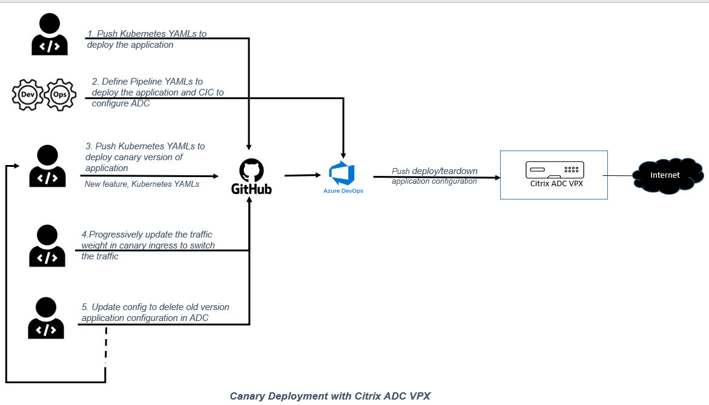
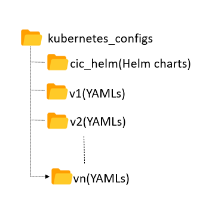
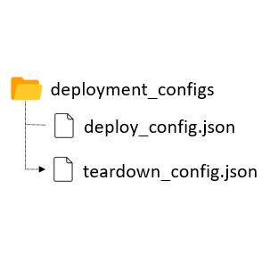
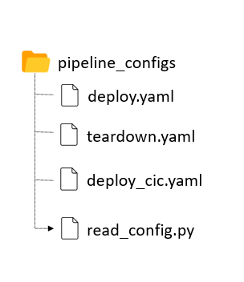

# Canary and blue-green deployment using Citrix ADC VPX and Azure pipelines for Kubernetes based applications

This topic provides information on how to achieve canary and blue-green deployment for Kubernetes applications using Citrix ADC VPX and Azure pipelines.

## Canary deployment using Citrix ADC VPX and Azure pipelines for Kubernetes based applications

Canary is a deployment strategy which involves deploying new versions of an application in small and phased incremental steps. The idea of canary is to first deploy the new changes to a small set of users to take a decision on whether to reject or promote the new deployments and then roll out the changes to the rest of the users. This strategy limits the risk involved in deploying a new version of the application in the production environment.

[Azure pipelines](https://docs.microsoft.com/en-us/azure/devops/pipelines/create-first-pipeline) are a cloud service provided by Azure DevOps which allows you to automatically run builds, perform tests, and deploy code to various development and production environments.

This section provides information on how to achieve canary deployment for Kubernetes based application using Citrix ADC VPX and Citrix ingress controller with Azure pipelines.

### Benefits of Canary deployment

- Canary version of application acts as an early warning for potential problems that might be present in the new code and the deployment issues.
- You can use the canary version for smoke tests and A/B testing.
- Canary offers easy rollback and zero-downtime upgrades.
- You can run multiple versions of applications together at the same time.

In this solution, Citrix ADC VPX is deployed on the Azure platform to enable load balancing of an application and achieve canary deployment using Citrix ADC VPX. For more information on how to deploy Citrix ADC on Microsoft Azure, see the [Citrix documentation link](https://docs.citrix.com/en-us/citrix-adc/current-release/deploying-vpx/deploy-vpx-on-azure.html).

### Canary deployment using Citrix ADC

You can achieve canary deployment using Citrix ADC with Ingress annotations which is a rule based canary deployment. In this approach, you need to define an additional Ingress object with specific annotations to indicate that the application request needs to be served based on the rule based canary deployment strategy. In the Citrix solution, Canary based traffic routing at the Ingress level can be achieved by defining various sets of rules as follows:

- Applying the canary rules based on weight
- Applying the canary rules based on the HTTP request header
- Applying the canary rules based on the HTTP header value

For more information, see [simplified canary deployment using Ingress annotations](https://developer-docs.citrix.com/projects/citrix-k8s-ingress-controller/en/latest/canary/canary/#simplified-canary-deployment-using-ingress-annotations)

### Canary deployment using Citrix ADC VPX with Azure pipelines

Citrix proposes a solution for canary deployment using Citrix ADC VPX and Citrix ingress controller with Azure pipelines for Kubernetes based applications.

In this solution, there are three configuration directories:

- `kubernetes_configs`
- `deployment_configs`
- `pipeline_configs`

**kubernetes_configs**

This directory includes the version based application specific deployment YAML files and the Helm based configuration files to deploy Citrix ingress Controller which is responsible to push Citrix ADC configuration to achieve canary deployment.

**Note:** You can download the latest Helm charts from the [Citrix ingress controller Helm charts repository](https://github.com/citrix/citrix-helm-charts/tree/master/citrix-ingress-controller) and place it under the 
`cic_helm` directory.

**deployment_configs**

This directory includes the `setup_config` and `teardown_config` JSON files that specify the path of the YAML files available for the specific version of the application to be deployed or brought down during canary deployment. 

**pipeline_configs**

This directory includes the Azure pipeline script and the python script which reads the user configurations and triggers the pipeline based on the user request to introduce a new version of the application or teardown a version of an application. The change in percentage of traffic weight in application ingress YAML would trigger the pipeline to switch the traffic between the available version of applications.

With all the three configuration files in place, any update to the files under `deployment_configs` and `kubernetes_configs` directories in GitHub, would trigger the pipeline in Azure.

The traffic split percentage can be adjusted using the `ingress.citrix.com/canary-weight` annotation in the ingress YAML of the application.

### Deploy a sample application on Canary in Azure pipelines

This topic explains how to deploy a sample application on Canary mode using Citrix ADC and Azure pipelines.

**Prerequisites**

Ensure that:

- Citrix ADC VPX is already deployed on the Azure platform and is ready to be used by our sample application.
- AKS cluster with [Kubernetes service connection](https://docs.microsoft.com/en-us/azure/devops/pipelines/library/service-endpoints?view=azure-devops&tabs=yaml) configured for the Azure pipeline.

Perform the following steps:

1. Clone the GitHub repository and go to the directory `cd/canary-azure-devops`.

1. Place the application deployment specific YAMLs (with the ingress file) under a versioned folder `v1` in the `kubernetes_configs` directory.
1. Create three Azure pipelines using the existing YAML files, `deploy_cic.yaml`, `deploy.yaml`, and `teardown.yaml`, for deploying Citrix ingress controller and deploying and tearing down the applications. See, [Azure pipelines](https://docs.microsoft.com/en-us/azure/devops/pipelines/create-first-pipeline) for creating a pipeline.
1. Update the subscription, agent pool, service connection and Citrix ADC details in the pipeline YAML.
1. Save the pipeline.
1. Update the path in `deploy_config.json` with the path specifying the directory where the application YAMLs are placed.

        {

         "K8S_CONFIG_PATH" : "cd/canary-azure-devops/kubernetes_configs/v1"

        }

1. Commit the `deploy_config.json` file and v1 directory using Git to trigger the pipeline to deploy the v1 version of the application.

1. Access the application through Citrix ADC. 
1. Introduce the v2 version of the application by creating the `v2` directory under `kubernetes_configs`. Make sure that the ingress under this version has the canary annotation specified with the right weight to be set for traffic split.
1. Deploy the version v2 of the application by updating `deploy_config.json` with the path specifying the v2 directory. Now, the traffic is split between version v1 and v2 based on the canary weight set in the ingress annotation (for example, `ingress.citrix.com/canary-weight: "40"`)

1. Continue progressively increasing the traffic weight in the ingress annotation until the new version is ready to serve all the traffic.

## Blue-green deployment using Citrix ADC VPX and Azure pipelines for Kubernetes based applications

Blue-green deployment is a technique that reduces downtime and risk by running two identical production environments called blue and green. At any time, only one of the environments is live that serves all the production traffic. The basis of the blue-green method is side-by-side deployments of two separate but identical environments. Deploying an application in both the environments can be fully automated by using jobs and tasks. This approach enforces duplication of every resource of an application. However, there are many different ways blue-green deployments can be carried out in various continuous deployment tools. 

Using Citrix ADC VPX with Azure pipelines the same canary based solution can be used to achieve blue-green deployment by adjusting the traffic weight to either zero or 100.

