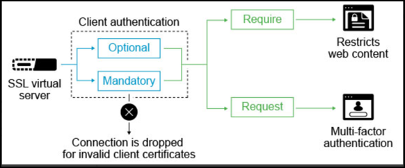

# TLS client authentication support in Citrix ADC

In TLS client authentication, a server requests a valid certificate from the client for authentication and ensures that it is only accessible by authorized machines and users.

You can enable TLS client authentication using Citrix ADC SSL-based virtual servers. With client authentication enabled on a Citrix ADC SSL virtual server, the Citrix ADC asks for the client certificate during the SSL handshake. The appliance checks the certificate presented by the client for normal constraints, such as the issuer signature and expiration date.

The following diagram explains the TLS client authentication feature on Citrix ADC.

TLS client authentication can be set to mandatory, or optional.
If the SSL client authentication is set as mandatory and the SSL Client does not provide a valid client certificate, then the connection is dropped. A valid client certificate means that it is signed or issued by a specific Certificate Authority, and not expired or revoked.
If it is marked as optional, then the Citrix ADC requests the client certificate, but the connection is not dropped. The Citrix ADC proceeds with the SSL transaction even if the client does not present a certificate or the certificate is invalid. The optional configuration is useful for authentication scenarios like two-factor authentication.

## Configuring TLS client authentication

### Enable TLS support in Citrix ADC

The Citrix ingress controller uses the **TLS** section in the Ingress definition as an enabler for TLS support with Citrix ADC.
The following is a sample snippet of the Ingress definition:

        spec:
          tls:
           - secretName:

To generate a Kubernetes secret for an existing certificate, use the following kubectl command:

    $ kubectl create secret generic tls-ca --from-file=tls.crt=cacerts.pem

**Note:** You must specify 'tls.crt=' while creating a secret. This file is used by the Citrix ingress controller while parsing a CA secret.

### Ingress configuration

You need to specify the annotations provided by Citrix to enable the client authentication in the Ingress.

**When an SSL profile is not enabled on Citrix ADC**

If an SSL profile is not enabled in the Citrix ADC, use the following annotation to enable the client authentication.

        ingress.citrix.com/ca-secret: '{"frontend-hotdrinks": "hotdrink-ca-secret"}' 

If this annotation is specified in the Ingress and the CA certificate is bound successfully to the SSL virtual server, then client authentication is enabled on the Citrix ADC.

**With an SSL profile enabled on Citrix ADC**

If the SSL profile is enabled by default in Citrix ADC, then the following annotation is required to enable the client authentication feature for the SSL virtual server.

        ingress.citrix.com/frontend_sslprofile: '{"clientauth":"ENABLED"}'