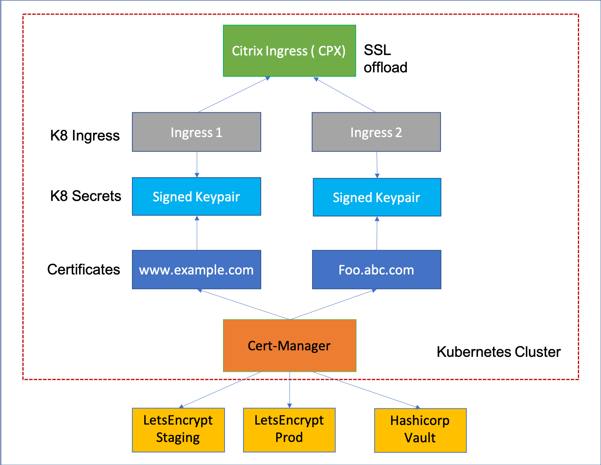

# Install, link, and update certificates on a Citrix ADC using the Citrix ingress controller

On the Ingress Citrix ADC, you can [install, link, and update certificates](https://docs.citrix.com/en-us/citrix-adc/13/ssl/ssl-certificates/add-group-certs.html). Many server certificates are signed by multiple hierarchical certificate authorities (CAs). This means that certificates form a chain.

A certificate chain is an ordered list of certificates containing an SSL certificate and certificate authority (CA) certificates. It enables the receiver to verify that the sender and all CAs are trustworthy. The chain or path begins with the SSL certificate, and each certificate in the chain is signed by the entity identified by the next certificate in the chain.

Any certificate that sits between the SSL certificate and the root certificate is called a chain or intermediate certificate. The intermediate certificate is the signer or issuer of the SSL certificate. The root CA certificate is the signer or issuer of the intermediate certificate.

If the intermediate certificate is not installed on the server (where the SSL certificate is installed) it may prevent some browsers, mobile devices, and applications from trusting the SSL certificate. To make the SSL certificate compatible with all clients, it is necessary that the intermediate certificate is installed.


## Certificates linking in Kubernetes

The Citrix ingress controller supports automatic provisioning and renewal of TLS certificates using the Kubernetes [cert-manager](https://github.com/jetstack/cert-manager). The `cert-manager` issues certificates from different sources, such as [Let’s Encrypt](https://letsencrypt.org/docs/) and [HashiCorp Vault](https://www.hashicorp.com/products/vault/) and converts them to Kubernetes secrets.

The following diagram explains how the `cert-manager` performs certificate management.


When you create a Kubernetes secret from a PEM certificate embedded with multiple CA certificates, you need to link the server certificates with the associated CAs.
While applying the Kubernetes secret, you can link the server certificates with all the associated CAs using the Ingress Citrix ADC. Linking the server certificates and CAs enable the receiver to verify if the sender and CAs are trustworthy.

The following is a sample Ingress definition:

```yml
apiVersion: networking.k8s.io/v1
kind: Ingress
metadata:
  name: frontendssl
spec:
  rules:
  - host: frontend.com
    http:
      paths:
      - backend:
          service:
            name: frontend
            port:
              number: 443
        path: /web-frontend/frontend.php
        pathType: ImplementationSpecific
  tls:
  - secretName: certchain1

```

On the Citrix ADC, you can verify if certificates are added to the Citrix ADC. Perform the following:

1.  Log on to the Citrix ADC command-line interface.

2.  Verify if certificates are added to the Citrix ADC using the following command:

        >show certkey

    For sample outputs, see the [Citrix ADC documentation](https://docs.citrix.com/en-us/citrix-adc/13/ssl/ssl-certificates/add-group-certs.html#manual-certificate-linking).

3.  Verify that the server certificate and CAs are linked using the following command:

        >show certlink

    **Output:**

        1)  Cert Name: k8s-3KC24EQYHG6ZKEDAY5Y3SG26MT2   CA Cert Name: k8s-3KC24EQYHG6ZKEDAY5Y3SG2_ic1
 
        2)  Cert Name: k8s-3KC24EQYHG6ZKEDAY5Y3SG2_ic1   CA Cert Name: k8s-3KC24EQYHG6ZKEDAY5Y3SG2_ic2