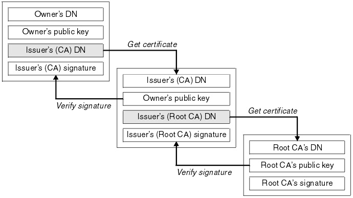

# Install, link, and update certificates on Citrix ADC using Citrix ingress controller

On the Ingress Citrix ADC, you can [install, link, and update certificates](https://docs.citrix.com/en-us/citrix-adc/13/ssl/ssl-certificates/add-group-certs.html). Many server certificates are signed by multiple hierarchical Certificate Authorities (CAs). This means that the certificates form a chain.

A certificate chain is an ordered list of certificates, containing an SSL certificate and certificate authority (CA) certificates. It enables the receiver to verify that the sender and all CAs are trustworthy. The chain or path begins with the SSL certificate, and each certificate in the chain is signed by the entity identified by the next certificate in the chain.

Any certificate that sits between the SSL certificate and the root certificate is called a chain or Intermediate Certificate. The intermediate certificate is the signer or issuer of the SSL Certificate. The root CA certificate is the signer or issuer of the Intermediate Certificate.

If the Intermediate Certificate is not installed on the server (where the SSL certificate is installed) it may prevent some browsers, mobile devices, applications, and so on, from trusting the SSL certificate. To make the SSL certificate compatible with all clients, it is necessary that the Intermediate Certificate is installed.



## Certificates linking in Kubernetes

In Kubernetes deployments, CA certificate linking is required when k8s secret created from PEM certificate which embeds the CA certificates. While applying the K8s secret you can link the server certificates with all the associated CAs using the Ingress Citrix ADC. Linking the server certificates and the CAs enable the receiver to verify if the sender and all the CAs are trustworthy.

The following is a sample Ingress definition:

```yml
apiVersion: extensions/v1beta1
kind: Ingress
metadata:
  name: frontendssl
spec:
  tls:
  - secretName: certchain1
  rules:
  - host:  frontend.com
    http:
      paths:
      - path: /web-frontend/frontend.php
        backend:
          serviceName: frontend
          servicePort: 443

```

On the Citrix ADC, you can verify if the certificates are added to the Citrix ADC. Perform the following:

1.  Log on to Citrix ADC command-line interface:

1.  Verify if the certificates are added to the Citrix ADC using the following command:

        >sh certkey

    **Output:**

            1)  Name: ns-sftrust-certificate
            Cert Path: ns-sftrust.cert
            Key Path: ns-sftrust.key
            Format: PEM
            Status: Valid,   Days to expiration:5363
            Certificate Expiry Monitor: ENABLED
            Expiry Notification period: 30 days
            Certificate Type:   "Client Certificate"    "Server Certificate"
            Version: 3
            Serial Number: 01
            Signature Algorithm: sha256WithRSAEncryption
            Issuer:  C=US,ST=California,L=San Jose,O=Citrix Gateway,OU=NS SFTrust,CN=SFTrust default RMPSDH
            Validity
                Not Before: Oct  4 22:13:37 2018 GMT
                Not After : Aug 16 12:48:17 2034 GMT
            Subject:  C=US,ST=California,L=San Jose,O=Citrix Gateway,OU=NS SFTrust,CN=SFTrust default RMPSDH
            Public Key Algorithm: rsaEncryption
            Public Key size: 2048
            Ocsp Response Status: NONE
         
            2)  Name: ns-server-certificate
            Cert Path: ns-server.cert
            Key Path: ns-server.key
            Format: PEM
            Status: Valid,   Days to expiration:5363
            Certificate Expiry Monitor: ENABLED
            Expiry Notification period: 30 days
            Certificate Type:   "Client Certificate"    "Server Certificate"
            Version: 3
            Serial Number: 01
            Signature Algorithm: sha256WithRSAEncryption
            Issuer:  C=US,ST=California,L=San Jose,O=Citrix ANG,OU=NS Internal,CN=default LUJFBF
            Validity
                Not Before: Oct  4 22:13:36 2018 GMT
                Not After : Aug 16 12:48:16 2034 GMT
            Subject:  C=US,ST=California,L=San Jose,O=Citrix ANG,OU=NS Internal,CN=default LUJFBF
            Public Key Algorithm: rsaEncryption
            Public Key size: 2048
            Ocsp Response Status: NONE
         
            3)  Name: k8s-3KC24EQYHG6ZKEDAY5Y3SG26MT2
            Cert Path: k8s-3KC24EQYHG6ZKEDAY5Y3SG26MT2.crt
            Key Path: k8s-3KC24EQYHG6ZKEDAY5Y3SG26MT2.key
            Format: PEM
            Status: Valid,   Days to expiration:7729
            Certificate Expiry Monitor: ENABLED
            Expiry Notification period: 30 days
            Certificate Type:   "Client Certificate"    "Server Certificate"
            Version: 3
            Serial Number: F5CFF9EF1E2460FE
            Signature Algorithm: sha1WithRSAEncryption
            Issuer:  C=in,O=citrix,CN=ca_6
            Validity
                Not Before: Feb 14 12:07:00 2011 GMT
                Not After : Feb  6 12:07:00 2041 GMT
            Subject:  C=in,O=citrix,CN=ee_client
            Public Key Algorithm: rsaEncryption
            Public Key size: 1024   
            Ocsp Response Status: NONE
         
            4)  Name: k8s-3KC24EQYHG6ZKEDAY5Y3SG2_ic1
            Cert Path: k8s-3KC24EQYHG6ZKEDAY5Y3SG26MT2.crt_ic1
            Format: PEM
            Status: Valid,   Days to expiration:7729
            Certificate Expiry Monitor: ENABLED
            Expiry Notification period: 30 days
            Certificate Type:   "Intermediate CA"
            Version: 3
            Serial Number: F5CFF9EF1E2460FC
            Signature Algorithm: sha1WithRSAEncryption
            Issuer:  C=in,O=citrix,CN=root
            Validity
                Not Before: Feb 14 12:06:52 2011 GMT
                Not After : Feb  6 12:06:52 2041 GMT
            Subject:  C=in,O=citrix,CN=ca_6
            Public Key Algorithm: rsaEncryption
            Public Key size: 1024
            Ocsp Response Status: NONE
         
            5)  Name: k8s-3KC24EQYHG6ZKEDAY5Y3SG2_ic2
            Cert Path: k8s-3KC24EQYHG6ZKEDAY5Y3SG26MT2.crt_ic2
            Format: PEM
            Status: Valid,   Days to expiration:7729
            Certificate Expiry Monitor: ENABLED
            Expiry Notification period: 30 days
            Certificate Type:   "ROOT CA"
            Version: 3
            Serial Number: AA3CB5E1BAD646CF
            Signature Algorithm: sha1WithRSAEncryption
            Issuer:  C=in,O=citrix,CN=root
            Validity
                Not Before: Feb 14 12:06:47 2011 GMT
                Not After : Feb  6 12:06:47 2041 GMT
            Subject:  C=in,O=citrix,CN=root
            Public Key Algorithm: rsaEncryption
            Public Key size: 1024
            Ocsp Response Status: NONE
         Done

1.  Verify the server certificate and the CAs are linked using the following command:

        >sh certlink

    **Output:**

        1)  Cert Name: k8s-3KC24EQYHG6ZKEDAY5Y3SG26MT2   CA Cert Name: k8s-3KC24EQYHG6ZKEDAY5Y3SG2_ic1
 
        2)  Cert Name: k8s-3KC24EQYHG6ZKEDAY5Y3SG2_ic1   CA Cert Name: k8s-3KC24EQYHG6ZKEDAY5Y3SG2_ic2