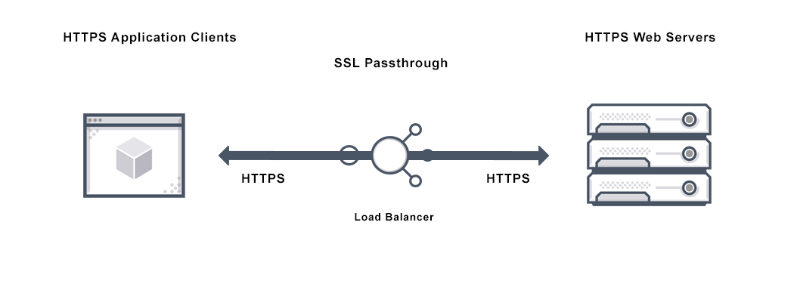

# Configure SSL passthrough using Kubernetes Ingress

SSL passthrough is a method that allows you to pass incoming security sockets layer (SSL) requests directly to a server for decryption rather than decrypting the request using a load balancer. SSL passthrough is widely used for web application security and it uses the TCP mode to pass encrypted data to servers.

The proxy SSL passthrough configuration does not require the installation of an SSL certificate on the load balancer. The SSL certificates are installed on the back end server as they handle the SSL connection instead of the load balancer.



The Citrix ingress controller provides the following Ingress annotation that you can use enable SSL passthrough on the Ingress Citrix ADC:

    ingress.citrix.com/ssl-passthrough: 'True|False'

The default value of the annotation is `False`.

SSL passthrough is enabled for all services or host names provided in the Ingress definition. SSL passthrough uses host name (wildcard host name is also supported) and ignores paths given in Ingress.

> **Note:** The Citrix ingress controller does not support SSL passthrough for non-hostname based Ingress. Also, SSL passthrough is not valid for default back end Ingress.

To configure SSL passthrough on the Ingress Citrix ADC, you must define the `ingress.citrix.com/ssl-passthrough:` as shown in the following sample Ingress definition. You must also enable TLS for the host as shown in the example.

```yml
apiVersion: networking.k8s.io/v1beta1
kind: Ingress
metadata:
  name: hotdrinks-ingress
  annotations:
    ingress.citrix.com/frontend-ip: "10.106.143.160" # IP address of the Ingress Citrix ADC.
    kubernetes.io/ingress.class: "citrix"
    ingress.citrix.com/ssl-passthrough: "True"  # Enable SSL passthrough on the Ingress Citrix ADC
    ingress.citrix.com/insecure-termination: "redirect"
    ingress.citrix.com/secure-backend: "True"
spec:
  tls:                              # Enable TLS
  - secretName: beverages
  rules:
  - host:  hotdrinks.beverages.com
    http:
      paths:
      - path:
      - path: / any path given will be ignored
        backend:
          serviceName: frontend-hotdrinks
          servicePort: 443
```