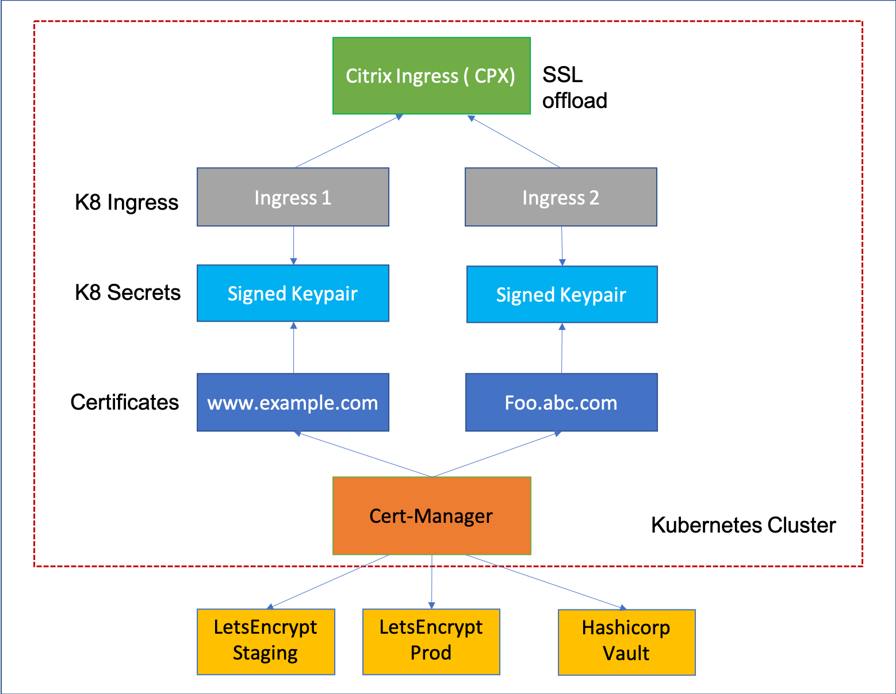

# Automated Certificate Management with cert-manager

Citrix Ingress Controller (CIC) supports automatic provisioning and renewal of TLS certificates using [cert-manager](https://github.com/jetstack/cert-manager). cert-manager is a native Kubernetes certificate management controller. It issues certificates from different sources, such as [Let’s Encrypt](https://letsencrypt.org/docs/) and [HashiCorp Vault](https://www.hashicorp.com/products/vault/).

As shown in the following diagram, cert-manager interacts with the external Certificate Authorities (CA) to sign the certificates and converts it to Kubernetes secrets. These secrets are used by CIC to configure SSL virtual server on the Citrix ADC.

For detailed configurations, refer:

-  [Deploying HTTPS web applications on Kubernetes with Citrix Ingress Controller and LetsEncrypt using cert-manager](./acme.md)

-  [Deploying HTTPS web application on Kubernetes with Citrix Ingress Controller and Hashicorp Vault using cert-manager](./vault.md)
