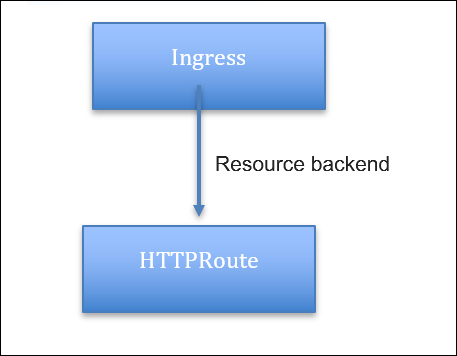

# Advanced content routing for Kubernetes Ingress using the HTTPRoute CRD

Kubernetes native Ingress offers basic host and path-based routing which is supported by the Citrix ingress controller. 
Citrix also provides an alternative approach using content routing CRDs for supporting advanced routing capabilities. Content Routing CRDs include Listener CRD and HTTPRoute CRD. These CRDs provide advanced content routing features such as regex based expression and content switching based on query parameters, cookies, HTTP headers, and other Citrix ADC custom expressions.

With the Ingress version `networking.k8s.io/v1`, Kubernetes introduces support for [resource backends](https://kubernetes.io/docs/concepts/services-networking/ingress/#resource-backend). A resource backend is an `ObjectRef` to another Kubernetes resource within the same namespace as an Ingress object.

Now, Citrix supports configuring the HTTP route CRD resource as a resource backend in Ingress. By default, Ingress supports only limited content routing capabilities like path and host-based routing. With this feature, you can extend advanced content routing capabilities to Ingress and configure various content switching options. For a given domain, you can use the `HTTPRoute` custom resource to configure content switching without losing the third party compatibility support of the Kubernetes Ingress API.

  

**Note**: This feature supports the Kubernetes Ingress version `networking.k8s.io/v1` that is available on Kubernetes 1.19 and later versions.

**Note:** If the Ingress path routing and `HTTPRoute` are used for the same domain, all the content routing policies from the `HTTPRoute` resource get lower priority than the Ingress based content routing policies. So, it is recommended to configure all the content switching policies of the`HTTPRoute` resource for a given domain if advanced content routing is required.

## Configure advanced content routing for Kubernetes Ingress using the HTTPRoute CRD

This procedure shows how to deploy an HTTPRoute resource as a resource backend to support advanced content routing. 

**Prerequisites**

 - Ensure that the ingress API version `networking.k8s.io/v1` is available in the Kubernetes cluster.
 - Ensure that the HTTPRoute CRD is deployed.

### Deploy the Ingress resource

Define the Ingress resource with the resource back-end pointing to a `HTTPRoute` custom resource in a YAML file. Specify all the front-end configurations such as certificates, front-end profiles, front-end IP address, and ingress class as part of the Ingress resource. 

Following is a sample Ingress resource named as `sample-ingress.yaml`.


```yml
apiVersion: networking.k8s.io/v1
kind: Ingress
metadata:
  name: kuard-ingress
  annotations:
    ingress.citrix.com/frontend-ip: "x.x.x.x"
    kubernetes.io/ingress.class: citrix
    ingress.citrix.com/insecure-termination: "redirect"
spec:
  tls:
  - secretName: web-ingress-secret
  rules:
  - host: kuard.example.com
    http:
      paths:
      - pathType: ImplementationSpecific
        backend:
          resource:
            apiGroup: citrix.com
            kind: HTTPRoute
            name: kuard-example-route
```

After defining the Ingress resource in a YAML file, deploy the YAML file using the following command. Here, `sample-ingress.yaml` is the YAML file definition.

    Kubectl apply -f sample-ingress.yaml

In this example, content switching policies for the domain `kuard.example.com` are defined as part of the `HTTPRoute` custom resource called `kuard-example-route`. `Certificates`, `frontend-ip`, and `ingress class` are specified as part of the Ingress resource. Back-end annotations such as load balancing method and service group configurations are specified as part of the `HTTPRoute` custom resource.

### Deploy the HTTPRoute resource

Define the HTTP route configuration in a YAML file. In the YAML file, use HTTPRoute in the `kind` field and in the `spec` section add the `HTTPRoute` CRD attributes based on your requirement for the HTTP route configuration.   
For more information about API description and examples, see the [HTTPRoute documentation](https://developer-docs.citrix.com/projects/citrix-k8s-ingress-controller/en/latest/crds/content-routing/#httproute-crd). 

Following is a sample `HTTPRoute` resource configuration. This example shows how to use query parameters based content switching for the various Kubernetes back-end microservices.


```yml
apiVersion: citrix.com/v1
kind: HTTPRoute
metadata:
   name: kuard-example-route
spec:
  hostname:
  - kuard.example.com
  rules:
  - name: kuard-blue
    match:
    - queryParams:
      - name: version
        contains: v2
    action:
      backend:
        kube:
          service: kuard-blue
          port: 80
  - name: kuard-green
    match:
    - queryParams:
      - name: version
        contains: v3
    action:
      backend:
        kube:
          service: kuard-green
          port: 80
  - name: kuard-default
    match:
    - path:
       prefix: /
    action:
      backend:
        kube:
          service: kuard-purple
          port: 80
```
After you have defined the HTTP routes in the YAML file, deploy the YAML file. In this example, `httproute` is the YAML definition.


    Kubectl apply -f httproute.yaml

