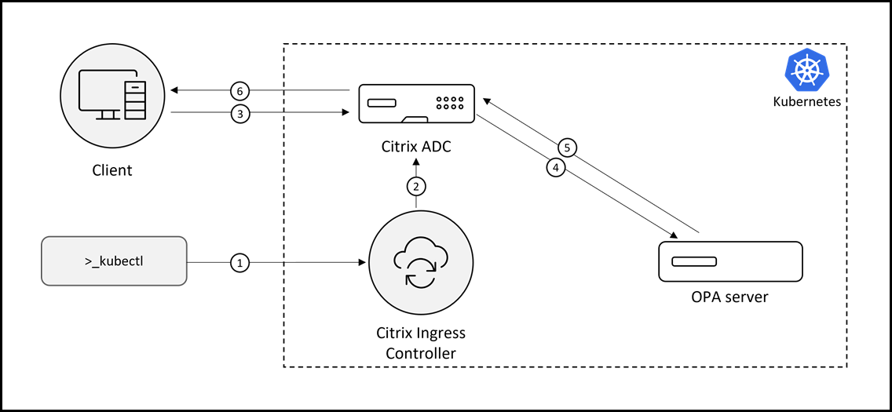

# Open policy agent support for Kubernetes with Citrix ADC

Open policy agent (OPA) is an open source, general-purpose policy engine that unifies policy enforcement across different technologies and systems. OPA provides a high-level declarative language that lets you specify policy as code and simple APIs to offload policy decision-making from your software. Using OPA, you can decouple policy decision-making from policy enforcement. You can use OPA to enforce policies through Citrix ADC in a Kubernetes environment.

With OPA, you can create a centralized policy-decision making system for an environment involving multiple Citrix ADCs or multiple devices which are distributed. The advantage of this approach is you have to make changes only on the OPA server for any decision specific changes applicable to multiple devices.

For more information on OPA, see the [OPA documentation](https://www.openpolicyagent.org/docs/latest/).

The OPA integration on Citrix ADC can be supported through HTTP callout, where OPA can be used with or without authentication. An HTTP callout is an HTTP or HTTPS request that the Citrix ADC appliance generates and sends to an external application as part of the policy evaluation.

For more information on the HTTP callout support, see the [HTTP callout documentation](https://docs.citrix.com/en-us/citrix-k8s-ingress-controller/how-to/http-callout.html).

For more information regarding authentication support, see the [Authentication and authorization policies for Kubernetes with Citrix ADC](https://docs.citrix.com/en-us/citrix-k8s-ingress-controller/crds/auth.html).

The following diagram provides an overview of how to integrate OPA with the Citrix ADC cloud native solution.



In the OPA integration diagram, each number represents the corresponding task in the following list:

1. Creating the required Kubernetes objects using Kubernetes commands. This step should include creating the CRD to send the HTTP callout to the OPA server.

2. Configuring Citrix ADC. Citrix ADC is automatically configured by Citrix ADC ingress controller based on the created Kubernetes objects.

3. Sending user request for resources from client. The user might get authenticated if authentication CRDs are created.

4. Sending HTTP callout to OPA server in JSON format from Citrix ADC carrying authorization parameters.

5. Sending authorization decision from OPA server based on the rules defined in REGO, the policy language for OPA.

6. Sending response to the client based on the authorization decision.

## Example use cases

### Allow or deny access to resources based on the client source IP address

Following is an example HTTP callout policy to the OPA server using rewrite policy CRD to allow or deny access to resources based on the client source IP address and the corresponding OPA rules.

In the example, the OPA server responds with `"result": true` if the client source IP address is 192.2.162.0/24, else it responds with `"result":false`.

```yml

apiVersion: citrix.com/v1
kind: rewritepolicy
metadata:
  name: calloutexample
spec:
  responder-policies:
    - servicenames:
        - frontend
      responder-policy:
        respondwith:
          http-payload-string: '"HTTP/1.1 401 Access denied\r\n\r\n"' #Access is denied if the respose from OPA server contains false.
        respond-criteria: 'sys.http_callout("callout_name").CONTAINS("false")'
        comment: 'Invalid access'
  httpcallout_policy:
    - name: callout_name
      server_ip: "192.2.156.160" #OPA Server IP
      server_port: 8181 #OPA Server Port
      http_method: 'POST'
      host_expr: "\"192.2.156.160\""
      url_stem_expr: "\"/v1/data/example/allow\"" #URL stem expression to be used
      body_expr: '"{\"input\": {\"clientinfo\": [{\"id\": \"ci\", \"ip\": [\""+ CLIENT.IP.SRC +"\"]}]}}"' #JSON to OPA server carrying client IP
      headers:
      - name: Content-Type
        expr: '"application/json"'
      return_type: TEXT
      result_expr: "HTTP.RES.BODY(100)"

```

Following are the rules defined through the Rego policy language on the OPA server for the HTTP callout policy for this example:

        package example

        default allow = false                               # unless otherwise defined, allow is false

        allow = true {                                      # allow is true if...
            count(violation) != 0                           # the ip matches regex.
        }

        violation[client.id] {                              # a client is in the violation set if...
            client := input.clientinfo[_]
            regex.match("192.2.162.", client.ip[_])         # the client is not part of 192.2.162.0/24 network.
        }

### Allow or deny access based on user group after authentication

Following is an example HTTP callout policy to the OPA server using rewrite policy CRD to allow or deny access to resources based on user group after authentication and the corresponding OPA rules.

In this example, the OPA server responds with `"result":true` if the user is part of the `beverages` group, else it responds with `"result":false`.

Following is the HTTP callout policy to the OPA server through the rewrite policy CRD.

```yml
apiVersion: citrix.com/v1
kind: rewritepolicy
metadata:
  name: calloutexample
spec:
  responder-policies:
    - servicenames:
        - frontend
      responder-policy:
        respondwith:
          http-payload-string: '"HTTP/1.1 401 Access denied\r\n\r\n"' #Access is denied if the respose from OPA server contains false.
        respond-criteria: 'sys.http_callout("callout_name").CONTAINS("false")'
        comment: 'Invalid access'

  httpcallout_policy:
    - name: callout_name
      server_ip: "192.2.156.160" #OPA Server IP
      server_port: 8181 #OPA Server Port
      http_method: 'POST'
      host_expr: "\"192.2.156.160\""
      url_stem_expr: "\"/v1/data/example/allow\"" #URL stem expression to be used
      body_expr: '"{\"input\": {\"users\": [{\"name\": \""+ AAA.USER.NAME +"\", \"group\": [\""+ AAA.USER.GROUPS +"\"]}]}}"' #JSON to OPA server carrying username and group information
      headers:
      - name: Content-Type
        expr: '"application/json"'
      return_type: TEXT
      result_expr: "HTTP.RES.BODY(100)"
```

Following are the rules defined through the Rego language on the OPA server for this example:

        package example

        default allow = false                               # unless otherwise defined, allow is false

        allow = true {                                      # allow is true if...
            count(isbeveragesuser) != 0                     # the user is part of beverages group.
        }

        isbeveragesuser[user.name] {                        # a user is beverages user...
            user := input.users[_]
            user.group[_] == "beverages"                    # if it is part of beverages group.
        }

You can perform authentication using the request header (401 based) or through forms based.

Following is a sample authentication policy using request header-based authentication. In this policy,
local authentication is used.

```yml
apiVersion: citrix.com/v1beta1
kind: authpolicy
metadata:
  name: localauth
spec:
    servicenames:
    - frontend

    authentication_mechanism:
      using_request_header: 'ON'

    authentication_providers:

        - name: "local-auth-provider"
          basic_local_db:
              use_local_auth: 'YES'

    authentication_policies:

        - resource:
            path: []
            method: []
          provider: ["local-auth-provider"]

    authorization_policies:

        - resource:
            path: []
            method: []
            claims: []
```

Following is a sample authentication policy using form-based authentication. In this policy, local-based authentication is used.

```yml

apiVersion: citrix.com/v1beta1
kind: authpolicy
metadata:
  name: localauth
spec:
    servicenames:
    - frontend

    authentication_mechanism:
      using_forms:
        authentication_host: "fqdn_authenticaton_host"
        authentication_host_cert:
          tls_secret: authhost-tls-cert-secret
        vip: "192.2.156.156"

    authentication_providers:

        - name: "local-auth-provider"
          basic_local_db:
              use_local_auth: 'YES'

    authentication_policies:

        - resource:
            path: []
            method: []
          provider: ["local-auth-provider"]


    authorization_policies:

        - resource:
            path: []
            method: []
            claims: []

```

### Allow or deny access based on authentication attributes obtained during authentication

Following is an example HTTP callout policy to the OPA server using the rewrite policy CRD to allow or deny access based on authentication attributes obtained during authentication and the corresponding OPA rules.

In the example, the OPA server responds with `"result":true'` if the user `memberof` attribute contains `grp1`, else it responds with `"result":false`.

The following is the sample HTTP callout policy to the OPA server through the rewrite policy CRD:

```yml
apiVersion: citrix.com/v1
kind: rewritepolicy
metadata:
  name: calloutexample
spec:
  responder-policies:
    - servicenames:
        - frontend
      responder-policy:
        respondwith:
          http-payload-string: '"HTTP/1.1 401 Access denied\r\n\r\n"' #Access is denied if the respose from OPA server contains false.
        respond-criteria: 'sys.http_callout("callout_name").CONTAINS("false")'
        comment: 'Invalid access'

  httpcallout_policy:
    - name: callout_name
      server_ip: "192.2.156.160" #OPA Server IP
      server_port: 8181 #OPA Server Port
      http_method: 'POST'
      host_expr: "\"192.2.156.160\""
      url_stem_expr: "\"/v1/data/example/allow\"" #URL stem expression to be used
      body_expr: '"{\"input\": {\"users\": [{\"name\": \""+ AAA.USER.NAME +"\", \"attr\": [\""+ aaa.user.attribute("memberof") +"\"]}]}}"' #JSON to OPA server carrying username and "memberof" attribute information
      headers:
      - name: Content-Type
        expr: '"application/json"'
      return_type: TEXT
      result_expr: "HTTP.RES.BODY(100)"
```

Following are the rules defined through the Rego language on the OPA server for this example:

        package example

        default allow = false                               # unless otherwise defined, allow is false

        allow = true {                                      # allow is true if...
            count(isbeveragesuser) != 0                     # the user is part of grp1.
        }

        isbeveragesuser[user.name] {                        # a user is part of allow group...
            user := input.users[_]
            regex.match("CN=grp1", user.attr[_])            # if it is part of grp1 group.
}

You can perform authentication using request header (401 based) or through forms based. In this example, LDAP authentication is used, where the user `memberof` attribute is obtained from the LDAP server during authentication.

Following is a sample authentication policy using request header-based authentication.

```yml
apiVersion: citrix.com/v1beta1
kind: authpolicy
metadata:
  name: ldapauth
spec:
    servicenames:
    - frontend

    authentication_mechanism:
      using_request_header: 'ON'

    authentication_providers:
        - name: "ldap-auth-provider"
          ldap:
              server_ip: "192.2.156.160"
              base: 'dc=aaa,dc=local'
              login_name: accountname
              sub_attribute_name: CN
              server_login_credentials: ldapcredential
              attributes_to_save: memberof #memberof attribute to be obtained from LDAP server for user

    authentication_policies:
        - resource:
            path: []
            method: []
          provider: ["ldap-auth-provider"]

    authorization_policies:
        - resource:
             path: []
             method: []
             claims: []
```

Following is a sample authentication policy using form-based authentication.

```yml

apiVersion: citrix.com/v1beta1
kind: authpolicy
metadata:
  name: authhotdrinks
spec:
    servicenames:
    - frontend

    authentication_mechanism:
      using_forms:
        authentication_host: "fqdn_authenticaton_host"
        authentication_host_cert:
          tls_secret: authhost-tls-cert-secret
        vip: "192.2.156.156"

    authentication_providers:
        - name: "ldap-auth-provider"
          ldap:
              server_ip: "192.2.156.160"
              base: 'dc=aaa,dc=local'
              login_name: accountname
              sub_attribute_name: CN
              server_login_credentials: ldapcredential
              attributes_to_save: memberof #memberof attribute to be obtained from LDAP server for user

    authentication_policies:

        - resource:
            path: []
            method: []
          provider: ["ldap-auth-provider"]
```