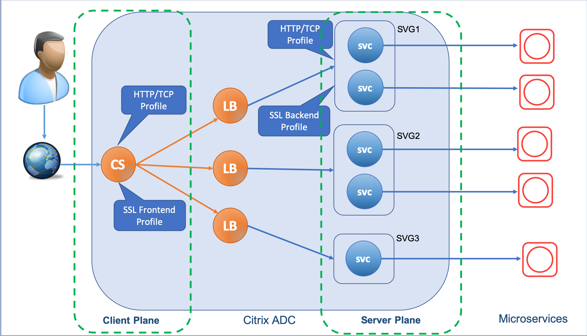

# Configure HTTP, TCP, or SSL profiles on Citrix ADC

Configurations such as, HTTP, TCP, or SSL for a Citrix ADC appliance can be specified using individual entities such as [HTTP profile](https://docs.citrix.com/en-us/citrix-adc/13/system/http-configurations.html#sample-http-configurations), [TCP profile](https://docs.citrix.com/en-us/citrix-adc/13/system/tcp-configurations.html), or [SSL profile](https://docs.citrix.com/en-us/citrix-adc/13/ssl/ssl-profiles.html) respectively.  The profile is a collection of settings pertaining to the individual protocols, for example, HTTP profile is a collection of HTTP settings. It offers ease of configuration and flexibility. Instead of configuring the settings on each entity you can configure them in a profile and bind the profile to all the entities that the settings apply to.

Citrix ingress controller enables you to configure HTTP, TCP, or SSL related configuration on the Ingress Citrix ADC using profiles.

## Understand Citrix ADC configuration in Kubernetes environment

In a Kubernetes environment, the Ingress Citrix ADC uses [Content Switching (CS)](https://docs.citrix.com/en-us/citrix-adc/13/content-switching.html) virtual server as the front end for external traffic. That is, it is the entity that receives the requests from the client. After processing the request, the CS virtual server passes the request data to a [load balancing (LB)](https://docs.citrix.com/en-us/citrix-adc/13/load-balancing.html) entity. The LB virtual server and the associated service group processes the request data and then forwards it to the appropriate app (microservice).

You need to have a separate **front end configuration** for the entities that receive the traffic from the client (highlighted as **Client Plane** in the diagram) and a **back end configuration** for the entities that forward the traffic from the Citrix ADC to the microservices in Kubernetes (highlighted as **Server Plane** in the diagram).



The Citrix ingress controller provides individual smart annotations for the front end and back-end configurations that you can use based on your requirement.

## HTTP profile

An [HTTP profile](https://docs.citrix.com/en-us/citrix-adc/13/system/http-configurations.html#sample-http-configurations) is a collection of HTTP settings. A default HTTP profile (`nshttp_default_profile`) is configured to set the HTTP configurations that are applied by default, globally to all services and virtual servers.

The Citrix ingress controller provides the following two smart annotations for HTTP profile. You can use these annotations to define the HTTP settings for the Citrix ADC. When you deploy an ingress that includes these annotations, the Citrix ingress controller creates an HTTP profile derived from the default HTTP profile (`nshttp_default_profile`) configured on the Citrix ADC. Then, it applies the parameters that you have provided in the annotations to the new HTTP profile and applies the profile to the Citrix ADC.

| Smart annotation | Description | Sample |
| ---------------- | ------------ | ----- |
| `ingress.citrix.com/frontend-httpprofile` | Use this annotation to create the front-end HTTP profile (**Client Plane**) | `ingress.citrix.com/frontend-httpprofile: '{"dropinvalreqs":"enabled", "websocket" : "enabled"}'`  |
| `ingress.citrix.com/backend-httpprofile` | Use this annotation to create the back-end HTTP profile (**Server Plane**). </br>**Note:** Ensure that you manually enable the HTTP related global parameters on the Citrix ADC. </br> For example, to use HTTP2 at the back end (**Server Plane**), ensure that you can enable `HTTP2Serverside` global parameter in the Citrix ADC. For more information, see [Configurating HTTP2](https://docs.citrix.com/en-us/citrix-adc/13/system/http-configurations/configuring-http2.html). | `ingress.citrix.com/backend-httpprofile: '{"app-1": {"dropinvalreqs":"enabled", "websocket" : "enabled"}}'`  |

## TCP profile

A [TCP profile](https://docs.citrix.com/en-us/citrix-adc/13/system/tcp-configurations.html) is a collection of TCP settings. A default TCP profile (`nstcp_default_profile`) is configured to set the TCP configurations that is applied by default, globally to all services and virtual servers.

The Citrix ingress controller provides the following two smart annotations for TCP profile. You can use these annotations to define the TCP settings for the Citrix ADC. When you deploy an ingress that includes these annotations, the Citrix ingress controller creates a TCP profile derived from the default TCP profile (`nstcp_default_profile`) configured on the Citrix ADC. Then, it applies the parameters that you have provided in the annotations to the new TCP profile and applies the profile to the Citrix ADC.

| Smart annotation | Description | Sample |
| ---------------- | ------------ | ----- |
| `ingress.citrix.com/frontend-tcpprofile` | Use this annotation to create the front-end TCP profile (**Client Plane**) | `ingress.citrix.com/frontend-tcpprofile: '{"ws":"enabled", "sack" : "enabled"}'`  |
| `ingress.citrix.com/backend-tcpprofile` | Use this annotation to create the back-end TCP profile (**Server Plane**) | `ingress.citrix.com/backend-tcpprofile: '{"citrix-svc":{"ws":"enabled", "sack" : "enabled"}}'`  |

## SSL profile

An [SSL profile](https://docs.citrix.com/en-us/citrix-adc/13/ssl/ssl-profiles.html) is a collection of settings for SSL entities. It offers ease of configuration and flexibility. Instead of configuring the settings on each entity, you can configure them in a profile and bind the profile to all the entities that the settings apply to.

### Prerequisites

On the Citrix ADC, by default, SSL profile is not enable on the Ingress Citrix ADC. Ensure that you manually enable SSL profile on the Citrix ADC. Enabling the SSL profile overrides all the existing SSL related setting on the Citrix ADC, for detailed information on SSL profiles, see [SSL profiles](https://docs.citrix.com/en-us/citrix-adc/13/ssl/ssl-profiles.html).

SSL profiles are classified into two categories:

-  **Front end profiles**, containing parameters applicable to the front-end entity. That is, they apply to the entity that receives requests from a client.
-  **Back-end profiles**, containing parameters applicable to the back-end entity. That is, they apply to the entity that sends client requests to a server.

Once you enable SSL profiles on the Citrix ADC, a default front end profile (`ns_default_ssl_profile_frontend`) is applied to the SSL virtual server and a default back-end profile (`ns_default_ssl_profile_backend`) is applied to the service or service group on the Citrix ADC.

The Citrix ingress controller provides the following two smart annotations for SSL profile. You can use these annotations to customize the default front end profile (`ns_default_ssl_profile_frontend`) and back-end profile (`ns_default_ssl_profile_backend`) based on your requirement:

| Smart annotation | Description | Sample |
| ---------------- | ------------ | ----- |
| `ingress.citrix.com/frontend-sslprofile` | Use this annotation to create the front end SSL profile (**Client Plane**). The front end SSL profile is required only if you have enabled TLS on the Client Plane. | `ingress.citrix.com/frontend-sslprofile: '{"hsts":"enabled", "tls12" : "enabled"}'`  |
| `ingress.citrix.com/backend-sslprofile` | Use this annotation to create the back-end SSL profile (**Server Plane**). The SSL back end profile is required only if you use the [ingress.citrix.com/secure-backend](https://developer-docs.citrix.com/projects/citrix-k8s-ingress-controller/en/latest/configure/annotations/) annotation for the back-end. | `ingress.citrix.com/backend-sslprofile: '{"citrix-svc":{"hsts":"enabled", "tls1" : "enabled"}}'`  |

> **IMPORTANT:**
> SSL profile does not enable you to configure SSL certificate.

## Front end configuration

For the front end configuration (Client Plane) of the Ingress Citrix ADC, you need to create ingress definition that includes HTTP, TCP, or SSL profile based smart annotations. The Citrix ingress controller considers an ingress definition as front end configuration only if the `spec:rules` parameter in the ingress definition is empty.

>**Note:** Ensure that you do not create separate ingress definitions for each profile. All the profile based smart annotations should be used in the single ingress definition for front end configuration.

**Sample Ingress manifest for front end configuration for an HTTP server:**

```yml
#The values for the parameters are for demonstration purpose only.

apiVersion: extensions/v1beta1
kind: Ingress
metadata:
  name: frontend-ingress
  annotations:
  # /* The CS virtual server is derived from the combination of insecure-port/secure-port, frontend-ip, and secure-service-type/insecure-service-type annotations. */
   ingress.citrix.com/insecure-port: "80" 
   ingress.citrix.com/frontend-ip: "192.168.1.1"
   ingress.citrix.com/frontend-httpprofile: '{"dropinvalreqs":"enabled", "markconnreqInval" : "enabled"}'
   ingress.citrix.com/frontend-tcpprofile: '{"ws":"enabled", "sack" : "enabled"}'
spec:
  rules:
  - host:
```

If you want to configure SSL related parameters to the front end configuration, you need to add the SSL profile based smart annotation and also add the `spec:tls` parameter to the ingress definition:

```yml
spec:
  rules:
  - host:
  tls:
  - hosts: OR
# - secretName:  #either of hosts or secretName can be given
```

**Sample Ingress manifest for front end configuration for an SSL server:**

```yml
#The values for the parameters are for demonstration purpose only.

apiVersion: extensions/v1beta1
kind: Ingress
metadata:
  name: admin-ingress
  annotations:
  # /* The CS virtual server is derived from the combination of insecure-port/secure-port, frontend-ip, and secure-service-type/insecure-service-type annotations. */
   ingress.citrix.com/frontend-ip: "1.1.1.1"
   ingress.citrix.com/insecure-port: "80"
   ingress.citrix.com/secure-port: "443"
   ingress.citrix.com/frontend-httpprofile: '{"dropinvalreqs":"enabled", "markconnreqInval" : "enabled"}'
   ingress.citrix.com/frontend-tcpprofile: '{"ws":"enabled", "sack" : "enabled"}'
   ingress.citrix.com/frontend-sslprofile: '{"hsts":"enabled", "tls1" : "enabled"}'
   #ingress.citrix.com/insecure-termination: "redirect"
spec:
  rules:
  - host:
  tls:
  - hosts:
# - secretName:  #either of hosts or secretName can be given
```

## Back-end configuration

Any ingress definition that includes service details, `spec:rules:host`, `spec:backend` entry, and so on are considered as back-end configuration.

**Sample backend ingress manifest without TLS configuration:**

```yml
#The values for the parameters are for demonstration purpose only.

apiVersion: extensions/v1beta1
kind: Ingress
metadata:
  name: apache-ingress
  annotations:
  # /* The CS virtual server is derived from the combination of insecure-port/secure-port, frontend-ip, and secure-service-type/insecure-service-type annotations. */
   ingress.citrix.com/frontend-ip: "10.106.172.22"
   ingress.citrix.com/insecure-port: "80"
   ingress.citrix.com/backend-httpprofile: '{"apache":{"markhttp09inval": "disabled"}}'
   ingress.citrix.com/backend-tcpprofile: '{"apache":{"sack":"enabled"}}'
spec:
  rules:
  - host:  www.apachetest.com
    http:
      paths:
      - path: /
        backend:
          serviceName: apache
          servicePort: 80

```

**Sample backend ingress manifest with TLS configuration:**

```yml
#The values for the parameters are for demonstration purpose only.

apiVersion: extensions/v1beta1
kind: Ingress
metadata:
  name: hotdrink-ingress
  annotations:
  # /* The CS virtual server is derived from the combination of insecure-port/secure-port, frontend-ip, and secure-service-type/insecure-service-type annotations. */
    ingress.citrix.com/frontend-ip: "10.106.172.22"
    ingress.citrix.com/secure-port: "443"
    ingress.citrix.com/backend-sslprofile: '{"hotdrink":{"snienable": "enabled"}}'
    ingress.citrix.com/backend-httpprofile: '{"hotdrink":{"markhttp09inval": "disabled"}}'
    ingress.citrix.com/backend-tcpprofile: '{"hotdrink":{"sack":"enabled"}}'
    ingress.citrix.com/secure-backend: '{"hotdrink":"true"}'
spec:
  tls:
  - secretName: hotdrink.secret
  rules:
  - host:  hotdrinks.beverages.com
    http:
      paths:
      - path: /
        backend:
          serviceName: hotdrink
          servicePort: 443

```

## Using built-in or existing user-defined profiles on the Ingress Citrix ADC

You can use the individual smart annotations to configure the built-in profiles or existing user-defined profiles on the Ingress Citrix ADC for the front end and back-end configurations based on your requirement. For more information on built-in profiles, see [Built-in TCP Profiles](https://docs.citrix.com/en-us/citrix-adc/13/system/tcp-configurations.html#built-in-tcp-profiles) and [Built-in HTTP profiles](https://docs.citrix.com/en-us/citrix-adc/13/system/http-configurations.html#built-in-http-profiles).

For the front end configuration, you can provide the name of the built-in or existing user-defined profiles on the Ingress Citrix ADC. The following is a sample ingress annotation:

    ingress.citrix.com/frontend-httpprofile: "http_preconf_profile1"

Where, 'http_preconf_profile1' is the profile that exists on the Ingress Citrix ADC.

For the back-end configuration, you must provide the name of the built-in or existing profile on the Ingress Citrix ADC and the back-end service name. The following is a sample ingress annotation:

    ingress.citrix.com/backend-httpprofile: '{"citrix-svc": "http_preconf_profile1"}'

Where, 'http_preconf_profile1' is the profile that exists on the Ingress Citrix ADC and `citrix-svc` is the back-end service name.

**Sample HTTP profile:**

    ingress.citrix.com/frontend-httpprofile: "http_preconf_profile"
    ingress.citrix.com/backend-httpprofile: '{"citrix-svc": "http_preconf_profile"}'

**Sample TCP profile:**

    ingress.citrix.com/frontend-tcpprofile: "tcp_preconf_profile"
    ingress.citrix.com/backend-tcpprofile: '{"citrix-svc":"tcp_preconf_profile"}'

**Sample SSL profile:**

    ingress.citrix.com/frontend-sslprofile: "ssl_preconf_profile"
    ingress.citrix.com/backend-sslprofile: '{"citrix-svc":"ssl_preconf_profile"}'