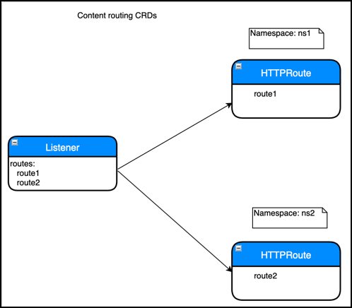

# Advanced content routing for Kubernetes with Citrix ADC

Kubernetes native Ingress offers basic host and path based routing. But, other advanced routing techniques like routing based on header values or query strings is not supported in the Ingress structure. You can expose these features on the Kubernetes Ingress through Ingress annotations, but annotations are complex to manage and validate.

You can expose the advanced content routing abilities provided by Citrix ADC as a custom resource definition (CRD) API for Kubernetes.

Using content routing CRDs, you can route the traffic based on the following parameters:

- Hostname
- URL path
- HTTP headers
- Cookie
- Query parameters
- HTTP method
- Citrix ADC policy expression

**Note:**
An Ingress resource and content routing CRDs cannot co-exist for the same endpoint (IP address and port). The usage of content routing CRDs with Ingress is not supported.

The advanced content routing feature is exposed in Kubernetes with the following CRDs:

- Listener
- HTTPRoute



## Listener CRD

A Listener CRD object represents the end-point information like virtual IP address, port, certificates, and other front-end configurations. It also defines the default actions like sending the default traffic to a back end or redirecting the traffic. A Listener CRD object can refer to HTTPRoute CRD objects which represents HTTP routing logic for the incoming HTTP request.

For the full CRD definition, see the [Listener CRD](https://github.com/citrix/citrix-k8s-ingress-controller/blob/master/crd/contentrouting/Listener.yaml).
For complete information on all attributes of the Listener CRD, see [Listener CRD documentation](Listener.md).

### Deploy the Listener CRD

1. Download the [Listener CRD](https://github.com/citrix/citrix-k8s-ingress-controller/blob/master/crd/contentrouting/Listener.yaml).

2. Deploy the listener CRD with following command.

	    Kubectl create -f  Listener.yaml
        Example:
        root@k8smaster:# kubectl create -f Listener.yaml
        customresourcedefinition.apiextensions.k8s.io/listeners.citrix.com created

## How to write Listener CRD objects

After you have deployed the CRD provided by Citrix in the Kubernetes cluster, you can define the listener configuration in a YAML file. In the YAML file, use `Listener` in the kind field and in the spec section add the listener CRD attributes based on your requirement for the listener configuration.
After you deploy the YAML file, the Citrix ingress controller applies the listener configuration on the Ingress Citrix ADC device.

Following is a sample Listener CRD object definition named as `Listener-crd.yaml`.

```yml

apiVersion: citrix.com/v1alpha1
kind: Listener
 metadata:
   name: test-listener
   namespace: default
 spec:
   certificates:
   - secret:
       name: secret1
   - secret:
       name: secret2
       namespace: demo
   - default: true
     preconfigured: secret3
   defaultAction:
     backend:
       kube:
         namespace: default
         port: 80
         service: default-service
         backendConfig:
           lbConfig:
             lbmethod: ROUNDROBIN
           servicegroupConfig:
             clttimeout: '20'
   vip: 192.168.0.1
   port: 443
   protocol: https
   routes:
   - labelSelector:
       team: team1
   - name: domain-1
     namespace: default
   - name: domain-2
     namespace: default

```

In this example, a listener is exposing an HTTPS endpoint. Under certificates section, SSL certificates for the endpoint are configured using Kubernetes secrets named `secret1` and `sercret2` and a default ADC preconfigured certificate with certkey named `secret3`. The default action for the listener is configured as a Kubernetes service. Routes are attached with the listener using both label selectors and individual route references using name and namespace.

After you have defined the Listener CRD object in the YAML file, deploy the YAML file using the following command. In this example, `Listener-crd.yaml` is the YAML definition.


	    Kubectl create -f  Listener-crd.yaml

## HTTPRoute CRD

An HTTPRoute CRD object represents the HTTP routing logic for the incoming HTTP requests. You can use a combination of various HTTP parameters like host name, path, headers, query parameters, and cookies to route the incoming traffic to a back-end service. An HTTPRoute object can be attached to one or more Listener objects which represent the end point information. You can have one or more rules in an HTTPRoute object, with each rule specifying an action associated with it. Order of evaluation of the rules within an HTTPRoute object is same as the order mentioned in the object. For example, if there are two rules with the order rule1 and rule2, with rule1 is written before rule2, rule1 is evaluated first before rule2.

HTTPRoute CRD definition is available at [HTTPRoute.yaml](https://github.com/citrix/citrix-k8s-ingress-controller/blob/master/crd/contentrouting/HTTPRoute.yaml). For complete information on the attributes for HTTP Route CRD, see [HTTPRoute CRD documentation](HTTPRoute.md).

## Deploy the HTTPRoute CRD

Perform the following to deploy the HTTPRoute CRD:

1. Download the [HTTPRoute.yaml](https://github.com/citrix/citrix-k8s-ingress-controller/blob/master/crd/contentrouting/HTTPRoute.yaml).

2. Apply the HTTPRoute CRD in your cluster using the following command.

	    Kubectl apply -f  HTTPRoute.yaml


    Example:

        root@k8smaster:# kubectl create -f HTTPRoute.yaml
        customresourcedefinition.apiextensions.k8s.io/httproutes.citrix.com configured

## How to write HTTPRoute CRD objects

 Once you have deployed the HTTPRoute CRD, you can define the HTTP route configuration in a YAML file. In the YAML file, use `HTTPRoute` in the kind field and in the spec section add the HTTPRoute CRD attributes based on your requirement for the HTTP route configuration.

Following is a sample HTTPRoute CRD object definition named as `Route-crd.yaml`.

```yml
apiVersion: citrix.com/v1alpha1
kind: HTTPRoute
metadata:
   name: test-route
spec:
  hostname:
  - host1.com
  rules:
  - name: header-routing
    match:
    - headers:
      - headerName:
          exact: my-header
    action:
      backend:
        kube:
          service: mobile-app
          port: 80
          backendConfig:
            secureBackend: true
            lbConfig:
              lbmethod: ROUNDROBIN
  - name: path-routing
    match:
    - path:
        prefix: /
    action:
      backend:
        kube:
          service: default-app
          port: 80
```

In this example, any request with a header name matching `my-header` is routed to the mobile-app service and all other traffic is routed to the default-app service.
For detailed explanations and API specifications of HTTPRoute, see [HTTPRoute CRD](https://github.com/citrix/citrix-k8s-ingress-controller/blob/master/crd/contentrouting/HTTPRoute.yaml).

After you have defined the HTTP routes in the YAML file, deploy the YAML file for HTTPRoute CRD object using the following command. In this example, `Route-crd.yaml` is the YAML definition.


	    Kubectl create -f  Route-crd.yaml

Once you deploy the YAML file, the Citrix ingress controller applies the HTTP route configuration on the Ingress Citrix ADC device.


### Attaching HTTPRoute CRD objects to a Listener CRD object

You can attach HTTPRoute CRD objects to a Listener CRD object in two ways:

- Using name and namespace
- Using labels and selector

**Attaching HTTPRoute CRD objects using name and namespace**

In this approach, a Listener CRD object explicitly refer to one or more HTTPRoute objects by specifying the name and namespace in the `routes` section.
The order of evaluation of HTTPRoute objects is same as the order specified in the Listener CRD object with the first HTTPRoute object is evaluated first and so on.

For example, a snippet of the Listener CRD object is shown as follows.

    routes:
     - name: route-1
       namespace: default
     - name: route-2
       namespace: default

In this example, the HTTPRoute CRD object named route1 is evaluated before the HTTPRoute named route2.

**Attaching an HTTPRoute CRD object using labels and selector**

 You can also attach HTTPRoute objects to a Listener object by using labels and selector. You can specify one or more labels in the Listener CRD object. Any HTTPRoute objects which match the labels are automatically linked to the Listener object and the rules are created in Citrix ADC. When you use this approach, there is no particular order of evaluation between multiple HTTPRoute objects. Only exception is an HTTPRoute object with a default route (a route with just a host name or a '/' path) which is evaluated as the last object.

For example, snippet of a listener resource is as follows:

    routes:
    - labelSelector:
        team: team1


