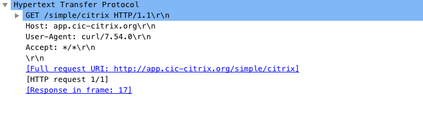

# Use Rewrite and Responder policies in Kubernetes

In a Kubernetes environment, to deploy specific layer 7 policies to handle scenarios such as:

-  Redirecting HTTP traffic to a specific URL
-  Blocking a set of IP addresses to mitigate DDoS attacks
-  Imposing HTTP to HTTPS

Requires you to add appropriate libraries within the microservices and manually configure the policies. Instead, you can use the Rewrite and Responder features provided by the Ingress Citrix ADC device to deploy these policies.

Citrix provides Kubernetes [CustomResourceDefinitions](https://kubernetes.io/docs/concepts/extend-kubernetes/api-extension/custom-resources/#customresourcedefinitions) (CRDs) that you can use with the Citrix ingress controller to automate the configurations and deployment of these policies on the Citrix ADCs used as Ingress devices.

The Rewrite and Responder CRD provided by Citrix is designed to expose a set of tools used in front-line Citrix ADCs. Using these functionalities you can rewrite the header and payload of ingress and egress HTTP traffic as well as respond to HTTP traffic on behalf of a microservice.

Once you deploy the Rewrite and Responder CRD in the Kubernetes cluster. You can define extensive rewrite and responder policies using datasets, pat sets, and string maps and also enable audit logs for statistics on the ingress device. For more information on rewrite and responder policy feature provided by Citrix ADC, see [Rewrite policy](https://docs.citrix.com/en-us/citrix-adc/12-1/appexpert/rewrite.html) and [Responder policy](https://docs.citrix.com/en-us/citrix-adc/12-1/appexpert/responder.html).

!!! note "Note"
    The Rewrite and Responder CRD is not supported for OpenShift routes. You can use OpenShift ingress to use Rewrite and Responder CRD.

## Deploy the Citrix Rewrite and Responder CRD

The Citrix Rewrite and Responder CRD deployment YAML file: [rewrite-responder-policies-deployment.yaml](https://github.com/citrix/citrix-k8s-ingress-controller/blob/master/crd/rewrite-responder-policies-deployment.yaml).

!!! note "Note"
    Ensure that you do not modify the deployment YAML file.

Deploy the CRD, using the following command:

    kubectl create -f rewrite-responder-policies-deployment.yaml

For example,

    root@master:~# kubectl create -f rewrite-responder-policies-deployment.yaml
    customresourcedefinition.apiextensions.k8s.io/rewritepolicies.citrix.com created

## Rewrite and Responder CRD attributes

The **CRD** provides attributes for various options required to define the rewrite and responder policies. Also, it provides attributes for dataset, pat set, string map, and audit logs to use within the rewrite and responder policies. These CRD attributes correspond to **Citrix ADC** command and attribute respectively.

### Rewrite policy

The following table lists the **CRD** attributes that you can use to define a rewrite policy. Also, the table lists the corresponding Citrix ADC command and attributes.

| **CRD attribute** | **Citrix ADC command** | **Citrix ADC attribute** |
| ----------------- | ---------------------- | ------------------------ |
| rewrite-criteria | Add rewrite policy | rule |
| default-action | Add rewrite policy | undefAction |
| operation | Add rewrite action | type |
| target  | Add rewrite action | target |
| modify-expression | Add rewrite action| stringBuilderExpr |
| multiple-occurence-modify| Add rewrite action| Search |
| additional-multiple-occurence-modify | Add rewrite action | RefineSearch |
| Direction | Bind lb vserver | Type |

### Responder policy

The following table lists the **CRD** attributes that you can use to define a responder policy. Also, the table lists the corresponding Citrix ADC command and attributes.

| **CRD attribute** | **Citrix ADC command** | **Citrix ADC attribute** |
| ----------------- | ---------------------- | ------------------------ |
| Redirect | Add responder action | Type (the value of type) |
| url | Add responder action | Target |
| redirect-status-code | Add responder action | responseStatusCode |
| redirect-reason | Add responder action | reasonPhrase |
| Respond-with | Add responder action | Type (the value of type) |
| http-payload-string | Add responder action | Target |
| Noop | Add responder policy | Action (the value of action) |
| Reset | Add responder policy | Action (the value of action) |
| Drop | Add responder policy | Action (the value of action) |
| Respond-criteria | Add responder policy | Rule |
| Default-action | Add responder policy | undefAction |

### Audit log

The following table lists the **CRD** attributes provide to enable audit log within the rewrite or responder policies. Also, the table lists the corresponding Citrix ADC command and attributes.

| **CRD attribute** | **Citrix ADC command** | **Citrix ADC attribute** |
| ----------------- | ---------------------- | ------------------------ |
| Logexpression | Add audit message action | stringBuilderExpr |
| Loglevel | Add audit message action | Loglevel |

### Dataset

The following table lists the **CRD** attributes for dataset that you can use within the rewrite or responder policies. Also, the table lists the corresponding Citrix ADC command and attributes.

| **CRD attribute** | **Citrix ADC command** | **Citrix ADC attribute** |
| ----------------- | ---------------------- | ------------------------ |
| Name | Add policy dataset | Name |
| Type  | Add policy dataset |Type |
| Values | Bind policy dataset | Value |

### Patset

| **CRD attribute**  | **Citrix ADC command** | **Citrix ADC attribute** |
| ------------------ | ---------------------- | ------------------------ |
| Name | Add policy patset | Name |
| Values | Bind policy patset | string |

### String map

| **CRD attribute** | **Citrix ADC command** | **Citrix ADC attribute** |
| ----------------- | ---------------------- | ------------------------ |
| Name | Add policy stringmap | Name |
| Key | Bind policy stringmap | Key |
| Value | Bind policy stringmap | Value |

### Goto-priority-expression

The following table provides information about the `goto-priority-expression` attribute, which is a CRD attribute for binding a group of multiple consecutive policies to services.

| **CRD attribute** | **Citrix ADC command** | **Citrix ADC attribute** |**Supported values**|**Default value**|
| ----------------- | ---------------------- | ------------------------ |---------------------- |---------------------- |
| goto-priroty-expression| Bind lb vserver | gotoPriorityExpression|   NEXT and END| End|

For more information on how to use the `goto-priority-expression` attribute, see the example [Modify strings and host name in the requested URL](#Modify-strings-and-hostname-in-the-requested-URL).

## How to write a policy configuration

After you have deployed the CRD provided by Citrix in the Kubernetes cluster, you can define the policy configuration in a`.yaml` file. In the `.yaml` file, use `rewritepolicy` in the `kind` field and based on your requirement add any of the following individual sections in `spec` for policy configuration.

-  `rewrite-policy` - To define rewrite policy configuration.
-  `responder-policy` - To define responder policy configuration.
-  `logpackets` - To enable audit logs.
-  `dataset` - To use a data set for extensive policy configuration.
-  `patset` - To use a pat set for extensive policy configuration.
-  `stringmaps` - To use string maps for extensive policy configuration.

In these sections, you need to use the [CRD attributes](#crd-attributes) provided for respective policy configuration (rewrite or responder) to define the policy.

Also, in the `spec` section, you need to include a `rewrite-policies` section to specify the service or services to which the policy must be applied. For more information, see [Sample policy configurations](#sample-policy-configurations).

After you deploy the `.yaml` file, the Citrix ingress controller applies the policy configuration on the Ingress Citrix ADC device.

> **Points to note:**
>
> -  If the CRD is associated with a [namespace](https://kubernetes.io/docs/concepts/overview/working-with-objects/namespaces/) then, by default, the policy is applied to the services associated with the namespace. For example, if you have the same service name associated with multiple namespaces, then the policy is applied to the service that belongs to the namespace associated with the CRD.
>
> -  If you have defined multiple policies in a single `.yaml` file then the first policy configuration defined in the file takes priority and the subsequent policy configurations is applied as per the sequence. If you have multiple policies defined in different files then the first policy configuration defined in the file that you deployed first takes priority.

> **Guidelines for the usage of Goto-priority-expression**

> - The rewrite and responder policies can be combined as multiple groups using the `NEXT` keyword within the `goto-priority-expression` field.

> - When `goto-priority-expression` field is `NEXT` within the current policy and if the current policy evaluates to `True`, the next policy in the group is executed and the flow moves to the next consecutive policies unless the `goto-priority-expression` field points to `END`.

> - When the current policy evaluates to `FALSE`, the `goto-priority-expression` has no impact, as the policy execution stops at the current policy.

> - The rewrite or responder policy group within the rewrite or responder policies begins with the policy assigned with `goto-priority-expression` as NEXT and includes all the consecutive policies until the `goto-priority-expression` field is assigned to `END`.

> - When you group rewrite or responder policies using `goto-priority-expression`, the service names bound to the policies within the group should be the same.

> - The last policy within the rewrite-policies or responder-policies should always have the `goto-priority-expression` as `END`.

> - If the `goto-priority-expression` field is not specified for a policy, the default value of END is assigned to `goto-priority-expression`.

>**Note:** For more information on how to use the `goto-priority-expression` field, see the example [Modify strings and host name in the requested URL](#Modify-strings-and-hostname-in-the-requested-URL).

Consider a scenario wherein you want to define a policy in Citrix ADC to rewrite all the incoming URLs to `new-url-for-the-application` and send it to the microservices. Create a `.yaml` file called `target-url-rewrite.yaml` and use the appropriate [CRD attributes](#crd-attributes) to define the rewrite policy as follows:

**target-url-rewrite.yaml:**

```YAML
apiVersion: citrix.com/v1
kind: rewritepolicy
metadata:
  name: targeturlrewrite
spec:
  rewrite-policies:
    - servicenames:
        - citrix-svc
      logpackets:
        logexpression: "http.req.url"
        loglevel: INFORMATIONAL
      rewrite-policy:
        operation: replace
        target: 'http.req.url'
        modify-expression: '"new-url-for-the-application"'
        comment: 'Target URL Rewrite - rewrite the url of the HTTP request'
        direction: REQUEST
        rewrite-criteria: 'http.req.is_valid'
```

After you have defined the policy configuration, deploy the `.yaml` file using the following command:

    kubectl create -f target-url-rewrite.yaml

After you deploy the `.yaml` file, the Citrix ingress controller applies the policy configuration on the Ingress Citrix ADC device.

On the master node in the Kubernetes cluster, you can verify the status of created/applied rewrite policy CRD using the following command:

    Kubectl get rewritepolicies.citrix.com targeturlrewrite
    You can view the status as follows
    kubectl get rewritepolicies.citrix.com targeturlrewrite 
    NAME               STATUS    MESSAGE
    targeturlrewrite   Success   CRD Activated

If there are issues while creating or applying the CRD, the same can be debugged using the citrix-k8s-ingress-controller logs.

    kubectl logs citrixingresscontroller

Also, you can verify whether the configuration is applied on the Citrix ADC by using the following steps.

1.	Log on to the Citrix ADC command-line.

2.	Use the following command to verify if the configuration is applied to the Citrix ADC:

        show run | grep `lb vserver`
        add lb vserver k8s-citrix_default_80_k8s-citrix-svc_default_80_svc HTTP 0.0.0.0 0 -persistenceType NONE -cltTimeout 180
        bind lb vserver k8s-citrix_default_80_k8s-citrix-svc_default_80_svc k8s-citrix_default_80_k8s-citrix-svc_default_80_svc
        bind lb vserver k8s-citrix_default_80_k8s-citrix-svc_default_80_svc -policyName k8s_crd_rewritepolicy_rwpolicy_targeturlrewrite_0_default -priority 100300076 -gotoPriorityExpression END -type REQUEST 
        
      You can verify that the policy `k8s_crd_rewritepolicy_rwpolicy_targeturlrewrite_0_default` is bound to the load balancing virtual server.


## Sample policy configurations

### Responder policy configuration

**black-list-urls.yaml:**

```YAML
apiVersion: citrix.com/v1
kind: rewritepolicy
metadata:
  name: blacklisturls
spec:
  responder-policies:
    - servicenames:
        - citrix-svc
      responder-policy:
        respondwith:
          http-payload-string: '"HTTP/1.1 401 Access denied"'
        respond-criteria: 'http.req.url.equals_any("blacklistUrls")'
        comment: 'Blacklist certain Urls'


  patset:
    - name: blacklistUrls
      values:
        - '/app1'
        - '/app2'
        - '/app3'
```

In this example, if Citrix ADC receives any URL that matches the `/app1`, `/app2`, or `/app3` strings defined in the `patset`, Citrix ADC blocks the URL.

### Policy with audit logs enabled

**black-list-urls-audit-log.yaml:**

```yml
apiVersion: citrix.com/v1
kind: rewritepolicy
metadata:
  name: blacklisturls
spec:
  responder-policies:
    - servicenames:
        - citrix-svc
      logpackets:
        logexpression: "http.req.url"
        loglevel: INFORMATIONAL
      responder-policy:
        respondwith:
          http-payload-string: '"HTTP/1.1 401 Access denied"'
        respond-criteria: 'http.req.url.equals_any("blacklistUrls")'
        comment: 'Blacklist certain Urls'


  patset:
    - name: blacklistUrls
      values:
        - '/app1'
        - '/app2'
        - '/app3'
```

### Multiple policy configurations

You can add multiple policy configurations in a single `.yaml` file and apply the policies to the Citrix ADC device. You need add separate sections for each policy configuration.

**multi-policy-config.yaml:**

``` yml
apiVersion: citrix.com/v1
kind: rewritepolicy
metadata:
  name: multipolicy
spec:
  responder-policies:
    - servicenames:
        - citrix-svc
      responder-policy:
        redirect:
          url: '"www.citrix.com"'
        respond-criteria: 'client.ip.src.TYPECAST_text_t.equals_any("redirectIPs")'
        comment: 'Redirect IPs to citrix.com'
    - servicenames:
        - citrix-svc
      responder-policy:
        redirect:
          url: 'HTTP.REQ.HOSTNAME+http.req.url.MAP_STRING_DEFAULT_TO_KEY("modifyurls")'
        respond-criteria: 'http.req.is_valid'
        comment: 'modify specific URLs'

  rewrite-policies:
    - servicenames:
        - citrix-svc
      rewrite-policy:
        operation: insert_http_header
        target: 'sessionID'
        modify-expression: '"48592th42gl24456284536tgt2"'
        comment: 'insert SessionID in header'
        direction: RESPONSE
        rewrite-criteria: 'http.res.is_valid'


  dataset:
    - name: redirectIPs
      type: ipv4
      values:
        - 1.1.1.1
        - 2.2.2.2

  stringmap:
    - name: modifyurls
      comment: Urls to be modified string
      values:
        - key: '"/app1/"'
          value: '"/internal-app1/"'
        - key: '"/app2/"'
          value: '"/internal-app2/"'
```

The example contains two responder policies and a rewrite policy, based on these policies the Citrix ADC device performs the following:

-  Any client request to IP addresses defined in the `redirectIP` dataset, that is, `1.1.1.1` or `2.2.2.2` respectively, the request is redirected to `www.citrix.com`.

-  Any incoming URL with strings provided in the `modifyurls` stringmap is modified to the value provided in the stringmap. For example, if the incoming URL has the string `/app1/` is modified to `/internal-app1/`

-  Adds a session ID as a new header in the response to the client.

## Example use cases

### Add response headers

When the requested URL from the client contains `/citrix-app/`, you can add the following headers in the HTTP response from the microservices to the client using a rewrite policy:

-  Client source port to the header
-  Server destination IP address
-  random HTTP header

The following sample rewrite policy definition adds these headers to the HTTP response from the microservices to the client:

```yml
apiVersion: citrix.com/v1
kind: rewritepolicy
metadata:
name: addresponseheaders
spec:
rewrite-policies:
  - servicenames:
      - frontend
    rewrite-policy:
      operation: insert_before_all
      target: http.res.full_header
      modify-expression: '"\r\nx-port: "+client.tcp.srcport+"\r\nx-ip:"+client.ip.dst+"\r\nx-new-dummy-header: Sending_a_gift"'
      multiple-occurence-modify: 'text("\r\n\r\n")'
      comment: 'Response header rewrite'
      direction: RESPONSE
      rewrite-criteria: 'http.req.url.contains("/citrix-app/")'
```

Create a YAML file (`add_response_headers.yaml`) with the rewrite policy definition and deploy the YAML file using the following command:

    kubectl create -f add_response_headers.yaml

You can verify the HTTP header added to the response as follows:

    $ curl -vvv http://app.cic-citrix.org/citrix-app/
    *   Trying 10.102.33.176...
    * TCP_NODELAY set
    * Connected to app.cic-citrix.org (10.102.33.176) port 80 (#0)
    > GET /citrix-app/ HTTP/1.1
    > Host: app.cic-citrix.org
    > User-Agent: curl/7.54.0
    > Accept: */*
    >
    < HTTP/1.1 200 OK
    < Server: nginx/1.8.1
    < Date: Fri, 29 Mar 2019 11:14:04 GMT
    < Content-Type: text/html
    < Transfer-Encoding: chunked
    < Connection: keep-alive
    < X-Powered-By: PHP/5.5.9-1ubuntu4.14
    < x-port: 22481 ==================> NEW RESPONSE HEADER
    < x-ip:10.102.33.176 ==================> NEW RESPONSE HEADER
    < x-new-dummy-header: Sending_a_gift ==================> NEW RESPONSE HEADER
    <
    <html>
    <head>
    <title> Front End App - v1 </title>


    TRIMMED
    .......

### Add custom header to the HTTP response packet

Using a rewrite policy, you can add custom headers in the HTTP response from the microservices to the client.

The following sample rewrite policy definition adds custom header to the HTTP response from the microservices to the client:

```yml
apiVersion: citrix.com/v1
kind: rewritepolicy
metadata:
  name: addcustomheaders
spec:
  rewrite-policies:
    - servicenames:
        - frontend
      rewrite-policy:
        operation: insert_before_all
        target: http.res.full_header
        modify-expression: '"\r\nx-request-time:"+sys.time+"\r\nx-using-citrix-ingress-controller: true"'
        multiple-occurence-modify: 'text("\r\n\r\n")'
        comment: 'Adding custom headers'
        direction: RESPONSE
        rewrite-criteria: 'http.req.is_valid'

```

Create a YAML file (`add_custom_headers.yaml`) with the rewrite policy definition and deploy the YAML file using the following command:

    kubectl create -f add_custom_headers.yaml

You can verify the custom HTTP header added to the response as follows:

    $ curl -vvv http://app.cic-citrix.org/
    * Trying 10.102.33.176...
    * TCP_NODELAY set
    * Connected to app.cic-citrix.org (10.102.33.176) port 80 (#0)
    > GET / HTTP/1.1
    > Host: app.cic-citrix.org
    > User-Agent: curl/7.54.0
    > Accept: */*
    >
    < HTTP/1.1 200 OK
    < Server: nginx/1.8.1
    < Date: Fri, 29 Mar 2019 12:15:09 GMT
    < Content-Type: text/html
    < Transfer-Encoding: chunked
    < Connection: keep-alive
    < X-Powered-By: PHP/5.5.9-1ubuntu4.14
    < x-request-time:Fri, 29 Mar 2019 13:27:40 GMT =============> NEW HEADER ADDED
    < x-using-citrix-ingress-controller: true  ===============> NEW HEADER ADDED
    <
    <html>
    <head>
    <title> Front End App - v1 </title>
    <style>

    TRIMMED
    ........

### Replace host name in the request

You can define a rewrite policy as shown in the following example YAML (`http_request_modify_prefixasprefix.yaml`) to replace the host name in an HTTP request as per your requirement:

```yml
apiVersion: citrix.com/v1
kind: rewritepolicy
metadata:
  name: httpheadermodifyretainprefix
spec:
  rewrite-policies:
    - servicenames:
        - frontend
      rewrite-policy:
        operation: replace_all
        target: 'http.req.header("host")'
        modify-expression: '"citrix-service-app"'
        multiple-occurence-modify: 'text("app.cic-citrix.org")'
        comment: 'HTTP header rewrite of hostname'
        direction: REQUEST
        rewrite-criteria: 'http.req.is_valid'
```

Create a YAML file (`http_request_modify_prefixasprefix.yaml`) with the rewrite policy definition and deploy the YAML file using the following command:

    kubectl create -f http_request_modify_prefixasprefix.yaml

You can verify the policy definition using the `curl` command. The host name in the request is replaced with the defined host name.

    curl http://app.cic-citrix.org/prefix/foo/bar

Output:


### Modify the application root

You can define a rewrite policy to modify the application root if the existing application root is `/`.

The following sample rewrite policy modifies `/` to `/citrix-approot/` in the request URL:

```yml
apiVersion: citrix.com/v1
kind: rewritepolicy
metadata:
 name: httpapprootrequestmodify
spec:
 rewrite-policies:
   - servicenames:
       - frontend
     rewrite-policy:
       operation: replace
       target: http.req.url
       modify-expression: '"/citrix-approot/"'
       comment: 'HTTP app root request modify'
       direction: REQUEST
       rewrite-criteria: http.req.url.eq("/")
```

Create a YAML file (`kubectl create -f http_approot_request_modify.yaml`) with the rewrite policy definition and deploy the YAML file using the following command:

    kubectl create -f kubectl create -f http_approot_request_modify.yaml

Using the `curl` command, you can verify if the application root is modified as per your requirement:

    curl -vvv http://app.cic-citrix.org/

Output:


### Modify strings in the requested URL

You can define a rewrite policy to modify the strings in the requested URL as per your requirement.

The following sample rewrite policy replaces the strings `something` to `simple` in the requested URL:

```yml
apiVersion: citrix.com/v1
kind: rewritepolicy
metadata:
name: httpurlreplacestring
spec:
rewrite-policies:
 - servicenames:
     - frontend
   rewrite-policy:
     operation: replace_all
     target: http.req.url
     modify-expression: '"/"'
     multiple-occurence-modify: 'regex(re~((^(\/something\/))|(^\/something$))~)'
     comment: 'HTTP url replace string'
     direction: REQUEST
     rewrite-criteria: http.req.is_valid
```

Create a YAML file (`http_url_replace_string.yaml`) with the rewrite policy definition and deploy the YAML using the following command:

    kubectl create -f http_url_replace_string.yaml

You can verify the policy definition using a `curl` request with the string `something`. The string `something` is replaced with the string `simple` as shown in the following examples:

**Example 1:**

    curl http://app.cic-citrix.org/something/simple/citrix

Output:



**Example 2:**

    curl http://app.cic-citrix.org/something

Or,

    curl http://app.cic-citrix.org/something/

Output:


### Add X-Forwarded-For header within an HTTP request

You can define a rewrite policy as shown in the following example YAML (`http_x_forwarded_for_insert.yaml`) to add `X-Forwarded-For` header within an HTTP request:

```yml
apiVersion: citrix.com/v1
kind: rewritepolicy
metadata:
  name: httpxforwardedforaddition
spec:
  rewrite-policies:
    - servicenames:
        - frontend
      rewrite-policy:
        operation: insert_http_header
        target: X-Forwarded-For
        modify-expression: client.ip.src
        comment: 'HTTP Initial X-Forwarded-For header add'
        direction: REQUEST
        rewrite-criteria: 'HTTP.REQ.HEADER("X-Forwarded-For").EXISTS.NOT'

    - servicenames:
        - frontend
      rewrite-policy:
        operation: replace
        target: HTTP.REQ.HEADER("X-Forwarded-For")
        modify-expression: 'HTTP.REQ.HEADER("X-Forwarded-For").APPEND(",").APPEND(CLIENT.IP.SRC)'
        comment: 'HTTP Append X-Forwarded-For IPs'
        direction: REQUEST
        rewrite-criteria: 'HTTP.REQ.HEADER("X-Forwarded-For").EXISTS'
```

Create a YAML file (`http_x_forwarded_for_insert.yaml`) with the rewrite policy definition and deploy the YAML file using the following command:

    kubectl create -f http_x_forwarded_for_insert.yaml

Using the `curl` command you can verify the HTTP packet with and without `X-Forwarded-For` header.

**Example:** Output of the HTTP request packet without `X-Forwarded-For` header:

    curl http://app.cic-citrix.org/

Output:


**Example:** Output of the HTTP request packet with `X-Forwarded-For` header:

    curl  curl --header "X-Forwarded-For: 1.1.1.1" http://app.cic-citrix.org/

Output:


### Redirect HTTP request to HTTPS request using responder policy

You can define a responder policy definition as shown in the following example YAML(`http_to_https_redirect.yaml`) to redirect HTTP requests to HTTPS request:

```yml
apiVersion: citrix.com/v1
kind: rewritepolicy
metadata:
  name: httptohttps
spec:
  responder-policies:
    - servicenames:
        - frontend
      responder-policy:
        redirect:
          url: '"https://" +http.req.HOSTNAME.SERVER+":"+"443"+http.req.url'
        respond-criteria: 'http.req.is_valid'
        comment: 'http to https'

```

Create a YAML file (`http_to_https_redirect.yaml`) with the responder policy definition and deploy the YAML file using the following command:

    kubectl create -f http_to_https_redirect.yaml

You can verify if the HTTP request is redirected to HTTPS as follows:

**Example 1:**

    $ curl -vvv  http://app.cic-citrix.org
    * Rebuilt URL to: http://app.cic-citrix.org/
    *   Trying 10.102.33.176...
    * TCP_NODELAY set
    * Connected to app.cic-citrix.org (10.102.33.176) port 80 (#0)
    > GET / HTTP/1.1
    > Host: app.cic-citrix.org
    > User-Agent: curl/7.54.0
    > Accept: */*
    >
    < HTTP/1.1 302 Found : Moved Temporarily
    < Location: https://app.cic-citrix.org:443/   =======> Redirected to HTTPS
    < Connection: close
    < Cache-Control: no-cache
    < Pragma: no-cache
    <
    * Closing connection 0

**Example 2:**

    $ curl -vvv  http://app.cic-citrix.org/simple
    *   Trying 10.102.33.176...
    * TCP_NODELAY set
    * Connected to app.cic-citrix.org (10.102.33.176) port 80 (#0)
    > GET /simple HTTP/1.1
    > Host: app.cic-citrix.org
    > User-Agent: curl/7.54.0
    > Accept: */*
    >
    < HTTP/1.1 302 Found : Moved Temporarily
    < Location: https://app.cic-citrix.org:443/simple     ========> Redirected to HTTPS
    < Connection: close
    < Cache-Control: no-cache
    < Pragma: no-cache
    <
    * Closing connection 0

### Modify strings and host name in the requested URL

This example shows the usage of `goto-priority-expression` attribute. The guidelines for usage of `goto-priority-expression` field can be found at [How to write a policy configuration. This example modifies the URL `http://www.citrite.org/something/simple/citrix` to `http://app.cic-citrix.org/simple/citrix`.

Two rewrite policies are written to modify the URL:

- Rewrite policy 1: This policy is used to modify the host name `www.citrite.org` to `app.cic-citrix.org`.
- Rewrite Policy 2: This policy is used to modify the url `/something/simple/citrix` to `/simple/citrix`

You can bind the two policies using the `goto-priority-expression` attribute as shown in the following YAML:

```yml
  apiVersion: citrix.com/v1
  kind: rewritepolicy
  metadata:
    name: hostnameurlrewrite
  spec:
    rewrite-policies:
      - servicenames:
          - citrix-svc
        goto-priority-expression: NEXT
        rewrite-policy:
          operation: replace_all
          target: 'http.req.header("host")'
          modify-expression: '"app.cic-citrix.org"'
          multiple-occurence-modify: 'text("www.citrite.org")'
          comment: 'HTTP header rewrite of hostname'
          direction: REQUEST
          rewrite-criteria: 'http.req.is_valid.and(HTTP.REQ.HOSTNAME.EQ("www.citrite.org"))'
      - servicenames:
          - citrix-svc
        goto-priority-expression: END
        rewrite-policy:
          operation: replace_all
          target: http.req.url
          modify-expression: '"/"'
          multiple-occurence-modify: 'regex(re~((^(\/something\/))|(^\/something$))~)'
          comment: 'HTTP url replace string'
          direction: REQUEST
          rewrite-criteria: 'http.req.is_valid.and(HTTP.REQ.HOSTNAME.EQ("www.citrite.org"))'`
```

#### Verification

You can verify whether the following curl request `http://www.citrite.org/something/simple/citrix` is modified to `http://app.cic-citrix.org/simple/citrix`.

**Example:** Modifying the requested URL

    curl http://www.citrite.org/something/simple/citrix

Modified host name and URL for the requested URL is present in the image shown as follows:


## Related articles

-  Feature Documentation

    -  [Citrix ADC Rewrite Feature Documentation](https://docs.citrix.com/en-us/citrix-adc/12-1/appexpert/rewrite.html)

    -  [Citrix ADC Responder Feature Documentation](https://docs.citrix.com/en-us/citrix-adc/12-1/appexpert/responder.html)

-  Developer Documentation

    -  [Citrix ADC Rewrite Policy](https://developer-docs.citrix.com/projects/netscaler-command-reference/en/12.0/rewrite/rewrite-policy/rewrite-policy/)

    -  [Citrix ADC Rewrite Action](https://developer-docs.citrix.com/projects/netscaler-command-reference/en/12.0/rewrite/rewrite-action/rewrite-action/)

    -  [Citrix ADC Responder Policy](https://developer-docs.citrix.com/projects/netscaler-command-reference/en/12.0/responder/responder-policy/responder-policy/)

    -  [Citrix ADC Responder Action](https://developer-docs.citrix.com/projects/netscaler-command-reference/en/12.0/responder/responder-action/responder-action/)

    -  [Citrix ADC Audit Message Action](https://developer-docs.citrix.com/projects/netscaler-command-reference/en/latest/audit/audit-messageaction/audit-messageaction/)

    -  [Citrix ADC Policy Dataset](https://docs.citrix.com/en-us/netscaler/12/appexpert/pattern-sets-data-seta/configuring-data-sets.html)
