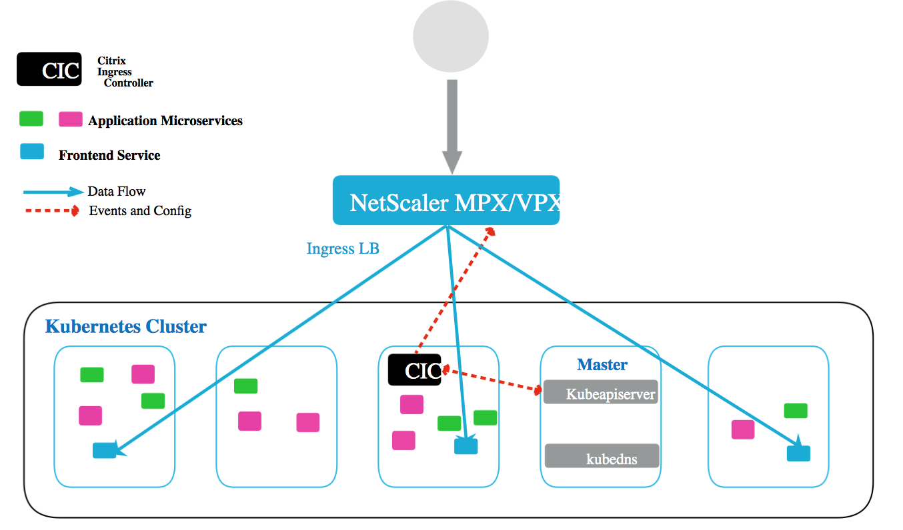
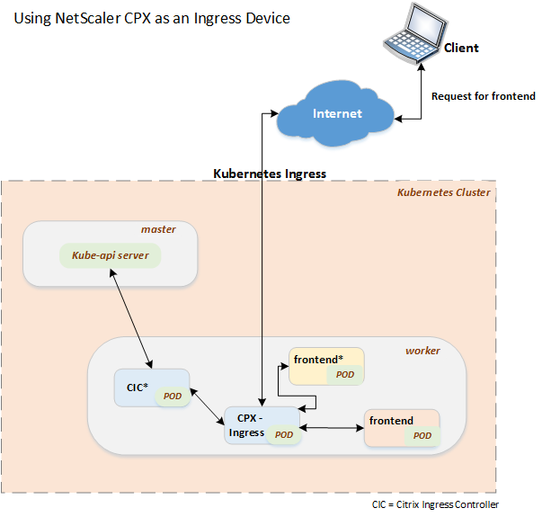
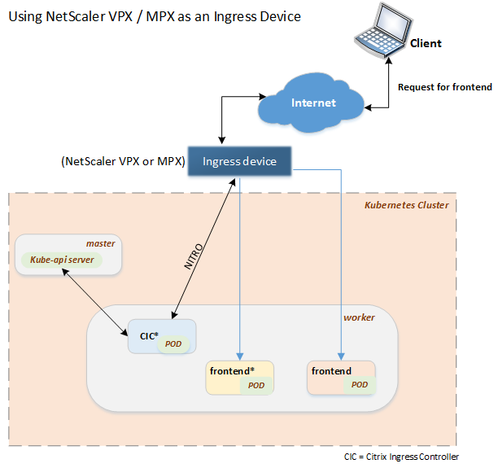
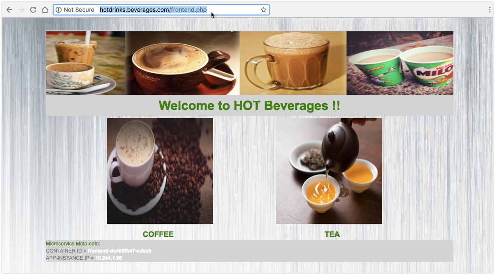

# Citrix Ingress Controller Deployment Guide For Kubernetes

## About Citrix Ingress Controller

In a Kubernetes environment, to load balance Ingress traffic for Kubernetes services you need an Ingress resource and an Ingress controller. An Ingress resouce is a Kubernetes resource with which you can configure a load balancer for your Kubernetes services. The load balancer exposes the services to clients outside your Kubernetes cluster by providing externally-reachable URLs for the services, and load balances the traffic sent to those URLs. Citrix ADC instances can be used as an Ingress load balancer in a Kubernetes environment, to load balance the North-South traffic to your Kubernetes services by clients outside the Kubernetes cluster.

An Ingress Controller integrates the load balancer with Kubernetes. It monitors the Ingress resource through the Kubernetes API and updates the configuration of the load balancer as per the service configuration in Kubernetes. The Citrix Ingress Controller (Citrix Ingress Controller) and the Citrix ADC instances deployed in the Kubernetes cluster enable you to load balance Ingress traffic for the services in the Kubernetes environment.

  

## How Citrix Ingress Controller works

After you have deployed the Kubernetes cluster and the Ingress device you must provide the details of the kube api-server URL and IP address of the Citrix ADC instance in the Citrix Ingress Controller container YAML file.

Once you deploy the Citrix Ingress Controller container, it monitors for changes in Kubernetes resouces such as, services, pods, and Ingress rules. When a app is deployed, or if there are any changes to the ingress rule , based on these events Citrix Ingress Controller configures the Ingress device to load balance the North-South traffic to the services in the Kubernetes environment. For information on the use cases, see [Sample deployment](#sample-deployment)

  

  

## Deploy Citrix Ingress Controller in Kubernetes environment

You can deploy a Citrix Ingress Controller (Citrix Ingress Controller) as a pod in your Kubernetes environment. You must define a pod specification for Citrix Ingress Controller to deploy it as a pod in the Kubernetes cluster. The pod specification is defined in a YAML file or a JSON script. The YAML file or the JSON script should contain the container type, Citrix Ingress Controller image file name, kube api-server URL, and Citrix ADC instance IP address.

### Prerequisites

Ensure that you have:

-  The kube-apiserver URL. Type the following command in the Kubernetes node to obtain the kube-apiserver URL:

    ```
    root@ubuntu:~# kubectl cluster-info
    Kubernetes master is running at https://10.102.29.101:6443
    KubeDNS is running at https://10.102.29.101:6443/api/v1/namespaces/kube-system/services/kube-dns:dns/proxy
    ```
-  Created a [secret](https://kubernetes.io/docs/concepts/configuration/secret/) object to store username and password of the Citrix ADC instance. Citrix Ingress Controller uses the secret object to communicate with Citrix ADC instance using NITRO API. You can create a secret object in a file first, in json or yaml format, and then create that object. Perform the following to create a secret object:

   1.  Verify if each item is base64 encoded, do the following:

       ```
       root@ubuntu:~# echo -n 'nsroot' | base64
       bnNyb290
       ```
   1.  Define the secret object in a YAML file:

       `Sample: login_credentials.yaml`

        ```YAML
        apiVersion: v1
        kind: Secret
        metadata:
            name: nslogin
        type: Opaque
        data:
            username: bnNyb290
            password: bnNyb290
        ```
   1.  Create the secret object using the `kubectl create -f` command:

        ```
        root@ubuntu:~# kubectl create -f login_credentials.yaml
        secret/nslogin created
        ```

-  Created a [service account](https://kubernetes.io/docs/reference/access-authn-authz/service-accounts-admin/) for the Citrix Ingress Controller instance on the *master* node. You can use the following YAML file to create a service account, ***cic***:

    `Sample: serviceaccount.yaml`

      ```YAML
      kind: ClusterRole
      apiVersion: rbac.authorization.k8s.io/v1beta1
      metadata:
        name: cic
      rules:
        - apiGroups: [""]
          resources: ["services", "endpoints", "ingresses", "pods", "secrets"]
          verbs: ["*"]

        - apiGroups: ["extensions"]
          resources: ["ingresses", "ingresses/status"]
          verbs: ["*"]

      ---

      kind: ClusterRoleBinding
      apiVersion: rbac.authorization.k8s.io/v1beta1
      metadata:
        name: cic
      roleRef:
        apiGroup: rbac.authorization.k8s.io
        kind: ClusterRole
        name: cic
      subjects:
      - kind: ServiceAccount
        name: cic
        namespace: default
      apiVersion: rbac.authorization.k8s.io/v1

      ---

      apiVersion: v1
      kind: ServiceAccount
      metadata:
        name: cic
        namespace: default

      ```

    Deploy the YAML file to create the service account, ***cic***, using the `kubectl create -f <yaml>` command.

    **Sample:**

    ```
    root@ubuntu:~# kubectl create -f rbac.yaml
    clusterrole.rbac.authorization.k8s.io/cic created
    clusterrolebinding.rbac.authorization.k8s.io/cic created
    serviceaccount/cic created
    ```

    Verify if the ***cic*** service account is created using the `kubectl get sa` command.

    **Sample:**

    ```
    root@ubuntu:~# kubectl get sa
    NAME      SECRETS   AGE
    cic       1         1m
    default   1         24d
    ```

The following is an example of a pod specification for Citrix Ingress Controller:

`Sample: cic-container.yaml`

```YAML
apiVersion: v1
kind: Pod
metadata:
  name: citrixingresscontroller
  labels:
    app: citrixingresscontroller
spec:
      serviceAccountName: cic
      containers:
      - name: citrixingresscontroller
        image: "in-docker-reg.eng.citrite.net/cpx-dev/cic_ubuntu:LABEL2_703989"
        env:
        # Set kube api-server URL
        - name: "kubernetes_url"
          value: "https://10.106.76.232:6443"
        # Set Citrix ADC Management IP. It must be the Node IP address on which the Citrix ADC CPX is deployed OR  Citrix ADC IP address of the Citrix ADC VPX/MPX appliance*/
        - name: "NS_IP"
          value: "10.106.76.235"
        # Set Protocol for NITRO
        - name: "NS_PROTOCOL"
          value: "HTTP"
        # Set port for NITRO
        - name: "NS_PORT"
          value: "9080"
        # Set username for NITRO
        - name: "NS_USER"
          valueFrom:
              secretKeyRef:
                name: nslogin
                key: username
        # Set user password for NITRO
        - name: "NS_PASSWORD"
          valueFrom:
              secretKeyRef:
                name: nslogin
                key: password
        # Set log level
        - name: "LOGLEVEL"
          value: "DEBUG"
        - name: "EULA"
          value: "yes"
        imagePullPolicy: IfNotPresent
```

## Sample deployment using Citrix ADC CPX as Ingress device

The sample deployment explains how to load balance North-South traffic to the services in Kubernetes using Citrix Ingress Controller (Citrix Ingress Controller) and Citrix ADC instance as Ingress device.

The sample deployment consistes of the following components:

-  A Kubernetes cluster with two nodes inculding a *master* and *worker* node.

-  A single instance of Citrix ADC VPX, MPX, or CPX to load balance [ingress](https://kubernetes.io/docs/concepts/services-networking/ingress/) traffic to the web application.

-  A single instance of Citrix Ingress Controller to use as a [ingress controller](https://kubernetes.io/docs/concepts/services-networking/ingress/#ingress-controllers).

-  Instances of frontend service of the web application.

-  Instances of the backend services (`coffee` and `tea`) for the web application.

## Prerequisites

-  Create a Kubernetes cluster. For more information, see [http://kubernetes.io/docs/](http://kubernetes.io/docs/).

-  Use latest version of Citrix Ingress Controller available on the [Docker Store](https://store.docker.com/images/netscaler-cpx-express-rel-120-experimental/plans/713845fd-23e7-4bc3-8233-8d66be9d182d?tab=instructions).

## Deployment process

The following is the high-level steps for the sample deployment:

1.  Deploy the Ingress device.
    If you are using Citrix ADC CPX as an Ingress device, see [Deploy Citrix ADC CPX as an Ingress device](#deploy-citrix-adc-cpx-as-an-ingress-device).

    If you are using Citrix ADC VPX or MPX appliance as an Ingress device then deploy the instance, see [Citrix ADC Documentation](https://docs.citrix.com/en-us/netscaler/).

1.  Create services in Kubernetes. For more information, see [Create services in Kubernetes](#create-services-in-kubernetes).

1.  Create ingress rules in Kubernetes. For more information, see [Create ingress rules in Kubernetes](#create-ingress-rules-in-kubernetes).

1.  Deploy Citrix Ingress Controller in the Kubernetes environment. For more information, see [Deploy Citrix Ingress Controller in the Kubernetes environment](#deploy-citrix-ingress-controller-in-the-kubernetes-environment).

## Deploy Citrix ADC CPX as an Ingress device

You must deploy the Citrix ADC CPX as a Kubernetes pod on a particular node in the cluster, you can use a label to designate the node. To label a Kubernetes node, use the kubectl command:

```
kubectl label nodes <node_name> node-role=<label_name>
```

***Sample:***

```
root@ubuntu:~# kubectl get nodes
NAME      STATUS    ROLES     AGE       VERSION
ubuntu    Ready     master    24d       v1.11.1
worker    Ready     <none>    24d       v1.11.1

root@ubuntu:~# kubectl label nodes worker node-role=ingress
node/worker labeled
```

Before you deploy the Citrix ADC CPX instance, ensure that you create a [service account](https://kubernetes.io/docs/reference/access-authn-authz/service-accounts-admin/) for the Citrix ADC CPX instance on the *master* node. You can use the following YAML file create a service account, ***cic***:

```YAML
kind: ClusterRole
apiVersion: rbac.authorization.k8s.io/v1beta1
metadata:
  name: cic
rules:
  - apiGroups: [""]
    resources: ["services", "endpoints", "ingresses", "pods", "secrets"]
    verbs: ["*"]

  - apiGroups: ["extensions"]
    resources: ["ingresses", "ingresses/status"]
    verbs: ["*"]

---

kind: ClusterRoleBinding
apiVersion: rbac.authorization.k8s.io/v1beta1
metadata:
  name: cic
roleRef:
  apiGroup: rbac.authorization.k8s.io
  kind: ClusterRole
  name: cic
subjects:
- kind: ServiceAccount
  name: cic
  namespace: default
apiVersion: rbac.authorization.k8s.io/v1

---

apiVersion: v1
kind: ServiceAccount
metadata:
  name: cic
  namespace: default
```

Define a pod specification for Citrix ADC CPX to deploy the Citrix ADC CPX container as a pod in the Kubernetes cluster. The pod specification is defined in a YAML file or a JSON script. The following is an example of a pod specification for Citrix ADC CPX as an Ingress device:

`Sample: cpx_ingress.yaml`

```YAML
apiVersion: v1
kind: Pod
metadata:
   name: cpx-ingress
spec:
    serviceAccountName: cic
    containers:
       - name: cpx-ingress
         image: "in-docker-reg.eng.citrite.net/cpx-dev/cpx_cic:LABEL3_704250"
         securityContext:
            privileged: true
         env:
         - name: "EULA"
           value: "yes"
         ports:
         - containerPort: 9080
           hostPort: 9080
         - containerPort: 9443
           hostPort: 9443
         - containerPort: 80
           hostPort: 80
         - containerPort: 443
           hostPort: 443

    nodeSelector:
       node-role: ingress
```

Ensure that you map the following container ports to host ports:

| Ports | Description |
| ----- | ----------- |
| 9080  | Used for Nitro communcation between Citrix ADC CPX and the host |
| 9443  | Used for Nitro communcation between Citrix ADC CPX and the host |
| 80    | The port used for virtual IP address (VIP) |
| 443   | The port used for virtual IP address (VIP) |

Deploy the YAML file `kubectl create -f <yaml>` command.

**Sample:**

```
kubectl create -f cpx_ingress.yaml
```

Verify if the ***cpx-ingress*** pod is created using the `kubectl get pods` command.

**Sample:**

```
root@ubuntu:~# kubectl get pods
NAME          READY     STATUS    RESTARTS   AGE
cpx-ingress   1/1       Running   0          1m
```

## Create services in Kubernetes

After deploying the Ingress device, you need to deploy the frontend service and backend services.

The following are the sample YAML files for the coffee and tea backend services:

`Sample: coffee.yaml`

```YAML
apiVersion: extensions/v1beta1
kind: Deployment
metadata:
  name: coffee-backend
  labels:
      name: coffee-backend
spec:
  replicas: 4
  template:
    metadata:
      labels:
        name: coffee-backend
    spec:
      containers:
      - name: coffee-backend
        image: in-docker-reg.eng.citrite.net/cpx-dev/hotdrinks.beverages.com:v1
        ports:
        - name: coffee-backend
          containerPort: 80
        resources:
          requests:
            cpu: 100m
            memory: 100Mi
---
apiVersion: v1
kind: Service
metadata:
  name: coffee-backend
spec:
  ports:
  - port: 80
    targetPort: 80
  selector:
    name: coffee-backend
```

`Sample: tea.yaml`

```YAML
apiVersion: extensions/v1beta1
kind: Deployment
metadata:
  name: tea-backend
  labels:
      name: tea-backend
spec:
  replicas: 4
  template:
    metadata:
      labels:
        name: tea-backend
    spec:
      containers:
      - name: tea-backend
        image: in-docker-reg.eng.citrite.net/cpx-dev/hotdrinks.beverages.com:v1
        ports:
        - name: tea-backend
          containerPort: 80
        resources:
          requests:
            cpu: 100m
            memory: 100Mi
---
apiVersion: v1
kind: Service
metadata:
  name: tea-backend
spec:
  ports:
  - port: 80
    targetPort: 80
  selector:
    name: tea-backend
```

The following is the sample YAML file for the frontend service:

`Sample: hotdrink-frontend.yaml`

```YAML
apiVersion: extensions/v1beta1
kind: Deployment
metadata:
  name: frontend
  labels:
      name: frontend
spec:
  replicas: 4
  template:
    metadata:
      labels:
        name: frontend
    spec:
      containers:
      - name: frontend
        image: in-docker-reg.eng.citrite.net/cpx-dev/hotdrinks.beverages.com:v1
        ports:
        - name: frontend
          containerPort: 80
        resources:
          requests:
            cpu: 100m
            memory: 100Mi
---
apiVersion: v1
kind: Service
metadata:
  name: frontend
spec:
  ports:
  - port: 80
    targetPort: 80
  selector:
    name: frontend
```

Now, deploy these service using the `kubectl create -f <yaml-file>` command as shown below:

```
root@ubuntu:~# kubectl create -f coffee.yaml
deployment.extensions/coffee-backend created

root@ubuntu:~# kubectl create -f tea.yaml
deployment.extensions/tea-backend created

root@ubuntu:~# kubectl create -f hotdrink-frontend.yaml
deployment.extensions/frontend created
```

After you have deployed the service, verify if the pods are created as follows:

```
root@ubuntu:~# kubectl get pods
NAME                             READY     STATUS    RESTARTS   AGE
coffee-backend-574f4dbfb-fc5nb   1/1       Running   0          50s
coffee-backend-574f4dbfb-lsvjl   1/1       Running   0          50s
coffee-backend-574f4dbfb-nzzn8   1/1       Running   0          50s
coffee-backend-574f4dbfb-qfdqf   1/1       Running   0          50s
cpx-ingress                      1/1       Running   0          5m
frontend-dc465fb47-7qc69         1/1       Running   0          25s
frontend-dc465fb47-b9r4z         1/1       Running   0          25s
frontend-dc465fb47-cb2rp         1/1       Running   0          25s
frontend-dc465fb47-rff9k         1/1       Running   0          25s
tea-backend-7876c577c4-2b29c     1/1       Running   0          36s
tea-backend-7876c577c4-4cvd9     1/1       Running   0          36s
tea-backend-7876c577c4-d9n4d     1/1       Running   0          36s
tea-backend-7876c577c4-jntwf     1/1       Running   0          36s
```

## Create ingress rules in Kubernetes

You must create ingress rules in Kubernetes. The Citrix Ingress Controller uses these rules to configure content switiching policies on the Citrix ADC VPX appliance *(ingress device)*.

The following is the sample YAML file to create ingress rules in Kubernetes, the YAML file uses Citrix ADC specific annotations:

| Annotation | Posible Value | Description |
| ---------- | ----------- | -------------- |
| ingress.citrix.com/frontend-ip | Frontend IP address | Enables you to customise the virtual IP address (VIP). This IP address is on the Citrix ADC instance as VIP. By default, the IP address is the Citrix ADC IP address |
| ingress.citrix.com/secure-port | Secure port number | Enables you to configure the port on which HTTPS traffic is received. This port is configured in Citrix ADC as the port value for corresponding Content Switching virtual server. By default, the port number is 443. |
| ingress.citrix.com/insecure-port | Insecure port number | Enables you to configure the port on which HTTPS traffic is received. This port is configured in Citrix ADC as the port value for the corresponding Content Switching virtual server. By default, the port number is 80. |
| ingress.citrix.com/insecure-termination | Any one of the following: allow, redirect, or disallow. Default value is `disallow` | - Use *allow*, if you want to allow HTTP traffic.  User |
|  |  | - Use *redirect*, if you want to redirect HTTP traffic to HTTPS. |
|  |  | - Use *disallow*, if you want to drop the HTTP traffic. |

`Sample: ingress.yaml`

```YAML
apiVersion: extensions/v1beta1
kind: Ingress
metadata:
  name: web-ingress
  annotations:
   ingress.citrix.com/insecure-port: "80"

spec:
  rules:
  - host: hotdrinks.beverages.com
    http:
      paths:
      - path: /
        backend:
          serviceName: frontend
          servicePort: 80
```

Now, deploy the ingress rules using the `kubectl create -f <yaml-file>` command as shown below:

```
root@ubuntu:~# kubectl create -f ingress.yaml
Ingress/web-ingress created
```

After you have deployed the ingress rules, Citrix Ingress Controller creates the content switching configuration and applies it on the Ingress device.

## Deploy Citrix Ingress Controller in Kubernetes environment

You can deploy a Citrix Ingress Controller (Citrix Ingress Controller) as a pod in your Kubernetes environment. You must define a pod specification for Citrix Ingress Controller to deploy it has as a pod in the Kubernetes cluster. The pod specification is defined in a YAML file or a JSON script. The YAML file or the JSON script should contain the container type, Citrix Ingress Controller image file name, kube api-server URL, and Citrix ADC instance IP address.

### Prerequisites

Ensure that you have:

-  The kube-apiserver URL. Type the following command in the Kubernetes node to obtain the kube-apiserver URL:

    ```
    root@ubuntu:~# kubectl cluster-info
    Kubernetes master is running at https://10.102.29.101:6443
    KubeDNS is running at https://10.102.29.101:6443/api/v1/namespaces/kube-system/services/kube-dns:dns/proxy
    ```
-  Created a [secret](https://kubernetes.io/docs/concepts/configuration/secret/) object to store username and password of the Citrix ADC instance. Citrix Ingress Controller uses the secret object to communicate with Citrix ADC instance using NITRO API. You can create a secret object in a file first, in json or yaml format, and then create that object. Perform the following to create a secret object:

   1.  Verify if each item is base64 encoded, do the following:

       ```
       root@ubuntu:~# echo -n 'nsroot' | base64
       bnNyb290
       ```
   1.  Define the secret object in a YAML file:

       `Sample: login_credentials.yaml`

        ```YAML
        apiVersion: v1
        kind: Secret
        metadata:
            name: nslogin
        type: Opaque
        data:
            username: bnNyb290
            password: bnNyb290
        ```
   1.  Create the secret object using the `kubectl create -f` command:

        ```
        root@ubuntu:~# kubectl create -f login_credentials.yaml
        secret/nslogin created
        ```

The following is an example of a pod specification for Citrix Ingress Controller:

`Sample: cic-container.yaml (for Citrix ADC CPX as an Ingress device)`

```YAML
apiVersion: v1
kind: Pod
metadata:
  name: citrixingresscontroller
  labels:
    app: citrixingresscontroller
spec:
      serviceAccountName: cic
      containers:
      - name: citrixingresscontroller
        image: "in-docker-reg.eng.citrite.net/cpx-dev/cic_ubuntu:LABEL2_703989"
        env:
        # Set kube api-server URL
        - name: "kubernetes_url"
          value: "https://10.102.29.101:6443"
        # Set Citrix ADC Management IP. It must be the Node IP address on which the Citrix ADC CPX is deployed OR  Citrix ADC IP address of the Citrix ADC VPX/MPX appliance*/
        - name: "NS_IP"
          value: "10.102.29.102"
        # Set Protocol for NITRO
        - name: "NS_PROTOCOL"
          value: "HTTP"
        # Set port for NITRO
        - name: "NS_PORT"
          value: "9080"
        # Set username for NITRO
        - name: "NS_USER"
          valueFrom:
              secretKeyRef:
                name: nslogin
                key: username
        # Set user password for NITRO
        - name: "NS_PASSWORD"
          valueFrom:
              secretKeyRef:
                name: nslogin
                key: password
        # Set log level
        - name: "LOGLEVEL"
          value: "DEBUG"
        - name: "EULA"
          value: "yes"
        imagePullPolicy: IfNotPresent
```

Now, deploy the Citrix Ingress Container using the `kubectl create -f` command:

```
kubectl create -f cic-container.yaml
```

Verify if the ***citrixingresscontroller*** pod is created:

```
root@ubuntu:~# kubectl get pods
NAME                             READY     STATUS    RESTARTS   AGE
citrixingresscontroller          1/1       Running   0          3h
coffee-backend-574f4dbfb-fc5nb   1/1       Running   0          3h
coffee-backend-574f4dbfb-lsvjl   1/1       Running   0          3h
coffee-backend-574f4dbfb-nzzn8   1/1       Running   0          3h
coffee-backend-574f4dbfb-qfdqf   1/1       Running   0          3h
cpx-ingress                      1/1       Running   0          3h
frontend-dc465fb47-7qc69         1/1       Running   0          3h
frontend-dc465fb47-b9r4z         1/1       Running   0          3h
frontend-dc465fb47-cb2rp         1/1       Running   0          3h
frontend-dc465fb47-rff9k         1/1       Running   0          3h
tea-backend-7876c577c4-2b29c     1/1       Running   0          3h
tea-backend-7876c577c4-4cvd9     1/1       Running   0          3h
tea-backend-7876c577c4-d9n4d     1/1       Running   0          3h
tea-backend-7876c577c4-jntwf     1/1       Running   0          3h
```

## Verify the sample deployment

After you have deployed all the components of the sample deployment, you can verify the deployment as follows:

1.  Verify if you can connect to the Citrix ADC CPX Ingress device using the IP address of the node on which you have deployed the Citrix ADC CPX instance:

    ```
    root@ubuntu:~# curl http://10.102.29.102:9080  -i
    HTTP/1.1 200 OK
    Date: Tue, 04 Sep 2018 12:11:21 GMT
    Server: Apache/2.2.34 (Unix) PHP/7.0.13
    Last-Modified: Thu, 16 Aug 2018 01:17:20 GMT
    ETag: "5fe-2c-57383345d6800"
    Accept-Ranges: bytes
    Content-Length: 44
    Content-Type: text/html

    <html><body><h1>It works!</h1></body></html>
    ```
1.  Using the logs generated by Citrix Ingress Controller verify if it is configuring your Citrix ADC CPX ingress device. Do the following:

    ```
    root@ubuntu:~# kubectl logs citrixingresscontroller
    ```
    Check if the content switching virtual server that you had defined in the `ingress.yaml` is created. Also, the frontend service is bound to servicegroup, the content switching polices and actions are created.

1.  Verify if you can access the deployed app. Do the following:

    1.  Add a entry in the host file for `hotdrinks.beverages.com` mapping it to the virtual IP address (VIP). In case of Citrix ADC CPX Ingress device the VIP is the IP address of the node on which you have deployed the Citrix ADC CPX instance and in case of Citrix ADC VPX or MPX the VIP is the Citrix ADC IP address.

      ```
      root@ubuntu:~# vi /etc/hosts
      127.0.0.1       localhost
      10.102.29.101   ubuntu
      10.102.29.102   hotdrinks.beverages.com
      ```
    1.  Send a request to the app as shown below. You can access it using the VIP and the port specified in the `ingress.yaml` file.

      ```
      root@ubuntu:~# curl -v -H 'Host:hotdrinks.beverages.com' http://hotdrinks.beverages.com/frontend.php  -I -v
      *   Trying 10.102.29.102...
      * Connected to hotdrinks.beverages.com (10.102.29.102) port 80 (#0)
      > HEAD /frontend.php HTTP/1.1
      > Host:hotdrinks.beverages.com
      > User-Agent: curl/7.47.0
      > Accept: */*
      >
      < HTTP/1.1 200 OK
      HTTP/1.1 200 OK
      < Server: nginx/1.8.1
      Server: nginx/1.8.1
      < Date: Tue, 04 Sep 2018 09:15:52 GMT
      Date: Tue, 04 Sep 2018 09:15:52 GMT
      < Content-Type: text/html
      Content-Type: text/html
      < Connection: keep-alive
      Connection: keep-alive
      < X-Powered-By: PHP/5.5.9-1ubuntu4.14
      X-Powered-By: PHP/5.5.9-1ubuntu4.14

      <
      * Connection #0 to host hotdrinks.beverages.com left intact
      ```
      Also, you can verify the app using a web browser. The verification URL for the app would be: `http://hotdrinks.beverages.com/frontend.php`

      

## Sample deployment using Citrix ADC VPX as Ingress device

The sample deployment explains how to load balance North-South traffic to the services in Kubernetes using Citrix Ingress Controller (Citrix Ingress Controller) and Citrix ADC instance as Ingress device.

The sample deployment consistes of the following components:

-  A Kubernetes cluster with two nodes inculding a *master* and *worker* node.

-  A single instance of Citrix ADC VPX or MPX load balance [ingress](https://kubernetes.io/docs/concepts/services-networking/ingress/) traffic to the web application.

-  A single instance of Citrix Ingress Controller to use as a [ingress controller](https://kubernetes.io/docs/concepts/services-networking/ingress/#ingress-controllers).

-  Instances of frontend service of the web application.

-  Instances of the backend services (`coffee` and `tea`) for the web application.

## Prerequisites

-  Create a Kubernetes cluster. For more information, see [http://kubernetes.io/docs/](http://kubernetes.io/docs/).

-  Deploy the Citrix ADC VPX or MPX appliance that you want to use as Ingress device. For more information, see [Deploying Citrix ADC VPX](https://docs.citrix.com/en-us/netscaler/12/deploying-vpx.html).

-  Use latest version of Citrix Ingress Controller available on the [Docker Store](https://store.docker.com/images/netscaler-cpx-express-rel-120-experimental/plans/713845fd-23e7-4bc3-8233-8d66be9d182d?tab=instructions).

## Deployment process

The following is the high-level steps for the sample deployment:

1.  Deploy the Citrix ADC VPX or MPX appliance that you want to use as Ingress device. For more information, see [Deploying Citrix ADC VPX](https://docs.citrix.com/en-us/netscaler/12/deploying-vpx.html).

1.  Create services in Kubernetes. For more information, see [Create services in Kubernetes](#create-services-in-kubernetes).

1.  Create ingress rules in Kubernetes. For more information, see [Create ingress rules in Kubernetes](#create-ingress-rules-in-kubernetes).

1.  Deploy Citrix Ingress Controller in the Kubernetes environment. For more information, see [Deploy Citrix Ingress Controller in the Kubernetes environment](#deploy-citrix-ingress-controller-in-the-kubernetes-environment).

## Create services in Kubernetes

After deploying the Ingress device, you need to deploy the frontend service and backend services.

The following are the sample YAML files for the coffee and tea backend services:

`Sample: coffee.yaml`

```YAML
apiVersion: extensions/v1beta1
kind: Deployment
metadata:
  name: coffee-backend
  labels:
      name: coffee-backend
spec:
  replicas: 4
  template:
    metadata:
      labels:
        name: coffee-backend
    spec:
      containers:
      - name: coffee-backend
        image: in-docker-reg.eng.citrite.net/cpx-dev/hotdrinks.beverages.com:v1
        ports:
        - name: coffee-backend
          containerPort: 80
        resources:
          requests:
            cpu: 100m
            memory: 100Mi
---
apiVersion: v1
kind: Service
metadata:
  name: coffee-backend
spec:
  ports:
  - port: 80
    targetPort: 80
  selector:
    name: coffee-backend
```

`Sample: tea.yaml`

```YAML
apiVersion: extensions/v1beta1
kind: Deployment
metadata:
  name: tea-backend
  labels:
      name: tea-backend
spec:
  replicas: 4
  template:
    metadata:
      labels:
        name: tea-backend
    spec:
      containers:
      - name: tea-backend
        image: in-docker-reg.eng.citrite.net/cpx-dev/hotdrinks.beverages.com:v1
        ports:
        - name: tea-backend
          containerPort: 80
        resources:
          requests:
            cpu: 100m
            memory: 100Mi
---
apiVersion: v1
kind: Service
metadata:
  name: tea-backend
spec:
  ports:
  - port: 80
    targetPort: 80
  selector:
    name: tea-backend
```

The following is the sample YAML file for the frontend service:

`Sample: hotdrink-frontend.yaml`

```YAML
apiVersion: extensions/v1beta1
kind: Deployment
metadata:
  name: frontend
  labels:
      name: frontend
spec:
  replicas: 4
  template:
    metadata:
      labels:
        name: frontend
    spec:
      containers:
      - name: frontend
        image: in-docker-reg.eng.citrite.net/cpx-dev/hotdrinks.beverages.com:v1
        ports:
        - name: frontend
          containerPort: 80
        resources:
          requests:
            cpu: 100m
            memory: 100Mi
---
apiVersion: v1
kind: Service
metadata:
  name: frontend
spec:
  ports:
  - port: 80
    targetPort: 80
  selector:
    name: frontend
```

Now, deploy these service using the `kubectl create -f <yaml-file>` command as shown below:

```
root@ubuntu:~# kubectl create -f coffee.yaml
deployment.extensions/coffee-backend created

root@ubuntu:~# kubectl create -f tea.yaml
deployment.extensions/tea-backend created

root@ubuntu:~# kubectl create -f hotdrink-frontend.yaml
deployment.extensions/frontend created
```

After you have deployed the service, verify if the pods are created as follows:

```
root@ubuntu:~# kubectl get pods
NAME                             READY     STATUS    RESTARTS   AGE
coffee-backend-574f4dbfb-fc5nb   1/1       Running   0          50s
coffee-backend-574f4dbfb-lsvjl   1/1       Running   0          50s
coffee-backend-574f4dbfb-nzzn8   1/1       Running   0          50s
coffee-backend-574f4dbfb-qfdqf   1/1       Running   0          50s
cpx-ingress                      1/1       Running   0          5m
frontend-dc465fb47-7qc69         1/1       Running   0          25s
frontend-dc465fb47-b9r4z         1/1       Running   0          25s
frontend-dc465fb47-cb2rp         1/1       Running   0          25s
frontend-dc465fb47-rff9k         1/1       Running   0          25s
tea-backend-7876c577c4-2b29c     1/1       Running   0          36s
tea-backend-7876c577c4-4cvd9     1/1       Running   0          36s
tea-backend-7876c577c4-d9n4d     1/1       Running   0          36s
tea-backend-7876c577c4-jntwf     1/1       Running   0          36s
```

## Create ingress rules in Kubernetes

You must create ingress rules in Kubernetes. The Citrix Ingress Controller uses these rules to configure content switiching policies on the Citrix ADC VPX appliance *(ingress device)*.

The following is the sample YAML file to create ingress rules in Kubernetes, the YAML file uses Citrix ADC specific annotations:

| Annotation | Posible Value | Description |
| ---------- | ----------- | -------------- |
| ingress.citrix.com/frontend-ip | Frontend IP address | Enables you to customise the virtual IP address (VIP). This IP address is on the Citrix ADC instance as VIP. By default, the IP address is the Citrix ADC IP address |
| ingress.citrix.com/secure-port | Secure port number | Enables you to configure the port on which HTTPS traffic is received. This port is configured in Citrix ADC as the port value for corresponding Content Switching virtual server. By default, the port number is 443. |
| ingress.citrix.com/insecure-port | Insecure port number | Enables you to configure the port on which HTTPS traffic is received. This port is configured in Citrix ADC as the port value for the corresponding Content Switching virtual server. By default, the port number is 80. |
| ingress.citrix.com/insecure-termination | Any one of the following: allow, redirect, or disallow. Default value is `disallow` | - Use *allow*, if you want to allow HTTP traffic.  User |
|  |  | - Use *redirect*, if you want to redirect HTTP traffic to HTTPS. |
|  |  | - Use *disallow*, if you want to drop the HTTP traffic. |

`Sample: ingress.yaml`

```YAML
apiVersion: extensions/v1beta1
kind: Ingress
metadata:
  name: web-ingress
  annotations:
   ingress.citrix.com/insecure-port: "80"

spec:
  rules:
  - host: hotdrinks.beverages.com
    http:
      paths:
      - path: /
        backend:
          serviceName: frontend
          servicePort: 80
```

Now, deploy the ingress rules using the `kubectl create -f <yaml-file>` command as shown below:

```
root@ubuntu:~# kubectl create -f ingress.yaml
Ingress/web-ingress created
```

After you have deployed the ingress rules, Citrix Ingress Controller creates the content switching configuration and applies it on the Ingress device.

## Add static route on the Citrix ADC VPX ingress device

You must add [static route](https://docs.citrix.com/en-us/netscaler/12/networking/ip-routing/configuring-static-routes.html) on the Citrix ADC VPX appliance *(ingress device)* to route the internet traffic to kubernetes network. You need to route the traffic to the services configured on the Citrix ADC VPX appliance *(ingress device)*.

Before you add the static route, ensure that you:

-  Use the `add ip <IP-ADDRESS> <NETMASK> -type SNIP` to configure a SNIP on the Citrix ADC VPX appliance *(ingress device)* in the host network. The host network is the network over which the Kubernetes nodes communicate with each other. Usually the eth0 IP address is from this network.

-  Note down the podCIDR on each Kubernetes nodes. If you using overlay subnetwork, use the `kubectl get nodes -o json | jq '[.items[] | {podCIDR: .spec.podCIDR, NodeInfo: [.status.addresses[].address]}]'` to view the podCIDR as shown below:

   ```
    root@ubuntu:~# kubectl get nodes -o json | jq '[.items[] | {podCIDR: .spec.podCIDR, NodeInfo: [.status.addresses[].address]}]'
    [
      {
        "podCIDR": "10.244.0.0/24",
        "NodeInfo": [
          "10.102.29.101",
          "ubuntu"
        ]
      },
      {
        "podCIDR": "10.244.1.0/24",
        "NodeInfo": [
          "10.102.29.102",
          "worker"
        ]
      }
    ]
   ```

   If you using flannel subnetwork, the details are stored in the `/run/flannel/subnet.env` on all the nodes as shown below:

   ```
   root@worker:~# cat /run/flannel/subnet.env
   FLANNEL_NETWORK=10.244.0.0/16
   FLANNEL_SUBNET=10.244.1.1/24
   FLANNEL_MTU=1450
   FLANNEL_IPMASQ=true
   ```

Now, add a static route on the Citrix ADC VPX appliance *(ingress device)* using the `add route <podCIDR_network> <podCIDR_netmask> <node_HostIP>` command with Node IP address as the gateway.

**Sample:**

```
> add route 10.244.0.0 255.255.255.0 10.102.29.101
 Done
> add route 10.244.1.0 255.255.255.0 10.102.29.102
 Done
```

>**Important:** If Kubernetes nodes rejoin and their overlay network are reassigned to different podCIDR, then you need to add static routes for the nodes.

## Deploy Citrix Ingress Controller in Kubernetes environment

You can deploy a Citrix Ingress Controller (Citrix Ingress Controller) as a pod in your Kubernetes environment. You must define a pod specification for Citrix Ingress Controller to deploy it has as a pod in the Kubernetes cluster. The pod specification is defined in a YAML file or a JSON script. The YAML file or the JSON script should contain the container type, Citrix Ingress Controller image file name, kube api-server URL, and Citrix ADC instance IP address.

### Prerequisites

Ensure that you have:

-  The kube-apiserver URL. Type the following command in the Kubernetes node to obtain the kube-apiserver URL:

    ```
    root@ubuntu:~# kubectl cluster-info
    Kubernetes master is running at https://10.102.29.101:6443
    KubeDNS is running at https://10.102.29.101:6443/api/v1/namespaces/kube-system/services/kube-dns:dns/proxy
    ```
-  Created a [secret](https://kubernetes.io/docs/concepts/configuration/secret/) object to store username and password of the Citrix ADC instance. Citrix Ingress Controller uses the secret object to communicate with Citrix ADC instance using NITRO API. You can create a secret object in a file first, in json or yaml format, and then create that object. Perform the following to create a secret object:

   1.  Verify if each item is base64 encoded, do the following:

       ```
       root@ubuntu:~# echo -n 'nsroot' | base64
       bnNyb290
       ```
   1.  Define the secret object in a YAML file:

       `Sample: login_credentials.yaml`

        ```YAML
        apiVersion: v1
        kind: Secret
        metadata:
            name: nslogin
        type: Opaque
        data:
            username: bnNyb290
            password: bnNyb290
        ```
   1.  Create the secret object using the `kubectl create -f` command:

        ```
        root@ubuntu:~# kubectl create -f login_credentials.yaml
        secret/nslogin created
        ```

The following is an example of a pod specification for Citrix Ingress Controller:

`Sample: cic-container.yaml (for Citrix ADC VPX or MPX appliance as an Ingress device)`

```YAML
apiVersion: v1
kind: Pod
metadata:
  name: citrixingresscontroller
  labels:
    app: citrixingresscontroller
spec:
      serviceAccountName: cic
      containers:
      - name: citrixingresscontroller
        image: "in-docker-reg.eng.citrite.net/cpx-dev/cic_ubuntu:LABEL2_703989"
        env:
        # Set kube api-server URL
        - name: "kubernetes_url"
          value: "https://10.102.29.101:6443"
        # Set Citrix ADC Management IP. It must be the Node IP address on which the Citrix ADC CPX is deployed OR  Citrix ADC IP address of the Citrix ADC VPX/MPX appliance*/
        - name: "NS_IP"
          value: "10.102.29.190"
        # Set Protocol for NITRO
        - name: "NS_PROTOCOL"
          value: "HTTP"
        # Set port for NITRO
        - name: "NS_PORT"
          value: "80"
        # Set username for NITRO
        - name: "NS_USER"
          valueFrom:
              secretKeyRef:
                name: nslogin
                key: username
        # Set user password for NITRO
        - name: "NS_PASSWORD"
          valueFrom:
              secretKeyRef:
                name: nslogin
                key: password
        # Set log level
        - name: "LOGLEVEL"
          value: "DEBUG"
        - name: "EULA"
          value: "yes"
        imagePullPolicy: IfNotPresent
```

Now, deploy the Citrix Ingress Container using the `kubectl create -f` command:

```
kubectl create -f cic-container.yaml
```

Verify if the ***citrixingresscontroller*** pod is created:

```
root@ubuntu:~# kubectl get pods
NAME                             READY     STATUS    RESTARTS   AGE
citrixingresscontroller          1/1       Running   0          3h
coffee-backend-574f4dbfb-fc5nb   1/1       Running   0          3h
coffee-backend-574f4dbfb-lsvjl   1/1       Running   0          3h
coffee-backend-574f4dbfb-nzzn8   1/1       Running   0          3h
coffee-backend-574f4dbfb-qfdqf   1/1       Running   0          3h
cpx-ingress                      1/1       Running   0          3h
frontend-dc465fb47-7qc69         1/1       Running   0          3h
frontend-dc465fb47-b9r4z         1/1       Running   0          3h
frontend-dc465fb47-cb2rp         1/1       Running   0          3h
frontend-dc465fb47-rff9k         1/1       Running   0          3h
tea-backend-7876c577c4-2b29c     1/1       Running   0          3h
tea-backend-7876c577c4-4cvd9     1/1       Running   0          3h
tea-backend-7876c577c4-d9n4d     1/1       Running   0          3h
tea-backend-7876c577c4-jntwf     1/1       Running   0          3h
```

## Verify the sample deployment

After you have deployed all the components of the sample deployment, you can verify the deployment as follows:

1.  Verify if you can connect to the Citrix ADC CPX Ingress device using the IP address of the node on which you have deployed the Citrix ADC CPX instance:

    ```
    root@ubuntu:~# curl http://10.102.29.102:9080  -i
    HTTP/1.1 200 OK
    Date: Tue, 04 Sep 2018 12:11:21 GMT
    Server: Apache/2.2.34 (Unix) PHP/7.0.13
    Last-Modified: Thu, 16 Aug 2018 01:17:20 GMT
    ETag: "5fe-2c-57383345d6800"
    Accept-Ranges: bytes
    Content-Length: 44
    Content-Type: text/html

    <html><body><h1>It works!</h1></body></html>
    ```
1.  Using the logs generated by Citrix Ingress Controller verify if it is configuring your Citrix ADC CPX ingress device. Do the following:

    ```
    root@ubuntu:~# kubectl logs citrixingresscontroller
    ```
    Check if the content switching virtual server that you had defined in the `ingress.yaml` is created. Also, the frontend service is bound to servicegroup, the content switching polices and actions are created.

1.  Verify if you can access the deployed app. Do the following:

    1.  Add a entry in the host file for `hotdrinks.beverages.com` mapping it to the virtual IP address (VIP). In case of Citrix ADC CPX Ingress device the VIP is the IP address of the node on which you have deployed the Citrix ADC CPX instance and in case of Citrix ADC VPX or MPX the VIP is the Citrix ADC IP address.

      ```
      root@ubuntu:~# vi /etc/hosts
      127.0.0.1       localhost
      10.102.29.101   ubuntu
      10.102.29.102   hotdrinks.beverages.com
      ```
    1.  Send a request to the app as shown below. You can access it using the VIP and the port specified in the `ingress.yaml` file.

      ```
      root@ubuntu:~# curl -v -H 'Host:hotdrinks.beverages.com' http://hotdrinks.beverages.com/frontend.php  -I -v
      *   Trying 10.102.29.102...
      * Connected to hotdrinks.beverages.com (10.102.29.102) port 80 (#0)
      > HEAD /frontend.php HTTP/1.1
      > Host:hotdrinks.beverages.com
      > User-Agent: curl/7.47.0
      > Accept: */*
      >
      < HTTP/1.1 200 OK
      HTTP/1.1 200 OK
      < Server: nginx/1.8.1
      Server: nginx/1.8.1
      < Date: Tue, 04 Sep 2018 09:15:52 GMT
      Date: Tue, 04 Sep 2018 09:15:52 GMT
      < Content-Type: text/html
      Content-Type: text/html
      < Connection: keep-alive
      Connection: keep-alive
      < X-Powered-By: PHP/5.5.9-1ubuntu4.14
      X-Powered-By: PHP/5.5.9-1ubuntu4.14

      <
      * Connection #0 to host hotdrinks.beverages.com left intact
      ```
      Also, you can verify the app using a web browser. The verification URL for the app would be: `http://hotdrinks.beverages.com/frontend.php`

      
