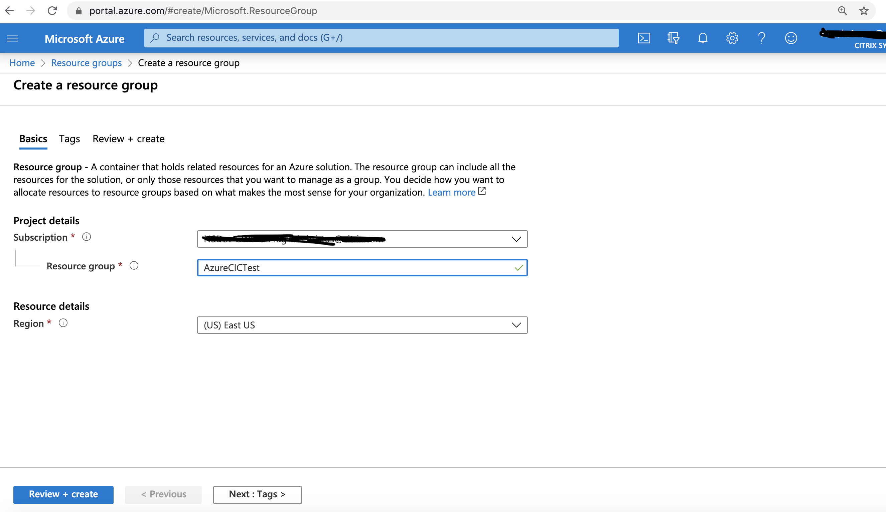

# Get Citrix Ingress Controller from Azure Marketplace

This guide explains the steps to create the URL for CIC image on Azure Markerplace.

#### Prerequisites:

- Valid Azure Marketplace account and Subscription

## Steps:

1. Login to your Azure Marketplace Account. See, [Azure Market Place](https://azuremarketplace.microsoft.com/en-us)
2. Create a Resource Group under your subscription if the kubernetes cluster has not been created yet. Please note that the      resouce group of the cluster and the CIC registry must be same. So, if the kubernetes cluster where the CIC is to deployed    already exists, then, same resource group should be used for CIC registry. If not, then create a new resouce group and then    create cluster with this new resource group. 

   - Enter any name in Resource group Textbox and set a region.
     
   - Click on Review+create   
   - Review the details and click on Create.
   
     
      
3. Select "Citrix Ingress Controller" on Azure Marketplace. See, [Citrix Ingress Controller](https://azuremarketplace.microsoft.com/en-us/marketplace/apps/citrix.citrixingresscontroller?tab=Overview)
   
   - Click on "GET IT NOW"
   - Verify the details on pop-up and Click on "Continue"
     

4. Create CIC Image registry with the Resource Group created in step 2
   
   - Click on "Create new" for new Azure CIC Registry
   - Enter a Registry name
   - Select the Resource group name from Step 2 in Resource group dropdown
   - Set location
   - Keep the tag latest and selece auto update.
   - Verify your account details and click on "Subscribe"
     

5. Get the Repository Image URL
   - Go to Resouce Groups page and select the resource group created in Step 2.
   - From the right side column, select the registry created in Step 4.
     
   - Under "services" on Left column, click on "Repositories"
     
   - Find the "citrix/citrix-k8s-ingess-controller" under repositories and select it.
     
   - Now, select "latest" in the new right column.
   
     
   - Here, image URL is shared in "Docker pull command" text.
   
     For instance, azurecpxnew.azurecr.io/citrix/citrix-k8s-cpx-ingress-13-0:latest
     
     Copy the same and replace as image in CIC yaml.
   

