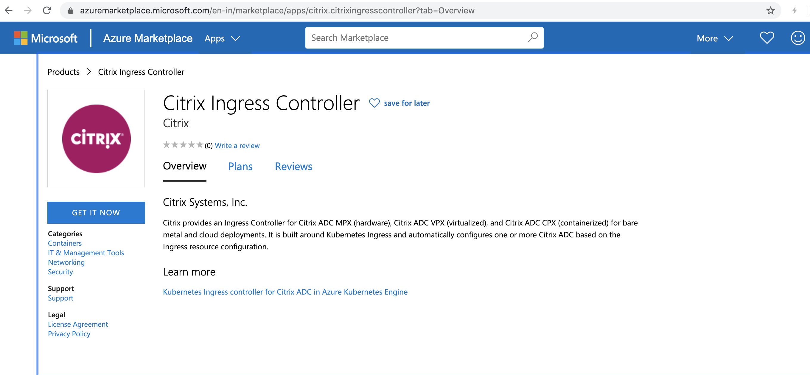

# Get Citrix Ingress Controller from Azure Marketplace

This topic explains the steps to create a URL for the Citrix ingress controller image on Azure Marketplace.

**Prerequisites**

- A valid Azure Marketplace account and subscription

## Generate a URL for the Citrix ingress controller image in Azure Marketplace

1. Log in to your [Azure Marketplace](https://azuremarketplace.microsoft.com/en-us) account. 

2. Create a resource group under your subscription if the Kubernetes cluster has not been created yet.
   
   **Note:** The resource group of the cluster and the Citrix ADC CPX registry must be the same. If the Kubernetes cluster where you want to deploy the Citrix ingress controller exists, then the same resource group should be used for the Citrix ingress controller registry. If the Kubernetes cluster does not exist, create a resource group and then create a cluster with this new resource group.

   - Enter a name for the Resource group and specify a region.
  
      
   
   - Click **Review+create**.
 
   - Review details and then click **Create**.
   
     
      
3. Select [Citrix Ingress Controller](https://azuremarketplace.microsoft.com/en-us/marketplace/apps/citrix.citrixingresscontroller?tab=Overview) on Azure Marketplace.

    
   
    - Click **GET IT NOW**.
   
   - Verify the details on the pop-up window and click **Continue**.

     

4. Create a Citrix ingress controller image registry with the resource group created in step 2.
   
   

   - Click **Create new** for creating an Azure Citrix ingress controller registry.
  
   - Enter a registry name.
  
   - Select the resource group name created in step 2 from the resource group drop-down list.
  
   - Set the location.
  
   - Set the tag as `latest` and select `auto update`.

   - Verify your account details and click **Subscribe**.
     

5. Get the repository image URL.

   - Go to the `Resouce Groups` page and select the resource group created in step 2.
  
   - Select the registry created in step 4.
  
     

   - Under `services`, click **Repositories**.
  
     

   - Find  `citrix/citrix-k8s-ingess-controller` under repositories and select it.
  
     
   
   - Select tag as **latest**.
   
     
   
   - Here, image URL is shared as part of the  `Docker pull ` command text.
   
     For example, `azurecicreg.azurecr.io/citrix/citrix-k8s-ingress-controller:latest`.
     
     Copy the image URL and replace as image in the Citrix ingress controller YAML file.

