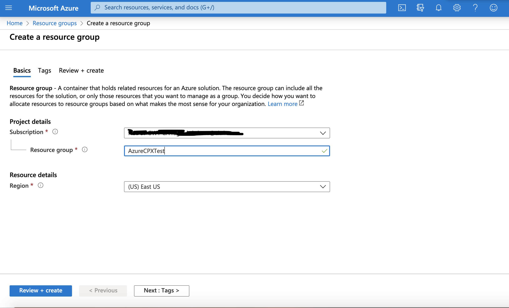
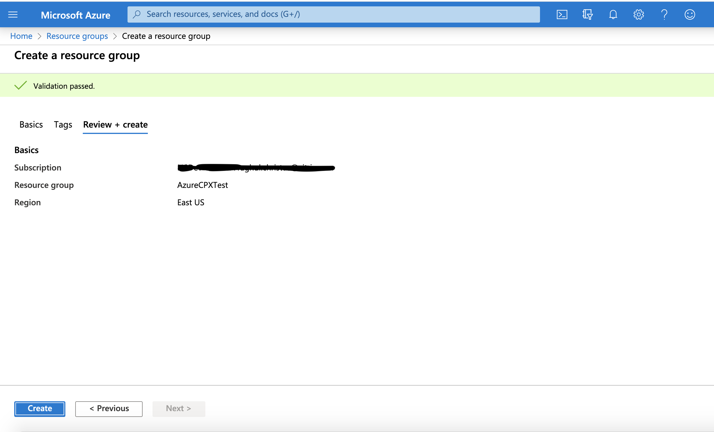
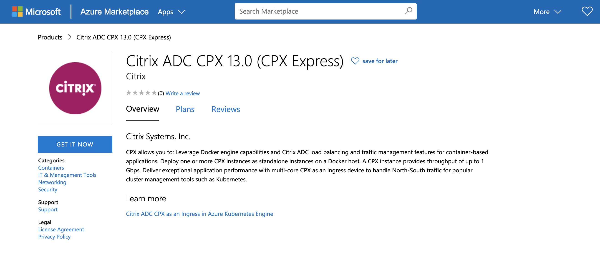
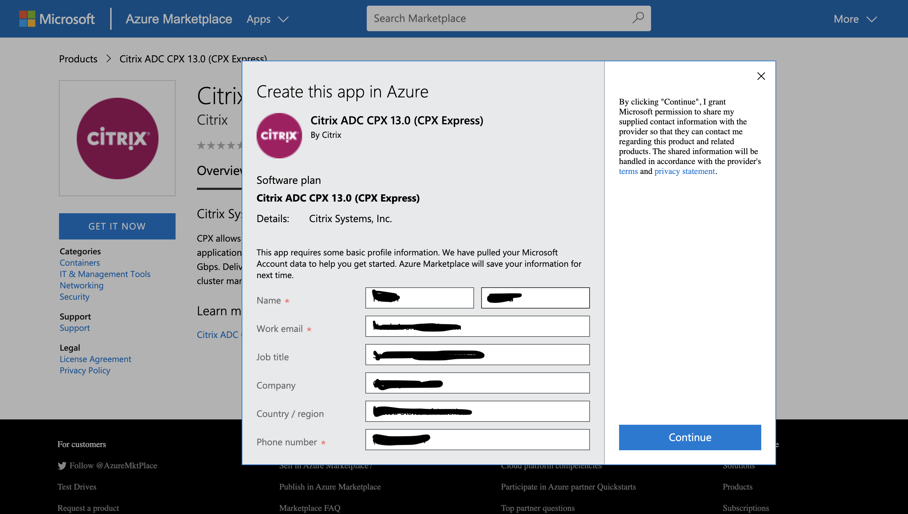
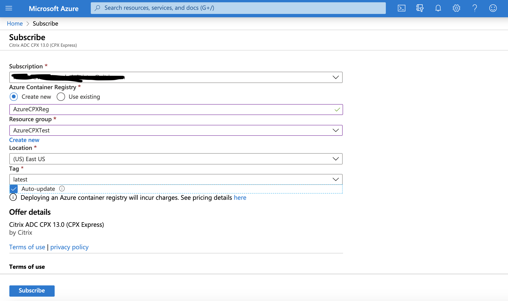
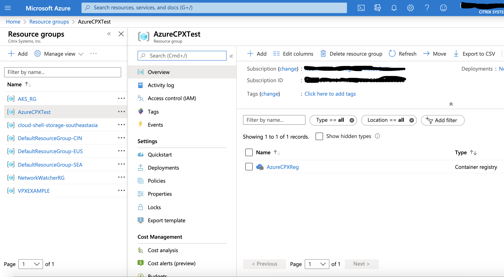
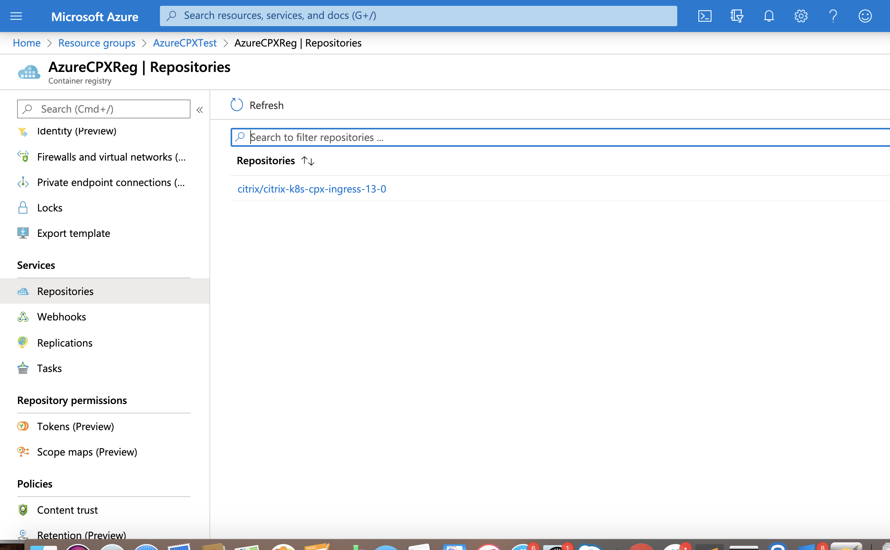
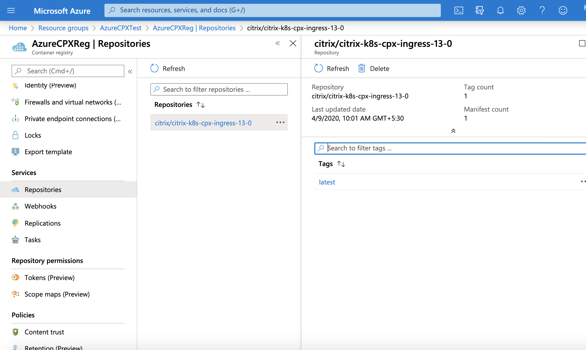
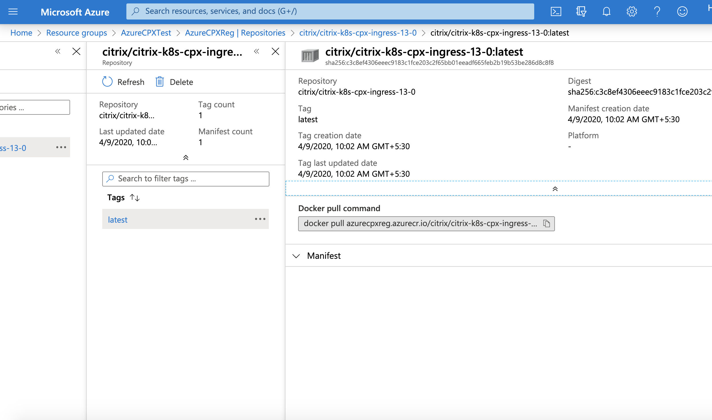

# Get Citrix ADC CPX from Azure Marketplace

This topic explains the steps to generate a URL for the Citrix ADC CPX image in Azure Marketplace. You can use this URL in the YAML file to deploy Citrix ADC CPX in the Azure Kubernetes cluster.

**Prerequisites**

- A valid Azure Marketplace account and subscription

## Generate a URL for the Citrix ADC CPX image in Azure Marketplace

Perform the following steps to generate a URL for the Citrix ADC CPX image in Azure Marketplace.

1. Log in to your [Azure Marketplace](https://azuremarketplace.microsoft.com/en-us) account.

2. Create a resource group under your subscription if the Kubernetes cluster has not been created yet.

   - Enter a name for the resource group and specify a region.

      
   
   - Click **Review+create**.
   
   - Review details and then click **Create**.
    
   **Note:** The resource group of the cluster and the Citrix ADC CPX registry must be the same. If the Kubernetes cluster where you want to deploy the Citrix ADC CPX exists, then the same resource group should be used for the Citrix ADC CPX registry. If the Kubernetes cluster does not exist, create a resource group and then create a cluster with this new resource group.
   
     

3. Select [Citrix ADC CPX](https://azuremarketplace.microsoft.com/en-us/marketplace/apps/citrix.citrixadccpx-13-0?tab=Overview) on Azure Marketplace.

   
   
   - Click **GET IT NOW**.
   
   - Verify the details on the pop-up window and click **Continue**.
  
     

4. Create a Citrix ADC CPX image registry with the resource group created in step 2.

   

   - Click **Create new** for creating an Azure CPX registry.
  
   - Enter a registry name.
  
   - Select the resource group name from step 2 in the resource group drop-down list.
  
   - Set the location.
  
   - Set the tag as `latest` and select `auto update`.

   - Verify your account details and click **Subscribe**.

5. Get the repository image URL.

   - Go to the `Resouce Groups` page and select the resource group created in step 2.
   
   - Select the registry created in step 4.
  
     
   
   - Under `services`, click **Repositories**.
     
     
   
   - Find `citrix/citrix-k8s-cpx-ingress-13.0` under repositories and select it.
     
     
   
   - Select tag as **latest**.
   
     
   
   - Here, image URL is shared as part of the  `Docker pull` command.
   
     For example, `azurecpxreg.azurecr.io/citrix/citrix-k8s-cpx-ingress-13-0:latest`
     
     Copy the image URL and replace as image in the Citrix ADC CPX YAML file.
