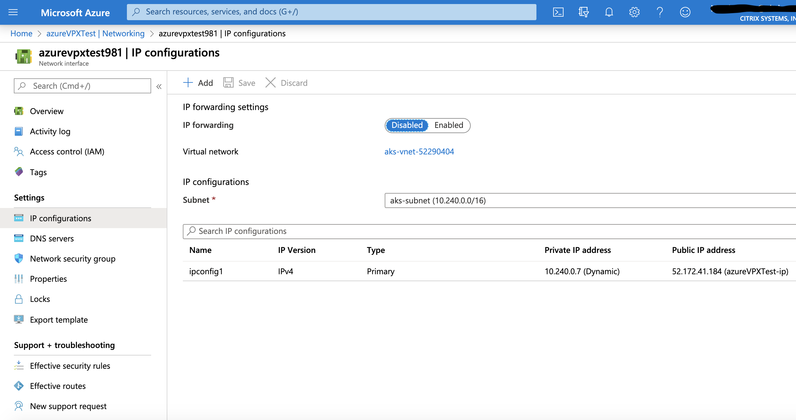

# Create a Citrix ADC VPX instance from Azure Marketplace

This topic explains the steps to create a Citrix ADC VPX instance from Azure Marketplace.

**Prerequisites:**

- A valid Azure Marketplace account and subscription
- An existing Kubernetes cluster in Azure
  
## Deploy Citrix ADC VPX from Azure Marketplace

Perform the following steps to create a Citrix ADC VPX instance from Azure Marketplace.

1. Log in to your [Azure Marketplace](https://azuremarketplace.microsoft.com/en-us) account.

2. Locate the resource group automatically created as a part of creating the Kubernetes cluster.  
  
   - If the Kubernetes cluster `X` is a part of a resource group `Y` in region `Z` then search for a resource group starting with `MC` followed ty `X_Y_Z` (`MC_X_Y_Z`).
     For example, consider a Kubernetes cluster with the following attributes:

       - cluster name as `cic-cluster-basic-1`
       - resource group for the cluster as `AKS_RG`
       - region used for the cluster as `southindia`
       
     Then, a resource group would have been automatically created as `MC_AKS_RG_cic-cluster-basic-1_southindia`.
     
     
     
3. Add Citrix ADC VPX in the resource group located in step 2.
   
   - From the resource group page, click **+Add**.
  
   - Search for `Citrix ADC 12.1`, select a software plan, and click **Create**.
    
     
     

4. Specify the required details for Citrix ADC VPX.

   - Specify a virtual machine name.
   
   - Specify a region which should be same as that of the cluster.
   
      
    
    - Specify the size for the Citrix ADC VPX.
   
      
   
    - Under Administrator account, select the authentication type as `Password` and specify the `Username` and `Password`.
  
    - Select all the relevant `inbound ports` from drop-down menu, then click **Next**.
  
      
      
    - Verify the disk details and then click **Next**.
   
      
  
    -  Verify the `Virtual network` and `Subnet` information and make sure that they are same as the network information of the resource group and then click **Next**.
       
       
   
    -  Verify the management details and then click **Next**.
   
       
   
    - Verify any `Advanced details` if necessary and then click **Next**.
  
      
   
    - Specify any Tags if needed and click **Next**.
     
      
  
    - Review all details of the Citrix ADC VPX, and then click **Create**. Wait for some time until the deployment is complete.
     

5. Set the Citrix ADC VPX networking configurations required as part of ingress or the Citrix ingress controller deployment in the cluster.

   - Go to the `Networking` section on the deployed VPX Page, and select **Network Interface** on the right.
  
     
   
    - Select **IP configurations** on the network interfaces page and click **+Add** for adding a new IP address.
    
  
    - Add an IP address for `SNIP`, specify a `name`, keep the allocation method as `Dynamic`, and set the public IP address as `Disabled`.
  
       
  
    -  Add an IP address for `VIP`, specify a `name`, keep the allocation method as `Dynamic`, and public IP address as `Enabled`.
  
       

     
       
    
    -  Verify all IP configurations and then set the IP forwarding as `Enabled`.
  
       

6. Verify if you are able to SSH into Citrix ADC VPX using the primary public IP address and the user name and password set during the Citrix ADC VPX deployment.
  
  **Note:**
  Before proceeding with the verification, make sure that all the necessary firewall settings are configured. Verify the SSH access and access to other ports like 80 and 443.
