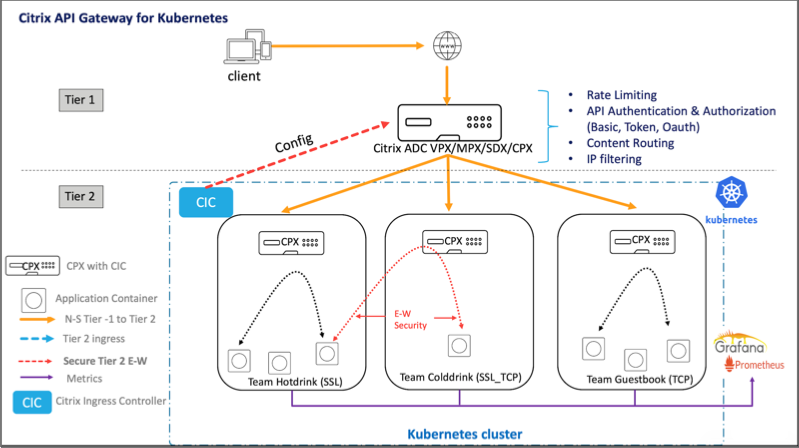

# Citrix API Gateway for Kubernetes

An API Gateway acts as the single entry point for your APIs and ensures secure and reliable access to multiple APIs and microservices in your system.

Citrix provides an enterprise grade API Gateway for North-South API traffic into the Kubernetes cluster.
Citrix API Gateway integrates with Kubernetes through the Citrix ingress controller and the Citrix ADC (Citrix ADC MPX, VPX, or CPX) deployed as the Ingress Gateway for on-premises or cloud deployments.

The following diagram shows a dual-tier topology for Citrix API Gateway.

Using Citrix API Gateway, you can perform the following functionalities:

- Enforce authentication policies
- Rate limit access to services

## How does Citrix API Gateway work

 Citrix API Gateway is built on top of Citrix Ingress Gateway and leverages Kubernetes API extensions such as custom resource definitions (CRDs). Using CRDs, you can automatically configure Citrix ADC and API Gateway in the same instance.

Citrix provides the following CRDs for API Gateway:

- [Auth CRD](https://github.com/citrix/citrix-k8s-ingress-controller/blob/master/crd/auth/auth-crd.yaml)
- [Rate limit CRD](https://github.com/citrix/citrix-k8s-ingress-controller/blob/master/crd/ratelimit/README.md)

## Key benefits of using Citrix API Gateway

Following are the key benefits of using Citrix API Gateway:

- Leverages the advanced traffic management and comprehensive security features of Citrix ADC
- Optimizes your deployments by consolidating multiple network functions into a single component of Citrix Ingress Gateway.
- Reduces the operational complexity and cost involved in deploying multiple components
- Ensures better performance for your application traffic by reducing multiple hops of TCP or TLS decryption while using separate components
- Simplifies deploy and integrate in your Kubernetes environments either by directly using YAMLs or helm charts

## Deploying Citrix API Gateway

For more information on how to configure Citrix API Gateway features using CRDs, see the following:

- [Authentication](https://developer-docs.citrix.com/projects/citrix-k8s-ingress-controller/en/latest/crds/auth/)
- [Rate limiting](https://developer-docs.citrix.com/projects/citrix-k8s-ingress-controller/en/latest/crds/rate-limit/)
