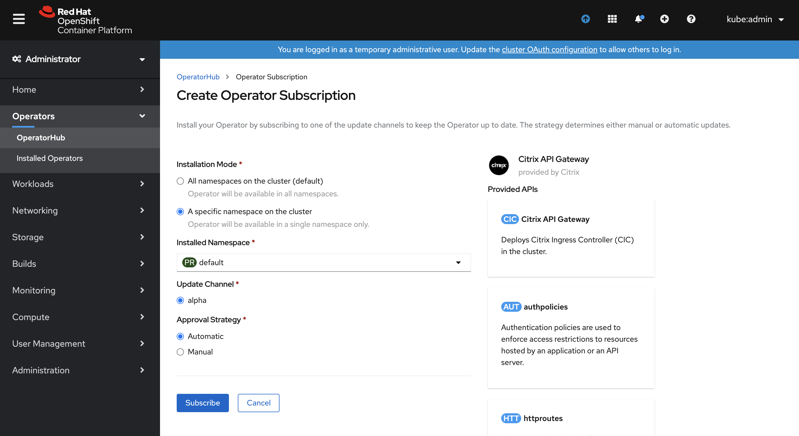

# Deploy Citrix API gateway using Red Hat OpenShift Operators

OpenShift Operator is an open-source toolkit designed to package, deploy, and manage Kubernetes native applications in a more effective, automated, and scalable way.

An API gateway acts as the single entry point for your APIs and ensures secure and reliable access to multiple APIs and microservices in your system. Citrix provides an enterprise grade API gateway for North-South API traffic into the OpenShift cluster. The API gateway integrates with the OpenShift cluster through the Citrix ingress controller and the Citrix ADC (Citrix ADC MPX, VPX, or CPX) deployed as the Ingress Gateway for on-premises or cloud deployments.

This topic covers information on how to deploy the API gateway using OpenShift Operators.

The Citrix API gateway operator installs the CRDs required for the API Gateway functionality. Since this operator leverages the Citrix ingress controller, you need to create an instance of the API Gateway CRD, which is the Citrix ingress controller. If you already have a Citrix ingress controller instance in the cluster you need to install it again.

API gateway supports the following CRDs:

- Auth CRD (authpolicies.citrix.com)

Authentication policies are used to enforce access restrictions to resources hosted by an application or an API server.

- Content routing CRDs (httproutes.citrix.com and listeners.citrix.com)

Kubernetes native Ingress supports only basic host and path based routing.
Using content routing CRDs, you can expose the advanced content routing abilities provided by Citrix ADC like routing based on header values or query strings.

- Rate limit CRD (ratelimits.citrix.com)

In a Kubernetes deployment, you can rate limit the requests to the resources on the back end server or services using the rate limiting feature provided by the ingress Citrix ADC.

- Rewrite and responder CRD (rewritepolicies.citrix.com)

In a Kubernetes environment, to deploy specific layer 7 policies (such as redirecting HTTP traffic to a specific URL) requires you to add appropriate libraries within the microservices and manually configure the policies. Instead, you can use the Rewrite and Responder features provided by the Ingress Citrix ADC device to deploy these policies.

- VIP CRD (vips.citrix.com)

Citrix provides a VIP CRD for asynchronous communication between the IPAM controller and the Citrix ingress controller. The IPAM controller is provided by Citrix for IP address management.

## Deploy Citrix API Gateway using OpenShift Operator

Perform the following steps to deploy the API gateway using the OpenShift Operator.

1. In the OperatorHub, search for **Citrix API Gateway Operator**.
   
   
2. Select the **Citrix API Gateway Operator**, and click **Install**.

    

3. Choose the namespace where you want the operator to be installed and click **Subscribe**.

    

4. Once the Citrix API gateway operator is installed, you can see it listed under the **Installed Operators** section on the left panel. At this point, all CRDs are installed in the cluster.
    

5. To create instances of each CRD, select the appropriate CRD and click **Create Instance**.
    

6. Once you create the instance you can see all your instances by selecting the **All instances** tab.
    

## Update the CRD instance

To update any values of the created CRD instance, click the instance and go to the **YAML** tab and edit the YAML file and click **Save**.

## Upgrade CRD versions

For more information on upgrading CRD versions, see the [OpenShift documentation](https://access.redhat.com/documentation/en-us/openshift_container_platform/4.3/html/operators/understanding-the-operator-lifecycle-manager-olm#olm-dependency-resolution-crd-upgrades_olm-understanding-dependency-resolution).

## Delete the instance and operator

To delete an instance of the CRD you have to delete the Citrix ingress controller instance from the user interface. Select the three vertical dots on the right side of the instance as shown in the following image and then click **Delete CitrixIngressController**.

To delete the operator, click the **Actions** drop-down list and then click **Uninstall operator**.

**Note:** Make sure that all instances are deleted manually before uninstalling the operator. The instances are not automatically deleted if you uninstall the operator.

