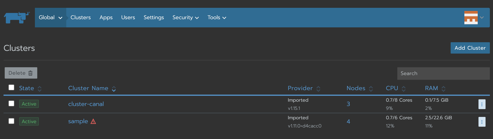
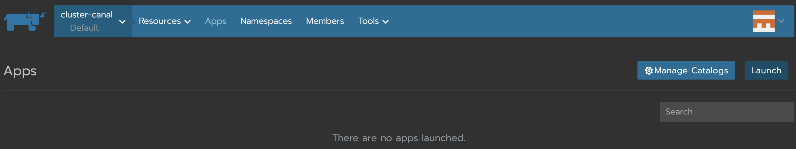
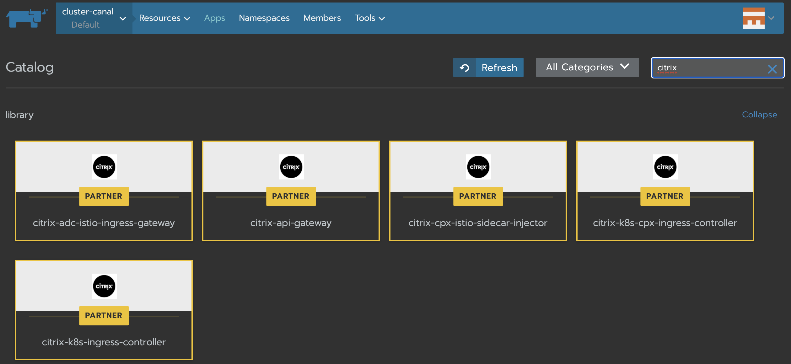

# Deploying Citrix API gateway using Rancher

Citrix API gateway provides a single entry point for APIs by ensuring secure and reliable access to APIs and microservices on your system. Citrix provides an enterprise-grade API gateway for North-South API traffic for Kubernetes clusters.
Citrix API gateway integrates with Kubernetes through the Citrix ingress controller and the Citrix ADC (Citrix ADC MPX, VPX, or CPX) deployed as the Ingress Gateway for on-premises and cloud deployments.

You can use the Rancher platform to deploy Citrix API gateway. Rancher provides a catalog of application templates that help you to deploy Citrix API gateway.

**Prerequisites**

You must import the cluster, in which you want to deploy the API gateway, to the Rancher platform.

## Import the cluster to the Rancher platform

Perform the following steps to import your cluster to the Rancher platform:

1. Log in to the Rancher platform.
2. In the Clusters page, click **Add Cluster**.

   

3. In the Add Cluster - Select Cluster Type page, choose the **Import an existing cluster** option.

4. Specify the **Cluster Name**.

5. Specify **Member Roles**, **Labels**, and **Annotations**.

6. Click **Create**.

## Deploy Citrix API gateway using the Rancher platform

Perform the following steps to deploy the API gateway on the cluster using the Rancher platform:

1. Log in to the Rancher platform.
   
2. From the **Global** drop-down list, select the cluster that you have imported.

3. Select the **Apps** tab and click **Launch**.

    

4. From the Catalog page, choose the **citrix-api-gateway** template.

    

5. Specify the mandatory and required fields under **Configuration Options** (includes deployment settings, ADC settings, the Citrix ingress controller image settings, and exporter settings).

   The mandatory fields include:

   - **Namespace:** Specify the namespace where you want to create the Citrix ingress controller. You can also use the **Edit as YAML** option to specify the same in the YAML file.
   - **Accept License:** Select **Yes** to accept the terms and conditions of the Citrix license.
   - **Login File Name:** Specify the name of the Kubernetes secret. The secret file is used for the Citrix ADC login.
   - **Citrix ADC IP:**  It is the NSIP or SNIP of the Citrix ADC device. For high availability, specify the SNIP as the IP address.

6. Click **Preview** to verify the information and click **Launch**.