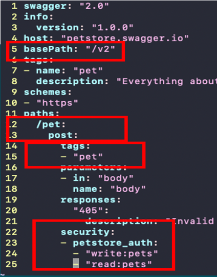
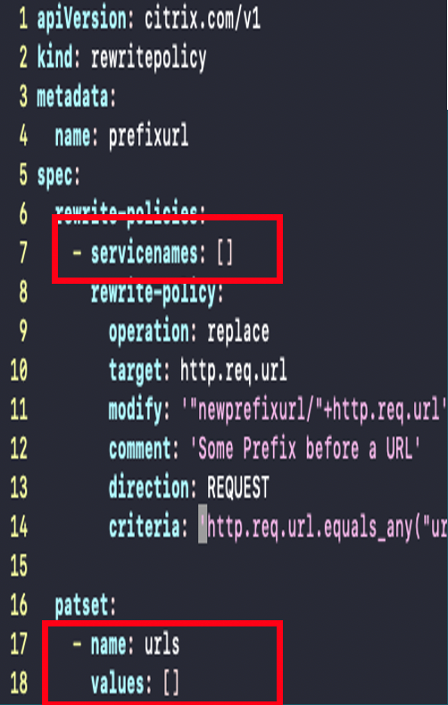
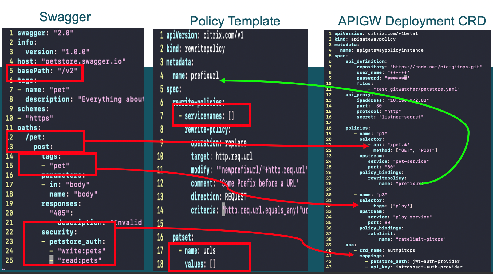

# Deploy API Gateway with GitOps

Custom Resource Definitions (CRDs) are the primary way of configuring API gateway policies in cloud native deployments. Operations teams create the configuration policies (routing, authentication, rewrite, Web Application Firewall (WAF), and so on) and apply them in the form of CRDs. In an API Gateway context, these policies are applied on the specific APIs and upstream hosting these APIs.

API developers document the API details in an Open API specification format for the client software developers and peer service implementation teams for using the API details. API documents contain information such as base path, path, method, authentication, and authorization.

Operation teams can use the information in an API specification document to configure the API Gateway. Git, a source control solution, is used extensively by developers and operations teams. The GitOps solution makes the collaboration and communication that take place between development and operations teams easier. GitOps helps to create a faster, more streamlined, and continuous delivery for Kubernetes without losing stability.

The API Gateway deployment with the GitOps solution enables operations teams to use the API specification document created by software developers in the API gateway configuration. This solution automates the tasks and information exchange between API development and operations teams.

## About the GitOps solution for API Gateway

The GitOps solution is constituted mainly by three entities:

- Open API specification document
- Policy template CRDs
- API Gateway deployment CRD

### Open API Specification document

Created by API developers or API designers, the document provides an API information. The GitOps solution uses the following details from an Open API specification document:

  -  Base path
  -  Path
  -  Method
  -  Tags
  -  Authentication
  -  Authorization

The following is a sample Open API specification file with the details (in red) that are used to automatically create policies.



### Policy template CRDs
  
CRDs are the primary way of configuring an API gateway instance. The operations team creates and manages the CRD implementations. In the traditional workflow, as part of creating the policies, the operations team manually fills the target details such as upstream and API path in the CRD instances. In the GitOps solution, the API path and upstream details are derived automatically. Operations team creates the CRDs without any target details and the solution refer to such CRD instances as policy templates.

The GitOps solution supports the following policy templates:

  -  Rewrite policy
  -  Rate limit policy
  -  Authentication policy
  -  WAF

The following is a sample rewrite policy template:

  **Note**: For information on how to create a CRD instance, see the individual CRDs.



### API Gateway deployment CRD

API Gateway deployment CRD binds the API specification document with policy templates. This CRD enables mapping of API resources with upstream services and API gateway policies related to routing and security. The API Gateway deployment CRD is maintained by the operations team with the data received from the development team.

The API Gateway deployment CRD configures the following:

  -  Git repository details
  -  Endpoint listener
  -  API to upstream mapping
  -  API to policy mapping
  -  Open API authentication policy references to authentication policy template mapping

  Alternatively, API Gateway CRD supports non-Git sources for fetching OpenAPI Specification (OAS) documents. Currently, both HTTP and HTTPS URL sources are supported. These URLs can be password protected and basic HTTP authentication is supported. Credentials can be configured using the same fields as that of Git based OAS file sources.

  **Workflow**

  The following image shows the API Gateway deployment CRD binding the API specification with policy templates using the API selectors and policy mappings.

  

  APIs that start with the */pet* regular expression is selected with the *path regexp* pattern and APIs with */play* is selected with the *play* tag. Security definitions in the API specification document are mapped with the available authentication, authorization, and auditing configurations in the authentication CRD template.

## Configure API Gateway CRD

  The API Gateway CRD binds the API resources defined in the Swagger specification with policies defined in the other CRDs.

  **Prerequisites**

  Apply CRD definitions for the following CRD objects:

  -	 [Listener](https://developer-docs.citrix.com/projects/citrix-k8s-ingress-controller/en/latest/crds/Listener/)
  -	 [HTTP route](https://developer-docs.citrix.com/projects/citrix-k8s-ingress-controller/en/latest/crds/content-routing/)
  -	 [Rate limit](https://developer-docs.citrix.com/projects/citrix-k8s-ingress-controller/en/latest/crds/rate-limit/)
  -	 [Rewrite](https://developer-docs.citrix.com/projects/citrix-k8s-ingress-controller/en/latest/crds/rewrite-responder/) 
  -	 [Authentication](https://developer-docs.citrix.com/projects/citrix-k8s-ingress-controller/en/latest/crds/auth/)
  -	 [WAF](https://developer-docs.citrix.com/projects/citrix-k8s-ingress-controller/en/latest/crds/waf/) 

   The following sections provide information about the various elements in the API Gateway CRD configuration file:

## API definition

  It provides information about the Git repository in which the Git watcher monitors for the Open API specification files.

**api-definition**:  Git repository access details.

| Field | Description |
| ---------- | ----------- |
| `Repository` | Specifies the Git repository URL.|
| `Branch` | Specifies the Git branch name (By default, master). |
| `oas_secret_ref` | Specifies the Git access secret reference as a Kubernetes secret object name. **Note**: When creating a secret, keep the *user name* and *password* as the secret field names for user name and password.|
| `User_name` | Specifies the Git user name. |
| `Password` | Specifies the Git password. **Note**: Credentials can be specified as a *git_secret_ref* as mentioned before or as user name and password in plain text format. |
| `Files` | The credentials for these OAS URLs can be accessed from the `oas_secret_ref` field or user_name and password field combinations. |

## API proxy

  It provides information about the endpoint (VIP) configuration that is used to expose the APIs on the API Gateway front end.

**api_proxy**: VIP details

| Field | Description |
| ---------- | ----------- |
| `ip_address` | Specifies the IP address of the end point (VIP). |
| `port` | Specifies the endpoint port. |
| `protocol` | Specifies the protocol (HTTP/HTTPs).|
| `secret` | Specifies the SSL certificate secret for the endpoint configuration. |

## Policy mappings

  It maps the API resources with the upstream services and policy templates. Some information in this section is collected from the developers when the operations team creating the CRD.

| Section | Sub section | Field |  Sub field | Description |
| -------- | --------- | -------- | --------- | ----------- |
| Policies |  |  | | Specifies the policy and upstream mapping. |
|  | | Name | | Specifies the name of the policy. It is unique in a CRD instance.|
|  | Selector | | | A list of filters for selecting the API resources. |
|  |  | API |  | Specifies the *Regexp* pattern for the API selection. All the APIs that match with this pattern are selected for applying policies from this block.|
|  |  | method |  | A list of HTTP verbs, if the API resource verb matches with ANY in the list, it is selected.  |
|  |  | Tags |  | A list of tags to match with an API. These tags are matched with *tags* in the API specification document. You can use either *ragexp* based path patterns or tags to match a policy. |
|  | Upstream. |   | | Specifies the upstream for the selected policy. |
|  |  | Service |  | Specifies the back-end service name. |
|  |  | Port |  | Specifies the back-end service port. |
|  | Policy-binding |  | | Specifies the policy list to be applied on the selected API. |
|  |  |  |  Type of the policy template | Specifies the exact type of policy. Supported types are WAF, rewrite policy, and rate limit. |
|  |  |  | Name | Specifies the name of the policy template. |

## AAA mappings

It maps the authentication references in the API specification document with the available policy definition sections in the authentication CRD template.

| Section | Sub section | Field |  Sub field | Description |
| -------- | --------- | -------- | --------- | ----------- |
| aaa |  |  | | Authentication, authorization, and auditing policy section mappings. |
|  | | Crd_name | | Specifies the name of the authentication CRD template.|
|  | Mappings | | | Mapping API specification security policy references with the appropriate sections in the authentication CRD template. **Note**: If the API specification refer to string matches with the policy section name in the CRD template, explicit mapping is not required. |

Perform the following steps to deploy the API Gateway CRD:

  1. Download the [API Gateway CRD](https://github.com/citrix/citrix-k8s-ingress-controller/blob/master/crd/apigateway/apigateway-crd.yaml).

  2. Deploy the API Gateway CRD using the following command:

            kubectl create -f apigateway-crd.yaml`
 
     The following is an example API Gateway CRD configuration:


```yml

apiVersion: citrix.com/v1beta1
kind: apigatewaypolicy
metadata:
  name: apigatewaypolicyinstance
spec:
    api_definition:
        repository: "https://code.citrite.net/scm/cnn/cic-gitops.git"
        branch: "modify-test-branch"
        git_secret_ref: "mysecret"
        user_name: "<username>"
        password: "<password>"
        files:
            - "test_gitwatcher/petstore.yaml"
            - "test_gitwatcher/playstore.yaml"
 
    api_proxy:
        ipaddress: "10.106.172.83"
        port:  80
        protocol: "http"
        secret: "listner-secret"
 
    policies:
       - name: "p1"
         selector:
            - api: "/pet.*"
              method: ["GET", "POST"] 
         upstream:
            service: "pet-service"
            port: "80"
         policy_bindings:
            ratelimit:
                name: "ratelimit-gitops-slow"
 
       - name: "p2"
         selector:
            - api: "/user.*"
              method: ["GET", "POST"] 
         upstream:
            service: "user-service"
            port: 80
         policy_bindings:
            ratelimit:
                name: "ratelimit-gitops-slow"
 
       - name: "p3"
         selector:
            - tags: ["play"]
         upstream:
            service: "play-service"
            port: 80
         policy_bindings:
            ratelimit:
                name: "ratelimit-gitops"
            rewritepolicy:
                name: "prefixurl"
            waf:
                name: "buffoverflow"
    aaa:
       - crd_name: authgitops
         mappings:
           - petstore_auth: jwt-auth-provider
           - api_key: introspect-auth-provider
```

## Support for web insight based analytics

Web insight based analytics is now supported with the API gateway CRD. When you use GitOps, the following web insight parameters are enabled by default:

- `httpurl`
- `httpuseragent`
- `httphost`
- `httpmethod`
- `httpcontenttype`  