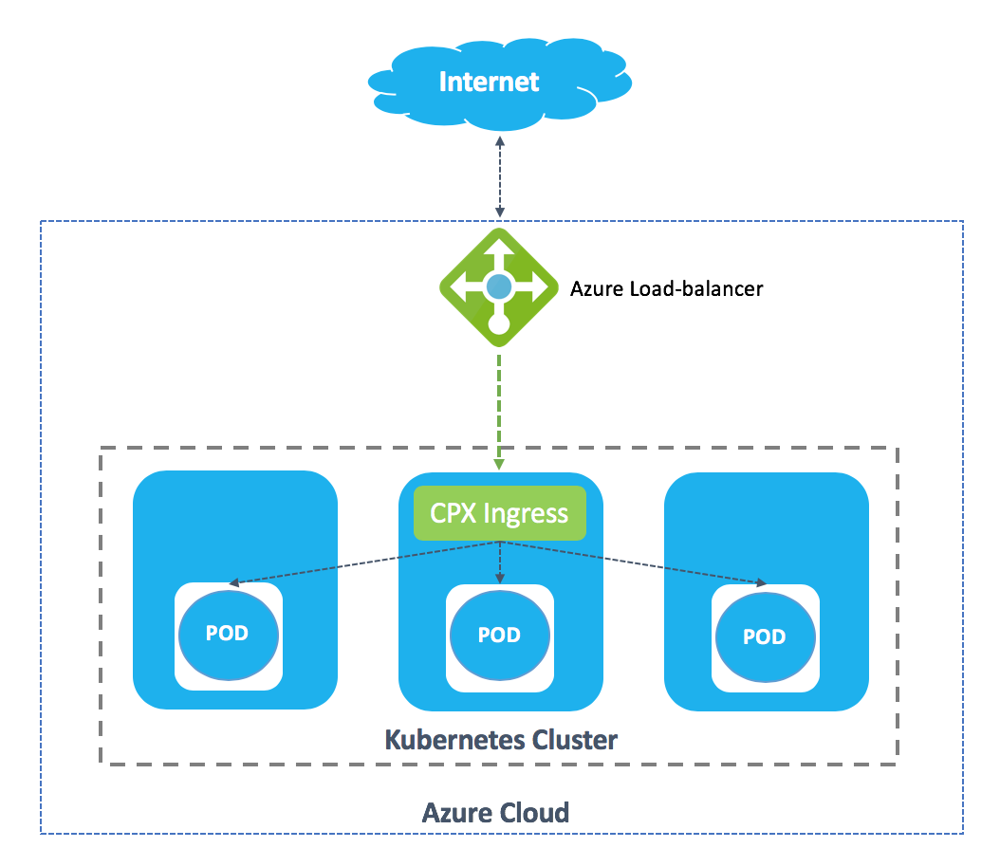
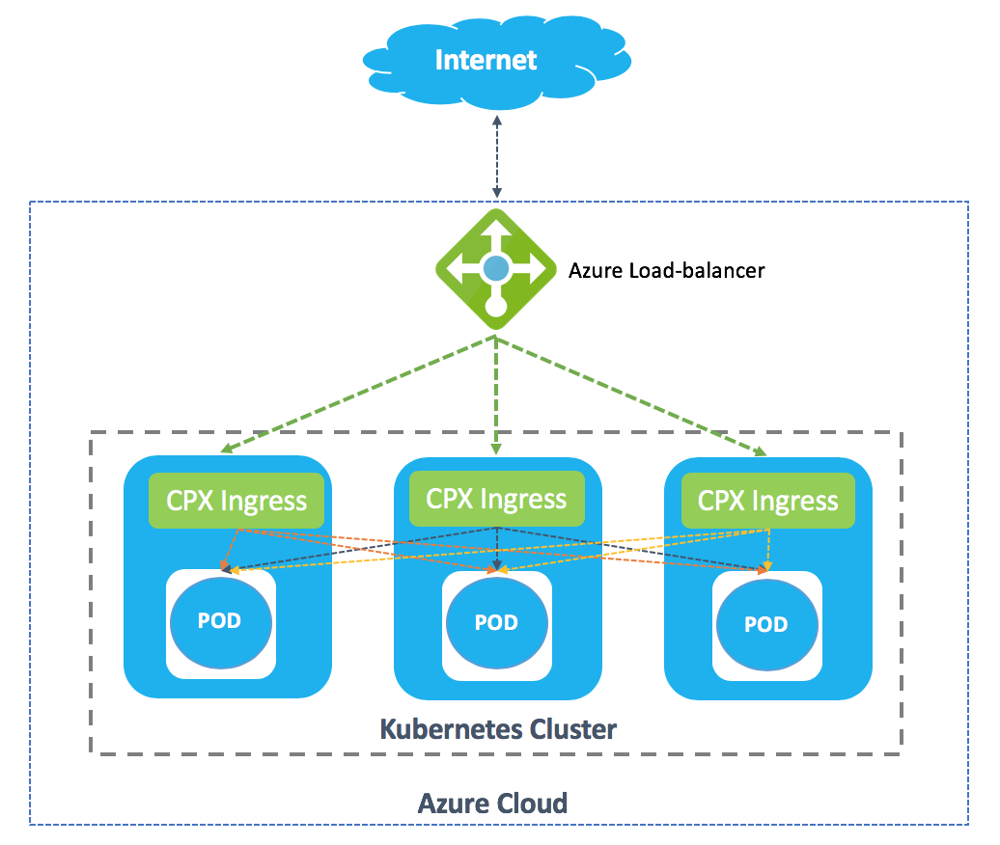

# Deploy Citrix ADC CPX as an Ingress device in an Azure Kubernetes Service cluster with advanced networking mode using Azure repository images

This topic explains how to deploy Citrix ADC CPX as an ingress device in an [Azure Kubernetes Service (AKS)](https://azure.microsoft.com/en-in/services/kubernetes-service/) cluster with advanced networking mode (Azure CNI).

## Get Citrix ADC CPX from Azure Marketplace

To deploy CPX, an image registry should be created on Azure and the correponding image URL should be used to fetch the CPX image.
For more information on how to create registery and get image URL, see [Get Citrix ADC CPX from Azure Marketplace](https://github.com/citrix/citrix-k8s-ingress-controller/blob/master/docs/deploy/azure-cpx-url.md)

Once registry is created, the CPX registry name should be attched to the aks cluster used for deployment.
```
az aks update -n <cluster-name> -g <resource-group-where-aks-deployed> --attach-acr <cpx-registry>
```

## Get Citrix Ingress Controller from Azure Marketplace

To deploy CIC, an image registry should be created on Azure and the correponding image URL should be used to fetch the CIC image.
For more information on how to create registery and get image URL, see [Get Citrix Ingress Controller from Azure Marketplace](https://github.com/citrix/citrix-k8s-ingress-controller/blob/master/docs/deploy/azure-cic-url.md)

Once registry is created, the CIC registry name should be attched to the aks cluster used for deployment.
```
az aks update -n <cluster-name> -g <resource-group-where-aks-deployed> --attach-acr <cic-registry>
```

## Deploy Citrix ADC CPX as an Ingress device in an AKS cluster

Perform the following steps to deploy Citrix ADC CPX as an Ingress device in an AKS cluster.

>**Note:** In this procedure, Apache web server is used as the sample application.

1. Deploy the required application in your Kubernetes cluster and expose it as a service in your cluster using the following command.

        kubectl create -f apache.yaml

    >**Note:** In this example, [apache.yaml](https://github.com/citrix/citrix-k8s-ingress-controller/blob/master/deployment/azure/manifest/azureimages/azureimages/azurecni/apache.yaml) is used. You should use the specific YAML file for your application.

2. Deploy Citrix ADC CPX as an Ingress device in the cluster using the following command.

```
wget https://raw.githubusercontent.com/citrix/citrix-k8s-ingress-controller/master/deployment/azure/manifest/azureimages/azurecni/standalone_cpx.yaml
```

Update the Citrix CPX image with the Azure Image URL in `standalone_cpx.yaml`. 

```
- name: cpx-ingress
  image: "<azure-cpx-instance-url>"
```

Update the Citrix CIC image with the Azure Image URL in `standalone_cpx.yaml`. 

```
- name: cic
  image: "<azure-cic-instance-url>"
```

After update the required values, deploy it.

```
kubectl create -f standalone_cpx.yaml 
```

3. Create the Ingress resource using the [cpx_ingress.yaml](https://raw.githubusercontent.com/citrix/citrix-k8s-ingress-controller/azurecni-beta/deployment/azure/manifest/azureimages/azurecni/cpx_ingress.yaml) following command.

        kubectl create -f cpx_ingress.yaml

4. Create a service of type LoadBalancer for accessing the Citrix ADC CPX by using the [cpx_service.yaml](https://github.com/citrix/citrix-k8s-ingress-controller/blob/master/deployment/azure/manifest/azureimages/azurecni/cpx_service.yaml) file.

        kubectl create -f cpx_service.yaml

    This command creates an Azure load balancer with an external IP for receiving traffic.

5. Verify the service and check whether the load balancer has created an external IP. Wait for some time if the external IP is not created.

        kubectl  get svc

    |NAME|TYPE|CLUSTER-IP|EXTERNAL-IP|PORT(S)| AGE|
    |----|----|-----|-----|----|----|
    |apache |ClusterIP|10.0.103.3|none|   80/TCP | 2m|
    |cpx-ingress |LoadBalancer |10.0.37.255 | pending |80:32258/TCP,443:32084/TCP |2m|
    |kubernetes |ClusterIP | 10.0.0.1 |none |  443/TCP | 22h |

6. Once the external IP for the load-balancer is available as follows, you can access your resources using the external IP for the load balancer.

        kubectl  get svc

    |NAME|TYPE|CLUSTER-IP|EXTERNAL-IP|PORT(S)| AGE|
    |----|----|-----|-----|----|----|
    |apache |ClusterIP|10.0.103.3|none|   80/TCP | 3m|
    |cpx-ingress |LoadBalancer |10.0.37.255 | created |80:32258/TCP,443:32084/TCP |2m|
    |kubernetes |ClusterIP | 10.0.0.1 |none |  443/TCP | 22h |

    >**Note:**  The health check for the cloud load-balancer is obtained from the `readinessProbe` configured in the [Citrix ADC CPX deployment YAML](https://github.com/citrix/citrix-k8s-ingress-controller/blob/master/deployment/azure/manifest/azureimages/azurecni/cpx_service.yaml) file. </br>
    If the health check fails, you should check the `readinessProbe` configured for Citrix ADC CPX. For more information, see [readinessProbe](https://kubernetes.io/docs/tasks/configure-pod-container/configure-liveness-readiness-probes/#define-readiness-probes) and [external Load balancer](https://kubernetes.io/docs/tasks/access-application-cluster/create-external-load-balancer/).

7. Access the application using the following command.

        curl http://<External-ip-of-loadbalancer>/ -H 'Host: citrix-ingress.com

## Deployment models

You can use the following deployment solutions for deploying Citrix ADC CPX as an ingress device in an AKS cluster.

-  Standalone Citrix ADC CPX deployment
-  High availability Citrix ADC CPX deployment
-  Citrix ADC CPX per node deployment

>**Note:**
>For the ease of deployment, the deployment models in this topic are explained with an all-in-one manifest file that combines the steps explained in the previous topic. You can modify the manifest file to suit your application and configuration.

### Deploy a standalone Citrix ADC CPX as the Ingress device

To deploy Citrix ADC CPX as an Ingress device in a standalone deployment model in AKS, you should use the service type as LoadBalancer. This step would create a load balancer in the Azure cloud.



Perform the following steps to deploy a stand-alone Citrix ADC CPX as the ingress device.

1.  Deploy Citrix ADC CPX ingress devices for high availability in your Kubernetes cluster by using the following command.

```
wget https://raw.githubusercontent.com/citrix/citrix-k8s-ingress-controller/master/deployment/azure/manifest/azureimages/azurecni/all-in-one.yaml
```

Update the Citrix CPX image with the Azure Image URL in `all-in-one.yaml`. 

```
- name: cpx-ingress
  image: "<azure-cpx-instance-url>"
```

Update the Citrix CIC image with the Azure Image URL in `all-in-one.yaml`. 

```
- name: cic
  image: "<azure-cic-instance-url>"
```

After update the required values, deploy it.

```
kubectl create -f all-in-one.yaml
```

2. Access the application using the following command.

        curl http://<External-ip-of-loadbalancer>/ -H 'Host: citrix-ingress.com'

    >**Note:**
    >To delete the deployment, use the following command:
    </br>
    > `kubectl delete -f all-in-one.yaml`

### Deploy Citrix ADC CPX for high availability

In the standalone deployment of Citrix ADC CPX as the Ingress, if the Ingress device fails there would be a traffic outage for a few seconds. To avoid this traffic disruption, you can deploy two Citrix ADC CPX Ingress devices instead of deploying a single Citrix ADC CPX Ingress device. In such deployments, even if one Citrix ADC CPX fails the other Citrix ADC CPX handles the traffic until the failed Citrix ADC CPX comes up.


Perform the following steps to deploy two Citrix ADC CPX devices for high availability.

1.  Deploy Citrix ADC CPX ingress devices for high availability in your Kubernetes cluster by using the following command.

```
wget https://raw.githubusercontent.com/citrix/citrix-k8s-ingress-controller/master/deployment/azure/manifest/azureimages/azurecni/all-in-one-ha.yaml
```

Update the Citrix CPX image with the Azure Image URL in `all-in-one-ha.yaml`. 

```
- name: cpx-ingress
  image: "<azure-cpx-instance-url>"
```

Update the Citrix CIC image with the Azure Image URL in `all-in-one-ha.yaml`. 

```
- name: cic
  image: "<azure-cic-instance-url>"
```

After update the required values, deploy it.

```
kubectl create -f all-in-one-ha.yaml
```

2. Access the application using the following command.

        curl http://<External-ip-of-loadbalancer>/ -H 'Host: citrix-ingress.com'

    >**Note:**
    >To delete the deployment, use the following command:
    </br>
    >`kubectl delete -f all-in-one-ha.yaml

### Deploy Citrix ADC CPX per node

Sometimes when cluster nodes are added and removed from the cluster, Citrix ADC CPX can be deployed as DaemonSets. In this deployment, every node has a Citrix ADC CPX Ingress in them. This deployment is a much more reliable solution than deploying two Citrix ADC CPXs as Ingress devices when the traffic is high.



Perform the followings steps to deploy Citrix ADC CPX as an Ingress device on each node in the cluster.

1.  Deploy Citrix ADC CPX ingress device in each node of your Kubernetes cluster by using the following command.

```
wget https://raw.githubusercontent.com/citrix/citrix-k8s-ingress-controller/master/deployment/azure/manifest/azureimages/azurecni/all-in-one-reliable.yaml
```

Update the Citrix CPX image with the Azure Image URL in `all-in-one-reliable.yaml`. 

```
- name: cpx-ingress
  image: "<azure-cpx-instance-url>"
```

Update the Citrix CIC image with the Azure Image URL in `all-in-one-reliable.yaml`. 

```
- name: cic
  image: "<azure-cic-instance-url>"
```

After update the required values, deploy it.

```
kubectl create -f all-in-one-reliable.yaml 
```

2. Access the application by using the following command.

        curl http://<External-ip-of-loadbalancer>/ -H 'Host: citrix-ingress.com

    >**Note**:
    >To delete the deployment, use the following command:
    </br>
    >`kubectl delete -f all-in-one-reliable.yaml`
