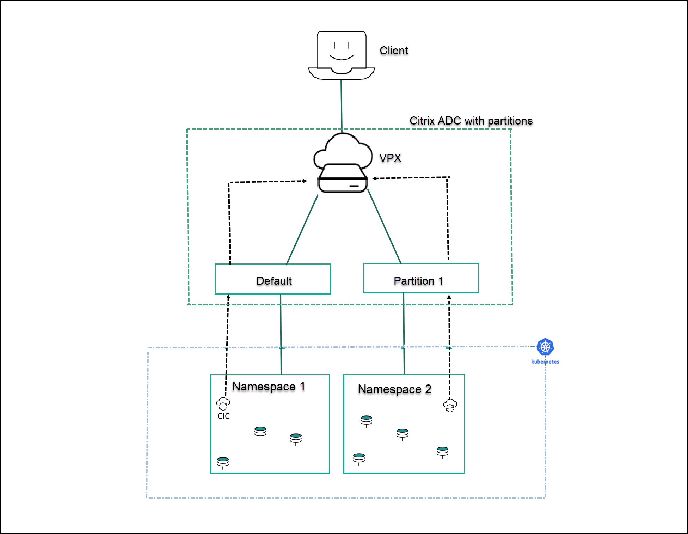

# Deploy the Citrix ingress controller for Citrix ADC with admin partitions

Citrix ingress controller is used to automatically configure one or more Citrix ADC based on the Ingress resource configuration. The ingress Citrix ADC appliance (MPX or VPX) can be partitioned into logical entities called admin partitions, where each partition can be configured and used as a separate Citrix ADC appliance. For more information, see [Admin Partition](https://docs.citrix.com/en-us/citrix-adc/13/admin-partition.html). Citrix ingress controller can also be deployed to configure Citrix ADC with admin partitions.

For Citrix ADC with admin partitions, you must deploy a single instance of Citrix ingress controller for each partition. And, the partition must be associated with a [partition user](https://docs.citrix.com/en-us/citrix-adc/13/admin-partition.html#user-access-and-roles) specific to the Citrix ingress controller instance.

## Prerequisites

Ensure that:

-  Admin partitions are configured on the Citrix ADC appliance. For instructions see, [Configure admin partitions](https://docs.citrix.com/en-us/citrix-adc/13/admin-partition/admin-partition-access-and-configure.html).
-  Create a partition user specifically for the Citrix ingress controller. Citrix ingress controller configures the Citrix ADC using this partition user account. Ensure that you do not associate this partition user to other partitions in the Citrix ADC appliance.

**Note:**
    For SSL-related use cases in the admin partition, ensure that you use Citrix ADC version 12.0–56.8 and above.

**To deploy the Citrix ingress controller for Citrix ADC with admin partitions:**

1.  Download the [citrix-k8s-ingress-controller.yaml](https://github.com/citrix/citrix-k8s-ingress-controller/blob/master/deployment/baremetal/citrix-k8s-ingress-controller.yaml) using the following command:

        wget  https://raw.githubusercontent.com/citrix/citrix-k8s-ingress-controller/master/deployment/baremetal/citrix-k8s-ingress-controller.yaml

1.  Edit the [citrix-k8s-ingress-controller.yaml](https://github.com/citrix/citrix-k8s-ingress-controller/blob/master/deployment/baremetal/citrix-k8s-ingress-controller.yaml) file and enter the values for the following environmental variables:

    | Environment Variable | Mandatory or Optional | Description |
    | ---------------------- | ---------------------- | ----------- |
    | NS_IP | Mandatory | The IP address of the Citrix ADC appliance. For more details, see [Prerequisites](#prerequisites). |
    | NS_USER and NS_PASSWORD | Mandatory | The user name and password of the partition user that you have created for the Citrix ingress controller. For more details, see [Prerequisites](#prerequisites). |
    | NS_VIP | Mandatory | Citrix ingress controller uses the IP address provided in this environment variable to configure a virtual IP address to the Citrix ADC that receives the Ingress traffic. **Note:** NS_VIP acts as a fallback when the [frontend-ip](https://github.com/citrix/citrix-k8s-ingress-controller/blob/master/docs/configure/annotations.md) annotation is not provided in Ingress YAML. Only Supported for Ingress.  |
    | NS_ENABLE_MONITORING | Mandatory | Set the value `Yes` to monitor Citrix ADC.  **Note:** Ensure that you disable Citrix ADC monitoring for Citrix ADC with admin partitions. Set the value to `No`. |
    | EULA | Mandatory | The End User License Agreement. Specify the value as `Yes`.|
    | Kubernetes_url | Optional | The kube-apiserver url that Citrix ingress controller uses to register the events. If the value is not specified, Citrix ingress controller uses the [internal kube-apiserver IP address](https://kubernetes.io/docs/tasks/access-application-cluster/access-cluster/#accessing-the-api-from-a-pod). |
    | LOGLEVEL | Optional | The log levels to control the logs generated by Citrix ingress controller. By default, the value is set to DEBUG. The supported values are: CRITICAL, ERROR, WARNING, INFO, and DEBUG. For more information, see [Log Levels](../configure/log-levels.md)|
    | NS_PROTOCOL and NS_PORT | Optional | Defines the protocol and port that must be used by the Citrix ingress controller to communicate with Citrix ADC. By default, the Citrix ingress controller uses HTTPS on port 443. You can also use HTTP on port 80. |
    | ingress-classes | Optional | If multiple ingress load balancers are used to load balance different ingress resources. You can use this environment variable to specify the Citrix ingress controller to configure Citrix ADC associated with a specific ingress class. For information on Ingress classes, see [Ingress class support](../configure/ingress-classes.md)|

1.  Once you update the environment variables, save the YAML file and deploy it using the following command:

        kubectl create -f citrix-k8s-ingress-controller.yaml

1.  Verify if the Citrix ingress controller is deployed successfully using the following command:

        kubectl get pods --all-namespaces

## Use case: How to securely deliver multitenant microservice-based applications using Citrix ADC admin partitions

You can isolate ingress traffic between different microservice based applications with the Citrix ADC admin partition using Citrix ingress controller. Citrix ADC admin partition enables multitenancy at the software level in a single Citrix ADC instance. Each partition has its own control plane and network plane.

You can deploy one instance of Citrix ingress controller in each namespace in a cluster.

For example, imagine you have two namespaces in a Kubernetes cluster and you want to isolate these namespaces from each other under two different admins. You can use the admin partition feature to separate these two namespaces. Create namespace 1 and namespace 2 and deploy Citrix ingress controller separately in both of these namespaces.

Citrix ingress controller instances provide configuration instructions to the respective Citrix ADC partitions using the system user account specified in the YAML manifest.

In this example, apache and guestbook sample applications are deployed in two different namespaces (namespace 1 and namespace 2 respectively) in a Kubernetes cluster. Both apache and guestbook application team wants to manage their workload independently and do not want to share resources. Citrix ADC admin partition helps to achieve multitenancy and in this example, two partitions (default, partition1) are used to manage both application workload separately.

The following prerequisites apply:

-  Ensure that you have configured admin partitions on the Citrix ADC appliance. For instructions see, [Configure admin partitions](https://docs.citrix.com/en-us/citrix-adc/13/admin-partition/admin-partition-access-and-configure.html).

-  Ensure that you create a partition user account specifically for the Citrix ingress controller. Citrix ingress controller configures the Citrix ADC using this partition user account. Ensure that you do not associate this partition user to other partitions in the Citrix ADC appliance.

### Example

The following example scenario shows how to deploy different applications within different namespaces in a Kubernetes cluster and how the request can be isolated from ADC using the admin partition.

In this example, two sample applications are deployed in two different namespaces in a Kubernetes cluster. In this example, it is used a default partition in Citrix ADC for the `apache` application and the admin partition `p1` for the `guestbook` application.

### Create namespaces

Create two namespaces `ns1` and `ns2` using the following commands:

        kubectl create namespace ns1
        kubectl create namespace ns2

### Configurations in namespace `ns1`

1. Deploy the `apache` application in `ns1`.

        apiVersion: v1
        kind: Namespace
        metadata:
          name: ns1

        ---
        apiVersion: apps/v1
        kind: Deployment
        metadata:
          labels:
            app: apache-ns1
          name: apache-ns1
          namespace: ns1
        spec:
          replicas: 2
          selector:
            matchLabels:
              app: apache-ns1
          template:
            metadata:
              labels:
                app: apache-ns1
            spec:
              containers:
              - image: httpd
                name: httpd
        ---

        apiVersion: v1
        kind: Service
        metadata:
          creationTimestamp: null
          labels:
            app: apache-ns1
          name: apache-ns1
          namespace: ns1
        spec:
          ports:
          - port: 80
            protocol: TCP
            targetPort: 80
          selector:
            app: apache-ns1

2. Deploy Citrix ingress controller in `ns1`.

   You can use the YAML file to deploy Citrix ingress controller or use the Helm chart.

   Ensure that you use the user credentials that is bind to the default partition.

        helm install cic-def-part-ns1 citrix/citrix-ingress-controller --set nsIP=<nsIP of ADC>,license.accept=yes,adcCredentialSecret=nslogin,ingressClass[0]=citrix-def-part-ns1 --namespace ns1

3. Deploy the Ingress resource.

        apiVersion: networking.k8s.io/v1
        kind: Ingress
        metadata:
          name: ingress-apache-ns1
          namespace: ns1
          annotations:
            kubernetes.io/ingress.class: "citrix-def-part-ns1"
            ingress.citrix.com/frontend-ip: "< ADC VIP IP >"
        spec:
          rules:
          - host: apache-ns1.com
            http:
              paths:
              - backend:
                  service:
                    name: apache-ns1
                    port:
                      number: 80
                pathType: Prefix
                path: /index.html

4. Citrix ingress controller in `ns1` configures the ADC entities in the default partition.

### Configurations in namespace `ns2`

1. Deploy `guestbook` application in `ns2`.

        apiVersion: v1
        kind: Namespace
        metadata:
          name: ns2
        ---
        apiVersion: v1
        kind: Service
        metadata:
          name: redis-master
          namespace: ns2
          labels:
            app: redis
            tier: backend
            role: master
        spec:
          ports:
          - port: 6379
            targetPort: 6379
          selector:
            app: redis
            tier: backend
            role: master
        ---
        apiVersion: apps/v1 #  for k8s versions before 1.9.0 use apps/v1beta2  and before 1.8.0 use extensions/v1beta1
        kind: Deployment
        metadata:
          name: redis-master
          namespace: ns2
        spec:
          selector:
            matchLabels:
              app: redis
              role: master
              tier: backend
          replicas: 1
          template:
            metadata:
              labels:
                app: redis
                role: master
                tier: backend
            spec:
              containers:
              - name: master
                image: k8s.gcr.io/redis:e2e  # or just image: redis
                resources:
                  requests:
                    cpu: 100m
                    memory: 100Mi
                ports:
                - containerPort: 6379
        ---
        apiVersion: v1
        kind: Service
        metadata:
          name: redis-slave
          namespace: ns2
          labels:
            app: redis
            tier: backend
            role: slave
        spec:
          ports:
          - port: 6379
          selector:
            app: redis
            tier: backend
            role: slave
        ---
        apiVersion: apps/v1 #  for k8s versions before 1.9.0 use apps/v1beta2  and before 1.8.0 use extensions/v1beta1
        kind: Deployment
        metadata:
          name: redis-slave
          namespace: ns2
        spec:
          selector:
            matchLabels:
              app: redis
              role: slave
              tier: backend
          replicas: 2
          template:
            metadata:
              labels:
                app: redis
                role: slave
                tier: backend
            spec:
              containers:
              - name: slave
                image: gcr.io/google_samples/gb-redisslave:v1
                resources:
                  requests:
                    cpu: 100m
                    memory: 100Mi
                env:
                - name: GET_HOSTS_FROM
                  value: dns
                  # If your cluster config does not include a dns service, then to
                  # instead access an environment variable to find the master
                  # service's host, comment out the 'value: dns' line above, and
                  # uncomment the line below:
                  # value: env
                ports:
                - containerPort: 6379
        ---
        apiVersion: v1
        kind: Service
        metadata:
          name: frontend
          namespace: ns2
          labels:
            app: guestbook
            tier: frontend
        spec:
          # if your cluster supports it, uncomment the following to automatically create
          # an external load-balanced IP for the frontend service.
          # type: LoadBalancer
          ports:
          - port: 80
          selector:
            app: guestbook
            tier: frontend
        ---
        apiVersion: apps/v1 #  for k8s versions before 1.9.0 use apps/v1beta2  and before 1.8.0 use extensions/v1beta1
        kind: Deployment
        metadata:
          name: frontend
          namespace: ns2
        spec:
          selector:
            matchLabels:
              app: guestbook
              tier: frontend
          replicas: 3
          template:
            metadata:
              labels:
                app: guestbook
                tier: frontend
            spec:
              containers:
              - name: php-redis
                image: gcr.io/google-samples/gb-frontend:v4
                resources:
                  requests:
                    cpu: 100m
                    memory: 100Mi
                env:
                - name: GET_HOSTS_FROM
                  value: dns
                  # If your cluster config does not include a dns service, then to
                  # instead access environment variables to find service host
                  # info, comment out the 'value: dns' line above, and uncomment the
                  # line below:
                  # value: env
                ports:
                - containerPort: 80

2. Deploy Citrix ingress controller in namespace `ns2`.

  Ensure that you use the user credentials that is bind to the partition `p1`.

    helm install cic-adm-part-p1 citrix/citrix-ingress-controller --set nsIP=<nsIP of ADC>,nsSNIPS='[<SNIPs in partition p1>]',license.accept=yes,adcCredentialSecret=admin-part-user-p1,ingressClass[0]=citrix-adm-part-ns2 --namespace ns2

3. Deploy ingress for the `guestbook` application.

        apiVersion: networking.k8s.io/v1
        kind: Ingress
        metadata:
          annotations:
          kubernetes.io/ingress.class: citrix-adm-part-ns2
          ingress.citrix.com/frontend-ip: "<VIP in partition 1>"
          name: guestbook-ingress
          namespace: ns2
        spec:
          rules:
          - host: www.guestbook.com
            http:
              paths:
              - backend:
                  service:
                    name: frontend
                    port:
                      number: 80
                path: /
                pathType: Prefix

4. Citrix ingress controller in `ns2` configures the ADC entities in partition `p1`.