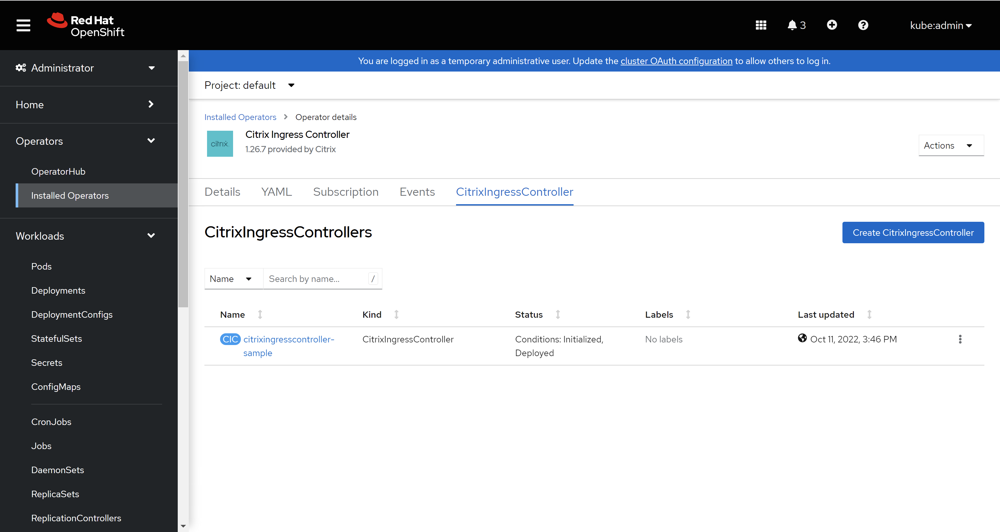
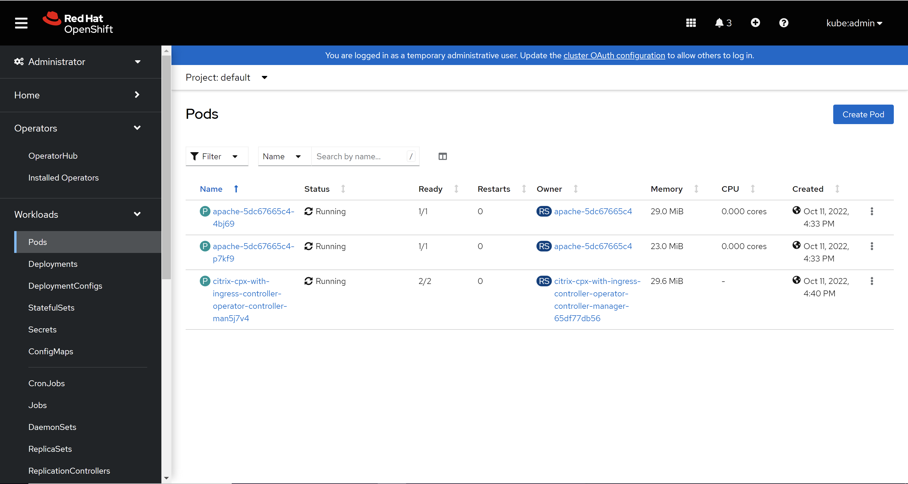
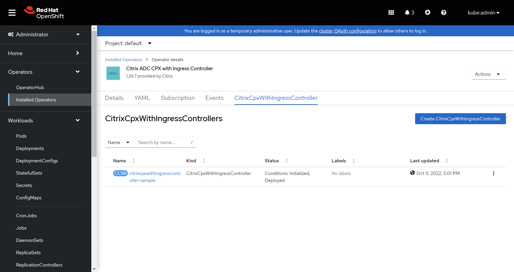
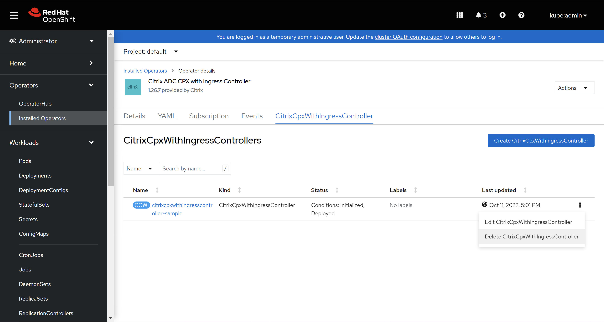
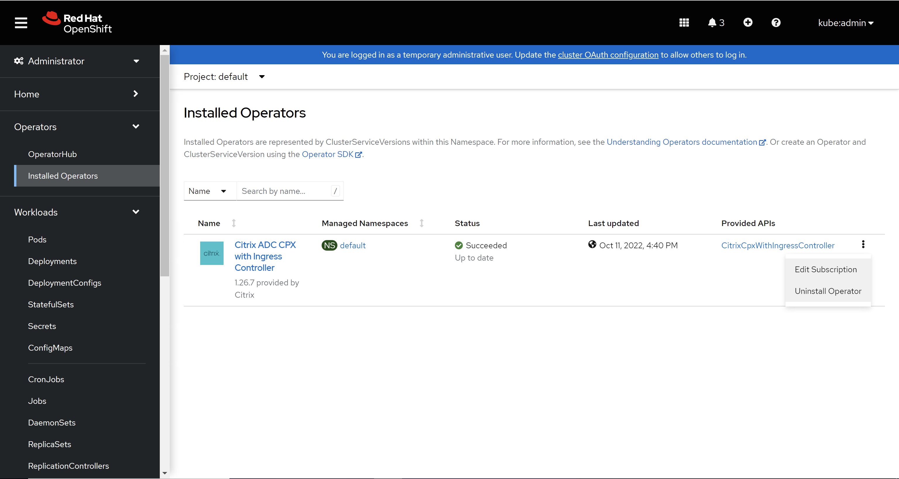

# Deploy the Citrix ingress controller using Red Hat OpenShift Operators

An Operator is an open source toolkit designed to package, deploy, and manage Kubernetes native applications in a more effective, automated, and scalable way.

This topic covers information on how to deploy the Citrix ingress controller using OpenShift Operators.

## Deployment options

Based on how you want to use Citrix ADC, there are two ways to deploy the Citrix ingress controller in an OpenShift cluster:

- As a standalone pod in the Kubernetes cluster: In this mode, you can control the Citrix ADC MPX or VPX appliance deployed outside the cluster.
- As a sidecar container alongside Citrix ADC CPX in the same pod: In this mode, Citrix ingress controller configures the Citrix ADC CPX.

## Deploy the Citrix ingress controller as a standalone pod in the OpenShift cluster for Citrix ADC MPX or VPX appliances

Using the Citrix ingress controller Operator you can deploy the Citrix ingress controller as a standalone pod in the OpenShift cluster. The Citrix Ingress controller configures the Citrix ADC VPX or MPX which is deployed as an Ingress or router for an application running in the OpenShift cluster. The following diagram explains the topology:


### Prerequisites

- Deployed [Red Hat OpenShift](https://www.openshift.com) version 4.1 or later.
- Determine the NS_IP IP address needed by the controller to communicate with the appliance. The IP address might be anyone of the following depending on the type of Citrix ADC deployment:
    - (Standalone appliances) NSIP - The management IP address of a standalone Citrix ADC appliance. For more information, see [IP Addressing in Citrix ADC](https://docs.citrix.com/en-us/citrix-adc/12-1/networking/ip-addressing.html)
    - (Appliances in High Availability mode) SNIP - The subnet IP address. For more information, see [IP Addressing in Citrix ADC](https://docs.citrix.com/en-us/citrix-adc/12-1/networking/ip-addressing.html)
    -  (Appliances in Clustered mode) CLIP - The cluster management IP (CLIP) address for a clustered Citrix ADC deployment. For more information, see [IP addressing for a cluster](https://docs.citrix.com/en-us/citrix-adc/12-1/clustering/cluster-overview/ip-addressing.html)
- The user name and password of the Citrix ADC VPX or MPX appliance used as the Ingress device. The Citrix ADC appliance must have a system user account (non-default) with certain privileges so that the Citrix ingress controller can configure the Citrix ADC VPX or MPX appliance. For instructions to create the system user account on Citrix ADC, see [Create System User Account for Citrix ingress controller in Citrix ADC](https://docs.citrix.com/en-us/citrix-k8s-ingress-controller/deploy/cic-yaml.html#create-system-user-account-for-citrix-ingress-controller-in-citrix-adc)

  You can directly pass the user name and password as environment variables to the controller, or use Kubernetes secrets (recommended). If you want to use Kubernetes secrets, create a secret for the user name and password using the following command:
  ```
  kubectl create secret  generic nslogin --from-literal=username='cic' --from-literal=password='mypassword'
  ```
        
#### Specify the allowed image registries to access by operators and pods

You must specify the image registries to which operators and pods should have access for pulling the images. You can specify the allowed list of registries by updating the `image.config.openshift.io/cluster` custom resource definition file. Ensure to bring up the Openshift cluster before updating the `image.config.openshift.io/cluster` custom resource definition.

To update the `image.config.openshift.io/cluster` custom resource definition, perform the following steps:

1. Run the following command:
   ```
   oc edit image.config.openshift.io/cluster
   ```

2. Edit the `spec` field such as follows:

        spec:
          registrySources:
            allowedRegistries:
            - quay.io
            - registry.redhat.io
            - registry.connect.redhat.com
            - registry.access.redhat.com
            - image-registry.openshift-image-registry.svc:5000

> **Note:**
>
> If your application needs to pull images from registries other than the ones specified here, you can add those registries.

> **Note:**
>
> The changes are applied to all the master and worker nodes and the node is in 'Not Ready' state for some time after updating the CRD. You must wait for all the nodes to be in 'Ready' state before proceeding to the next step. You can view the status of the nodes using the following command: 'oc get nodes'

### Deploy the Citrix ingress controller as a standalone pod using Operators

Perform the following:

1. Log on to OpenShift 4.x Cluster console.

2. Deploy an Apache application using the console. Perform the following:

    1. Navigate to **Workloads > Deployments > Create Deployment** and use the [apache.yaml](https://github.com/citrix/citrix-k8s-ingress-controller/blob/master/deployment/openshift/manifest/openshift-operator/apache.yaml) to create the deployment.

       
       > **NOTE:**
       > The Apache application is for the demonstration purpose only, you can modify the YAML file based on your requirement.

    2. Navigate to **Workloads > Pods** section and ensure that the Apache application pods are up and running.

       

3. Create a service for the Apache application. Navigate to **Networking > Services > Create Service** and use the [apache-service.yaml](https://github.com/citrix/citrix-k8s-ingress-controller/blob/master/deployment/openshift/manifest/openshift-operator/apache-service.yaml) to create the service.

   

4. Create an ingress for the apache application. Navigate to **Networking > Ingress > Create Ingress** and use the [apache-ingress-vpx.yaml](https://github.com/citrix/citrix-k8s-ingress-controller/blob/master/deployment/openshift/manifest/openshift-operator/apache-ingress-vpx.yaml) to create the ingress. Ensure that you update VIP of the Citrix ADC VPX in the ingress YAML before applying it in the cluster.

   

5. Navigate to **Operators > OperatorHub**, select **Certified** source from the left panel and then select the **Citrix Ingress Controller Operator**, and click **Install**.

   

   

   You have the following options to subscribe to the Citrix ingress Controller Operator:

   -  **All namespaces on the cluster (default)** - Allows the Citrix ingress controller operator to subscribe to every namespace present on the OpenShift cluster and hence allows you to initiate the Citrix ingress controller from any namespace on the cluster.
   -  **A specific namespace on the cluster** - Allows the Citrix ingress controller operator to subscribe to the selected namespace on the OpenShift cluster. You can initiate the Citrix ingress controller instance on the selected namespace only.

   For the demonstration purpose, you can subscribe the Citrix ingress controller operator to the default namespace.

   

   Wait until the Citrix ingress controller operator is subscribed successfully.

   

6. Navigate to **Workloads > Pods** section and verify that the **citrix-ingress-controller-operator** pod is up and running.

   

7. Navigate to **Operators > Installed Operators** and select the **Citrix ingress controller** operator.

   

8. Go to the **CitrixIngressController** tab, select **Create CitrixIngressController** option.

   

   The Citrix ingress controller YAML definition is displayed.

   

   Please see [this](https://github.com/citrix/citrix-helm-charts/tree/master/citrix-ingress-controller#configuration) table that lists the mandatory and optional parameters and their default values that you can configure during installation.
   Ensure that you set the `license.accept` parameter to `yes` and provided the IP address of the Citrix ADC VPX instance in the `nsIP` parameter and Kubernetes secret created using Citrix ADC VPX credentials in `adcCredentialSecret` parameter respectively for this exercise. You can choose other avaiable parameter as well depending upon you use-case.

   After you have updated the values of the required parameters, click **Create**. Ensure your Citrix Ingress Controller is succesfully deployed and initialised.

   

9. Navigate to **Workloads > Pods** section and ensure that the **citrix-ingress-controller** pod is up and running.

   

10. Verify the deployment by sending traffic as shown:
   ```
   curl http://citrix-ingress-operator.com --resolve citrix-ingress-operator.com:80:<VIP>
   ```
   The above `curl` command should return:
   <html><body><h1>It works!</h1></body></html>

#### Delete the Citrix ingress controller Operator.
1. Navigate to **Operators > Installed Operators > Citrix Ingress Controller** operator. Select **CitrixIngressController** tab inside. After that select the instance you want to delete and then select its **Delete CitrixIngressController** option.

   

2. Navigate to **Operators > Installed Operators** and select **Uninstall Operator** for **Citrix Ingress Controller** operator.

   


## Deploy the Citrix ingress controller as a sidecar with Citrix ADC CPX

Using the Citrix ingress controller Operator you can deploy a Citrix ADC CPX with the Citrix ingress controller as a sidecar. The Citrix Ingress controller configures the Citrix ADC CPX which is deployed as an Ingress or router for an application running in the OpenShift cluster. The following diagram explains the topology.


### Prerequisites

- Deployed [Red Hat Openshift](https://www.openshift.com) version 4.1 or later.
- Installed the [Prometheus Operator](https://github.com/coreos/prometheus-operator), if you want to view the metrics of the Citrix ADC CPX collected by the [Citrix ADC metrics exporter](https://github.com/citrix/citrix-k8s-ingress-controller/tree/master/metrics-visualizer#visualization-of-metrics).

### Deploy the Citrix ingress controller as a sidecar with Citrix ADC CPX using Operators

Perform the following:

1. Log on to OpenShift 4.x Cluster console.

2. Deploy an Apache application using the console. Perform the following:

    1. Navigate to **Workloads > Deployments > Create Deployment** and use the [apache.yaml](https://github.com/citrix/citrix-k8s-ingress-controller/blob/master/deployment/openshift/manifest/openshift-operator/apache.yaml) to create the deployment.

       
       > **NOTE:**
       > The Apache application is for the demonstration purpose only, you can modify the YAML file based on your requirement.

    2. Navigate to **Workloads > Pods** section and ensure that the Apache application pods are up and running.

       

3. Create a service for the Apache application. Navigate to **Networking > Services > Create Service** and use the [apache-service.yaml](https://github.com/citrix/citrix-k8s-ingress-controller/blob/master/deployment/openshift/manifest/openshift-operator/apache-service.yaml) to create the service.

   

4. Create an Ingress for the Apache application. Navigate to **Networking > Ingress > Create Ingress** and use the [apache-ingress-cpx.yaml](https://github.com/citrix/citrix-k8s-ingress-controller/blob/master/deployment/openshift/manifest/openshift-operator/apache-ingress-cpx.yaml) to create the ingress.

   

5. Navigate to **Operators > OperatorHub**, select the **Citrix ADC CPX with Ingress Controller Operator** and click **Install**.

   

   

   You have the following options to subscribe to the Citrix ingress Controller Operator:

   -  **All namespaces on the cluster (default)** - Allows the Citrix ADC CPX with ingress controller operator to subscribe to every namespace present on the OpenShift cluster and hence allows you to initiate the Citrix ADC CPX from any namespace on the cluster.
   -  **A specific namespace on the cluster** - Allows the Citrix ADC CPX with ingress controller operator to subscribe to the selected namespace on the OpenShift cluster. You can initiate the Citrix ADC CPX instance on the selected namespace only.

   For the demonstration purpose, you can subscribe the Citrix ADC CPX with ingress controller operator to the default namespace.

   

   Wait until the operator is subscribed successfully.

   

6. Navigate to **Workloads > Pods** section and verify that the **citrix-cpx-with-ingress-controller-operator** pod is up and running.

   

7. Navigate to **Operators > Installed Operators** and select the **Citrix ADC with Ingress Controller** operator.

   

8. Go to the **CitrixCpxWithIngressController** tab, select **Create CitrixCpxWithIngressController** option.

   

   The Citrix ADC with ingress controller YAML definition is displayed.

   

   Please see [this](https://github.com/citrix/citrix-helm-charts/tree/master/citrix-cpx-with-ingress-controller#configuration) table that lists the mandatory and optional parameters and their default values that you can configure during installation.
   Ensure that you set the `license.accept` parameter to `yes`. We will expose Citrix ADC CPX service using kind `nodePort` to access the Apache application. For this please set `serviceType.nodePort.enabled` to `true`. You can choose other avaiable parameter as well depending upon you use-case.

   After you have updated the values of the required parameters, click **Create**. Ensure your Citrix ADC CPX with Ingress Controller is succesfully deployed and initialised.

   

9. Please attach privileged security context constraints to the serviceaccount of Citrix ADC CPX as it runs as privileged pod by using following commands:
   1. Get the serviceaccount name used the Citrix ADC CPX using following command:
      ```
      oc get sa
      ```
  
   2. Attach privileged SCC to the serviceaccount of the Citrix ADC CPX:
      ```
      oc adm policy add-scc-to-user privileged -z <CPX-ServiceAccount-Name>
      ```

10. Navigate to **Workloads > Pods** section and ensure that the **citrix-cpx-with-ingress-controller** pod is up and running.

    

11. Verify the deployment by sending traffic. Perform the following:

    1. Obtain the NodePort details using the following command:
       ```
       oc get svc
       ```

    2. Use `cpx-service` NodePort and send the traffic as shown in the following command:
       ```
       curl http://citrix-ingress-operator.com:<NodePort> --resolve citrix-ingress-operator.com:<NodePort>:<Master-Node-IP>
       ```
       The above `curl` command should return:
       <html><body><h1>It works!</h1></body></html>

#### Delete the Citrix ADC CPX with ingress controller Operator.
1. Navigate to **Operators > Installed Operators > Citrix ADC CPX with Ingress Controller** operator. Select **CitrixCpxWithIngressController** tab inside. After that select the instance you want to delete and then select its **Delete CitrixCpxWithIngressController** option.

   

2. Navigate to **Operators > Installed Operators** and select **Uninstall Operator** for **Citrix Ingress Controller** operator.

   
