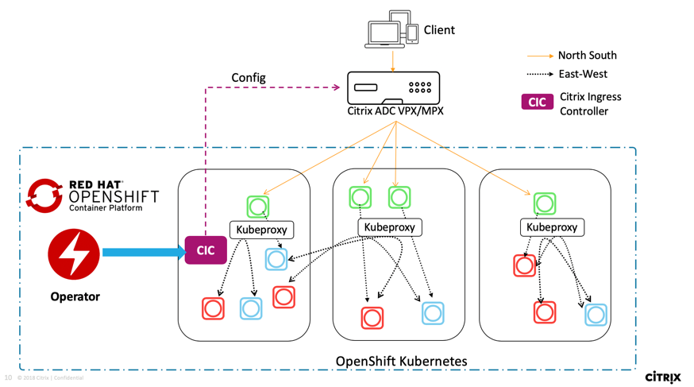

# Deploy the Citrix ingress controller using Red Hat OpenShift Operators

An Operator is an open source toolkit designed to package, deploy, and manage Kubernetes native applications in a more effective, automated, and scalable way.

This topic covers information on how to deploy the Citrix ingress controller using OpenShift Operators.

## Deployment options

Based on how you want to use Citrix ADC, there are two ways to deploy the Citrix ingress controller in an OpenShift cluster:

- As a standalone pod in the Kubernetes cluster: In this mode, you can control the Citrix ADC MPX or VPX appliance deployed outside the cluster.
- As a sidecar container alongside Citrix ADC CPX in the same pod: In this mode, Citrix ingress controller configures the Citrix ADC CPX.

## Deploy the Citrix ingress controller as a standalone pod in the OpenShift cluster for Citrix ADC MPX or VPX appliances

Using the Citrix ingress controller Operator you can deploy the Citrix ingress controller as a standalone pod in the OpenShift cluster. The Citrix Ingress controller configures the Citrix ADC VPX or MPX which is deployed as an Ingress or router for an application running in the OpenShift cluster. The following diagram explains the topology:

### Prerequisites

-  Deployed [Red Hat OpenShift](https://www.openshift.com) version 4.1 or later.
-  Determine the NS_IP IP address needed by the controller to communicate with the appliance. The IP address might be anyone of the following depending on the type of Citrix ADC deployment:
    -  (Standalone appliances) NSIP - The management IP address of a standalone Citrix ADC appliance. For more information, see [IP Addressing in Citrix ADC](https://docs.citrix.com/en-us/citrix-adc/12-1/networking/ip-addressing.html)
    -  (Appliances in High Availability mode) SNIP - The subnet IP address. For more information, see [IP Addressing in Citrix ADC](https://docs.citrix.com/en-us/citrix-adc/12-1/networking/ip-addressing.html)
    -  (Appliances in Clustered mode) CLIP - The cluster management IP (CLIP) address for a clustered Citrix ADC deployment. For more information, see [IP addressing for a cluster](https://docs.citrix.com/en-us/citrix-adc/12-1/clustering/cluster-overview/ip-addressing.html)
-  The user name and password of the Citrix ADC VPX or MPX appliance used as the Ingress device. The Citrix ADC appliance must have a system user account (non-default) with certain privileges so that the Citrix ingress controller can configure the Citrix ADC VPX or MPX appliance. For instructions to create the system user account on Citrix ADC, see [Create System User Account for Citrix ingress controller in Citrix ADC](#create-system-user-account-for-citrix-ingress-controller-in-citrix-adc)

    You can directly pass the user name and password as environment variables to the controller, or use Kubernetes secrets (recommended). If you want to use Kubernetes secrets, create a secret for the user name and password using the following command:

        kubectl create secret  generic nslogin --from-literal=username='cic' --from-literal=password='mypassword'

#### Create a system user account for the Citrix ingress controller in Citrix ADC

The Citrix ingress controller configures the Citrix ADC appliance (MPX or VPX) using a system user account of the Citrix ADC. The system user account should have certain privileges so that the Citrix ingress controller has permission to configure the following on the Citrix ADC:

-  Add, Delete, or View Content Switching (CS) virtual server
-  Configure CS policies and actions
-  Configure Load Balancing (LB) virtual server
-  Configure Service groups
-  Cofigure SSl certkeys
-  Configure routes
-  Configure user monitors
-  Add system file (for uploading SSL certkeys from Kubernetes)
-  Configure Virtual IP address (VIP)
-  Check the status of the Citrix ADC appliance

To create the system user account, perform the following:

1.  Log on to the Citrix ADC appliance. Perform the following:
    1.  Use an SSH client, such as PuTTy, to open an SSH connection to the Citrix ADC appliance.

    2.  Log on to the appliance by using the administrator credentials.

2.  Create the system user account using the following command:

        add system user <username> <password>

    For example:

        add system user cic mypassword

3.  Create a policy to provide required permissions to the system user account. Use the following command:

        add cmdpolicy cic-policy ALLOW "(^\S+\s+cs\s+\S+)|(^\S+\s+lb\s+\S+)|(^\S+\s+service\s+\S+)|(^\S+\s+servicegroup\s+\S+)|(^stat\s+system)|(^show\s+ha)|(^\S+\s+ssl\s+certKey)|(^\S+\s+ssl)|(^\S+\s+route)|(^\S+\s+monitor)|(^show\s+ns\s+ip)|(^\S+\s+system\s+file)|(^\S+\s+ns\s+feature)"

    !!! note "Note"
        The system user account would have the privileges based on the command policy that you define.

4.  Bind the policy to the system user account using the following command:

        bind system user cic cic-policy 0

### Deploy the Citrix ingress controller as a standalone pod using Operators

Perform the following:

1.  Log on to OpenShift 4.1 Cluster console.

1.  Deploy an Apache application using the console. Perform the following:

    1.  Navigate to **Workloads > Deployments > Create Deployment** and use the [apache.yaml](https://code.citrite.net/users/priyankash/repos/openshift-operators/raw/manifest/apache_deployment.yaml?at=refs%2Fheads%2Fmaster) to create the deployment.

        
        > **NOTE:**
        >The Apache application is for the demonstration purpose only, you can modify the YAML file based on your requirement.

    1.  Navigate to **Workloads > Pods** section and ensure that the Apache application pods are up and running.

        

1.  Create a service for the Apache application. Navigate to **Networking > Services > Create Service** and use the [apache_service.yaml](https://code.citrite.net/users/priyankash/repos/openshift-operators/raw/manifest/apache_service.yaml?at=refs%2Fheads%2Fmaster) to create the service.

    

1.  Create an ingress for the apache application. Navigate to **Networking > Ingress > Create Ingress** and use the [apache_ingress_vpx.yaml](https://code.citrite.net/users/priyankash/repos/openshift-operators/raw/manifest/apache_ingress_vpx.yaml?at=refs%2Fheads%2Fmaster) to create the ingress. Ensure that you update VIP of the Citrix ADC VPX in the ingress YAML before applying it in the cluster.

    

1.  Navigate to **Catalog > OperatorHUB**, select the **Citrix Ingress Controller Operator**, and click **Install**.

    

    

    You have the following options to subscribe to the Citrix ingress Controller Operator:

    -  **All namespaces on the cluster (default)** - Allows the Citrix ingress controller operator to subscribe to every namespace present on the OpenShift cluster and hence allows you to initiate the Citrix ingress controller from any namespace on the cluster.
    -  **A specific namespace on the cluster** - Allows the Citrix ingress controller operator to subscribe to the selected namespace on the OpenShift cluster. You can initiate the Citrix ingress controller instance on the selected namespace only.

    For the demonstration purpose, you can subscribe the Citrix ingress controller operator to the default namespace.

    

    Wait until the Citrix ingress controller operator is subscribed successfully.

    

2.  Navigate to **Workloads > Pods** section and verify that the `cic-operator` pod is up and running.

    

3.  Navigate to **Catalog > Installed Operators** and select the Citrix ingress controller operator.

    

4.  Click Citrix Ingress Controller and in the **Overview** tab, select **Create New** on the option to create the CRD for the Citrix ingress controller operator.

    

    The Citrix ingress controller YAML definition is displayed. 

    

     The following table lists the mandatory and optional parameters and their default values that you can configure also during installation. Ensure that you set the `license.accept` parameter to `yes`  and provide the IP address of the Citrix ADC VPX instance in the `nsIP` parameter. 

    | Parameters | Mandatory or Optional | Default value | Description |
    | --------- | --------------------- | ------------- | ----------- |
    | license.accept | Mandatory | no | Set `yes` to accept the Citrix ingress controller end user license agreement. |
    | cic.image | Mandatory | `quay.io/citrix/citrix-k8s-ingress-controller:1.2.0` | The Citrix ingress controller image. |
    | cic.pullPolicy | Mandatory | Always | The Citrix ingress controller image pull policy. |
    | loginFileName | Mandatory | nslogin | The secret key to log on to the Citrix ADC VPX or MPX. For information on how to create the secret keys, see [Prerequisites](#Prerequisites). |
    | nsIP | Mandatory | N/A | The IP address of the Citrix ADC device. For details, see [Prerequisites](#Prerequisites). |
    | nsVIP | Optional | N/A | The virtual IP address on the Citrix ADC device. |
    | nsPort | Optional | 443 | The port used by the Citrix ingress controller to communicate with Citrix ADC. You can port 80 for HTTP. |
    | nsProtocol | Optional | HTTPS | The protocol used by the Citrix ingress controller to communicate with Citrix ADC. You can also use HTTP on port 80. |
    | logLevel | Optional | DEBUG | The log level to control the logs generated by the Citrix ingress controller. The supported log levels are: CRITICAL, ERROR, WARNING, INFO, and DEBUG. For more information, see [Log Levels](https://developer-docs.citrix.com/projects/citrix-k8s-ingress-controller/en/latest/configure/log-levels/).|
    | kubernetesURL | Optional | N/A | The kube-apiserver url that the Citrix ingress controller uses to register the events. If the value is not specified, the Citrix ingress controller uses the [internal kube-apiserver IP address](https://kubernetes.io/docs/tasks/access-application-cluster/access-cluster/#accessing-the-api-from-a-pod). |
    | ingressClass | Optional | N/A | If multiple ingress load balancers are used to load balance different ingress resources. You can use this parameter to specify the Citrix ingress controller to configure Citrix ADC associated with specific ingress class. For more information on Ingress class, see [Ingress class support](https://developer-docs.citrix.com/projects/citrix-k8s-ingress-controller/en/latest/configure/ingress-classes/). |
    | nodeWatch | Optional | false | Use the argument if you want to automatically configure the network route from the Ingress Citrix ADC VPX or MPX to the pods in the Kubernetes cluster. For more information, see. Automatically configure a route on the Citrix ADC instance](https://developer-docs.citrix.com/projects/citrix-k8s-ingress-controller/en/latest/network/staticrouting/#automatically-configure-route-on-the-citrix-adc-instance). |
    | defaultSSLCert | Optional | N/A | Default SSL certificate that must be used as a non-SNI certificate in Citrix ADC. |
    | exporter.required | Optional | false | Use the argument, if you want to run the [Exporter for Citrix ADC Stats](https://github.com/citrix/citrix-adc-metrics-exporter) along with the Citrix ingress controller to pull metrics for the Citrix ADC VPX or MPX|
    | exporter.image    | Optional | `quay.io/citrix/citrix-adc-metrics-exporter:1.4.3` | The image of Exporter for Citrix ADC Stats. |
    | exporter.pullPolicy | Optional | Always | The pull policy for the Exporter for Citrix ADC Stats image. |
    | exporter.ports.containerPort | Optional | 8888 | The container port of the Exporter for Citrix ADC Stats. |
    | openshift | Optional | true | Set this argument if OpenShift environment is being used. |

    After you have updated the values of the required parameters, click **Create**.

5.  Navigate to **Workloads > Pods** section and ensure that the `citrix-ingress-controller` pod is up and running.

    

6.  Verify the deployment by sending traffic as shown:

        curl http://citrix-ingress-operator.com --resolve citrix-ingress-operator.com:80:<VIP>
	    <html><body><h1>It works!</h1></body></html>

## Deploy the Citrix ingress controller as a sidecar with Citrix ADC CPX

Using the Citrix ingress controller Operator you can deploy a Citrix ADC CPX with the Citrix ingress controller as a sidecar. The Citrix Ingress controller configures the Citrix ADC CPX which is deployed as an Ingress or router for an application running in the OpenShift cluster. The following diagram explains the topology.

### Prerequisites

-  Deployed [Red Hat Openshift](https://www.openshift.com) version 4.1 or later.
-  Installed the [Prometheus Operator](https://github.com/coreos/prometheus-operator), if you want to view the metrics of the Citrix ADC CPX collected by the [Citrix ADC metrics exporter](https://github.com/citrix/citrix-k8s-ingress-controller/tree/master/metrics-visualizer#visualization-of-metrics).

### Deploy the Citrix ingress controller as a sidecar with Citrix ADC CPX using Operators

Perform the following:

1.  Log on to OpenShift 4.1 Cluster console.

2.  Deploy an Apache application using the console. Perform the following:

    1.  Navigate to **Workloads > Deployments > Create Deployment** and use the [apache.yaml](https://code.citrite.net/users/priyankash/repos/openshift-operators/raw/manifest/apache_deployment.yaml?at=refs%2Fheads%2Fmaster) to create the deployment.

        
        > **NOTE:**
        >The Apache application is for the demonstration purpose only, you can modify the YAML file based on your requirement.

    2.  Navigate to **Workloads > Pods** section and ensure that the Apache application pods are up and running.

        

3.  Create a service for the Apache application. Navigate to **Networking > Services > Create Service** and use the [apache_service.yaml](https://code.citrite.net/users/priyankash/repos/openshift-operators/raw/manifest/apache_service.yaml?at=refs%2Fheads%2Fmaster) to create the service.

    

4.  Create an Ingress for the Apache application. Navigate to **Networking > Ingress > Create Ingress** and use the [apache_ingress_cpx.yaml](https://code.citrite.net/users/priyankash/repos/openshift-operators/raw/manifest/apache_ingress_cpx.yaml?at=refs%2Fheads%2Fmaster) to create the ingress.

    

5.  Navigate to **Catalog > OperatorHUB**, select the **Citrix ADC CPX with Ingress Controller Operator** and click **Install**.

    

    

    You have the following options to subscribe to the Citrix ingress Controller Operator:

    -  **All namespaces on the cluster (default)** - Allows the Citrix ingress controller operator to subscribe to every namespace present on the OpenShift cluster and hence allows you to initiate the Citrix ADC CPX from any namespace on the cluster.
    -  **A specific namespace on the cluster** - Allows the Citrix ingress controller operator to subscribe to the selected namespace on the OpenShift cluster. You can initiate the Citrix ADC CPX instance on the selected namespace only.

    For the demonstration purpose, you can subscribe the Citrix ingress controller operator to the default namespace.

    

    Wait until the operator is subscribed successfully.

    

6.  Navigate to **Workloads > Pods** section and verify that the `cic-operator` pod is up and running.

7.  Navigate to **Catalog > Installed Operators** and select the Citrix ingress controller operator.

    

8.  Click Citrix ADC CPX with Ingress Controller and in the **Overview** tab, select **Create New** on the option to create the CRD for the Citrix ADC CPX with the Ingress Controller operator.

    

    The Citrix ADC CPX with ingress controller YAML definition is displayed. 

    

    The following table lists the mandatory and optional parameters and their default values that you can configure during installation. Ensure that you set the `license.accept` parameter to `yes`.

    |Parameters | Mandatory or Optional | Default value | Description |
    | ---------- | --------------------- | ------------- | ----------- |
    | license.accept | Mandatory | no | Set `yes` to accept the Citrix ingress controller end user license agreement. |
    | cpx.image | Mandatory | `quay.io/citrix/citrix-k8s-cpx-ingress:13.0-36.29` | The Citrix ADC CPX image. |
    | cpx.pullPolicy | Mandatory | Always | The Citrix ADC CPX image pull policy. |
    | lsIP | Optional | N/A | Provide the Citrix Application Delivery Management (ADM) IP address to license Citrix ADC CPX. For more information, see [Licensing](https://developer-docs.citrix.com/projects/citrix-k8s-ingress-controller/en/latest/licensing/)|
    | lsPort | Optional | 27000 | Citrix ADM port if a non-default port is used. |
    | platform | Optional | N/A | Platform license. The platform is **CP1000**. |
    | cic.image | Mandatory | `quay.io/citrix/citrix-k8s-ingress-controller:1.2.0` | The Citrix ingress controller image. |
    | cic.pullPolicy | Mandatory | Always | The Citrix ingress controller image pull policy. |
    | cic.required | Optional | true | Specifies this parameter to run the Citrix ingress controller as a sidecar with Citrix ADC CPX |
    | defaultSSLCert | Optional | N/A | Default SSL certificate that must be used as a non-SNI certificate in Citrix ADC. |
    | exporter.required | Optional | false | Use the argument if you want to run the [Exporter for Citrix ADC Stats ](https://github.com/citrix/citrix-adc-metrics-exporter) along with the Citrix ingress controller to pull metrics for the Citrix ADC CPX|
    | exporter.image | Optional | `quay.io/citrix/citrix-adc-metrics-exporter:1.4.3` | The image for the Exporter for Citrix ADC Stats. |
    | exporter.pullPolicy | Optional | Always | The image pull policy for the Exporter for Citrix ADC Stats  |
    | exporter.ports.containerPort | Optional | 8888 | The container port of Exporter for the Citrix ADC Stats. |
    | ingressClass | Optional | N/A | If multiple ingress load balancers are used to load balance different ingress resources. You can use this parameter to specify the Citrix ingress controller to configure Citrix ADC associated with specific ingress class.|
    | openshift | Optional | true | Set this argument if OpenShift environment is being used. |

    After you have updated the values of the required parameters, click **Create**.

9.  Navigate to **Workloads > Pods** section and ensure that the `cpx-ingress` pod is up and running.

    

10. Verify the deployment by sending traffic. Perform the following:

    1.  Obtain the NodePort details using the following command:

            oc get svc

    2.  Use `cpx-service` NodePort and send the traffic as shown in the following command:

            curl http://citrix-ingress-operator.com:<NodePort> --resolve citrix-ingress-operator.com:<NodePort>:<Master-Node-IP>
            <html><body><h1>It works!</h1></body></html>
