# Deploy Citrix ADC VPX in active-active high availability in EKS environment using Amazon ELB and Citrix ingress controller

The topic covers a solution to deploy Citrix ADC VPX in active-active high availability mode on multiple availability zones in AWS Elastic Container Service (EKS) platform. The solution combines AWS Elastic load balancing (ELB) and Citrix ADC VPX to load balance the Ingress traffic to the microservices deployed in EKS cluster. AWS ELB handles the Layer 4 traffic and the Citrix ADC VPXs provides advanced Layer 7 functionalities such as, advanced load balancing, caching, and content-based routing.

## Solution overview

A basic architecture of an EKS cluster would include three public subnet and three private subnets deployed across three availability zones as shown in the following diagram:

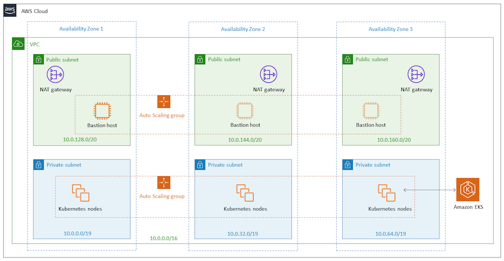

With the solution, the architecture of the EKS cluster would be as shown in the following diagram:

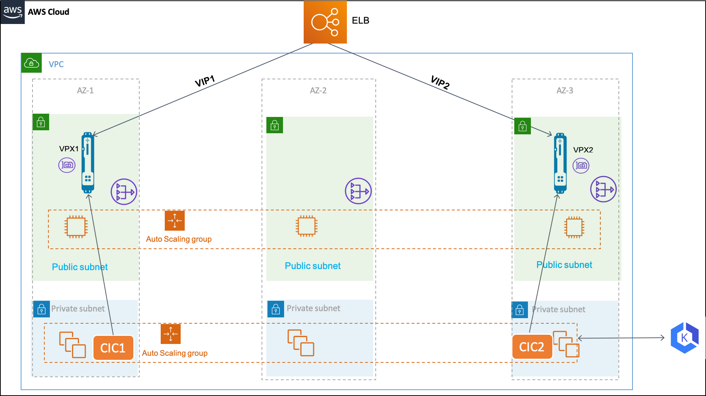

In the AWS cloud, AWS [Elastic Load Balancing](https://docs.aws.amazon.com/elasticloadbalancing/latest/userguide/what-is-load-balancing.html) handles the Layer 4 TCP connections and load balances the traffic using a flow hash routing algorithm. The ELB can be either Network Load Balancer or a Classic Load Balancer.

AWS ELB listens for incoming connections as defined by its listeners. Each listener forwards a new connection to one of the available Citrix ADC VPX instances. The Citrix ADC VPX instance load balances the traffic to the EKS pods. It also performs other Layer 7 functionalities such as, rewrite policy, responder policy, SSL offloading and so on provided by Citrix ADC VPX.

A Citrix ingress controller is deployed in the EKS cluster for each Citrix ADC VPX instance. The Citrix ingress controllers are configured with the same ingress class. And, it configures the Ingress objects in the EKS cluster on the respective Citrix ADC VPX instances.

AWS Elastic Load Balancing (ELB) has a DNS name to which an IP address is assigned dynamically. The DNS name can be added as Alias A record for your domain in [Route53](https://aws.amazon.com/route53/) to access the application hosted in the EKS cluster.

## Deployment process

Perform the following to deploy the solution:

1.  [Deploy Citrix ADC VPX Instances](#deploy-citrix-adc-vpx-instances).

1.  [Deploy Citrix ingress controller](#deploy-citrix-ingress-controller).

1.  [Set up Amazon Elastic Load Balancing](#setup-elastic-load-balancing). You can either set up [Network Load Balancer](#set-up-network-load-balancer) or [Classic Load Balancer](#set-up-classic-load-balancer).

1.  [Verify the solution](#verify-the-solution).

### Deploy Citrix ADC VPX instances

Citrix ADC VPX is available as [CloudFormation Template](cloud-formation-template.md). The CloudFormation template deploys an instance of Citrix ADC VPX with single ENI on a given subnet. It also configures the [NSIP](https://docs.citrix.com/en-us/netscaler/12/networking/ip-addressing/configuring-netscaler-owned-ip-addresses/configuring-netscaler-ip-address.html), [VIP](https://docs.citrix.com/en-us/netscaler/12/networking/ip-addressing/configuring-netscaler-owned-ip-addresses/configuring-and-managing-virtual-ip-addresses-vips.html), and [SNIP](https://docs.citrix.com/en-us/netscaler/12/networking/ip-addressing/configuring-netscaler-owned-ip-addresses/configuring-subnet-ip-addresses-snips.html) for the Citrix ADC VPX instance.

For this solution you need to deploy two instances of Citrix ADC VPX. Deploy the Citrix ADC VPX instances on two availability zones by specifying the same Citrix ADC VPX and different public subnet.

After you deploy the Citrix ADC VPX instances, you can verify the deployment by reviewing the output of the CloudFormation template as shown in the following screenshot. The output must show the various IP addresses (VIP, SNIP, and NSIP) configured for the Citrix VPX instances:

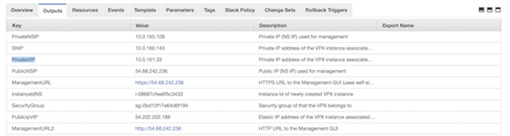

> **Note:**
> The CloudFormation template deploys the Citrix ADC VPX instance with primary IP address of the Citrix ADC VPX EC2 instance as VIP and secondary IP address as management IP address.

After the Citrix ADC VPX instances are successfully deployed, you must edit the security groups to allow traffic from EKS node group security group. Also, you must change the EKS node group security group to allow traffic from VPX instances.

### Deploy Citrix ingress controller

Deploy separate instance of Citrix ingress controller for each Citrix ADC VPX instance. Follow the [deployment instructions](deploy-cic-yaml.md) to deploy Citrix ingress controller.

After the Citrix ADC VPX instance is up, you must set up a system user account on the Citrix ADC VPX instances. The system user account is used by Citrix ingress controller to log into the Citrix ADC VPX instances. For instruction to set up the system user account, see [Create System User Account for CIC in Citrix ADC](deploy-cic-yaml.md#create-system-user-account-for-citrix-ingress-controller-in-citrix-adc).

1.  Edit the Citrix ingress controller deployment YAML ([citrix-ingress-controller.yaml](/deployment/aws/manifest/citrix-ingress-controller.yaml)).

    Replace `NS_IP` with the `Private NSIP` address of the respective Citrix ADC VPX instance. Also, provide the system user account user name and password that you have created on the Citrix ADC VPX instance. Once you edited the citrix-ingress-controller.yaml file, deploy the updated YAML file using the following command:

        kubectl apply -f citrix-ingress-controller .yaml

1.  Perform Step 1 on the second Citrix ingress controller instance.

1.  Ensure that both the pods are UP and running. Also, verify if Citrix ingress controller is able to connect to the respective Citrix ADC VPX instance using the logs:

        kubectl logs <cic_pod_name>

After the Citrix ingress controller pods are deployed and running in the EKS cluster. Any, Kubernetes Ingress resource configured with `citrix` ingress class is automatically configured on both the Citrix ADC VPX instances.

### Setup elastic load balancing

Depending upon your requirement you can configure any of the following load balancers:

-  Network Load Balancers
-  Classic Load Balancers

#### Set up network load balancer

Network Load Balancer (NLB) is a good option for handling TCP connection load balancing. In this solution, NLB is used to accept the incoming traffic and route it to one of the Citrix ADC VPX instances. NLB load balances using the flow hash algorithm based on the protocol, source IP address, source port, destination IP address, destination port, and TCP sequence number.

To set up NLB:

1.  Log on to the [AWS Management Console for EC2](https://console.aws.amazon.com/ec2/).

1.  In the left navigation bar, click **Target Group**. Create two different target groups. One target group (***Target-Group-80***) for routing traffic on port 80 and the other target group (***Target-Group-443***) for routing traffic on 443 respectively.

    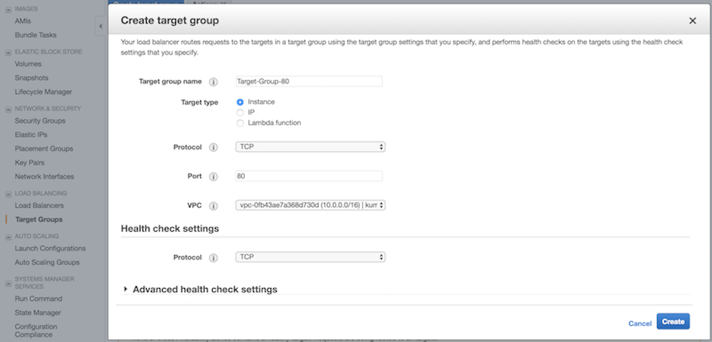

1.  Create a target group named, ***Target-Group-80**. Perform the following:

    1.  In the **Target group name** field, enter the target group name as ***Target-Group-80***.
    1.  In the **Target type** field, select Instance.
    1.  From the **Protocol** list, select **TCP**.
    1.  In the **Port** field, enter **80**.
    1.  From the **VCP** list, select you VPC where you deployed your EKS cluster.
    1.  In the **Health check settings** section, use TCP for health check.
    1.  Optional. You can modify the **Advance health check settings** to configure health checks.

        

1.  Create a target group named, ***Target-Group-443**. Perform the following:

    1.  In the **Target group name** field, enter the target group name as ***Target-Group-443***.
    2.  In the **Target type** field, select Instance.
    3.  From the **Protocol** list, select **TCP**.
    4.  In the **Port** field, enter **443**.
    5.  From the **VCP** list, select you VPC where you deployed your EKS cluster.
    6.  In the **Health check settings** section, use TCP for health check.
    7.  Optional. You can modify the **Advance health check settings** to configure health checks.

        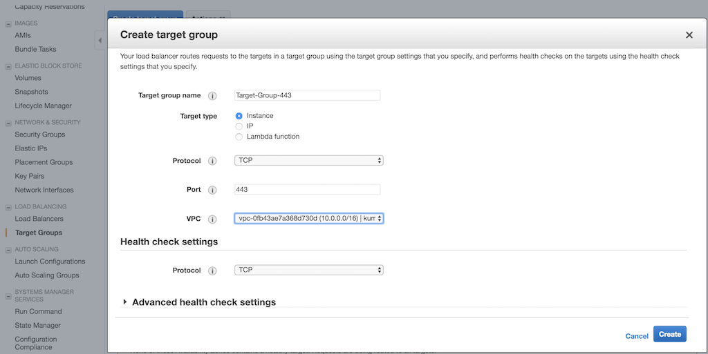

1.  Once you have created the target groups, you must register the target instances.
    1.  Select the created target group in the list page, click the **Target** tab, and select **edit**.
    2.  In the **Instances** tab, select the two Citrix ADC VPX instances and click **Add to registered**.

1.  Repeat **Step 5** for the other target group that you have created.

1.  Create Network Load Balancer.

    1.  In the left navigation bar, select **Load Balancers**, then click **Create Load Balancer**.
    2.  In the Select load balancer type window, click **Create** in the Network Load balancer panel.

        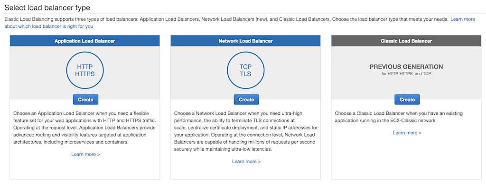

1.  In the **Configure Load Balancer** page, do the following:
    1.  In the **Name** field, enter a name for the load balancer.
    2.  In the Scheme field, select **internet-facing**.
    3.  In the Listeners section, click **Add listener** and add two entries with `TCP` as the load balancer protocol and `80` and `443` as the load balancer port respectively as shown in the following image:

        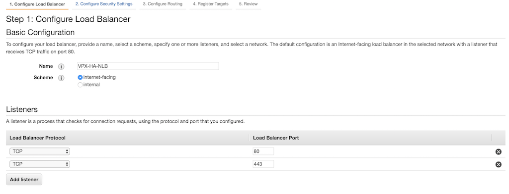

    4.  In the Availability Zones section, select the VPC, availability zones, and subnets where the Citrix ADC VPX instances are deployed.

        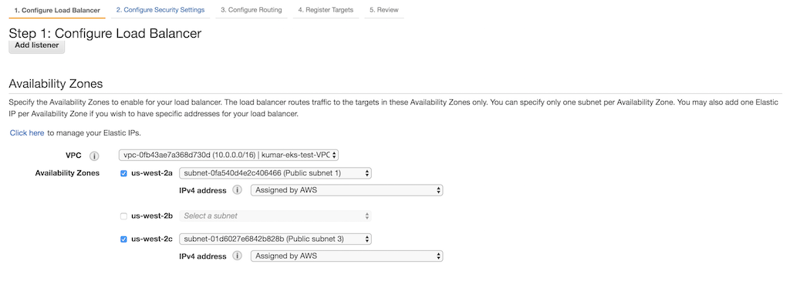

1.  In the **Configure routing** page. do the following:
    1.  In the **Target group** list, click **Existing target group**.
    2.  In the **Name** field, enter **Target-Group-80**.
    3.  In the **Target type** field, select **Instance**.
    4.  In the **Protocol** list, select **TCP**.
    5.  In the **Port** field, enter **80**.
    6.  Select **TCP** from the **Protocol** list in the **Health checks** section as shown in the following image:

        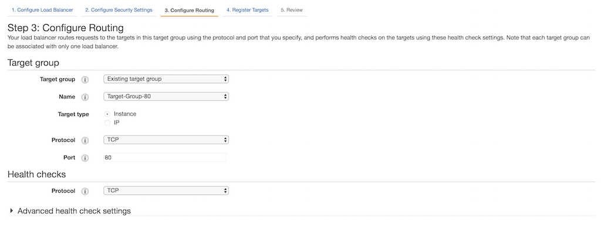

1.  In the **Review** page, review your configuration and click **Create**.

    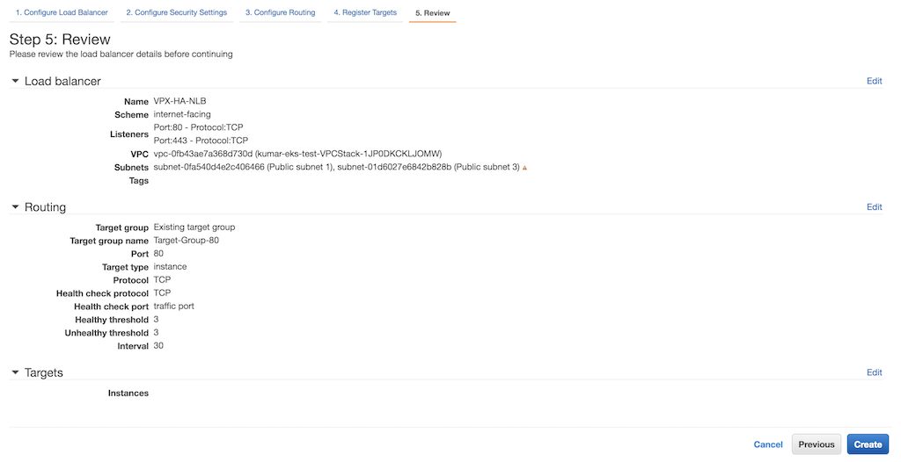

1.  After the Network load balancer is created, select the load balancer that you have created for the list page. Select **Listeners** tab, select **TCP : 444** and then click **Edit**.

     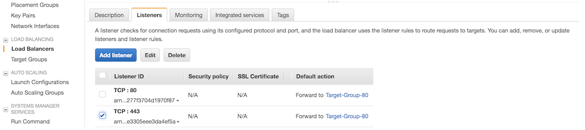

1.  In the **Listeners** page, delete the default action and then select **Target-Group-443** in the **Forward to** list.

     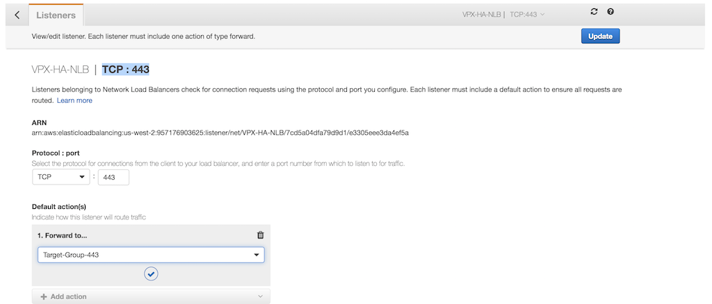

1.  Click **Update**.

#### Set up classic load balancer

Alternative to Amazon Network load balancer, you can set up Classic Load Balancer (CLB) as Tier 1 TCP load balancer.

1.  Log on to the [AWS Management Console for EC2](https://console.aws.amazon.com/ec2/).

1.  In the left navigation bar, select **Load Balancers**, then click **Create Load Balancer**.

    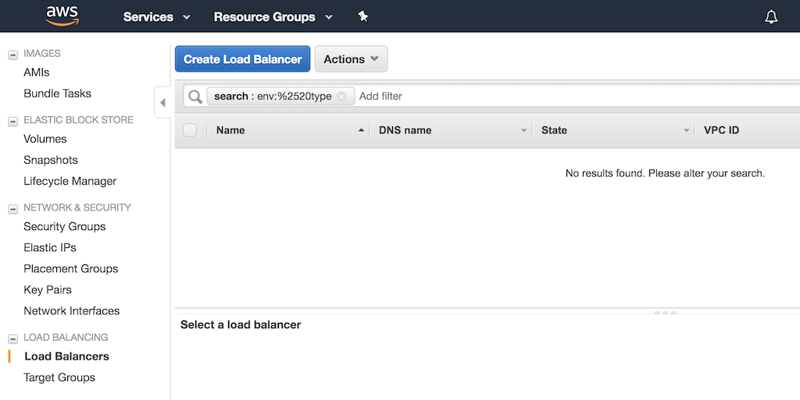

1.  In the **Select load balancer type** window, click **Create** on the Classic Load balancer panel.

    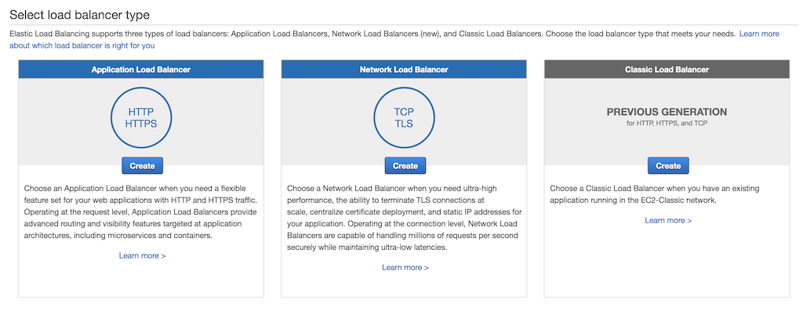

1.  In the **Define Load Balancer** page, do the following:

    1.  In the **Load Balancer name** field, enter a name for the load balancer.
    
    1.  In the **Create LB Inside** list, select your Citrix ADC VPX.
    
    1.   In the **Listener Configuration** section, click **Add** and add two entries with `TCP` as the load balancer protocol and `80` and `443` as the load balancer port respectively. Also, select `TCP` as instance protocol and `80` and `443` as the instance port respectively as shown in the following image:

         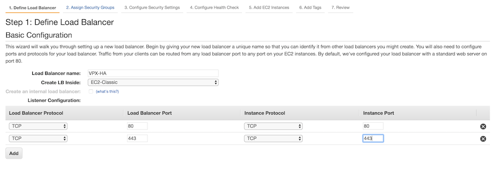

     1.  In the **Select Subnets** section, select two public subnets in two different availability zones for the Classic Load balancer to route the traffic. These subnets are same as where you have deployed the Citrix ADC VPX instances.

          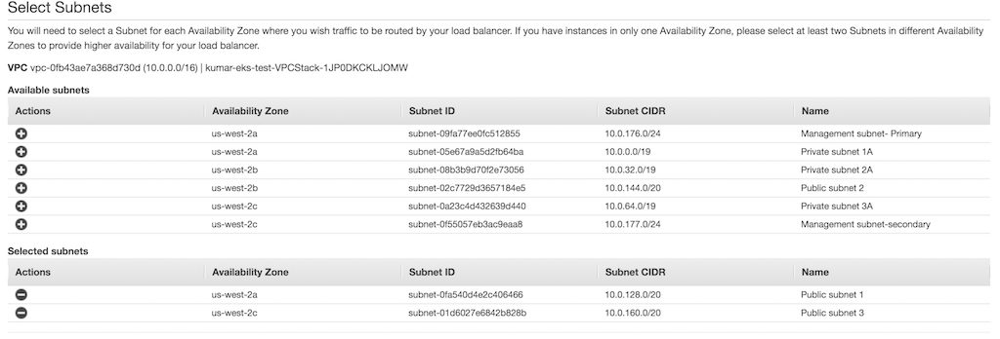

      1.  In the **Assign Security Groups** page, select a security group for the ELB instance. The security group can be same as the security group attached to Citrix ADC VPX ENI or it can be a new security group. 
          If you are using a new security group, make sure that you allow traffic to the Citrix ADC VPX security group from the ELB security group and conversely.

          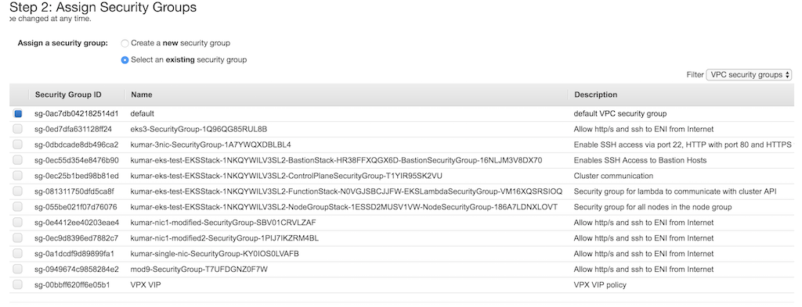

      1.  In the **Configure Health Check** page, select the configuration for the health check. By default health check is set as `TCP` on port `80`, optionally you can do the health check on port `443` as well.

           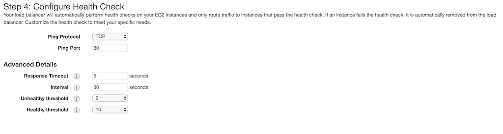

       1.  In the **Add EC2 Instances** page, select two Citrix ADC VPX instances that were deployed earlier.

            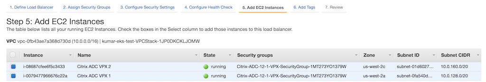

       1. In the Add Tags page, add tags as per your requirement.

       1. In the Review page, review your configurations.

       1.  Click **Create**.

### Verify the solution

After you have successfully deployed Citrix ADC VPX, AWS ELB, and Citrix ingress controller, you can verify the solution using a sample service.

Perform the following:

1.  Deploy a sample service and ingress using [app.yaml](/deployment/aws/manifest/app.yaml).

        kubectl apply -f app.yaml

1.  Log on to the Citrix ADC VPX instance and verify if the Content Switching vserver are successfully configured on both the Citrix ADC VPX instance. Do the following:

    1.  Log on to the Citrix ADC VPX instance. Perform the following:
        1.  Use an SSH client, such as PuTTy, to open an SSH connection to the Citrix ADC VPX instance.

        1.  Log on to the instance by using the administrator credentials.
    1.  Verify if the Content Switching (cs) vserver is configured on the instance using the following command:
   
                sh cs vserver

        **Output:**

               1)	k8s-10.0.139.87:80:http (10.0.139.87:80) - HTTP	Type: CONTENT
                        State: UP
                        Last state change was at Fri Apr 12 14:24:13 2019
                        Time since last state change: 3 days, 03:09:18.920
                        Client Idle Timeout: 180 sec
                        Down state flush: ENABLED
                        Disable Primary Vserver On Down : DISABLED
                        Comment: uid=NNJRYQ54VM2KWCXOERK6HRJHR4VEQYRI7U3W4BNFQLTIAENMTHWA====
                        Appflow logging: ENABLED
                        Port Rewrite : DISABLED
                        State Update: DISABLED
                        Default: 	Content Precedence: RULE
                        Vserver IP and Port insertion: OFF
                        L2Conn: OFF	Case Sensitivity: ON
                        Authentication: OFF
                        401 Based Authentication: OFF
                        Push: DISABLED	Push VServer:
                        Push Label Rule: none
                        Listen Policy: NONE
                        IcmpResponse: PASSIVE
                        RHIstate:  PASSIVE
                        Traffic Domain: 0 
    1.  Access the application `test.example.com` using the DNS name of the ELB instance.

                # curl -H 'Host: test.example.com' <DNS name of the ELB>

        **Example:**

                % curl -H 'Host: test.example.com' http://VPX-HA-829787521.us-west-2.elb.amazonaws.com

    1. To delete the deployment, use the following command:

                kubectl delete -f app.yaml

## Troubleshooting

| **Problem** | **Resolution** |
| ----------- | -------------- |
| CloudFormation stack failure | -  Ensure that the IAM user or role has sufficient privilege to create EC2 instances and Lambda configurations.    -  Ensure that you haven't exceeded the resource quota. |
| Citrix ingress controller unable to communicate with the Citrix ADC VPX instances. | - Ensure that user name and password is correct in `citrix-ingress-controller.yaml` file.    -  Ensure that the Citrix ADC VPX security group allows the traffic on port `80` and `443` from the EKS node group security group. |
| The services are DOWN in the Citrix ADC VPX instances. | Ensure that the Citrix ADC VPX traffic can reach the EKS cluster. Modify the security group of EKS node group to allow traffic from Citrix ADC VPX security group.|
| Traffic not routing to Citrix ADC VPX instance from ELB. | Ensure that security group of Citrix ADC VPX allows traffic from the ELB security group. |

