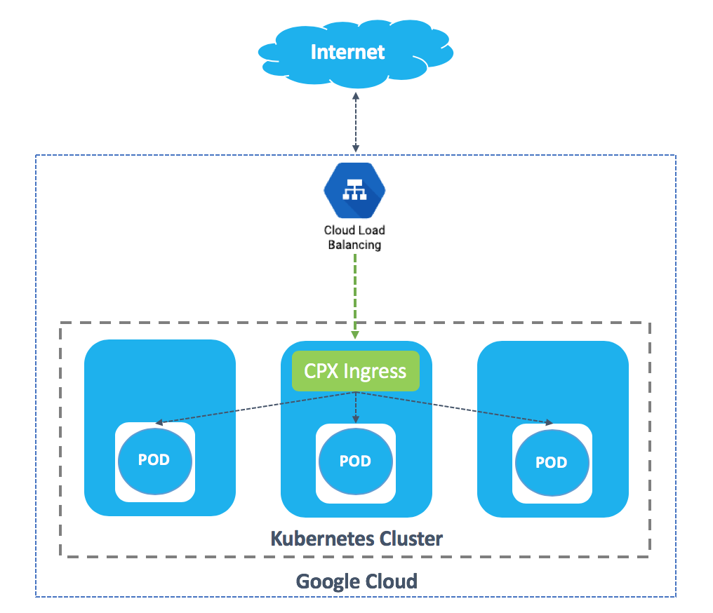
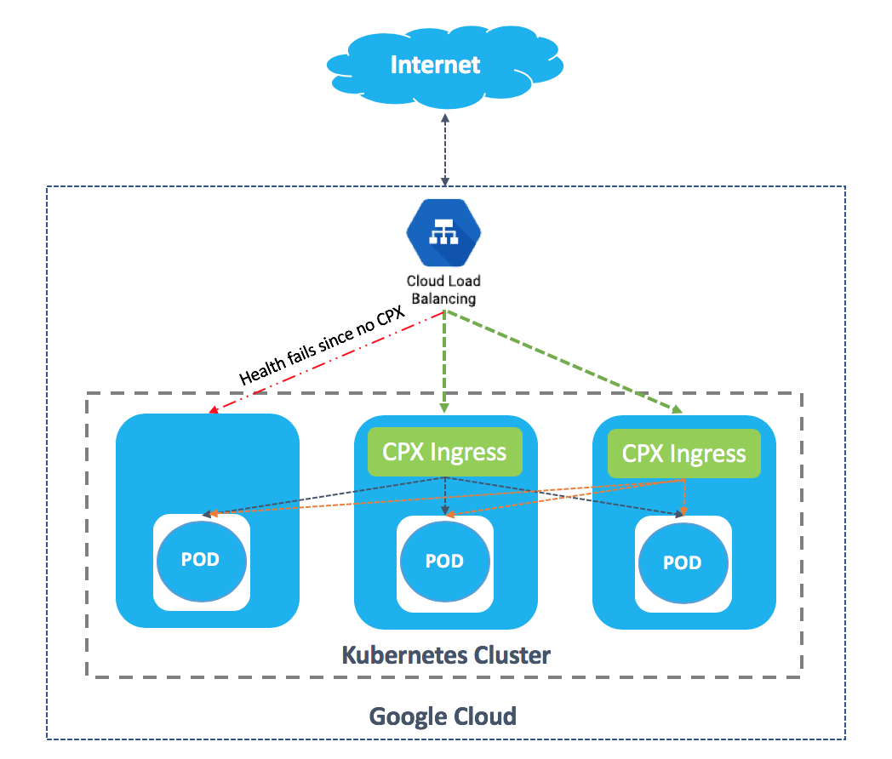
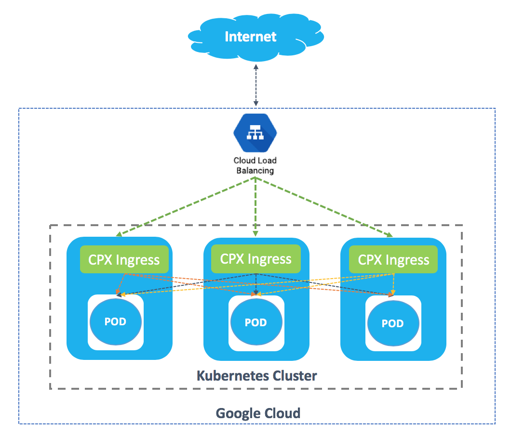

# Deploy Citrix ADC CPX as an Ingress device in Google Cloud Platform

This section explains how to deploy Citrix ADC CPX as an ingress device in [Google Kubernetes Engine (GKE)](https://cloud.google.com/kubernetes-engine/) and [Google Compute Engine (GCE)](https://cloud.google.com/compute/) clusters. The procedure to deploy the Citrix ADC CPX is the same for both Google Kubernetes Engine (GKE) and Google Compute Engine (GCE). However, if you configure Kubernetes on Google Compute Engine (GCE), then you need to deploy the CNI plug-in for the Kubernetes cluster.

## Prerequisites

You should complete the following tasks before performing the steps in the procedure.

-  Ensure that you have a Kubernetes Cluster up and running.

-  If you are running your cluster in GKE, ensure that you have configured a cluster-admin role binding.

You can use the following command to configure cluster-admin role binding.

    kubectl create clusterrolebinding citrix-cluster-admin --clusterrole=cluster-admin --user=<email-id of your google account>

You can get your Google account details using the following command.

    gcloud info | grep Account

## Deploy Citrix ADC CPX as an ingress device in Google Cloud Platform

1.  Deploy the required application in your Kubernetes cluster and expose it as a service in your cluster using the following command.

        kubectl create -f https://raw.githubusercontent.com/citrix/citrix-k8s-ingress-controller/master/deployment/gcp/manifest/apache.yaml
  
    !!! note "Note"
        In this example, ``apache.yaml`` is used. You should use the specific YAML file for your application.

1.  Deploy Citrix ADC CPX as an ingress device in the cluster using the following command.

        kubectl create -f https://raw.githubusercontent.com/citrix/citrix-k8s-ingress-controller/master/deployment/gcp/manifest/standalone_cpx.yaml

1.  Create the ingress resource using the following command.

        kubectl create -f https://raw.githubusercontent.com/citrix/citrix-k8s-ingress-controller/master/deployment/gcp/manifest/cpx_ingress.yaml

1.  Create a service of type LoadBalancer for accessing the Citrix ADC CPX by using the following command.

        kubectl create -f https://raw.githubusercontent.com/citrix/citrix-k8s-ingress-controller/master/deployment/gcp/manifest/cpx_service.yaml

    !!! note "Note"
        This command creates a load balancer with an external IP for receiving traffic.

1.  Verify the service and check whether the load balancer has created an external IP. Wait for some time if the external IP is not created.

        kubectl  get svc

    |NAME | TYPE | CLUSTER-IP | EXTERNAL-IP | PORT(S) | AGE |
    | --- | ---| ----| ----| ----| ----|
    |apache | ClusterIP |10.7.248.216 |none |  80/TCP | 2m |
    |cpx-ingress |LoadBalancer | 10.7.241.6 |  pending | 80:32258/TCP,443:32084/TCP | 2m|
    |kubernetes |ClusterIP |10.7.240.1 |none | 443/TCP | 22h|

1.  Once the external IP for the load-balancer is available as follows, you can access your resources using the external IP for the load balancer.

        kubectl  get svc

    |Name | Type | Cluster-IP | External IP| Port(s) | Age |
    |-----| -----| -------| -----| -----| ----|
    |apache| ClusterIP|10.7.248.216|none|80/TCP |3m|
    |cpx-ingress|LoadBalancer|10.7.241.6|EXTERNAL-IP CREATED|80:32258/TCP,443:32084/TCP|3m|
    |kubernetes| ClusterIP| 10.7.240.1|none|443/TCP|22h|`

    !!! note "Note"
        The health check for the cloud load-balancer is obtained from the readinessProbe configured in the [Citrix ADC CPX deployment YAML](https://github.com/citrix/citrix-k8s-ingress-controller/blob/master/deployment/azure/manifest/cpx_service.yaml) file. If the health check fails, you should check the readinessProbe configured for Citrix ADC CPX.
        For more information, see [readinessProbe](https://kubernetes.io/docs/tasks/configure-pod-container/configure-liveness-readiness-probes/#define-readiness-probes) and [external Load balancer](https://kubernetes.io/docs/tasks/access-application-cluster/create-external-load-balancer/).

1.  Access the application using the following command.

        curl http://<External-ip-of-loadbalancer>/ -H 'Host: citrix-ingress.com'

## Deployment models

You can use the following deployment solutions for deploying CPX as an ingress device in Google Cloud.

-  Standalone Citrix ADC CPX deployment
-  High availability Citrix ADC CPX deployment
-  Citrix ADC CPX per node deployment

!!! note "Note"
    For the ease of deployment, the deployment models in this section are explained with an all-in-one manifest file that combines the steps explained in the previous section. You can modify the manifest file to suit your application and configuration.

### Deploy a standalone Citrix ADC CPX as the Ingress device

To deploy Citrix ADC CPX as an Ingress in a standalone deployment model in GCP, you should use the Service Type as LoadBalancer. This step creates a load balancer in the Google cloud.

1.  Deploy a Citrix ADC CPX ingress with in built Citrix Ingress Controller in your Kubernetes cluster using the following command.

        kubectl create -f https://raw.githubusercontent.com/citrix/citrix-k8s-ingress-controller/master/deployment/gcp/manifest/all-in-one.yaml

1.  Access the application using the following command.

        curl http://<External-ip-of-loadbalancer>/ -H 'Host: citrix-ingress.com'

    !!! note "Note"
        To delete the deployment, use the following command:

            kubectl delete -f https://raw.githubusercontent.com/citrix/citrix-k8s-ingress-controller/master/deployment/gcp/manifest/all-in-one.yaml

### Deploy Citrix ADC CPX for high availability

In the standalone deployment of Citrix ADC CPX as ingress, if the ingress device fails, there would be a traffic outage for a few seconds. To avoid this traffic disruption, you can deploy two Citrix ADC CPX ingress devices instead of deploying a single Citrix ADC CPX ingress device. In such deployments, even if one Citrix ADC CPX fails the other Citrix ADC CPX is available to handle the traffic until the failed Citrix ADC CPX comes up.

1.  Deploy Citrix ADC CPX ingress devices for high availability in your Kubernetes cluster by using the following command.

         kubectl create -f https://raw.githubusercontent.com/citrix/citrix-k8s-ingress-controller/master/deployment/gcp/manifest/all-in-one-ha.yaml

1.  Access the application using the following command.

        curl http://<External-ip-of-loadbalancer>/ -H 'Host: citrix-ingress.com'

    !!! note "Note"
        To delete the deployment, use the following command.

            kubectl delete -f https://raw.githubusercontent.com/citrix/citrix-k8s-ingress-controller/master/deployment/gcp/manifest/all-in-one-ha.yaml

### Deploy Citrix ADC CPX per node

Sometimes when cluster nodes are added and removed from the cluster, CPX can also be deployed as DaemonSets. This deployment ensures that every node has a CPX ingress device in it. When the traffic is high, such a deployment is a much more reliable solution than deploying two Citrix ADC CPX devices as ingress devices.

1.  Deploy Citrix ADC CPX ingress device in each node of your Kubernetes cluster by using the following command.

        kubectl create -f https://raw.githubusercontent.com/citrix/citrix-k8s-ingress-controller/master/deployment/gcp/manifest/all-in-one-reliable.yaml

1.  Access the application by using the following command.

        curl http://<External-ip-of-loadbalancer>/ -H 'Host: citrix-ingress.com'

    !!! note "Note"
        To delete the deployment, use the following command.

            kubectl delete -f https://raw.githubusercontent.com/citrix/citrix-k8s-ingress-controller/master/deployment/gcp/manifest/all-in-one-reliable.yaml