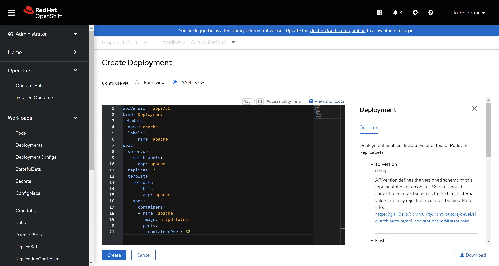
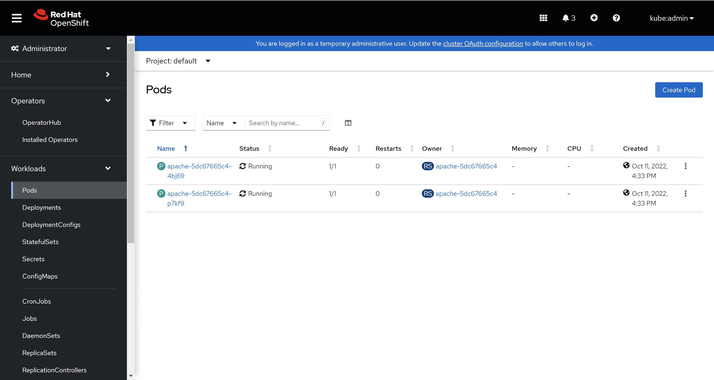
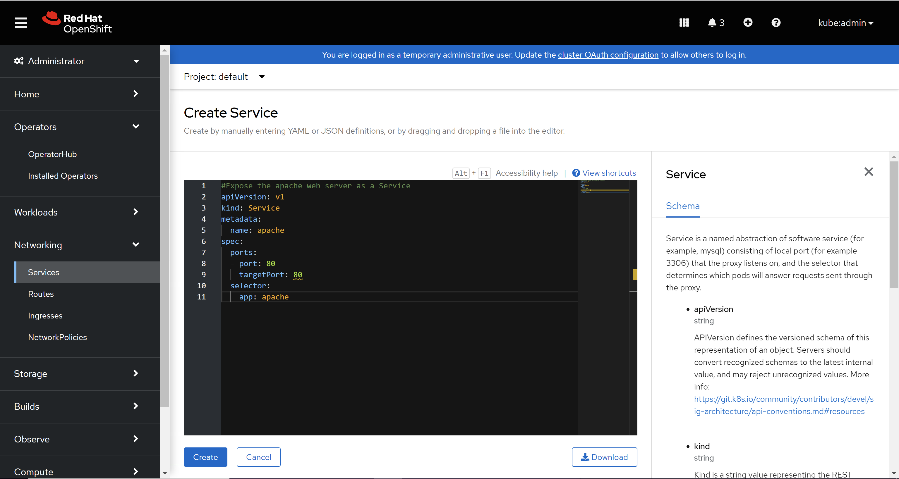
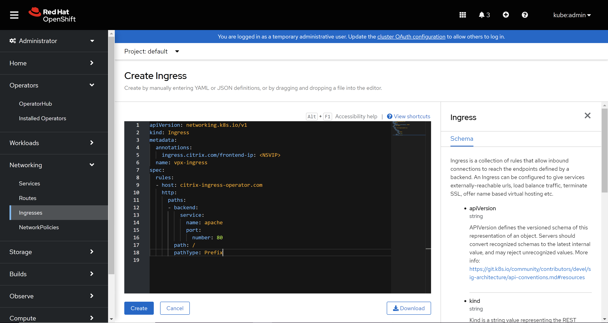
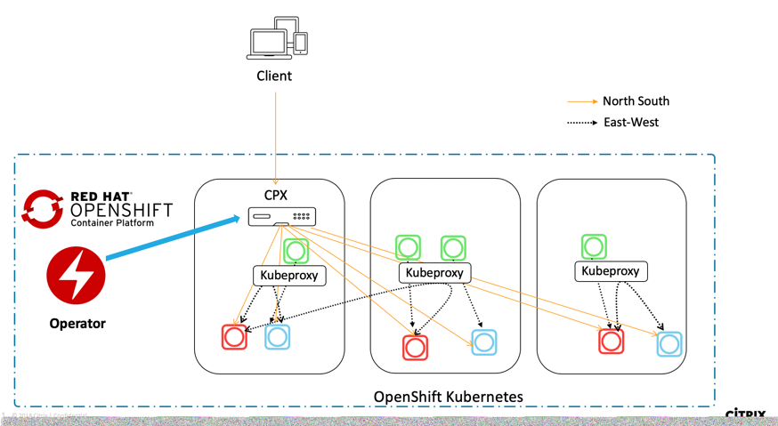
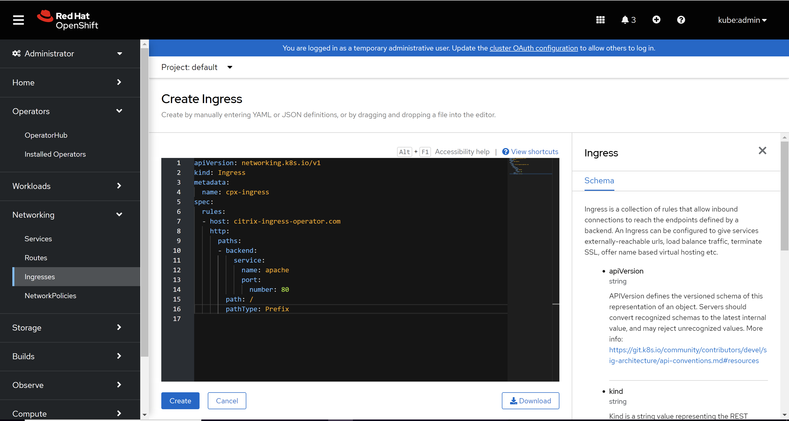

# Deploy NetScaler Operators in OpenShift using OpenShift Console

An Operator is an open source toolkit designed to package, deploy, and manage Kubernetes native applications in a more effective, automated, and scalable way.

Netscaler Operator enables user to deploy below solutions in the OpenShift Cluster:
1. [NetScaler Ingress Controller] (https://docs.netscaler.com/en-us/citrix-k8s-ingress-controller.html)
2. [NetScaler CPX with Ingress Controller] (https://docs.netscaler.com/en-us/citrix-k8s-ingress-controller/deployment-topologies.html#dual-tier-topology)
3. [Netscaler Observability Exporter] (https://docs.netscaler.com/en-us/citrix-observability-exporter.html)

## Deployment options

Based on how you want to use NetScaler, there are two ways to deploy the NetScaler ingress controller in an OpenShift cluster:

- As a standalone pod in the OpenShift cluster: In this mode, you can control the NetScaler ADC MPX or VPX appliance deployed outside the cluster.
- As a sidecar container alongside NetScaler CPX in the same pod: In this mode, NetScaler ingress controller configures the NetScaler ADC CPX.

If metrics need to be extracted from NetScaler, NetScaler observability exporter can be used. NOE collects metrics and transactions from NetScalers and transforms them to suitable formats (such as JSON, AVRO) for supported endpoints

## Installing NetScaler Operator

For installing NetScaler operator, login to OpenShift cluster console. Then navigate to **Operators > OperatorHub**, select **Certified** source from the left panel and then select the **NetScaler Operator**, and click **Install**.

   

   

   You have the following options to subscribe to NetScaler Operator:

   -  **All namespaces on the cluster (default)** - Allows the NetScaler operator to subscribe to every namespace present on the OpenShift cluster and hence allows you to initiate the instance of NetScaler operator from any namespace on the cluster.
   -  **A specific namespace on the cluster** - Allows the NetScaler operator to subscribe to the selected namespace on the OpenShift cluster. You can initiate the NetScaler operator instance on the selected namespace only.

   For the demonstration purpose, you can subscribe the NetScaler operator to the default namespace.

   

   Wait until the NetScaler operator is subscribed successfully.

   

   Navigate to **Workloads > Pods** section and verify that the **netscaler-ingress-controller-operator** pod is up and running.

   

## Deploy NetScaler Ingress Controller using NetScaler Operator

Using the NetScaler operator you can deploy the NetScaler ingress controller as standalone pod in the OpenShift cluster. The NetScaler ingress controller configures the NetScaler VPX or MPX which is deployed outside the OpenShift cluster and acts as an ingress for the applications running in the OpenShift cluster. The following diagram explains the topology:


### Prerequisites

- Deployed [Red Hat OpenShift](https://www.openshift.com) version 4.1 or later.
- Installed the [Prometheus Operator](https://github.com/coreos/prometheus-operator), if you want to view the metrics of the NetScaler CPX collected by the [NetScaler metrics exporter](https://github.com/citrix/citrix-k8s-ingress-controller/tree/master/metrics-visualizer#visualization-of-metrics).
- Determine the NS_IP IP address needed by the controller to communicate with the appliance. The IP address might be anyone of the following depending on the type of NetScaler deployment:
    - (Standalone appliances) NSIP - The management IP address of a standalone NetScaler appliance. For more information, see [IP Addressing in NetScaler](https://docs.citrix.com/en-us/citrix-adc/12-1/networking/ip-addressing.html)
    - (Appliances in High Availability mode) SNIP - The subnet IP address. For more information, see [IP Addressing in NetScaler](https://docs.citrix.com/en-us/citrix-adc/12-1/networking/ip-addressing.html)
    -  (Appliances in Clustered mode) CLIP - The cluster management IP (CLIP) address for a clustered NetScaler deployment. For more information, see [IP addressing for a cluster](https://docs.citrix.com/en-us/citrix-adc/12-1/clustering/cluster-overview/ip-addressing.html)
- The user name and password of the NetScaler VPX or MPX appliance used as the Ingress device. The NetScaler appliance must have a system user account (non-default) with certain privileges so that the NetScaler ingress controller can configure the NetScaler VPX or MPX appliance. For instructions to create the system user account on NetScaler, see [Create System User Account for NetScaler ingress controller in NetScaler](https://docs.citrix.com/en-us/citrix-k8s-ingress-controller/deploy/cic-yaml.html#create-system-user-account-for-citrix-ingress-controller-in-citrix-adc)

  You can directly pass the user name and password as environment variables to the controller, or use Kubernetes secrets (recommended). If you want to use Kubernetes secrets, create a secret for the user name and password using the following command:
  ```
  kubectl create secret generic nslogin --from-literal=username=<username> --from-literal=password=<password>
  ```

### Steps to deploy NetScaler Ingress Controller for apache application

1. Log on to OpenShift 4.x Cluster console.

2. Deploy an Apache application using the console. Perform the following:

    1. Navigate to **Workloads > Deployments > Create Deployment** and use the [apache.yaml](https://github.com/citrix/citrix-k8s-ingress-controller/blob/master/deployment/openshift/manifest/openshift-operator/apache.yaml) to create the deployment.

       
       > **NOTE:**
       > The Apache application is for the demonstration purpose only, you can modify the YAML file based on your requirement.

    2. Navigate to **Workloads > Pods** section and ensure that the Apache application pods are up and running.

       

3. Create a service for the Apache application. Navigate to **Networking > Services > Create Service** and use the [apache-service.yaml](https://github.com/citrix/citrix-k8s-ingress-controller/blob/master/deployment/openshift/manifest/openshift-operator/apache-service.yaml) to create the service.

   

4. Create an ingress for the apache application. Navigate to **Networking > Ingresses > Create Ingress** and use the [apache-ingress-vpx.yaml](https://github.com/citrix/citrix-k8s-ingress-controller/blob/master/deployment/openshift/manifest/openshift-operator/apache-ingress-vpx.yaml) to create the ingress. Ensure that you update VIP of the NetScaler VPX in the ingress YAML before applying it in the cluster.

   


5. Navigate to **Operators > Installed Operators** and select the **NetScaler Operator**.

   

6. Go to the **NetScaler Ingress Controller** tab, select **Create NetScalerIngressController** option.

   

   The NetScaler ingress controller YAML definition is displayed.

   

   Please see [this](https://github.com/citrix/citrix-helm-charts/tree/master/citrix-ingress-controller#configuration) table that lists the mandatory and optional parameters and their default values that you can configure during installation.

   Ensure to set the `license.accept` parameter to `yes`, provide the IP address of the NetScaler VPX instance in the `nsIP` parameter and Kubernetes secret created using NetScaler VPX credentials in `adcCredentialSecret` parameter respectively for this exercise. You can choose other available parameters as well depending upon your use-case.

   After you have updated the values of the required parameters, click **Create**. Ensure your NetScaler Ingress Controller is succesfully deployed and initialised.

   

7. Navigate to **Workloads > Pods** section and ensure that the **netscaler-ingress-controller** pod is up and running.

   

8. Verify the deployment by sending traffic as shown:
   ```
   curl http://citrix-ingress-operator.com --resolve citrix-ingress-operator.com:80:<VIP>
   ```
   The above `curl` command should return:
   ```
   <html><body><h1>It works!</h1></body></html>
   ```

> **NOTE:**
  Please make sure pod network in OpenShift cluster is reachable from NetScaler VPX/MPX if you are using service of type ClusterIP for your application. We have option to do this automatically using NSIC, see [this](https://github.com/netscaler/netscaler-k8s-ingress-controller/blob/310ae7eb1c8bdea57faa7f4556979a76822e23ec/docs/network/staticrouting.md)

### Steps to delete NetScaler Ingress Controller
1. Navigate to **Operators > Installed Operators > NetScaler Operator**. Select **NetScaler Ingress Controller** tab inside. After that select the instance you want to delete and then select its **Delete NetScalerIngressController** option.

   

## Deploy NetScaler ingress controller as a sidecar with NetScaler CPX using NetScaler Operator

Using the NetScaler ingress controller Operator you can deploy a NetScaler CPX with the NetScaler ingress controller as a sidecar. The NetScaler Ingress controller configures the NetScaler CPX which is deployed as an Ingress or router for an application running in the OpenShift cluster. The following diagram explains the topology.



### Prerequisites

- Deployed [Red Hat Openshift](https://www.openshift.com) version 4.1 or later.
- Installed the [Prometheus Operator](https://github.com/coreos/prometheus-operator), if you want to view the metrics of the NetScaler CPX collected by the [NetScaler metrics exporter](https://github.com/citrix/citrix-k8s-ingress-controller/tree/master/metrics-visualizer#visualization-of-metrics).

### Steps to deploy Netscaler CPX with NetScaler ingress controller for apache application

1. Log on to OpenShift 4.x Cluster console.

2. Deploy an Apache application using the console. Perform the following:

    1. Navigate to **Workloads > Deployments > Create Deployment** and use the [apache.yaml](https://github.com/citrix/citrix-k8s-ingress-controller/blob/master/deployment/openshift/manifest/openshift-operator/apache.yaml) to create the deployment.

       
       > **NOTE:**
       > The Apache application is for the demonstration purpose only, you can modify the YAML file based on your requirement.

    2. Navigate to **Workloads > Pods** section and ensure that the Apache application pods are up and running.

       

3. Create a service for the Apache application. Navigate to **Networking > Services > Create Service** and use the [apache-service.yaml](https://github.com/citrix/citrix-k8s-ingress-controller/blob/master/deployment/openshift/manifest/openshift-operator/apache-service.yaml) to create the service.

   

4. Create an Ingress for the Apache application. Navigate to **Networking > Ingresses > Create Ingress** and use the [apache-ingress-cpx.yaml](https://github.com/citrix/citrix-k8s-ingress-controller/blob/master/deployment/openshift/manifest/openshift-operator/apache-ingress-cpx.yaml) to create the ingress.

   

5. Navigate to **Operators > Installed Operators** and select the **NetScaler Operator**.

   

6. Go to the **NetScaler CPX with Ingress Controller** tab, select **Create NetScalerCpxWithIngressController** option.

   

   The NetScaler CPX with ingress controller YAML definition is displayed.

   

   Please see [this](https://github.com/citrix/citrix-helm-charts/tree/master/citrix-cpx-with-ingress-controller#configuration) table that lists the mandatory and optional parameters and their default values that you can configure during installation.

   Ensure to set the `license.accept` parameter to `yes`. We will expose NetScaler CPX service using kind `nodePort` to access the Apache application. For this please set `serviceType.nodePort.enabled` to `true`. You can choose other available parameters as well depending upon your use-case.

   After you have updated the values of the required parameters, click **Create**. Ensure your NetScaler CPX with Ingress Controller is succesfully deployed and initialised.

   

7. Please attach privileged security context constraints to the serviceaccount of NetScaler CPX as it runs as privileged pod by using following commands:
   1. Get the serviceaccount name used the NetScaler CPX using following command in the namespace where NetScaler CPX has been deployed:
      ```
      oc get sa
      ```
  
   2. Attach privileged SCC to the serviceaccount of the NetScaler CPX:
      ```
      oc adm policy add-scc-to-user privileged -z <CPX-ServiceAccount-Name>
      ```

8. Navigate to **Workloads > Pods** section and ensure that the **netscaler-cpx-with-ingress-controller** pod is up and running.

   

9. Verify the deployment by sending traffic. Perform the following:

    1. Obtain the NodePort details using the following command:
       ```
       oc get svc
       ```

    2. Use `cpx-service` NodePort and send the traffic as shown in the following command:
       ```
       curl http://citrix-ingress-operator.com:<NodePort> --resolve citrix-ingress-operator.com:<NodePort>:<Master-Node-IP>
       ```
       The above `curl` command should return:
       ```
       <html><body><h1>It works!</h1></body></html>
       ```

### Delete NetScaler CPX with Ingress Controller
1. Navigate to **Operators > Installed Operators > NetScaler Operator**. Select **NetScaler CPX with Ingress Controller** tab inside. After that select the instance you want to delete and then select its **Delete NetScalerCpxWithIngressController** option.

   


## Deploy NetScaler Observability Exporter using NetScaler Operator

NetScaler Observability Exporter is a container which collects metrics and transactions from NetScaler and transforms them to suitable formats (such as JSON, AVRO) for supported endpoints. You can export the data collected by NetScaler observability exporter to the desired endpoint for analysis and get valuable insights at a microservices level for applications proxied by NetScalers.

### Prerequisites

- Deployed [Red Hat Openshift](https://www.openshift.com) version 4.1 or later.
- To enable Tracing, set ns_tracing.enabled to true and ns_tracing.server to the tracer endpoint like zipkin.default.cluster.svc.local:9411/api/v1/spans. Default value for Zipkin server is zipkin:9411/api/v1/spans.
- To enable Elasticsearch endpoint for transactions, set elasticsearch.enabled to true and server to the elasticsearch endpoint like elasticsearch.default.svc.cluster.local:9200. Default value for Elasticsearch endpoint is elasticsearch:9200.
- To enable Kafka endpoint for transactions, set kafka.enabled to true, kafka.broker to kafka broker IPs, kafka.topic, and kafka.dataFormat . Default value for kafka topic is HTTP. Default value for kafka.dataFormat is AVRO.
- To enable Timeseries data upload in prometheus format, set timeseries.enabled to true. Currently Prometheus is the only timeseries endpoint supported.
- To enable Splunk endpoint for transactions, set splunk.enabled to true, splunk.server to Splunk server with port, splunk.authtoken to the token and splunk.indexprefix to the index prefix to upload the transactions. Default value for splunk.indexprefix is adc_noe.


### Steps to deploy NetScaler Observability Exporter

1. Log on to OpenShift 4.x Cluster console.

2. Navigate to **Operators > Installed Operators** and select the **NetScaler Operator**.

   

3. Go to the **NetScaler Observability Exporter** tab, select **Create NetScalerObservabilityExporter** option.

   

   The NetScaler Observability Exporter YAML definition is displayed.

   

   Please see [this](https://github.com/citrix/citrix-helm-charts/tree/master/citrix-observability-exporter#configuration) table that lists the mandatory and optional parameters and their default values that you can configure during installation.

   After you have updated the values of the required parameters, click **Create**. Ensure your NetScaler observability exporter is succesfully deployed and initialised.

   

4. Navigate to **Workloads > Pods** section and ensure that the **noe** pod is up and running.

   

### Delete NetScaler Observability Exporter
1. Navigate to **Operators > Installed Operators > NetScaler Operator**. Select **NetScaler Observability Exporter** tab inside. After that select the instance you want to delete and then select its **Delete NetScalerObservabilityExporter** option.

   

## Uninstall the NetScaler Operator.
1. Navigate to **Operators > Installed Operators** and select **Uninstall Operator** for **NetScaler Operator**.

   
