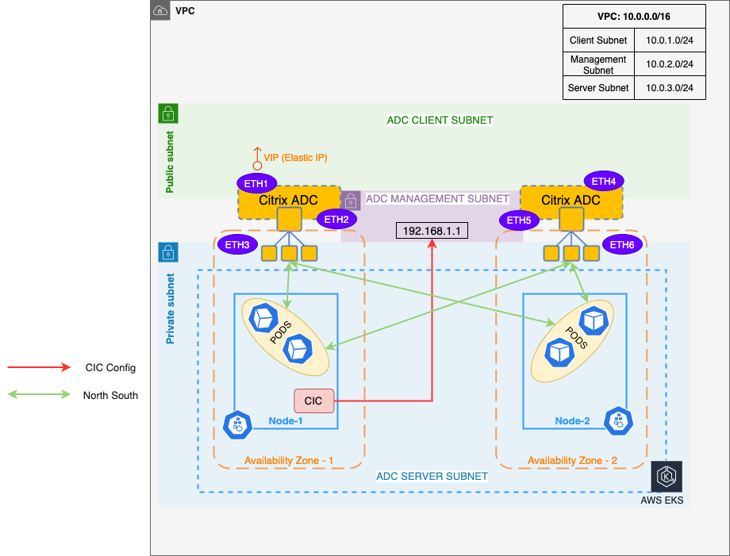

# Citrix ADC VPX in High Availability INC mode as ingress for Amazon EKS

You can deploy Citrix ADC VPX in a high availability (High Availability) INC (Independent Network Configuration) mode in the Amazon EKS (Elastic Kubernetes Service).

In a typical high availability deployment, both the Citrix ADC VPX instances in a high availability pair reside on the same subnet. A high availability deployment can also consist of two VPX instances in which each VPX is in a different network.

When the appliances in a high availability pair reside on two different networks, the secondary Citrix ADC VPX must have an independent network configuration. This means that Citrix ADC VPXs on different networks cannot share subnet IP address (SNIP), virtual IP address (VIP), or network routes. This type of configuration, in which the Citrix ADC VPXs in a high availability pair have different configuration parameters, is known as Independent Network Configuration (INC).

As the management IP address or NSIP of both the Citrix ADC VPX instances are different and they cannot share a subnet IP address, an IP address that does not belong to the VPC CIDR is selected. An AWS Route table is then configured for this IP address pointing to the ENI of the primary VPX instance. Whenever, the Citrix ADC VPX fails over (it becomes secondary), the Route table is automatically updated to point to the ENI of the new primary VPX (earlier the secondary VPX). This IP address is used as the `NS_IP` environment variable in Citrix ingress controller to configure the Citrix ADCs. For more information, see [VPX HA pair with private IP address](https://docs.citrix.com/en-us/citrix-adc/current-release/deploying-vpx/deploy-aws/vpx-ha-pip-different-aws-zones.html).

   

**Pre-requisites:**

1. Ensure that you have installed Terraform. For information, see [Terraform installation](https://learn.hashicorp.com/tutorials/terraform/install-cli).
2. Ensure that you have installed and configured the AWS command line utility `az`. Use the `aws configure` command login.
3. Ensure that you have installed the Kubernetes control command line utility `kubectl`.

## Deploy Citrix ADC VPX in high availability INC mode as ingress in Amazon EKS

1.  Clone the Citrix ADC Terraform repository using the following command:

        git clone https://github.com/citrix/terraform-cloud-scripts.git
        cd terraform-cloud-scripts/terraform-cloud-scripts/aws/cloud_native

1.  Create a Terraform variable file.

    The following is a sample Terraform variable:

        aws_region="ap-south-1"
        aws_availability_zones=["ap-south-1a", "ap-south-1b"]
        aws_access_key="XXXXXXXXXX"
        aws_secret_key="XXXXXXXXXX"
        vpc_cidr_block="192.168.0.0/16"
        management_subnet_cidr_blocks=["192.168.1.0/24", "192.168.2.0/24"]
        client_subnet_cidr_blocks=["192.168.3.0/24", "192.168.4.0/24"]
        server_subnet_cidr_blocks=["192.168.5.0/24", "192.168.6.0/24"]
        controlling_subnet="17.5.7.8/32"
        naming_prefix="cn-terraform"
        vpx_ami_map={"ap-south-1"="ami-05db944a73aa7c765"}
        ns_instance_type="m4.xlarge"
        aws_ssh_key_name="cn-terraform"
        aws_ssh_public_key="ssh-rsa XXXXXXXX"
        reset_password=true
        new_password="My_V3ry_Str0ng_VPX_Passw0rd_!s_Th!5"
        cic_config_snip="10.10.10.10"

The following table provides variables and their description:

### Variables and description

| Variable                        | Description                                                                                                                |
| ------------------------------- | -------------------------------------------------------------------------------------------------------------------------- |
| `aws_region`                    | Specify the AWS region.                                                                                                     |
| `aws_availability_zones`        | Specify the availability zones to be used in the region. Provide the availability zones in a `list` format.                                    |
| `aws_access_key`                | Specify the AWS Access Key.                                                                                                 |
| `aws_secret_key`                | Specify the AWS Secret Key.                                                                                                 |
| `vpc_cidr_block`                | Specify the CIDR block to be used for the VPC.                                                                              |
| `management_subnet_cidr_blocks` | Specify the CIDRs for the management subnet. Provide the CIDRs in a list format.                                                |
| `client_subnet_cidr_blocks`     | Specify the CIDRs for the client subnet. Provide the CIDRs in a list format.                                                    |
| `server_subnet_cidr_blocks`     | Specify the CIDRs for the server subnet. Provide the CIDRs in a list format.                                                   |
| `controlling_subnet`            | Specify the CIDR that access to the deployed Citrix ADC instances.                                               |
| `naming_prefix`                 | (Optional) Specify a name that is used as prefix in all the created resource names.                                         |
| `vpx_ami_map`                   | Specify the AMI map for Citrix ADC VPX.                                                                                     |
| `ns_instance_type`              | Specify the Citrix ADC instance type.                                                                                       |
| `aws_ssh_key_name`              | Specify the AWS SSH key name.                                                                                               |
| `aws_ssh_public_key`            | Specify the SSH Public key to use.                                                                                          |
| `reset_password`                | Specify if the Citrix ADC password has to be reset. Set this value to `true` always.                                          |
| `new_password`                  | Specify a strong Citrix ADC VPX password.                                                                                   |
| `cic_config_snip`               | Specify an IP address that is used as SNIP in the Citrix ADC. This IP address should be outside of the VPC CIDR range (`vpc_cidr_block`). |

Make sure input values in the file in accordance with your deployment topology.

**Important:** After creating a variable file in accordance with your requirements, ensure to name the file with the suffix `.auto.tfvars`. For example, `my-vpx-ha-deployment.auto.tfvars`.

4.  Initialize the Terraform deployment using the following command:

        terraform init

    It initializes the Terraform and installs all the modules that the Terraform requires.

1.  Start the Terraform deployment using the following commands:

        terraform plan
        terraform apply -auto-approve

It takes a few minutes to complete the deployment. After the Terraform deployment is complete, you can use the following `curl` command to see the initialized Terraform in action.

    $ curl http://$(terraform output -raw frontend_ip) -H "Host: $(terraform output -raw example_application_hostname)"

    <html><body><h1>It works!</h1></body></html>

This response is from the Apache microservice that is deployed inside the EKS cluster. The Citrix ADC VPX HA pair has load balanced the HTTP request to the Apache microservice and relayed the response back. 

This is an example on how to expose a microservice using the Citrix ADC VPX HA pair as Ingress. You can use the same for your microservice applications. You can also use the advanced features of Citrix ingress controller such as SSL termination, URL rewrite, Application Security and so on. For more information on Citrix ingress controller, see [Citrix ingress controller](https://developer-docs.citrix.com/projects/citrix-k8s-ingress-controller/en/latest/).

## Workloads on Amazon EKS

You can see the Kubernetes workloads that the Terraform deployed on Amazon EKS. Use the following command to download the `kubeconfig` of the newly created EKS cluster. This `kubeconfig` file is saved to the default `kubeconfig` location.

    aws eks --region $(terraform output -raw aws_region) update-kubeconfig --name $(terraform output -raw cluster_name)

After the `kubeconfig` file is saved, you can use the normal `kubectl` commands to see the workloads and other configurations in the Amazon EKS cluster.

For information on the Terraform scripts, see [Configuration scripts](https://github.com/citrix/terraform-cloud-scripts/blob/master/aws/ha_across_az/README.md).

For a high level information on the entities that this Terraform created, see [Configuration Entities](https://github.com/citrix/terraform-cloud-scripts/tree/master/aws/cloud_native#high-level-configuration-entities-created-by-the-terraform).

For information about VPX high availability pair, see [Cloud Native Deployment with VPX HA across availability zones](https://github.com/citrix/terraform-cloud-scripts/tree/master/aws/cloud_native) and [VPX high availability pair across AWS availability zones](https://github.com/citrix/terraform-cloud-scripts/blob/master/aws/ha_across_az/README.md).