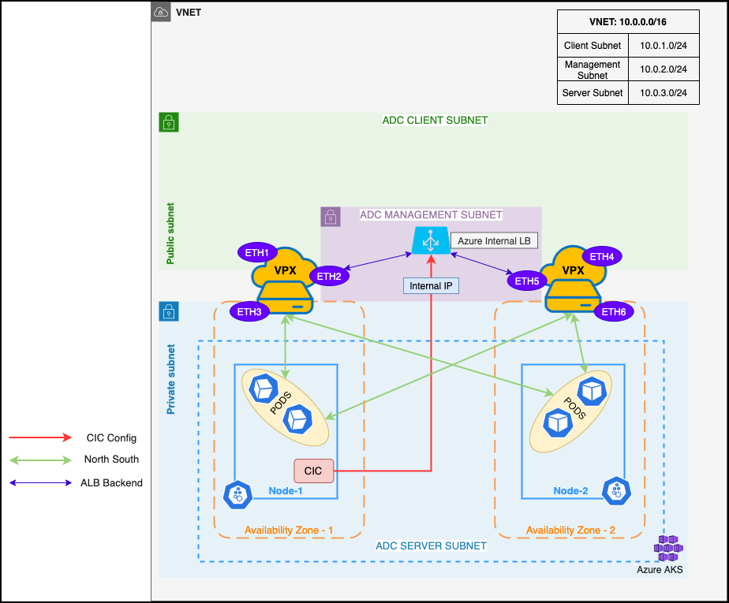

# Citrix ADC VPX in High Availability INC mode as ingress for Azure Kubernetes Services

You can deploy Citrix ADC VPX in a high availability (High Availability) INC (Independent Network Configuration) mode in the Azure Kubernetes cluster.

In a typical high availability deployment, both the Citrix ADC VPX instances in a high availability pair reside on the same subnet. A high availability deployment can also consist of two VPX instances in which each VPX is in a different network.

When the appliances in a high availability pair reside on two different networks, the secondary Citrix ADC VPX must have an independent network configuration. This means that Citrix ADC VPXs on different networks cannot share subnet IP address (SNIP), virtual IP address (VIP), or network routes. This type of configuration, in which the Citrix ADC VPXs in a high availability pair have different configuration parameters, is known as Independent Network Configuration (INC).

As the management IP or NSIP of both the Citrix ADC VPXs are different and they cannot share a Subnet IP address, an internal Azure load balancer (ALB) is created whose back-ends point to the primary and secondary VPX's management IP address. This internal ALB's front end IP address is used by CIC in the NS_IP environment variable to configure the Citrix ADCs.

   

**Pre-requisites:**

1. Ensure that you have installed Terraform. For information, see [Terraform installation](https://learn.hashicorp.com/tutorials/terraform/install-cli).
2. Ensure that you have installed and configured the Azure command line utility `az`. Use the `az login` command login. For information, see [Install the Azure CLI](https://docs.microsoft.com/en-us/cli/azure/install-azure-cli).
3. Ensure that you have installed the Kubernetes control command line utility `kubectl`.

## Deploy Citrix ADC VPX in high availability INC mode as ingress in Azure Kubernetes Services

 To deploy Citrix ADC VPX in high availability INC mode in Azure Kubernetes Services (AKS), you must complete the following tasks:

1.  Deploy Citrix ADC VPX in HA INC mode using Terraform
1.  Create an AKS cluster
1.  Enable VNet peering
1.  Configure Network Security Group
1.  Deploy the Citrix ingress controller
1.  Create a microservice application and expose it using an Ingress

Perform the following steps to deploy Citrix ADC VPX in a high availability INC mode in Azure:

### Deploy Citrix ADC VPX in HA INC mode using Terraform

1.  Clone the Citrix ADC Terraform repository using the following command:

        git clone https://github.com/citrix/terraform-cloud-scripts.git
        cd terraform-cloud-scripts/azure/ha_availability_zones

1.  Create a Terraform variable file. Ensure to name the file with the suffix `.auto.tfvars` and specify the required parameters for the terraform scripts.

    The following is a sample Terraform variable:

        resource_group_name="my-ha-inc-rg"
        location="southeastasia"
        virtual_network_address_space="192.168.0.0/16"
        management_subnet_address_prefix="192.168.0.0/24"
        client_subnet_address_prefix="192.168.1.0/24"
        server_subnet_address_prefix="192.168.2.0/24"
        adc_admin_password="<Provide a strong VPX Password>"
        controlling_subnet="<CIDR to allow Management Access>"
        create_ILB_for_management=true

The following table provides variables and their description:

| Variable Name                    | Description                                                                                            |
| -------------------------------- | ------------------------------------------------------------------------------------------------------ |
| `resource_group_name`              | Specifies the Azure resource group to deploy VPX high availability Pair.                                                        |
| `location`                         | Specifies the Azure location to be used for the deployment.                                                       |
| `virtual_network_address_space`    | Specifies the VNet Address space.                                                                         |
| `management_subnet_address_prefix` | Specifies the Management Subnet Address space.                                                            |
| `client_subnet_address_prefix`     | Specifies the Client Subnet Address space.                                                                |
| `server_subnet_address_prefix`     | Specifies the Server Subnet Address space.                                                                |
| `adc_admin_password`               | Specifies a password for the Citrix ADC `nsroot` user.                                             |
| `controlling_subnet`               | Specifies the CIDR to allow management access.                                                        |
| `create_ILB_for_management`        | Specify `true` to create an internal Azure load balancer for configuring the Citrix ADC VPX. |

  **Important:** After creating a variable file in accordance with your requirements, ensure to name the file with the suffix `.auto.tfvars`. For example, `my-vpx-ha-deployment.auto.tfvars`.

4.  Initialize the Terraform deployment using the following command:

        terraform init

    It initializes the terraform and installs all the modules that the Terraform requires.

1.  Start the Terraform deployment using the following commands:

        terraform plan
        terraform apply -auto-approve

1.  Save the output.

    It is important to verify the output of terraform execution. The following is a sample output after the Terraform deployment:

```
Apply complete! Resources: 44 added, 0 changed, 0 destroyed.

Outputs:

alb_public_ip = "X.X.X.X"
bastion_public_ip = "X.X.X.X"
cic_nsip = [
  {
    "cic_nsip" = "192.168.0.7"
  },
]
management_subnet_id = "/subscriptions/<subscription-id>/resourceGroups/my-ha-inc-rg/providers/Microsoft.Network/virtualNetworks/terraform-virtual-network/subnets/terraform-management-subnet"
private_nsips = [
  "192.168.0.5",
  "192.168.0.6",
]
private_vips = [
  "192.168.1.5",
  "192.168.1.4",
]
public_nsips = [
  "X.X.X.X",
  "X.X.X.X",
]
server_subnet_id = "/subscriptions/<subscription-id>/resourceGroups/my-ha-inc-rg/providers/Microsoft.Network/virtualNetworks/terraform-virtual-network/subnets/terraform-server-subnet"
```

 **Output variables:**

The following table provides the output variables and their description.

| Output Variables  | Description                                                                 |
| ----------------- | ---------------------------------------------------------------------------- |
| `cic_nsip`          | Specifies the IP address that is to be used in CIC deployment as `NS_IP` the environment variable.                  |
| `alb_public_ip`     | Specifies the VIP address that is to be used in Ingress as the `ingress.citrix.com/frontend-ip` annotation. |
| `bastion_public_ip` | Specifies the public IP address of the bastion through which the Citrix ADC can be accessible.  |
| `private_nsips`     | Specifies the private NSIP of the primary and secondary Citrix ADC.                     |

### Create an AKS Cluster

1.  Create an AKS cluster in the same resource group of the Citrix ADC VPX deployment. Use the following Azure command to create this AKS cluster:

        az aks create --network-plugin azure --resource-group my-ha-inc-rg --name my-aks-with-vpx-ha-inc 

    After the cluster is created, you can download the `kubeconfig` file using the following command. This file is required to run `kubectl` commands in the cluster. The commands are used to create workloads later in the procedure.

        az aks get-credentials --name my-aks-with-vpx-ha-inc --resource-group my-ha-inc-rg

### Enable VNet peering

You can enable VNet peering only if Citrix ADC VPX and AKS are on different VNets. Perform the following steps to enable peering between the VNets.

1. Identify the VNet resource IDs of AKS and Citrix ADC VPX.

    You can modify the following values in accordance with your deployment.

        resource_group="my-ha-inc-rg"
        aks_name="my-aks-with-vpx-ha-inc"
        aks_node_resource_group=$(az aks show -g $resource_group -n $aks_name --query nodeResourceGroup -o tsv)
        aks_vnet_name=$(az network vnet list --resource-group $aks_node_resource_group --query [].name -o tsv)
        aks_vnet_id=$(az network vnet list --resource-group $aks_node_resource_group --query [].id -o tsv)
        vpx_vnet_name=$(az network vnet list --resource-group $resource_group --query [].name -o tsv)
        vpx_vnet_id=$(az network vnet list --resource-group $resource_group --query [].id -o tsv)

2. Create VNet peering using the following Azure CLI command:

        az network vnet peering create -g $aks_node_resource_group -n my-aks-to-vpx-peer --vnet-name $aks_vnet_name --remote-vnet $vpx_vnet_id --allow-vnet-access --allow-forwarded-traffic

        az network vnet peering create -g $resource_group -n my-vpx-to-aks-peer --vnet-name $vpx_vnet_name --remote-vnet $aks_vnet_id --allow-vnet-access --allow-forwarded-traffic

### Configure Network Security Group to allow traffic from Citrix ADC

A network security group contains security rules that allow or deny inbound or outbound network traffic for a VM instance in Azure. For more information, see [Network Security Groups](https://docs.microsoft.com/en-us/azure/virtual-network/network-security-groups-overview). 

When you deploy an AKS cluster, it creates a Network Security Group (NSG) by default for allowing inter-node communication. You can either edit this Network Security Group to allow traffic from Citrix ADC VPX or create a Network Security Group to allow traffic from Citrix ADC VPX to AKS cluster and vice versa. For more information on how to create an NSG or edit an existing NSG, see [Work with Network Security Group](https://docs.microsoft.com/en-us/azure/virtual-network/manage-network-security-group#work-with-network-security-groups).

### Deploy the Citrix ingress controller

1.  Use the following commands to deploy Citrix ingress controller in the Azure managed Kubernetes cluster (AKS) using the helm chart.

        #Create a Kubernetes Secret using Citrix ADC login credentials

        kubectl create secret generic nslogin --from-literal username=nsroot --from-literal password=$(terraform output -raw adc_admin_password)

        helm repo update && helm repo add citrix https://citrix.github.io/citrix-helm-charts/

        helm install cic citrix/citrix-ingress-controller --set nsIP=$(terraform output -raw cic_nsip),license.accept=yes,adcCredentialSecret=nslogin,nodeWatch=true,ingressClass[0]="citrix"

### Create a sample microservice application and expose it using Ingress

The following steps show how to create a sample Apache microservice and exposes the microservice using Ingress through the Citrix ADC VPX high availability pair.

1.  Use the following command to deploy the Apache microservice:

        kubectl create deployment apache --image httpd:latest --replicas=6
        kubectl expose deployment apache --port 80

1.  Use the following commands to create a simple HTTP Ingress:

        kubectl create ingress my-simple-apache-http-ingress --class=citrix --rule="mysample-testdomain.com/=apache:80"
        kubectl annotate ingress my-simple-apache-http-ingress ingress.citrix.com/frontend-ip=$(terraform output -raw alb_public_ip)

3.  Use the following command to validate the traffic:

        curl --resolve mysample-testdomain.com:80: $(terraform output -raw alb_public_ip) http://mysample-testdomain.com
        <html><body><h1>It works!</h1></body></html>

Now you have deployed Citrix ADC VPX instances in High Availability INC mode as the ingress for your Azure Kubernetes Services (AKS). You can further use our advanced Citrix ingress controller for features such as SSL termination, Rewrite and Responder functionalities and so on. For information about Citrix ingress controller, see [Citrix ingress controller](https://developer-docs.citrix.com/projects/citrix-k8s-ingress-controller/en/latest/).

For information on network architecture for Citrix ADC VPX instances on Microsoft Azure, see [Citrix ADC VPX instances on Microsoft Azure](https://docs.citrix.com/en-us/citrix-adc/current-release/deploying-vpx/deploy-vpx-on-azure/network-architecture-vpx-azur).