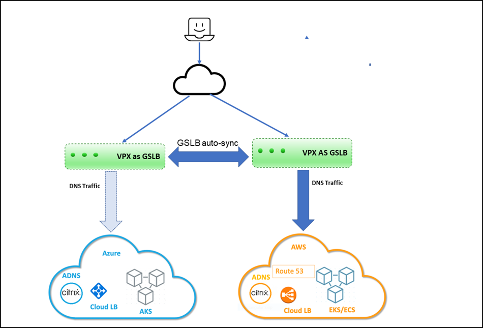

# Multi-cloud and multi-cluster ingress and load balancing solution with Amazon EKS and Microsoft AKS clusters

You can deploy multiple instances of the same application across multiple clouds provided by different cloud providers. This multi-cloud strategy helps you to ensure resiliency, high availability, and proximity. A multi-cloud approach also allows you to take advantage of the best of each cloud provider by reducing the risks such as vendor lock-in and cloud outages.

You can deploy the multi-cloud and multi-cluster ingress and load balancing solution with Amazon EKS and Microsoft AKS.

## Deployment topology

The following diagram explains a deployment topology of the multi-cloud ingress and load balancing solution for Kubernetes service provided by Amazon EKS and Microsoft AKS.

 

**Prerequisites**

  -  You should be familiar with AWS and Azure.
  -  You should be familiar with Citrix ADC and [Citrix ADC networking](https://docs.citrix.com/en-us/citrix-adc/current-release/networking.html).
  -  Instances of the same application must be deployed in Kubernetes clusters on Amazon EKS and Microsoft AKS.

## Deploy multi-cloud and multi-cluster ingress and load balancing solution with Amazon EKS and Microsoft AKS clusters

To deploy the multi-cloud multi-cluster ingress and load balancing solution, you must perform the following tasks.

1.	Deploy Citrix ADC VPX in AWS.
1.	Deploy Citrix ADC VPX in Azure.
1.	Configure ADNS service on Citrix ADC VPX deployed in AWS and AKS.
1.	Configure GSLB service on Citrix ADC VPX deployed in AWS and AKS.
1.  Apply GTP and GSE CRDs on AWS and Azure Kubernetes clusters.
1.	Deploy the multi-cluster controller.

## Deploy Citrix ADC VPX in AWS

You must ensure that the Citrix ADC VPX instances are installed in the same virtual private cloud (VPC) on the EKS cluster. It enables Citrix ADC VPX to communicate with EKS workloads. You can use an existing EKS subnet or create a subnet to install the Citrix ADC VPX instances.

Also, you can install the Citrix ADC VPX instances in a different VPC. In that case, you must ensure that the VPC for EKS can communicate using VPC peering. For more information about VPC peering, see [VPC peering documentation](https://docs.aws.amazon.com/vpc/latest/peering/what-is-vpc-peering.html).

For high availability (HA), you can install two instances of Citrix ADC VPX in HA mode.

1. Install Citrix ADC VPX in AWS. For information on installing Citrix ADC VPX in AWS, see [Deploy Citrix ADC VPX instance on AWS](https://docs.citrix.com/en-us/citrix-adc/current-release/deploying-vpx/deploy-aws.html#deploy-a-citrix-adc-vpx-instance-on-aws).

    Citrix ADC VPX requires a secondary public IP address other than the NSIP to run GSLB service sync and ADNS service.

2. Open the AWS console and choose **EC2** > **Network Interfaces** > **VPX primary ENI ID** > **Manage IP addresses**. Click **Assign new IP Address**.

     

    After the secondary public IP address has been assigned to the VPX ENI, associate an elastic IP address to it.

3. Choose **EC2** > **Network Interfaces** > **VPX ENI ID** - **Actions** , click **Associate IP Address**. Select an elastic IP address for the secondary IP address and click **Associate**.

     

4. Log in to the Citrix ADC VPX instance and add the secondary IP address as `SNIP` and enable the management access using the following command:

        add ip 192.168.211.73 255.255.224.0 -mgmtAccess ENABLED -type SNIP

    **Note**:  To log in to Citrix ADC VPX using SSH, you must enable the SSH port in the security group. Route tables must have an internet gateway configured for the default traffic and the NACL must allow the SSH port.

    **Note**: If you are running the Citrix ADC VPX in High Availability (HA) mode, you must perform this configuration in both of the Citrix ADC VPX instances.

5. Enable Content Switching (CS), Load Balancing (LB), Global Server Load Balancing(GSLB), and SSL features in Citrix ADC VPX using the following command:

        enable feature *feature*

    **Note**: To enable GSLB, you must have an additional license.

6. Enable port 53 for UDP and TCP in the VPX security group for Citrix ADC VPX to receive DNS traffic. Also enable the TCP port 22 for SSH and the TCP port range 3008–3011 for GSLB metric exchange.

    For information on adding rules to the security group, see [Adding rules to a security group](https://docs.aws.amazon.com/AWSEC2/latest/UserGuide/working-with-security-groups.html#adding-security-group-rule).

7. Add a nameserver to Citrix ADC VPX using the following command:

        add nameserver *nameserver IP*

## Deploy Citrix ADC VPX in Azure

You can run a standalone Citrix ADC VPX instance on an AKS cluster or run two Citrix ADC VPX instances in High Availability mode on the AKS cluster.

While installing, ensure that the AKS cluster must have connectivity with the VPX instances. To ensure the connectivity, you can install the Citrix ADC VPX in the same virtual network (VNet) on the AKS cluster in a different resource group.

While installing the Citrix ADC VPX, select the VNet where the AKS cluster is installed. Alternatively, you can use VNet peering to ensure the connectivity between AKS and Citrix ADC VPX if the VPX is deployed in a different VNet other than the AKS cluster.

1. Install Citrix ADC VPX in AWS. For information on installing Citrix ADC VPX in AKS, see [Deploy a Citrix ADC VPX instance on Microsoft Azure](https://docs.citrix.com/en-us/citrix-adc/current-release/deploying-vpx/deploy-vpx-on-azure.html).

    You must have a SNIP with public IP for GSLB sync and ADNS service. If SNIP already exists, associate a public IP address with it.
    
2. To associate, choose **Home** > **Resource group** > **VPX instance** > **VPX NIC instance**. Associate a public IP address as shown in the following image. Click **Save** to save the changes.

      

3. Log in to the Azure Citrix ADC VPX instance and add the secondary IP as SNIP with the management access enabled using the following command:

        add ip 192.240.0.11 255.255.0.0 -type SNIP -mgmtAccess ENABLED

    If the resource exists, you can use the following command to set the management access enabled on the existing resource.

        set ip 192.240.0.11 -mgmtAccess ENABLED

4. Enable CS, LB, SSL, and GSLB features in the Citrix ADC VPX using the following command:

        enable feature *feature*

    To access the Citrix ADC VPX instance through SSH, you must enable the inbound port rule for the SSH port in the Azure network security group that is attached to the Citrix ADC VPX primary interface.

5. Enable the inbound rule for the following ports in the network security group on the Azure portal.

    - TCP: 3008–3011 for GSLB metric exchange
    - TCP: 22 for SSH
    - TCP and UDP: 53 for DNS

6. Add a nameserver to Citrix ADC VPX using the following command:

        add nameserver *nameserver IP*

## Configure ADNS service in Citrix ADC VPX deployed in AWS and Azure

  The ADNS service in Citrix ADC VPX acts as an authoritative DNS for your domain. For more information on the ADNS service, see [Authoritative DNS service](https://docs.citrix.com/en-us/citrix-adc/current-release/global-server-load-balancing/configure/configure-gslb-adns-service.html).

1. Log in to AWS Citrix ADC VPX and configure the ADNS service on the secondary IP address and port 53 using the following command:

        add service Service-ADNS-1 192.168.211.73 ADNS 53

    Verify the configuration using the following command:

        show service Service-ADNS-1

1.	Log in to Azure Citrix ADC VPX and configure the ADNS service on the secondary IP address and port 53 using the following command:

        add service Service-ADNS-1 192.240.0.8 ADNS 53

    Verify the configuration using the following command:

        show service Service-ADNS-1  

1.	After creating two ADNS service for the domain, update the NS record of the domain to point to the ADNS services in the domain registrar.

    For example, create an 'A' record `ns1.domain.com` pointing to the ADNS service public IP address. NS record for the domain must point to ns1.domain.com.

##	Configure GSLB service in Citrix ADC VPX deployed in AWS and Azure

You must create GSLB sites on Citrix ADC VPX deployed on AWS and Azure.

1.	Log in to AWS Citrix ADC VPX and configure GSLB sites on the secondary IP address using the following command. Also, specify the public IP address using the *–publicIP* argument. For example:

        add gslb site aws_site 192.168.197.18 -publicIP 3.139.156.175

        add gslb site azure_site 192.240.0.11 -publicIP 23.100.28.121

2.	Log in to Azure Citrix ADC VPX and configure GSLB sites. For example:

        add gslb site aws_site 192.168.197.18 -publicIP 3.139.156.175

        add gslb site azure_site 192.240.0.11 -publicIP 23.100.28.121

3.	Verify that the GSLB sync is successful by initiating a sync from any of the sites using the following command:

        sync gslb config –debug

**Note**: If the initial sync fails, review the security groups on both AWS and Azure to allow the required ports.

##  Apply GTP and GSE CRDs on AWS and Azure Kubernetes clusters

The global traffic policy (GTP) and global service entry (GSE) CRDs help to configure Citrix ADC for performing GSLB in Kubernetes applications. These CRDs are designed for configuring multi-cluster ingress and load balancing solution for Kubernetes clusters.

**GTP CRD**

The GTP CRD accepts the parameters for configuring GSLB on the Citrix ADC including deployment type (canary, failover, and local-first), GSLB domain, health monitor for the ingress, and service type.

For GTP CRD definition, see the [GTP CRD](https://developer-docs.citrix.com/projects/citrix-k8s-ingress-controller/en/latest/multicluster/multi-cluster/#gtp-crd-definition). Apply the GTP CRD definition on AWS and Azure Kubernetes clusters using the following command:

    kubectl apply -f https://raw.githubusercontent.com/citrix/citrix-k8s-ingress-controller/master/multicluster/Manifest/gtp-crd.yaml

**GSE CRD**

The GSE CRD specifies the endpoint information (information about any Kubernetes object that routes traffic into the cluster) in each cluster. The global service entry automatically picks the external IP address of the application, which routes traffic into the cluster. If the external IP address of the routes change, the global service entry picks a newly assigned IP address and configure the multi-cluster endpoints of Citrix ADCs accordingly.

For the GSE CRD definition, see the [GSE CRD](https://developer-docs.citrix.com/projects/citrix-k8s-ingress-controller/en/latest/multicluster/multi-cluster/#gse-crd-definition). Apply the GSE CRD definition on AWS and Azure Kubernetes clusters using the following command:

    kubectl apply -f https://raw.githubusercontent.com/citrix/citrix-k8s-ingress-controller/master/multicluster/Manifest/gse-crd.yaml
 
##	Deploy multi-cluster controller

Multi-cluster controller helps you to ensure the high availability of the applications across clusters in a multi-cloud environment.

You can install the multi-cluster controller on the AWS and Azure clusters. Multi-cluster controller listens to GTP and GSE CRDs and configures the Citrix ADC for GSLB that provides high availability across multiple regions in a multi-cloud environment.

To deploy the multi-cluster controller, perform the following steps:

1. Create an RBAC for the multi-cluster ingress controller on the AWS and Azure Kubernetes clusters.

        kubectl apply -f https://raw.githubusercontent.com/citrix/citrix-k8s-ingress-controller/master/multicluster/Manifest/gslb-rbac.yaml

2. Create the secrets on the AWS and Azure clusters using the following command: 

    **Note**: Secrets enable the GSLB controller to connect and push the configuration to the GSLB devices.

        kubectl create secret generic secret-1 --from-literal=username=<username> --from-literal=password=<password>

    **Note**: You can add a user to Citrix ADC using the `add system user` command.


3.	Download the GSLB controller YAML file from [gslb-controller.yaml](https://github.com/citrix/citrix-k8s-ingress-controller/blob/master/multicluster/Manifest/gslb-controller.yaml).

4. Apply the `gslb-controller.yaml` in an AWS cluster using the following command:

        kubectl apply -f  gslb-controller.yaml

    For the AWS environment, edit the `gslb-controller.yaml` to define the LOCAL_REGION, LOCAL_CLUSTER, and SITENAMES environment variables.

    The following example defines the environment variable `LOCAL_REGION` as *us-east-2* and `LOCAL_CLUSTER` as *eks-cluster* and the  `SITENAMES` environment variable as *aws_site,azure_site*.

        name: "LOCAL_REGION"
        value: "us-east-2"
        name: "LOCAL_CLUSTER"
        value: "eks-cluster"
        name: "SITENAMES"
        value: "aws_site,azure_site"
        name: "aws_site_ip"
        value: "NSIP of aws VPX(internal IP)"
        name: "aws_site_region"
        value: "us-east-2"
        name: "azure_site_ip"
        value: "NSIP of azure_VPX(public IP)"
        name: "azure_site_region"
        value: "central-india"
        name: "azure_site_username"
        valueFrom:
          secretKeyRef:
           name: secret-1
           key: username
        name: "azure_site_password"
        valueFrom:
          secretKeyRef:
           name: secret-1
           key: password
        name: "aws_site_username"
        valueFrom:
          secretKeyRef:
           name: secret-1
           key: username
        name: "aws_site_password"
        valueFrom:
          secretKeyRef:
           name: secret-1
           key: password

    Apply the [gslb-controller.yaml](https://github.com/citrix/citrix-k8s-ingress-controller/blob/master/multicluster/Manifest/gslb-controller.yaml) in the Azure cluster using the following command:

        kubectl apply -f  gslb-controller.yaml

1.  For the Azure site, edit the `gslb-controller.yaml` to define `LOCAL_REGION`, `LOCAL_CLUSTER`, and `SITENAMES` environment variables.

    The following example defines the environment variable `LOCAL_REGION` as *central-india*, `LOCAL_CLUSTER` as *azure-cluster*, and  `SITENAMES` as *aws_site, azure_site*.

        name: "LOCAL_REGION"
        value: "central-india"
        name: "LOCAL_CLUSTER"
        value: "aks-cluster"
        name: "SITENAMES"
        value: "aws_site,azure_site"
        name: "aws_site_ip"
        value: "NSIP of AWS VPX(public IP)"
        name: "aws_site_region"
        value: "us-east-2"
        name: "azure_site_ip"
        value: "NSIP of azure VPX(internal IP)"
        name: "azure_site_region"
        value: "central-india"
        name: "azure_site_username"
        valueFrom:
          secretKeyRef:
           name: secret-1
           key: username
        name: "azure_site_password"
        valueFrom:
          secretKeyRef:
           name: secret-1
           key: password
        name: "aws_site_username"
        valueFrom:
          secretKeyRef:
           name: secret-1
           key: username
        name: "aws_site_password"
        valueFrom:
          secretKeyRef:
           name: secret-1
           key: password

    **Note**: The order of the GSLB site information should be the same in all clusters. The first site in the order is considered as the master site for pushing the configuration. Whenever the master site goes down, the next site in the list becomes the new master. Hence, the order of the sites should be the same in all Kubernetes clusters.

### Deploy a sample application

In this example application deployment scenario, an `https` image of apache is used. However, you can choose the sample application of your choice.

The application is exposed as type LoadBalancer in both AWS and Azure clusters. You must run the commands in both AWS and Azure Kubernetes clusters.

1.	Create a deployment of a sample apache application using the following command:

        kubectl create deploy apache --image=httpd:latest port=80

1. Expose the apache application as service of type LoadBalancer using the following command:

        kubectl expose deploy apache --type=LoadBalancer --port=80

2. Verify that an external IP address is allocated for the service of type LoadBalancer using the following command:

        kubectl get svc apache
        NAME     TYPE           CLUSTER-IP    EXTERNAL-IP     PORT(S)        AGE
        apache   LoadBalancer   192.0.16.231   20.62.235.193   80:32666/TCP   3m2s

After deploying the application on AWS and Azure clusters, you must configure the GTE custom resource to configure high availability in the multi-cloud clusters.

Create a GTP YAML resource `gtp_isntance.yaml` as shown in the following example.

```
apiVersion: "citrix.com/v1beta1"
 kind: globaltrafficpolicy
 metadata:
   name: gtp-sample-app
   namespace: default
 spec:
   serviceType: 'HTTP'
   hosts:
   - host: <domain name>
     policy:
       trafficPolicy: 'FAILOVER'
       secLbMethod: 'ROUNDROBIN'
       targets:
       - destination: 'apache.default.us-east-2.eks-cluster'
         weight: 1
       - destination: 'apache.default.central-india.aks-cluster'
         primary: false
         weight: 1
       monitor:
       - monType: http
         uri: ''
         respCode: 200
   status:
     {}
```

In this example, traffic policy is configured as `FAILOVER`. However, the multi-cluster controller supports multiple traffic policies. For more information, see the documentation for the traffic policies.

Apply the GTP resource in both the clusters using the following command: 

    kubectl apply -f gtp_instance.yaml

You can verify that the GSE resource is automatically created in both of the clusters with the required endpoint information derived from the service status. Verify using the following command:

    kubectl get gse 
    kubectl get gse *name* -o yaml

Also, log in to Citrix ADC VPX and verify that the GSLB configuration is successfully created using the following command:

    show gslb runningconfig

As the GTP CRD is configured for the traffic policy as `FAILOVER`, Citrix ADC VPX instances serve the traffic from the primary cluster (EKS cluster in this example). 

    curl -v http://*domain_name* 

 However, if an endpoint is not available in the EKS cluster, applications are automatically served from the Azure cluster. You can ensure it by setting the replica count to `0` in the primary cluster.

## Citrix ADC VPX as ingress and GSLB device for Amazon EKS and Microsoft AKS clusters

You can deploy the multi-cloud and multi-cluster ingress and load balancing solution with Amazon EKS and Microsoft AKS with Citrix ADC VPX as GSLB and the same Citrix ADC VPX as ingress device too.

To deploy the multi-cloud multi-cluster ingress and load balancing with Citrix ADC VPX as ingress device, you must complete the following tasks described in the previous sections:

1.  [Deploy Citrix ADC VPX in AWS](#deploy-citrix-adc-vpx-in-aws)
1.	[Deploy Citrix ADC VPX in Azure](#deploy-citrix-adc-vpx-in-azure)
1.	[Configure ADNS service on Citrix ADC VPX deployed in AWS and AKS](#configure-adns-service-on-citrix-adc-vpx-deployed-in-aws-and-aks)
1.	[Configure GSLB service on Citrix ADC VPX deployed in AWS and AKS](#configure-gslb-service-on-citrix-adc-vpx-deployed-in-aws-and-aks)
1.  [Apply GTP and GSE CRDs on AWS and Azure Kubernetes clusters](#apply-gtp-and-gse-crds-on-aws-and-azure-kubernetes-clusters)
1.	[Deploy the multi-cluster controller](#deploy-multi-cluster-controller)

After completing the preceding tasks, perform the following tasks:

1.  Configure Citrix ADC VPX as Ingress Device for AWS
1.  Configure Citrix ADC VPX as Ingress Device for Azure

### Configure Citrix ADC VPX as Ingress Device for AWS

#### Create Citrix ADC VPX login credentials using Kubernetes secret

```
kubectl create secret  generic nslogin --from-literal=username='nsroot' --from-literal=password='<instance-id-of-vpx>'
```

The Citrix ADC VPX password is usually the instance-id of the VPX if you have not changed it.


#### Configure SNIP in the Citrix ADC VPX

SSH to the Citrix ADC VPX and configure a SNIP, which is the secondary IP of the VPX to which no Elastic IP is assigned

```
add ns ip 192.168.84.93 255.255.224.0
```

This is required for Citrix ADC to interact with the pods inside the Kubernetes cluster.


#### Update the Citrix ADC VPX management IP and VIP in the Citrix Ingress controller manifest

```
wget https://raw.githubusercontent.com/citrix/citrix-k8s-ingress-controller/master/deployment/aws/quick-deploy-cic/manifest/cic.yaml
```

***If you don't have `wget` installed, you can use `fetch` or `curl`***

Update the Citrix ADC VPX's primary IP in the `cic.yaml` in the below field

```
# Set NetScaler NSIP/SNIP, SNIP in case of HA (mgmt has to be enabled) 
- name: "NS_IP"
  value: "X.X.X.X"
```

Update the Citrix ADC VPX VIP in the `cic.yaml` in the below field. This is the private IP to which you have assigned an EIP.

```
# Set NetScaler VIP for the data traffic
- name: "NS_VIP"
  value: "X.X.X.X"
```

#### Create the Citrix Ingress Controller

Now that we have configure the Citrix Ingress controller with the required values, let's deploy it.

```
kubectl create -f cic.yaml
```

### Configure Citrix ADC VPX as Ingress Device for Azure

Perform the following steps to deploy the Citrix ingress controller.

1. Create Citrix ADC VPX login credentials using Kubernetes secret.

    
        kubectl create secret  generic nslogin --from-literal=username='<azure-vpx-instance-username>' --from-literal=password='<azure-vpx-instance-password>'
    
   **Note:** The Citrix ADC VPX user name and password should be the same as the credentials set while creating Citrix ADC VPX on Azure.

2. Using SSH, configure a SNIP in the Citrix ADC VPX, which is the secondary IP address of the Citrix ADC VPX. This step is required for the Citrix ADC to interact with pods inside the Kubernetes cluster.

   
        add ns ip <snip-vpx-instance-private-ip> <vpx-instance-primary-ip-subnet>
    

   -  `snip-vpx-instance-private-ip` is the dynamic private IP address assigned while adding a SNIP during the Citrix ADC VPX instance creation.

   - `vpx-instance-primary-ip-subnet` is the subnet of the primary private IP address of the Citrix ADC VPX instance.
  
     To verify the subnet of the private IP address, SSH into the Citrix ADC VPX instance and use the following command.

    
    
          show ip <primary-private-ip-addess>
    


3. Update the Citrix ADC VPX image URL, management IP, and VIP in the Citrix ingress controller YAML file.


   1. Download the Citrix ingress controller YAML file.

       

          wget https://raw.githubusercontent.com/citrix/citrix-k8s-ingress-controller/master/deployment/azure/manifest/azurecic/cic.yaml
     
       

       **Note:** If you do not have `wget` installed, you can use the `fetch` or `curl` command.

   2. Update the Citrix ingress controller image with the Azure image URL in the `cic.yaml` file.

      
            - name: cic-k8s-ingress-controller
              # CIC Image from Azure
              image: "<azure-cic-image-url>"
      

   3. Update the primary IP address of the Citrix ADC VPX in the `cic.yaml` in the following field with the primary private IP address of the Azure VPX instance.

      
     
          # Set NetScaler NSIP/SNIP, SNIP in case of HA (mgmt has to be enabled) 
          - name: "NS_IP"
            value: "X.X.X.X"
      

    1. Update the Citrix ADC VPX VIP in the `cic.yaml` in the following field with the private IP address of the VIP assigned during VPX Azure instance creation.
 
       

            # Set NetScaler VIP for the data traffic
            - name: "NS_VIP"
              value: "X.X.X.X"
        
      

4. Once you have configured the Citrix ingress controller with the required values, deploy the Citrix ingress controller using the following command.


            kubectl create -f cic.yaml
