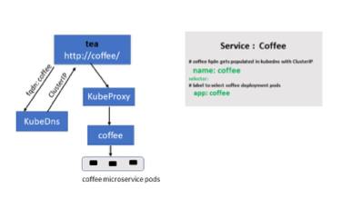
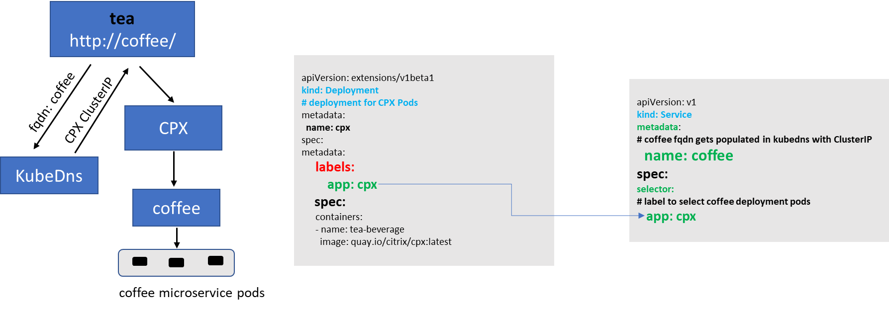
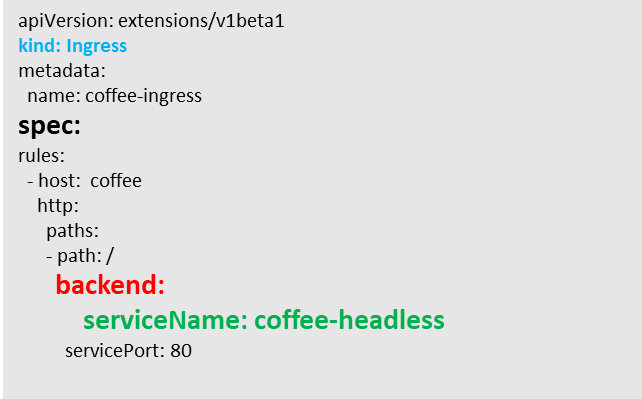
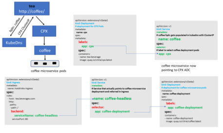
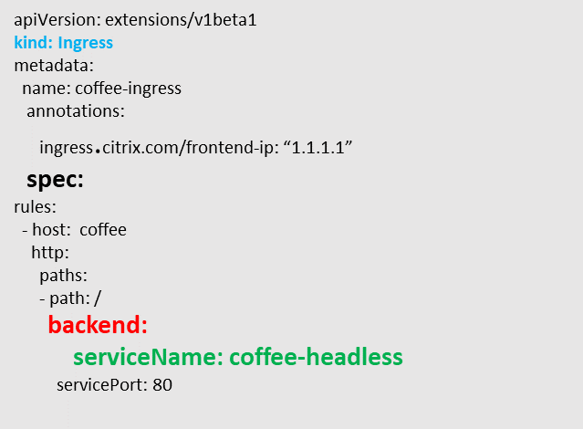

# Service Mesh Lite

An Ingress solution (either hardware or virtualized or containerized) typically performs L7 proxy functions for North South traffic. The Service Mesh lite architecture uses the same Ingress solution to manage East-west traffic as well.
In a standard Kubernetes deployment, E-W traffic traverses the built-in KubeProxy deployed in each node. KubeProxy being a L4 proxy can only do TCP/UDP based load balancing without the benefits of L7 proxy.

Citrix ADC (MPX, VPX, SDX, CPX) can provide such benefits for E-W traffic such as:

-  Mutual TLS, SSL offload
-  Content based routing, Allow/Block traffic based on HTTP, HTTPS header parameters
-  Advanced load balancing algorithms (least connections, least response time)
-  Observability of east-west traffic through measuring golden signals (errors, latencies, saturation, traffic volume)

Citrix ADM’s Service Graph is an observability solution to monitor and debug microservices.

A Service Mesh architecture (like Istio or LinkerD) can be complex to manage. Service Mesh lite architecture is much simpler to get started to achieve the same requirements.

Let’s start by looking at how KubeProxy is configured to manage east-west traffic.

## East West Communication with KubeProxy

When a user creates a Kubernetes Deployment for a microservice, Kubernetes deploys a set of pods based on the replica count. To access those pods a user then creates a Kubernetes Service which provides an abstraction to access those pods. The abstraction is provided by assigning a Cluster IP to the Service.

Kubernetes DNS gets populated with an address record that maps the service name with the Cluster IP. So, when an application lets say `tea` wants to access a microservice (let’s say) `coffee` then DNS returns the Cluster IP of `coffee` service to `tea` application. `Tea` application initiates a connection which is then intercepted by KubeProxy to load balance it to a set of `coffee` pods.



## East-West Communication with Citrix ADC CPX in Service Mesh Lite architecture

The goal is to insert the Citrix ADC CPX in the East-West path and use Ingress rules to control this traffic. The steps are:

### Step 1: Modify the coffee service definition to point to Citrix ADC CPX

For Citrix ADC CPX to manage east-west traffic the FQDN of the microservice (for example, `coffee` as mentioned above) should point to Citrix ADC CPX IP instead of the cluster IP of the target microservice (`coffee`). (This Citrix ADC CPX deployment can be the same as the Ingress Citrix ADC CPX device.) After this modification, when a pod in the Kubernetes cluster resolves the FQDN for the coffee Service, the IP of the Citrix ADC CPX will be returned.



## Step 2: Create a headless service “`coffee-headless`” for coffee microservice pods

Since we have modified `coffee` service to point to Citrix ADC CPX, we need to create one more service that represents coffee microservice deployment.

A sample headless service resource is given below.

```yml
apiVersion: v1
kind: Service
metadata:
  name: coffee-headless
spec:
#headless Service
  clusterIP: None
  ports:
  - name: coffee-443
    port: 443
    targetPort: 443
  selector:
    name: coffee-deployment
```

### Step 3: Create an ingress resource with rules for "`coffee-headless`" service

With the above changes, we are now ready to create an ingress object that configures the Citrix ADC CPX to control the E-W traffic to the coffee microservice pods.

A sample ingress resource is given below.



Using the usual Ingress load balancing methodology with above changes CPX can now load balance East-West traffic. The following diagrams show how CPX Service Mesh Lite architecture provides L7 proxying for East-west communication between tea and coffee microservices using ingress rules:



## East-West Communication with Citrix ADC MPX/VPX in Service Mesh Lite architecture

Citrix ADC MPX/VPX acting as an ingress can also load balance E-W microservice communication in a similar way as mentioned above with slight modifications. The below procedure shows how to achieve the same.

### Step 1: Create external service resolving the coffee host name to Citrix ADC MPX/VPX IP

There are two ways to do it. You can add an external service mapping a host name or by using an IP.

#### Mapping by a host name (CNAME)

-  Create a domain name for ingress endpoint IP(Content Switching virtual server IP) in Citrix ADC MPX/VPX lets say `myadc–instance1.us-east-1.mydomain.com` and update in your DNS server.
-  Create a Kubernetes Service for `coffee` with `externalName`  `myadc–instance1.us-east-1.mydomain.com`.
-  Now, when any pod, will look up the `coffee` microservice a `CNAME`(`myadc–instance1.us-east-1.mydomain.com`) is returned.

```yml
kind: Service
apiVersion: v1
metadata:
name: coffee
spec:
type: ExternalName
externalName: myadc–instance1.us-east-1.mydomain.com
```

#### Mapping a host name to an IP

When you want your application to use the host name `coffee` which will redirect to virtual IP address hosted in Citrix ADC MPX/VPX, you can create the following.

```yml
---
kind: "Service"
apiVersion: "v1"
metadata:
  name: "coffee"
spec:
  ports:
    -
      name: "coffee"
      protocol: "TCP"
      port: 80
---
kind: "Endpoints"
apiVersion: "v1"
metadata:
  name: "coffee"
subsets:
  -
    addresses:
      -
        ip: "1.1.1.1" # Ingress IP in MPX
    ports:
      -
        port: 80
        name: "coffee"
```

### Step 2: Create headless service “`coffee-headless`” for coffee microservice pods

Since we have modified coffee service to point to Citrix ADC MPX, we need to create one more service that represents coffee microservice deployment. <Please add it here.>

### Step 3: Create an ingress resource with rules for “coffee-headless” service having the *ingress.citrix.com/frontend-ip annotation*
  
Create an ingress resource using `ingress.citrix.com/frontend-ip` annotation where the value should match to the ingress Endpoint IP in Citrix ADC MPX/VPX.

With the above changes we are now ready to create an ingress object that configures the Citrix ADC MPX/VPX to control the E-W traffic to the coffee microservice pods.

A sample ingress resource is given below.



Using the usual ingress load balancing methodology with above changes MPX can now load balance East-West traffic. The following diagram shows the Citrix ADC MPX/VPX configured as N-S and E-W proxy using ingress rules.


