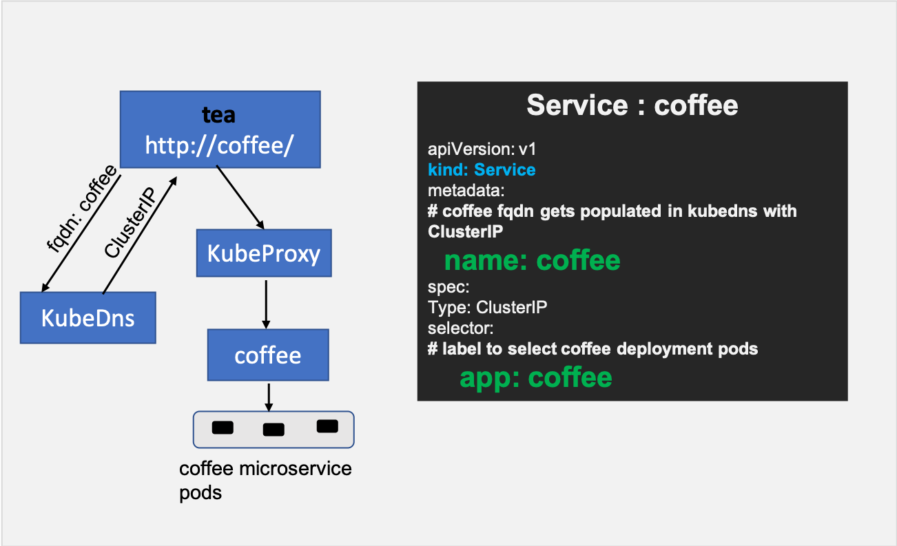
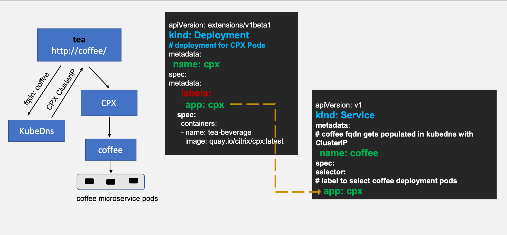
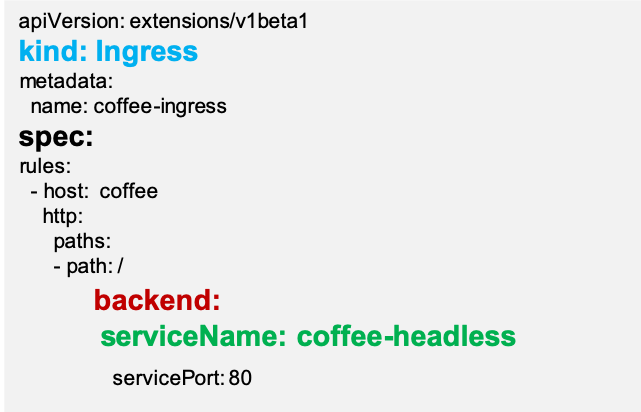
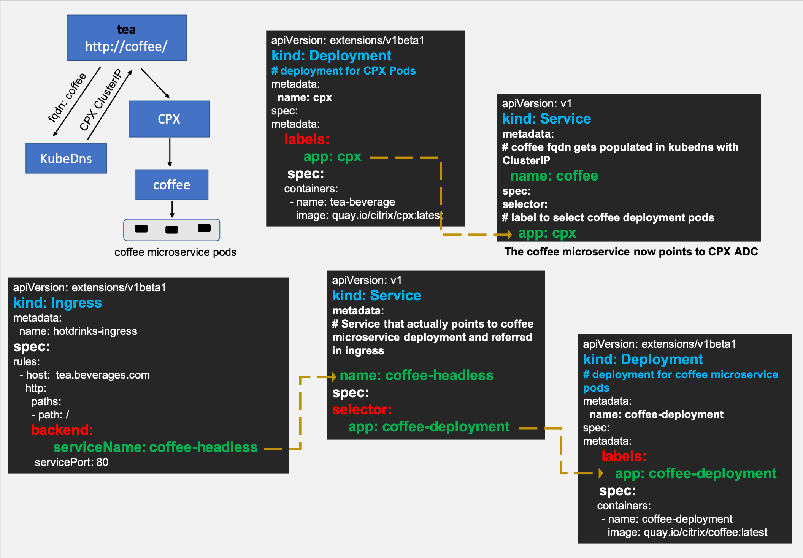
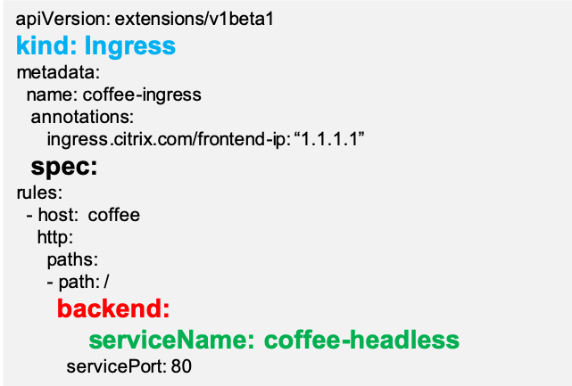
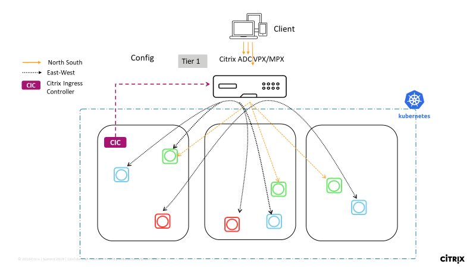

# Service Mesh lite

An Ingress solution (either hardware or virtualized or containerized) typically performs L7 proxy functions for north-south (N-S) traffic. The Service Mesh lite architecture uses the same Ingress solution to manage east-west traffic as well.

In a standard Kubernetes deployment, east-west (E-W) traffic traverses the built-in KubeProxy deployed in each node. KubeProxy being a L4 proxy can only do TCP/UDP based load balancing without the benefits of L7 proxy.

Citrix ADC (MPX, VPX, SDX, or CPX) can provide such benefits for E-W traffic such as:

-  Mutual TLS, SSL offload
-  Content based routing, Allow/Block traffic based on HTTP, HTTPS header parameters
-  Advanced load balancing algorithms (least connections, least response time)
-  Observability of east-west traffic through measuring golden signals (errors, latencies, saturation, traffic volume). Citrix ADM’s Service Graph is an observability solution to monitor and debug microservices.

A Service Mesh architecture (like Istio or LinkerD) can be complex to manage. Service Mesh lite architecture is much simpler to get started to achieve the same requirements.

Let’s start by looking at how KubeProxy is configured to manage east-west traffic.

## East-west communication with KubeProxy

When you create a Kubernetes deployment for a microservice, Kubernetes deploys a set of pods based on the replica count. To access those pods, you create a Kubernetes service which provides an abstraction to access those pods. The abstraction is provided by assigning a Cluster IP address to the service.

Kubernetes DNS gets populated with an address record that maps the service name with the Cluster IP. So, when an application lets say `tea` wants to access a microservice (let’s say) `coffee` then DNS returns the Cluster IP of `coffee` service to `tea` application. The `Tea` application initiates a connection which is then intercepted by KubeProxy to load balance it to a set of `coffee` pods.



## East-west communication with Citrix ADC CPX in Service Mesh Lite architecture

The goal is to insert the Citrix ADC CPX in the east-west path and use Ingress rules to control this traffic. The steps are:

### Step 1: Modify the coffee service definition to point to Citrix ADC CPX

For Citrix ADC CPX to manage east-west traffic, the FQDN of the microservice (for example, `coffee` as mentioned above) should point to Citrix ADC CPX IP address instead of the Cluster IP of the target microservice (`coffee`). (This Citrix ADC CPX deployment can be the same as the Ingress Citrix ADC CPX device.) After this modification, when a pod in the Kubernetes cluster resolves the FQDN for the coffee service, the IP address of the Citrix ADC CPX is returned.



## Step 2: Create a headless service “`coffee-headless`” for coffee microservice pods

Since we have modified `coffee` service to point to Citrix ADC CPX, we need to create one more service that represents coffee microservice deployment.

A sample headless service resource is given below.

```yml
apiVersion: v1
kind: Service
metadata:
  name: coffee-headless
spec:
#headless Service
  clusterIP: None
  ports:
  - name: coffee-443
    port: 443
    targetPort: 443
  selector:
    name: coffee-deployment
```

### Step 3: Create an ingress resource with rules for "`coffee-headless`" service

With the above changes, we are now ready to create an ingress object that configures the Citrix ADC CPX to control the east-west traffic to the coffee microservice pods.

A sample ingress resource is given below.



Using the usual Ingress load balancing methodology with above changes, Citrix ADC CPX can now load balance east-west traffic. The following diagrams show how Citrix ADC CPX Service Mesh Lite architecture provides L7 proxying for east-west communication between `tea` and `coffee` microservices using Ingress rules:



## East-west communication with Citrix ADC MPX or VPX in Service Mesh Lite architecture

Citrix ADC MPX or VPX acting as an ingress can also load balance east-west microservice communication in a similar way as mentioned above with slight modifications. The below procedure shows how to achieve the same.

### Step 1: Create external service resolving the coffee host name to Citrix ADC MPX/VPX IP address

There are two ways to do it. You can add an external service mapping a host name or by using an IP address.

#### Mapping by a host name (CNAME)

-  Create a domain name for ingress endpoint IP(Content Switching virtual server IP address) in Citrix ADC MPXor VPX lets say `myadc–instance1.us-east-1.mydomain.com` and update it in your DNS server.
-  Create a Kubernetes service for `coffee` with `externalName` as `myadc–instance1.us-east-1.mydomain.com`.
-  Now, when any pod looks up for the `coffee` microservice a `CNAME`(`myadc–instance1.us-east-1.mydomain.com`) is returned.

```yml
kind: Service
apiVersion: v1
metadata:
name: coffee
spec:
type: ExternalName
externalName: myadc–instance1.us-east-1.mydomain.com
```

#### Mapping a host name to an IP address

When you want your application to use the host name `coffee` that will redirect to virtual IP address hosted in Citrix ADC MPX or VPX, you can create the following.

```yml
---
kind: "Service"
apiVersion: "v1"
metadata:
  name: "coffee"
spec:
  ports:
    -
      name: "coffee"
      protocol: "TCP"
      port: 80
---
kind: "Endpoints"
apiVersion: "v1"
metadata:
  name: "coffee"
subsets:
  -
    addresses:
      -
        ip: "1.1.1.1" # Ingress IP in MPX
    ports:
      -
        port: 80
        name: "coffee"
```

### Step 2: Create a headless service “`coffee-headless`” for the "`coffee`" microservice pods

Since we have modified coffee service to point to Citrix ADC MPX, we need to create one more service that represents coffee microservice deployment.

### Step 3: Create an ingress resource with rules for “`coffee-headless`” service having the "`ingress.citrix.com/frontend-ip`" annotation
  
Create an ingress resource using `ingress.citrix.com/frontend-ip` annotation where the value matches the ingress endpoint IP address in Citrix ADC MPX or VPX.

With the above changes we are now ready to create an ingress object that configures the Citrix ADC MPX or VPX to control the east-west traffic to the coffee microservice pods.

A sample ingress resource is given below.



Using the usual ingress load balancing methodology with above changes Citrix ADC MPX can now load balance east-west traffic. The following diagram shows the Citrix ADC MPX or VPX configured as N-S and E-W proxy using ingress rules.



## Automated deployment of applications in Service Mesh lite

To deploy an application in a Service Mesh lite architecture, you need to perform multiple tasks which include:

- Modifying the existing services to make them headless services
- Creating a service to point to Citrix ADC CPX
- Creating Ingress rules

However, when you want to deploy multiple applications which consist of several microservices, you may need an easier way you deploy the services in a Service Mesh lite architecture. Citrix provides you an automated way to generate ready to deploy YAMLs out of your application YAMLs for Service Mesh lite deployment.

This topic provides information on how to generate all the necessary YAMLs for Service Mesh lite deployment from your existing YAMLs using the Citrix provided script.

**Prerequisites**

You need to provide a few inputs which are explained in the following section while running the script for your microservice applications.

### Information on required inputs

This section provides information on the details of inputs you need to provide.

1. Provide one of the following while running the script:

   - Provide the YAML file that contains your application deployments and services. If you are choosing this option, you can directly go to step 2.

   - Provide all service names and the namespace in which they are already running in a Kubernetes cluster. Deployment YAMLs remain the same for running an application in SML architecture, so they can be used as it is. In this case you must provide more inputs as follows:

        You can run the applications from a Kubernetes cluster where the provided services are already running or from a client. Depending on the option you need, choose `Yes` or `No`.
  
            Do you want to connect to a Remote Kubernetes Cluster? (Y/N):
        
        If you are running script from a Kubernetes cluster where the services that you want the SML yamls for are already running then choose which `Kubeconfig` file to use.


        - Choose `Y` if you want to use the default `kubeconfig` file of the Kubernetes cluster.

                    
                     Do you want to use default kubeconfig file present at "/root/.kube/config"? (Y/N):

        - Otherwise, provide the path of the `kubeconfig` file that you want to use:  

                     Please provide path of kubeconfig file:
                    

    
        If you want to run the application from a client, the remote Kubernetes cluster can be accessed either using a bearer token or the `Kubeconfig` file.
      
        - If the remote cluster is accessed using bearer token, provide the following inputs.
    
        
          1. Choose `Y` if you are using a bearer token to access the remote Kubernetes Cluster:
           
           
           
                    Do you want to use Bearer Token for connecting to a Remote Kubernetes Cluster? (Y/N):
           
        
        
          2. Provide the bearer token.
           
           
                    Please provide Bearer Token key of SA having permission to access given service:

        
          3. Provide API server and port number of the remote Kubernetes cluster.
           
           
                  Please provide API server <IP:PORT>: x.x.x.x:<port>
           
  
        -  If the remote cluster is accessed using the `Kubeconfig` File, provide the following inputs.
  
           1. Choose `N` if you are using `Kubeconfig` File to access the remote Kubernetes Cluster:
          
           
                    Do you want to use bearer token for connecting to a Remote Kubernetes Cluster? (Y/N):
           
    
           2. Provide the path of the `kubeconfig` file of the remote Kubernetes Cluster:
           
           
                    Please provide the path of the kubeconfig file:
        

2. Provide the name of the front-end microservice of the application.
     
     
        Please provide the name of the service exposed to tier-1:
    
3. Provide the host name for the application.

     
        Please provide hostname for exposing the "<frontend-micoservice-name>" service:
     

4. Provide information about the protocol which your microservice is using. The value can be `tcp`,`udp`,`http`,`https`, or `grpc`.
     
     
        Please enter protocol to be used for service "<service-name>" (tcp/udp/http/https/grpc):
     

5. If the Kubernetes service YAML for your microservice is exposing more than one port, then provide the port that is working on the protocol you provided in the previous step.

     
        Found multiple ports in the service "<service-name>". Please enter port to be used <port-list>:
        

6. If the HTTPS protocol is being used by any service, provide the secret to configure TLS certificates for Citrix ADC SSL-based virtual servers.
   
     
        Please give secret-name for TLS certificate:
     

For more information on TLS certificate handling by the Citrix ingress controller, see [TLS certificates handling in the Citrix ingress controller](https://github.com/citrix/citrix-k8s-ingress-controller/blob/master/docs/certificate-management/tls-certificates.md).

>**Note:**
>You must create the Kubernetes secret used for the certificates before applying the service mesh lite YAMLs.

### Create Service Mesh lite YAMLs

1. Clone the citrix-k8s-ingress-controller repository from GitHub using the following command.

       git clone https://github.com/citrix/citrix-k8s-ingress-controller.git

2. Go to the repository and change your directory to `sml`

         cd docs/how-to/sml

3. Run one of the following commands.


        python3 smlite.py <list-of-path-of-application-yaml-seperated-by-comma>

        or

        python3 smlite.py <list-of-service-names-deployed-in-the-cluster-seperated-by-comma> <namespace>


    For example:

        python3 smlite.py example/hotdrinks-all-in-one.yaml
        Please provide name of the service exposed to tier-1: frontend
        Please provide hostname for exposing "frontend" service: hotdrink.beverages.com
        Please enter protocol to be used for service "tea" (tcp/udp/http/https/grpc): https
        Found multiple ports in the service "tea". Please enter port to be used 80, 443: 443
        Please give secret-name for TLS certificate: hotdrink-secret
        Please enter protocol to be used for service "coffee" (tcp/udp/http/https/grpc): https
        Found multiple ports in the service "coffee". Please enter port to be used 80, 443: 443
        Please give secret-name for TLS certificate: hotdrink-secret
        Please enter protocol to be used for service "frontend" (tcp/udp/http/https/grpc): https
        Found multiple ports in the service "frontend". Please enter port to be used 80, 443: 443
        Please give secret-name for TLS certificate: hotdrink-secret
        2020-04-14 12:04:01,683 - SMLITE - INFO - ServiceMesh Lite YAMLs are created and is present in "smlite-all-in-one.yaml" file.

    A YAML named `smlite-all-in-one.yaml`  gets created with all the YAML files of your application for Service Mesh lite architecture.

    **Note:** If you have used service names which are running inside a cluster to generate the Service Mesh lite YAMLs for them, `smlite-all-in-one.yaml` file which gets generated at the end of the script execution will not have deployment YAMLs of application in it. In that case, you must deploy the deployment YAMLs which are there in the application along with the `smlite-all-in-one.yaml` file for running your application in the SML architecture.

4. Deploy the ingress YAML file to expose Citrix ADC CPX (the Citrix ADC CPX handling front-end microservice) service to tier-1 Citrix ADC VPX or MPX and the [Citrix Ingress Controller](https://github.com/citrix/citrix-k8s-ingress-controller) to access your application from outside.

### Limitations

The following limitations apply to the automation procedure to generate YAMLs for the Service Mesh lite deployment.

  - Multiple namespaces are not supported while using this automation script. All YAMLs created by the script work only for the single namespace.

  - Only [dual-tier deployment](https://developer-docs.citrix.com/projects/citrix-k8s-ingress-controller/en/latest/deployment-topologies/#dual-tier-topology) architecture is supported.