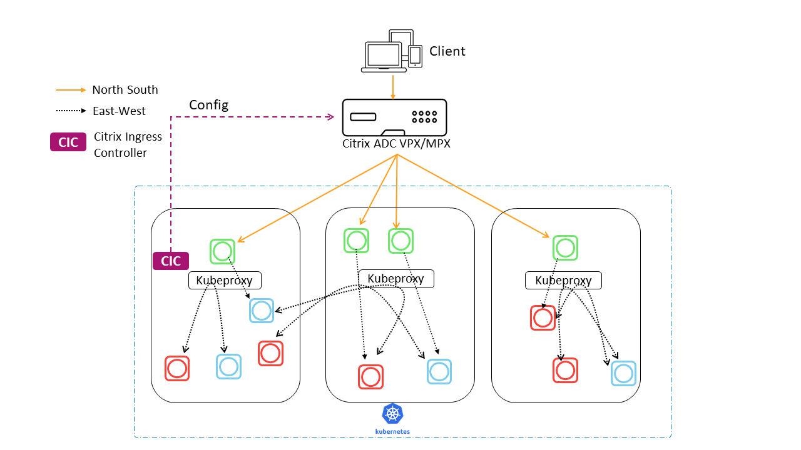
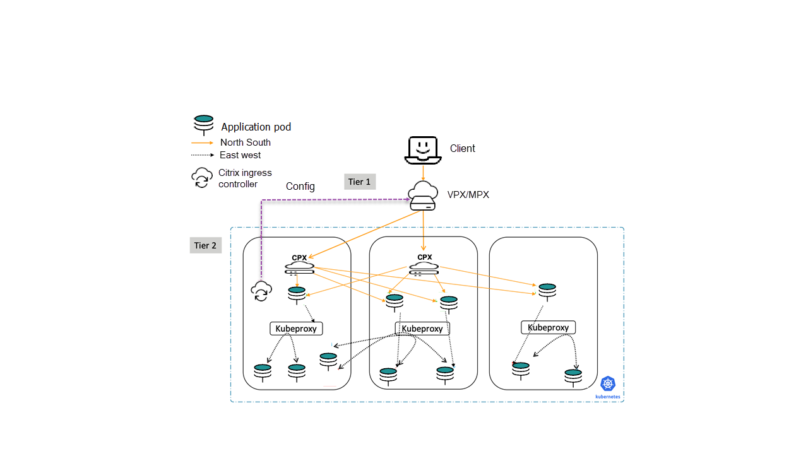
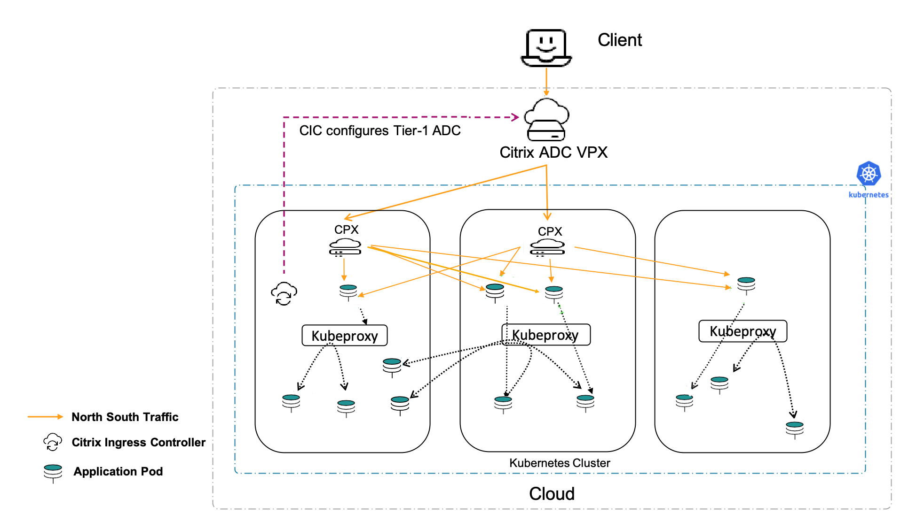
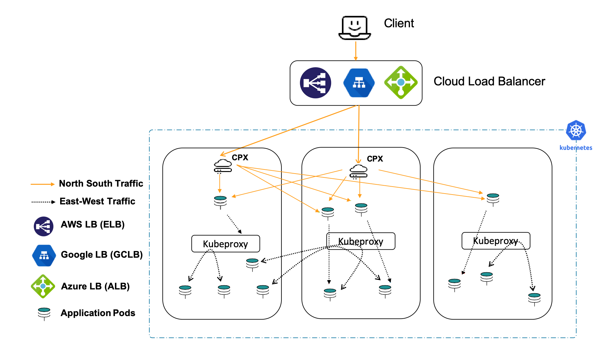
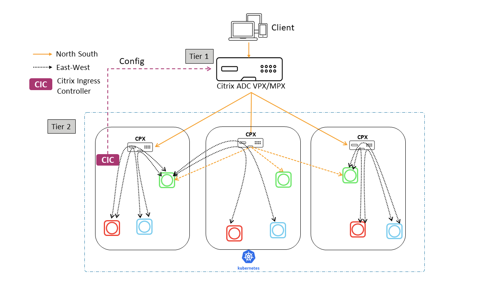
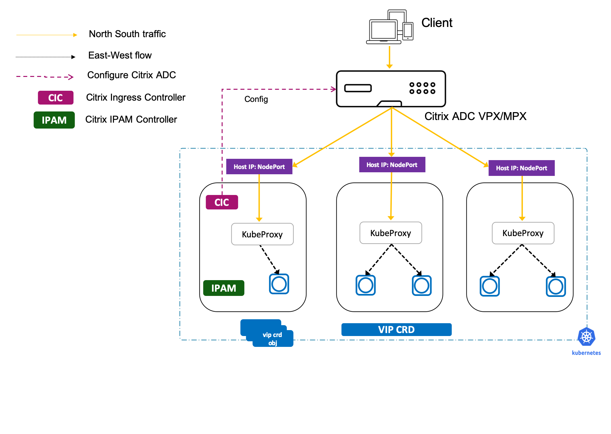
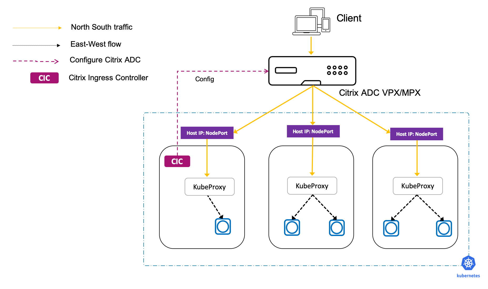

# Deployment topologies

Citrix ADCs can be combined in powerful and flexible topologies that complement organizational boundaries. Dual-tier deployments employ high-capacity hardware or virtualized Citrix ADCs (Citrix ADC MPX and VPX) in the first tier to offload security functions and implement relatively static organizational policies while segmenting control between network operators and Kubernetes operators.

In Dual-tier deployments, the second tier is within the Kubernetes Cluster (using the Citrix ADC CPX) and is under control of the service owners. This setup provides stability for network operators, while allowing Kubernetes users to implement high-velocity changes. Single-tier topologies are suited to organizations that need to handle high rates of change.

## Single-Tier topology

In a Single-Tier topology, Citrix ADC MPX or VPX devices proxy the (North-South) traffic from the clients to microservices inside the cluster. The Citrix ingress controller is deployed as a standalone pod in the Kubernetes cluster. The controller automates the configuration of Citrix ADCs (MPX or VPX) based on the changes to the microservices or the Ingress resources.

## Dual-Tier topology

In Dual-Tier topology, Citrix ADC MPX or VPX devices in Tier-1 proxy the traffic (North-South) from the client to Citrix ADC CPXs in Tier-2. The Tier-2 Citrix ADC CPX then routes the traffic to the microservices in the Kubernetes cluster. The Citrix ingress controller deployed as a standalone pod configures the Tier-1 devices. And, the sidecar controller in one or more Citrix ADC CPX pods configures the associated Citrix ADC CPX in the same pod.

## Cloud topology

Kubernetes clusters in public clouds such as [Amazon Web Services (AWS)](https://aws.amazon.com), [Google Cloud](https://cloud.google.com), and [Microsoft Azure](https://azure.microsoft.com/en-in/) can use their native load balancing services such as, [AWS Elastic Load Balancing](https://aws.amazon.com/elasticloadbalancing/), [Google Cloud Load Balancing](https://cloud.google.com/load-balancing/), and [Microsoft Azure NLB](https://azure.microsoft.com/en-in/services/load-balancer/) as the first (relatively static) tier of load balancing to a second tier of Citrix ADC CPX. Citrix ADC CPX operates inside the Kubernetes cluster with the sidecar Ingress controller. The Kubernetes clusters can be self-hosted or managed by the cloud provider (for example, [AWS EKS](https://aws.amazon.com/eks/), [Google GKE](https://cloud.google.com/kubernetes-engine/) and [Azure AKS](https://docs.microsoft.com/en-us/azure/aks/)) while using the Citrix ADC CPX as the Ingress. If the cloud-based Kubernetes cluster is self-hosted or self-managed, the Citrix ADC VPX can be used as the first tier in a Dual-tier topology.

**Cloud deployment with Citrix ADC (VPX) in tier-1:**

**Cloud deployment with Cloud LB in tier-1:**

## Service mesh lite

When the Citrix ADC CPX is deployed inside the cluster as an Ingress, it can be used to proxy network (East-West) traffic between microservices within the cluster. For this, the target microservice needs to be deployed in [headless](https://kubernetes.io/docs/concepts/services-networking/service/#headless-services) mode to bypass [kube-proxy](https://kubernetes.io/docs/concepts/overview/components/#kube-proxy), so that you can benefit from the advanced ADC functionalities provided by Citrix ADC.  

## Services of type LoadBalancer

Service of type `LoadBalancer` in Kubernetes enables you to directly expose services to the outside world without using an ingress resource. It’s generally made available only by cloud providers, who spin up their own native cloud load balancers and assign an external IP address through which the service is accessed. This helps you to deploy microservices easily and expose them outside the Kubernetes cluster.

By default, in a bare metal Kubernetes cluster, service of type `LoadBalancer` simply exposes `NodePorts` for the service. And, it does not configure external load balancers.

The Citrix ingress controller supports the services of type `LoadBalancer`. You can create a service of type `LoadBalancer` and expose it using the ingress Citrix ADC in Tier-1. The ingress Citrix ADC provisions a load balancer for the service and an external IP address is assigned to the service. The Citrix ingress controller allocates the IP address using the [Citrix IPAM controller](crds/vip.md).

For more information, see [Expose services of type LoadBalancer](network/type_loadbalancer.md).

## Services of type NodePort

By default, Kubernetes services are accessible using the [cluster IP](https://kubernetes.io/docs/concepts/services-networking/service/#defining-a-service) address. The cluster IP address is an internal IP address that can be accessed within the Kubernetes cluster. To make the service accessible from outside of the Kubernetes cluster, you can create a service of type `NodePort`.

The Citrix ingress controller supports services of type `NodePort`. Using the Ingress Citrix ADC and Citrix ingress controller, you can expose the service of type `NodePort` to the outside world.

For more information, see [Expose services of type NodePort](network/nodeport.md).

