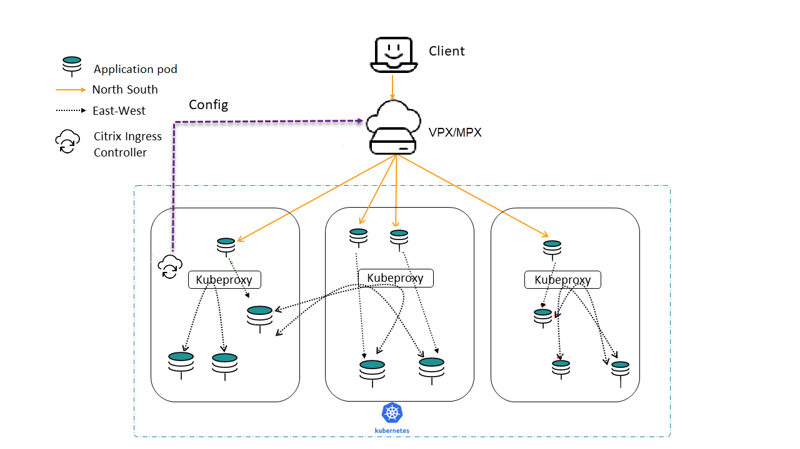
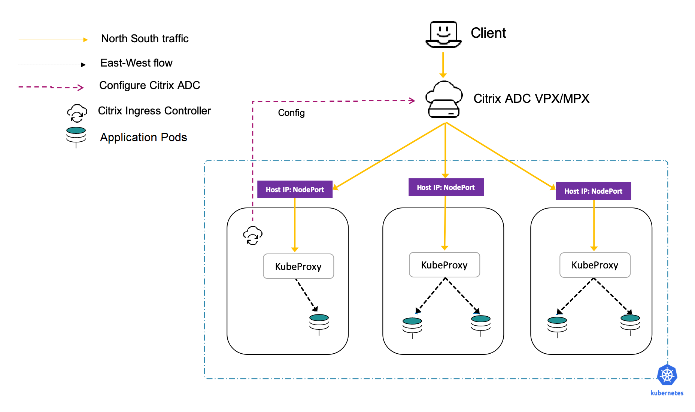

# Deployment topologies

Citrix ADCs can be combined in powerful and flexible topologies that complement organizational boundaries. Dual-tier deployments employ high-capacity hardware or virtualized Citrix ADCs (Citrix ADC MPX and VPX) in the first tier to offload security functions and implement relatively static organizational policies while segmenting control between network operators and Kubernetes operators.

In Dual-tier deployments, the second tier is within the Kubernetes Cluster (using the Citrix ADC CPX) and is under the control of the service owners. This setup provides stability for network operators, while allowing Kubernetes users to implement high-velocity changes. Single-tier topologies are suited to organizations that need to handle high rates of change.

## Single-Tier topology

In a Single-Tier topology, Citrix ADC MPX or VPX devices proxy the (north-south) traffic from the clients to microservices inside the cluster. The Citrix ingress controller is deployed as a standalone pod in the Kubernetes cluster. The controller automates the configuration of Citrix ADCs (MPX or VPX) based on the changes to the microservices or the Ingress resources.

## Dual-Tier topology

In Dual-Tier topology, Citrix ADC MPX or VPX devices in Tier-1 proxy the traffic (north-south) from the client to Citrix ADC CPXs in Tier-2. The Tier-2 Citrix ADC CPX then routes the traffic to the microservices in the Kubernetes cluster. The Citrix ingress controller deployed as a standalone pod configures the Tier-1 devices. And, the sidecar controller in one or more Citrix ADC CPX pods configures the associated Citrix ADC CPX in the same pod.

## Cloud topology

Kubernetes clusters in public clouds such as [Amazon Web Services (AWS)](https://aws.amazon.com), [Google Cloud](https://cloud.google.com), and [Microsoft Azure](https://azure.microsoft.com/en-in/) can use their native load balancing services such as, [AWS Elastic Load Balancing](https://aws.amazon.com/elasticloadbalancing/), [Google Cloud Load Balancing](https://cloud.google.com/load-balancing/), and [Microsoft Azure NLB](https://azure.microsoft.com/en-in/services/load-balancer/) as the first (relatively static) tier of load balancing to a second tier of Citrix ADC CPX. Citrix ADC CPX operates inside the Kubernetes cluster with the sidecar Ingress controller. The Kubernetes clusters can be self-hosted or managed by the cloud provider (for example, [AWS EKS](https://aws.amazon.com/eks/), [Google GKE](https://cloud.google.com/kubernetes-engine/) and [Azure AKS](https://docs.microsoft.com/en-us/azure/aks/)) while using the Citrix ADC CPX as the Ingress. If the cloud-based Kubernetes cluster is self-hosted or self-managed, the Citrix ADC VPX can be used as the first tier in a Dual-tier topology.

**Cloud deployment with Citrix ADC (VPX) in tier-1:**

**Cloud deployment with Cloud LB in tier-1:**

## Service mesh lite

An Ingress solution typically performs layer 7 proxy functions for traffic from client to microservices inside the Kubernetes cluster (north-south traffic). The Service mesh lite architecture uses the same Ingress solution to manage the traffic across services with in the Kubernetes cluster (east-west traffic) as well. Typically a service mesh solution is used for managing east-west traffic, but it is heavier and complex to manage. Service mesh lite solution is a simplified version of the service mesh architecture and ideal when there is a need to manage both north-south and east-west traffic management. In a service mesh, there are as many sidecar proxies as the number of applications. But, in the service mesh lite architecture, a proxy is deployed as a standalone proxy managing multiple East-West connections. Hence, the Service mesh lite solution is lighter compared to a service mesh
because the number of proxies required are less.

In a standard Kubernetes deployment, east-west traffic traverses the built-in kube-proxy deployed in each node. [Kube-proxy](https://kubernetes.io/docs/concepts/overview/components/#kube-proxy) being a L4 proxy can only do TCP/UDP based load balancing without the benefits of L7 proxy.

Citrix ADC (MPX, VPX, or CPX) can provide such benefits for east-west traffic such as:

-  Mutual TLS or SSL offload
-  Content based routing, allow, or block traffic based on HTTP or HTTPS header parameters
-  Advanced load balancing algorithms (for example, least connections, least response time and so on.)
-  Observability of east-west traffic through measuring golden signals (errors, latencies, saturation, or traffic volume). [Citrix ADM’s](https://docs.citrix.com/en-us/citrix-application-delivery-management-service.html) Service Graph is an observability solution to monitor and debug microservices.

For more information, see [Service mesh lite](deploy/service-mesh-lite.md).  

Following are some of the scenarios when service mesh lite topology is recommended:

-  When you need both the north-south and the east-west traffic management for microservices.
-  When you need the east-west traffic management through a proxy deployed as a standalone proxy and not as sidecar proxies to microservices.
-  When you need the proxy inside the Kubernetes cluster to perform both north-south and east-west traffic management.
-  When you need the benefits of service mesh, but wants a lighter and simpler solution.

## Services of type LoadBalancer

Services of type `LoadBalancer` in Kubernetes enables you to directly expose services to the outside world without using an ingress resource. It is made available only by cloud providers, who spin up their own native cloud load balancers and assign an external IP address through which the service is accessed. This helps you to deploy microservices easily and expose them outside the Kubernetes cluster.

By default, in a bare metal Kubernetes cluster, service of type `LoadBalancer` simply exposes `NodePorts` for the service. And, it does not configure external load balancers.

The Citrix ingress controller supports the services of type `LoadBalancer`. You can create a service of type `LoadBalancer` and expose it using the ingress Citrix ADC in Tier-1. The ingress Citrix ADC provisions a load balancer for the service and an external IP address is assigned to the service. The Citrix ingress controller allocates the IP address using the [Citrix IPAM controller](crds/vip.md).

For more information, see [Expose services of type LoadBalancer](network/type_loadbalancer.md).

## Services of type NodePort

By default, Kubernetes services are accessible using the [cluster IP](https://kubernetes.io/docs/concepts/services-networking/service/#defining-a-service) address. The cluster IP address is an internal IP address that can be accessed within the Kubernetes cluster. To make the service accessible from the outside of the Kubernetes cluster, you can create a service of the type `NodePort`.

The Citrix ingress controller supports services of type `NodePort`. Using the Ingress Citrix ADC and Citrix ingress controller, you can expose the service of type `NodePort` to the outside world.

For more information, see [Expose services of type NodePort](network/nodeport.md).

## Guidelines for choosing the topology

The following information helps you to choose the right deployment among the topologies Single-Tier and Dual-tier based on your needs.

### Single-Tier (Unified Ingress)

Following are some of the scenarios when Single-Tier (unified ingress) topology is recommended and the benefits:

-  Easy to start and adopt because you can use the existing NetScaler as the ingress proxy in front of the Kubernetes cluster.
-  When the Network team manages both NetScaler and the Kubernetes deployment.
-  Your workload running as microservices is less and a Kubernetes proxy inside the Kubernetes cluster is not required.
-  More suitable for north-south traffic deployments.

### Dual-Tier

Following are some of the scenarios when Dual-Tier ingress topology is preferred and the benefits:

-  When you have significant workload running as microservices there is a need for a proxy inside the Kubernetes cluster.
-  When the external proxy (managed by the network team) and Kubernetes proxies (managed by platform team) are managed by two different teams.
-  You need segregation of functions for proxies external to Kubernetes and for proxies inside Kubernetes. For example, WAF, and SSL offload on external NetScaler and policy enforcement and rate limiting on the Kubernetes proxy.
-  The proxy inside the Kubernetes cluster performs north-south traffic management only.

## Deployment using Helm charts and the Citrix deployment builder

For deploying Citrix cloud native topologies, there are various options available using YAML and Helm charts. Helm charts are one of the easiest ways for deployment in a Kubernetes environment. When you deploy using the Helm charts, you can use a `values.yaml` file to specify the values of the configurable parameters instead of providing each parameter as an argument.

You can generate the `values.yaml` file for Citrix cloud native deployments using the [Citrix deployment builder](https://citrix.github.io/citrix-k8s-ingress-controller/), which is a GUI.

The following topologies are supported by the Citrix deployment builder:

-  Single-Tier

    -  Ingress

    -  Service type LoadBalancer

-  Dual-Tier

    -  Citrix ADC CPX as NodePort

    -  Citrix ADC CPX as service of type LoadBalancer

-  Multi-cluster Ingress

-  Service mesh

For detailed information on how to use the Citrix deployment builder, see the [Citrix deployment builder blog](https://www.citrix.com/blogs/2021/03/02/citrix-deployment-builder-simplifying-citrix-cloud-native-deployments/#).

