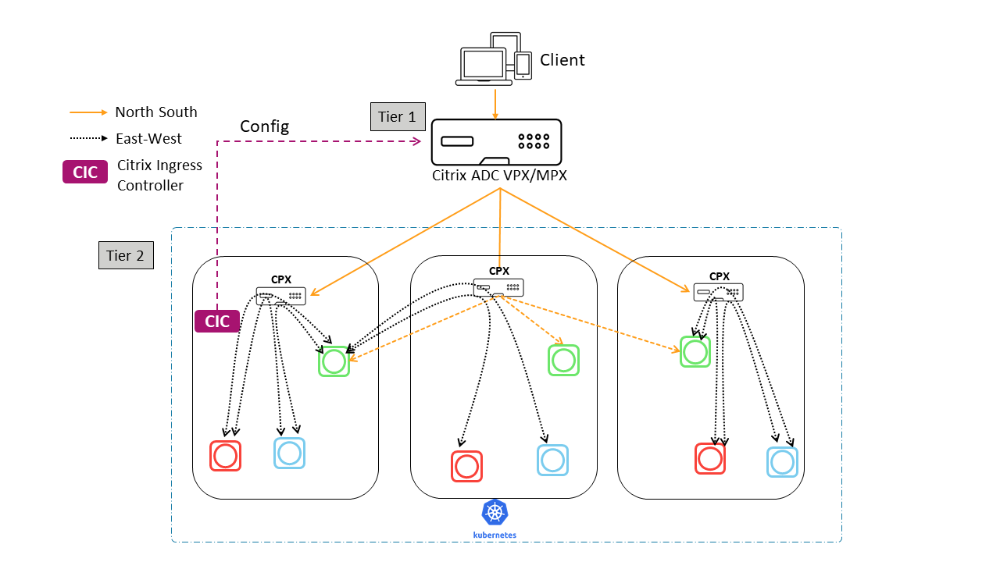

# Dual Tier Topology with Hairpin E-W

In Dual Tier deployment with Hairpin E-W mode the Tier-1 Citrix ADC load balances the  Tier-2 Citrix ADCs(CPX) and CPX load balances the  microservices.
CPX load balances the N-S traffic as well the E-W traffic between microservices.
The microservices are deployed in headless mode to bypass kube-proxy to get the benefits of advanced ADC functionalities that Citrix ADC provides.
Citrix Ingress Controller automates the configuration of CITRIX ADC(VPX/MPX) with the help of ingress which exposes these applications.
CPX has inbuilt controller that configures the CPX based upon the Ingress resources.

