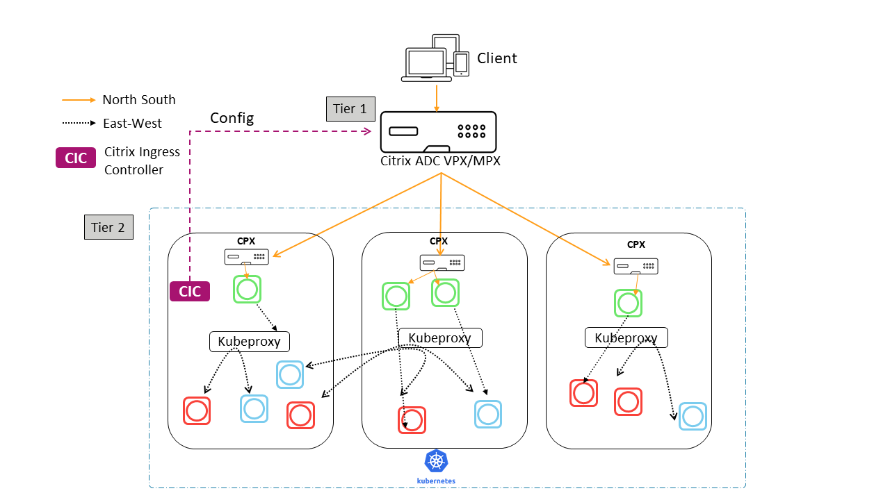

# Dual Tier Topology

In Dual Tier deployment mode the Tier-1 Citrix ADC load balances the  Tier-2 Citrix ADC(CPX) and CPX load balances the frontend microservice applications.
Citrix ingress Controller automates the configuration of CITRIX ADC(VPX/MPX) with the help of ingress which exposes these applications.
CPX has inbuilt CIC that configures the CPX based upon the ingress.

