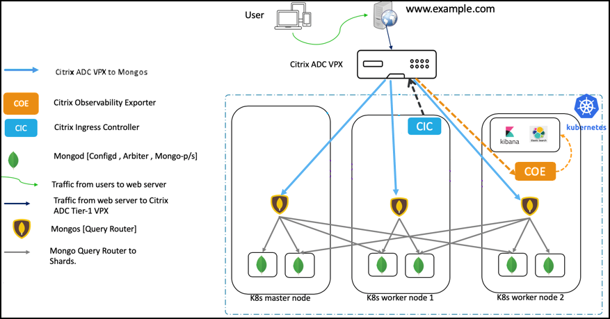
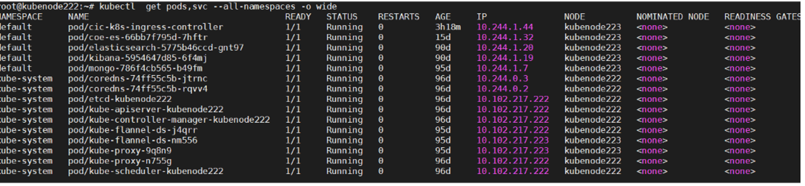
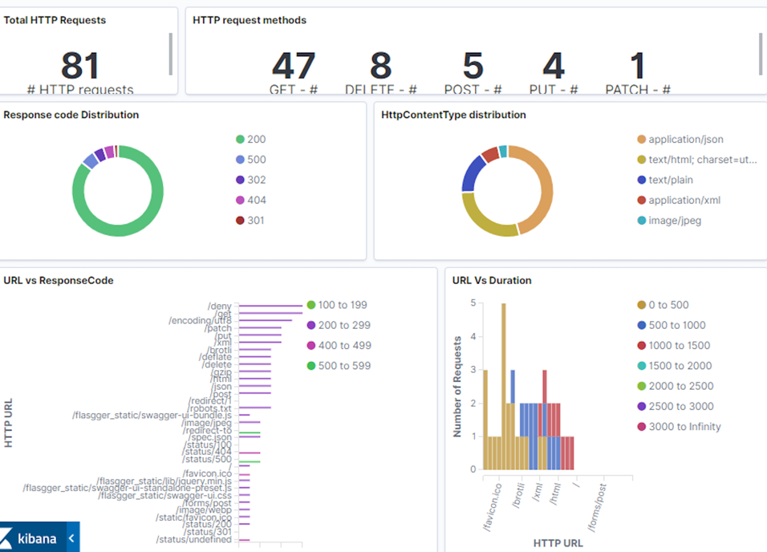

# Single tier Citrix Ingress solution for MongoDB

MongoDB is one of the most popular NoSQL databases which is designed to process and store massive amounts of unstructured data. Cloud-native applications widely use MongoDB as a NoSQL database in the Kubernetes platform.

To identify and troubleshoot performance issues are a challenge in a Kubernetes environment due to the massive scale of application deployments. For database deployments like MongoDB, monitoring is a critical component of database administration to ensure that high availability and high performance requirements are met.

Citrix provides an ingress solution for load balancing and monitoring MongoDB databases on a Kubernetes platform using the advanced load balancing and performance monitoring capabilities of Citrix ADCs. Citrix Ingress solution for MongoDB provides you deeper visibility into MongoDB transactions and helps you to quickly identify and address performance issues whenever they occur. Using [Citrix ADC observability exporter](https://github.com/citrix/citrix-observability-exporter), you can export the MongoDB transactions to [Elasticsearch](https://www.elastic.co/products/elasticsearch) and visualize them using [Kibana](https://www.elastic.co/kibana) dashboards to get deeper insights.

The following diagram explains Citrix Ingress solution for MongoDB using a single-tier deployment of Citrix ADC.



In this solution, a Citrix ADC VPX is deployed outside the Kubernetes cluster (Tier-1) and Citrix ADC observability exporter is deployed inside the Kubernetes cluster.

The Tier-1 Citrix ADC VPX routes the traffic (North-South) from MongoDB clients to Mongo DB query routers (Mongos) in the Kubernetes cluster. Citrix observability exporter is deployed inside the Kubernetes cluster.


As part of this deployment, an Ingress resource is created for Citrix ADC VPX (Tier-1 Ingress). The Tier-1 Ingress resource defines rules to enable load balancing for MongoDB traffic on Citrix ADC VPX and specifies the port for Mongo. Whenever MongoDB traffic arrives on the specified port on a Citrix ADC VPX, it routes this traffic to one of the Mongo service instances mentioned in the Ingress rule. Mongo service is exposed by the MongoDB administrator, and the same service instance is specified in the Ingress.

The Citrix observability exporter instance aggregates transactions from Citrix ADC VPX and uploads them to the Elasticsearch server. You can set up Kibana dashboards to visualize the required data (for example, query response time, most queried collection names) and analyze them to get meaningful insights. Only insert, update, delete, find, and reply operations are parsed and metrics are sent to the Citrix Observability Exporter.

## Prerequisites

You must complete the following steps before deploying the Citrix Ingress solution for MongoDB.

- Set up a Kubernetes cluster in cloud or on-premises
- Deploy MongoDB in the Kubernetes cluster with deployment mode as [sharded replica set](https://docs.mongodb.com/manual/tutorial/deploy-shard-cluster/). Other deployment modes for MongoDB are not supported.

- Ensure that you have Elasticsearch installed and configured. Use the [elasticsearch.yaml](https://github.com/citrix/citrix-observability-exporter/blob/master/examples/elasticsearch/elasticsearch.yaml) file for deploying Elasticsearch.
- Ensure that you have installed Kibana to visualize your transaction data. Use the [kibana.yaml](https://github.com/citrix/citrix-observability-exporter/blob/master/examples/elasticsearch/kibana.yaml) file for deploying Kibana.
- Deploy a Citrix ADC VPX instance outside the Kubernetes cluster. For instructions on how to deploy Citrix ADC VPX, see [Deploy a Citrix ADC VPX instance](https://docs.citrix.com/en-us/citrix-adc/13/deploying-vpx.html).

Perform the following after you deploy the Citrix ADC VPX:

1. Configure an IP address from the subnet of the Kubernetes cluster as SNIP on the Citrix ADC. For information on configuring SNIPs in Citrix ADC, see [Configuring Subnet IP Addresses (SNIPs)](https://docs.citrix.com/en-us/citrix-adc/13/networking/ip-addressing/configuring-citrix-adc-owned-ip-addresses/configuring-subnet-ip-addresses-snips.html).

2. Enable management access for the SNIP that is the same subnet of the Kubernetes cluster. The SNIP should be used as `NS_IP` variable in the [Citrix ingress controller YAML](https://github.com/citrix/citrix-k8s-ingress-controller/blob/master/deployment/dual-tier/manifest/tier-1-vpx-cic.yaml) file to enable the Citrix ingress controller to configure the Tier-1 Citrix ADC.

    >**Note:**
    >It is not mandatory to use SNIP as `NS_IP`. If the management IP address of the Citrix ADC is reachable from the Citrix ingress controller then you can use the management IP address as `NS_IP`.

3. Create a [Citrix ADC system user account](https://developer-docs.citrix.com/projects/citrix-k8s-ingress-controller/en/latest/deploy/deploy-cic-yaml/#create-system-user-account-for-citrix-ingress-controller-in-citrix-adc) specific to the Citrix ingress controller. The Citrix ingress controller uses the system user account to automatically configure the Tier-1 Citrix ADC.

1. Configure Citrix ADC VPX to forward DNS queries to CoreDNS pod IP addresses in the Kubernetes cluster. 
 
        add dns nameServer <core-dns-pod-ip-address>

    For example, if the pod IP addresses are 10.244.0.2 and 10.244.0.3, configure the name servers on Citrix ADC VPX as:

        add dns nameServer 10.244.0.3
        add dns nameServer 10.244.0.2

## Deploy the Citrix Ingress solution for MongoDB

When you deploy the Citrix Ingress solution for MongoDB, you deploy the following components in the Kubernetes cluster:

- A stand-alone Citrix ingress controller for Citrix ADC VPX
- An Ingress resource for Citrix ADC VPX
- Citrix Observability Exporter

Perform the following steps to deploy the Citrix Ingress solution for MongoDB.

1. Create a Kubernetes secret with the user name and password for Citrix ADC VPX.

        kubectl create secret  generic nslogin --from-literal=username='username' --from-literal=password='mypassword'

1. Download the [cic-configmap.yaml](https://raw.githubusercontent.com/citrix/citrix-observability-exporter/master/examples/elasticsearch/cic-configmap.yaml) file and then deploy it using the following command.

        kubectl create -f cic-configmap.yaml

2. Deploy the Citrix ingress controller as a pod using the following steps.
      
    1.  Download the Citrix ingress controller manifest file. Use the following command:

            wget https://raw.githubusercontent.com/citrix/citrix-k8s-ingress-controller/master/deployment/dual-tier/manifest/tier-1-vpx-cic.yaml

    2.  Edit the Citrix ingress controller manifest file and enter the values for the following environmental variables:

        | Environment Variable | Mandatory or Optional | Description |
        | ---------------------- | ---------------------- | ----------- |
        | NS_IP | Mandatory | The IP address of the Citrix ADC appliance. For more details, see [Prerequisites](/docs/deploy/deploy-cic-yaml.md#prerequisites). |
        | NS_USER and NS_PASSWORD | Mandatory | The user name and password of the Citrix ADC VPX or MPX appliance used as the Ingress device. |
        | EULA | Mandatory | The End User License Agreement. Specify the value as `Yes`.|
        | LOGLEVEL | Optional | The log levels to control the logs generated by Citrix ingress controller. By default, the value is set to DEBUG. The supported values are: CRITICAL, ERROR, WARNING, INFO, and DEBUG.
        | NS_PROTOCOL and NS_PORT | Optional | Defines the protocol and port that must be used by the Citrix ingress controller to communicate with Citrix ADC. By default, the Citrix ingress controller uses HTTPS on port 443. You can also use HTTP on port 80. |
        | ingress-classes | Optional | If multiple Ingress load balancers are used to load balance different Ingress resources. You can use this environment variable to specify the Citrix ingress controller to configure Citrix ADC associated with a specific Ingress class. For information on Ingress classes, see [Ingress class support](../configure/ingress-classes.md)|
        | NS_VIP | Optional | Citrix ingress controller uses the IP address provided in this environment variable to configure a virtual IP address to the Citrix ADC that receives Ingress traffic. **Note:** NS_VIP takes precedence over the [frontend-ip](https://github.com/citrix/citrix-k8s-ingress-controller/blob/master/docs/annotations.md) annotation. |
    
    1. Specify or modify the following arguments in the Citrix ingress controller YAML file.

            args:
             - --configmap
                default/cic-configmap
             - --ingress-classes
                tier-1-vpx                  

    3.  Deploy the updated Citrix ingress controller manifest file using the following command:

            kubectl create -f tier-1-vpx-cic.yaml

1. Create an Ingress object for the Tier-1 Citrix ADC using the [tier-1-vpx-ingress.yaml](../../example/mongodb/tier-1-vpx-ingress.yaml) file.

        kubectl apply -f tier-1-vpx-ingress.yaml 

   Following is the content for the `tier-1-vpx-ingress.yaml` file. As per the rules specified in this Ingress resource, Citrix ingress controller configures the Citrix ADC VPX to listen for MongoDB traffic at port 27017. As shown in this example, you must specify the service that you have created for MongoDb query routers (for example:`serviceName: mongodb-mongos`) so that the Citrix ADC VPX can route traffic to it. Here, `mongodb-mongos` is the service for MongoDB query routers.

```yml
apiVersion: networking.k8s.io/v1
kind: Ingress
metadata:
  annotations:
    ingress.citrix.com/analyticsprofile: '{"tcpinsight": {"tcpBurstReporting":"DISABLED"}}'
    ingress.citrix.com/insecure-port: "27017"
    ingress.citrix.com/insecure-service-type: mongo
    ingress.citrix.com/insecure-termination: allow
    kubernetes.io/ingress.class: tier-1-vpx
  name: vpx-ingress
spec:
  defaultBackend:
      service:
         name: mongodb-mongos
         port:
           number: 27017
```

6. Deploy Citrix ADC observability exporter with Elasticsearch as the endpoint using the [coe-es-mongo.yaml](https://github.com/citrix/citrix-observability-exporter/blob/master/examples/elasticsearch/coe-es-mongodb.yaml) file.

       kubectl apply -f coe-es-mongo.yaml

   **Note:** You must set the Elasticsearch server details in the ELKServer environment variable either based on an IP address or the DNS name, along with the port information.

   Following is a sample ConfigMap file.


```yml

apiVersion: v1
kind: ConfigMap
metadata:
  name: coe-config-es
data:
  lstreamd_default.conf: |
    {
        "Endpoints": {
            "ES": {
                "ServerUrl": "elasticsearch.default.svc.cluster.local:9200",
                "IndexPrefix":"adc_coe",
                "IndexInterval": "daily",
                "RecordType": {
                    "HTTP": "all",
                    "TCP": "all",
                    "SWG": "all",
                    "VPN": "all",
                    "NGS": "all",
                    "ICA": "all",
                    "APPFW": "none",
                    "BOT": "none",
                    "VIDEOOPT": "none",
                    "BURST_CQA": "none",
                    "SLA": "none",
                    "MONGO": "all"
                },
                "ProcessAlways": "no",
                "ProcessYieldTimeOut": "500",
                "MaxConnections": "512",
                "ElkMaxSendBuffersPerSec": "64",
                "JsonFileDump": "no"
            }
        }
    }
```

## Verify the deployment of Citrix Ingress solution

You can use the command as shown in the following example to verify that all the applications are deployed and list all services and ports.




 You can use the `kubectl get ingress` command as shown in the following example to get information about the Ingress objects deployed.

       # kubectl get ingress

        NAME               HOSTS   ADDRESS   PORTS   AGE
        vpx-ingress        *                 80      22d

## Verify observability for MongoDB traffic

This topic provides information on how to get visibility into MongoDB transactions using the Citrix Ingress solution and it uses Kibana dashboards to visualize the database performance statistics.

Before performing the steps in this topic ensure that:

- You have deployed MongoDB as a sharded replica set in the Kubernetes cluster
- Deployed the Citrix Ingress solution for MongoDB
- A client application for MongoDB is installed to send traffic to the MongoDB.
- Kibana is installed for visualization

Perform the following steps to verify observability for MongoDB traffic.

1. Configure your client application for MongoDB to point to the virtual IP address of the Tier-1 Citrix ADC VPX.

     For example:

        mongodb://<vip-of-vpx>:27017/

2. Send multiple requests (for example insert, update, delete) to the MongoDB database using your MongoDB client application. The transactions are uploaded to the Elasticsearch server.

3. Set up a Kibana dashboard to visualize the MongoDB transactions. You can use the following sample Kibana dashboard.

   

   In this dashboard, you can see performance statistics for your MongoDB deployment including the different type of queries and query response time. Analyzing this data helps you to find any anomalies like latency in a transaction and take immediate action.

## Export telemetry data to Prometheus

For your Kubernetes deployment, if you have your Prometheus server deployed in the same Kubernetes cluster, you can configure annotations to enable Prometheus to automatically add Citrix ADC observability exporter as a scrape target. 

Following is a snippet of Citrix ADC observability exporter YAML file ([coe-es-mongodb.yaml](https://github.com/citrix/citrix-observability-exporter/blob/master/examples/elasticsearch/coe-es-mongodb.yaml)) with these annotations.

    template:
      metadata:
        name: coe-es
        labels:
          app: coe-es
        annotations:
          prometheus.io/scrape: "true"
          prometheus.io/port: "5563"
         
Alternatively, you can manually add Citrix ADC observability exporter as the scrape target on your [Prometheus server configuration file](https://prometheus.io/docs/prometheus/latest/configuration/configuration/).

Also, ensure that metrics for Prometheus are enabled in the `cic-configmap.yaml` file as shown in the following YAML file.

```yml
apiVersion: v1
kind: ConfigMap
metadata:
  name: cic-configmap
  namespace: default
data:
   NS_ANALYTICS_CONFIG: |
     distributed_tracing:
       enable: 'false'
       samplingrate: 0
     endpoint:
       server: 'coe-es.default.svc.cluster.local'
     timeseries: 
       port: 5563 
       metrics:
         enable: 'true'
         mode: 'prometheus' 
       auditlogs:
         enable: 'false'
       events: 
         enable: 'false'
     transactions:
       enable: 'true'
       port: 5557 
```

In this YAML file, the following configuration enables metrics for Prometheus.

     metrics:
        enable: 'true'
        mode: 'prometheus' 


