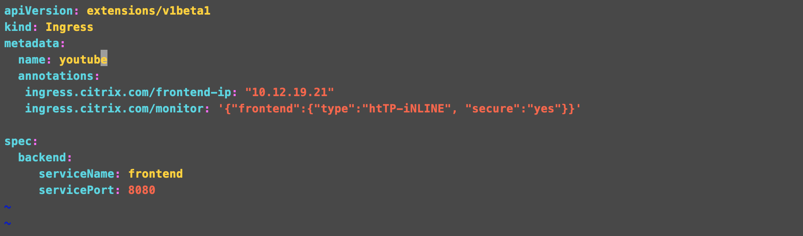

# **Creating monitor for the Application**
	
The topic covers how to create custom monitor for the application which would help to load balance the application better. Smart annnotation on Citrix Ingress Controller can be used for creating various types of Monitor for your applications. To configure monitors on a Web site, you first decide whether to use a built-in monitor or create your own monitor. If you create a monitor, you can choose between creating a monitor based on a built-in monitor, or creating a custom monitor that uses a script that you write to monitor the service. Once you have chosen or created a monitor, you can use smart annotation which manages the monitor lifecyle for your application. 
 

## **Smart annotation for monitor**

Anotation  created for monitor is ```ingress.citrix.com/monitor``` which can be used to create monitor of your choice. Citrix Ingress controller internally creates the monitor and bound to the right service.


## **Configure a builtin Monitor**
  
  The NetScaler appliance contains a number of built-in monitors that you can use to monitor your services. These built-in monitors handle most of the common protocols. Based on the application you can choose the builtin monitor which suits your application. 
Here, we will show how we can use HTTP-Inline monitor the http application with help of smart annotation.

```
ingress.citrix.com/monitor: '{"frontend":{"type":"htTP-iNLINE", "secure":"yes"}}'
```
In this example service called frontend is configured with http inline monitor with secure type as yes. When citrix ingress controller gets this, it creates a monitor and bind with the service frontend.

  Sample ingress.

  

## **Configure a user monitor**

  To configure a user monitor, you must write a script that the monitor uses to check the services that are bound to it. Upload the script to the /nsconfig/monitors directory on the NetScaler appliance. Give executable permission to the script. If the monitor type is a protocol that the NetScaler appliance does not support, only then you must use the monitor of type USER. There are few custom monitors are already built and packaged with ADC which can be directly use. Following are already provided scripts.

  

  Here we are using a user monitor for SFTP application. Name of the service used here is sftp and type of monitor is USER. Providing the script ```nssftp.pl``` which is already available in ADC.

  ```
    ingress.citrix.com/monitor: '{"sftp":{"type":"USER", "scriptname":"nssftp.pl", "scriptargs":"file=/sftp/incoming/test.log;user=admin;password=admin"}}'
  ```  

  Sample ingress.

  
  
  When this ingress applied for the service sftp, a user monitor will be created on ADC and bound to the service.  
  
  


