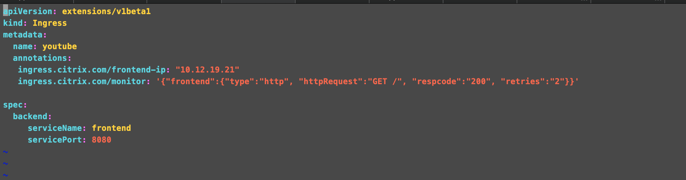
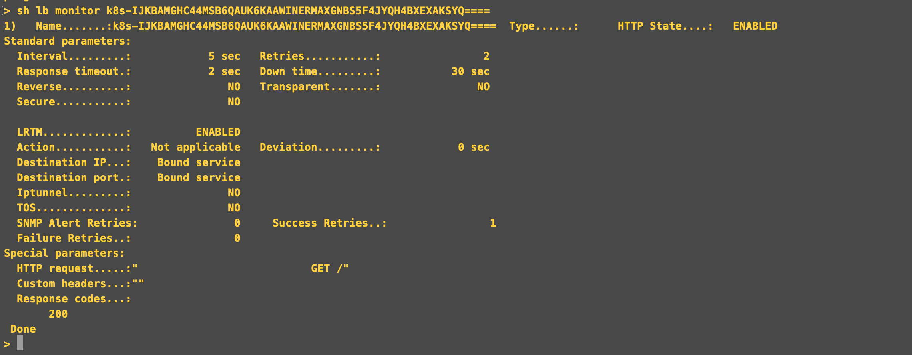
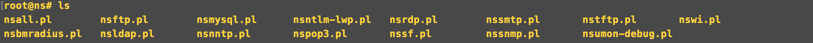
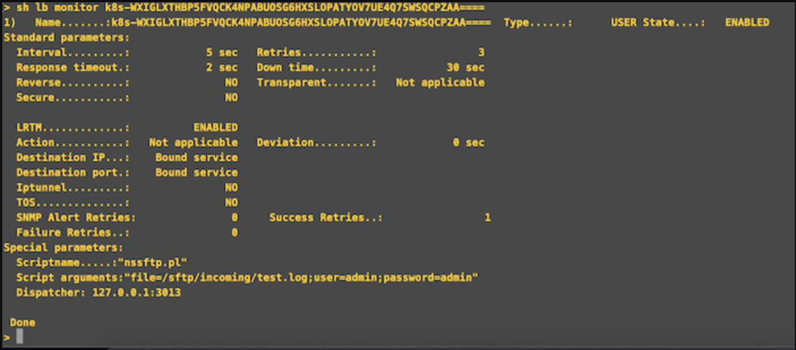

# Creating monitors for applications

The topic covers how to create monitors for applications which would help to load balance applications better.

Citrix ADC supports two types of monitors.

1. Built-in monitors
2. Custom monitors

A smart annotation on the Citrix ingress controller can be used for creating various types of monitors for your applications. You can choose between creating a monitor based on a built-in monitor, or creating a custom monitor that uses a script that you write to monitor the service. Once you have chosen or created a monitor, you can use the smart annotation to manage your application monitor lifecycle.

## Smart annotation for monitor

You can use the  ```ingress.citrix.com/monitor```  smart annotation which can be used to create a monitor of your choice. The Citrix Ingress controller internally creates the monitor and bounds it to the right service.

## Configure a built-in monitor
  
The Citrix ADC appliance contains various built-in monitors that you can use to monitor your services. These built-in monitors handle most of the common protocols. Based on your application needs, you can choose the built-in monitor which suits your application.

Here is an example of using an HTTP monitor with the help of smart annotation.

```
ingress.citrix.com/monitor: '{"frontend":{"type":"http", "httpRequest":"GET /", "respcode":"200", "retries":"2"}}'
```

In this example, a service called ```frontend``` is configured with an HTTP monitor which sends a GET request and expects the HTTP response code 200. When the Citrix ingress controller gets this event, it creates a monitor and binds the monitor with the corresponding service.

  A sample Ingress is shown as follows:

  

  Corresponding ADC configurations are as follows:

  

## Configure a custom monitor**

In addition to built-in monitors, you can use custom monitors to check the state of your services. The Citrix ADC appliance provides several types of custom monitors based on scripts that are included with the Citrix ADC operating system. These monitors can be used to determine the state of services based on the load on the service or network traffic sent to the service. These are the inline monitors, user monitors, and load monitors. You can either use the provided functionality or you can create your own scripts and use those scripts to determine the state of the service to which the monitor is bound.

Following are the scripts which are provided by Citrix ADC:

  

  Here, we are using a user monitor for SFTP application. The name of the service used here is `sftp` and type of monitor is `USER`. Providing the script ```nssftp.pl``` which is already available in Citrix ADC.

  ```
    ingress.citrix.com/monitor: '{"sftp":{"type":"USER", "scriptname":"nssftp.pl", "scriptargs":"file=/sftp/incoming/test.log;user=admin;password=admin"}}'
  ```  

  A sample Ingress is shown as follows:

  
  
  When this Ingress is applied for the service `sftp`, a user monitor is created on the Citrix ADC and bound to the service.  
 
  Corresponding ADC configurations are shown as follows:

  
