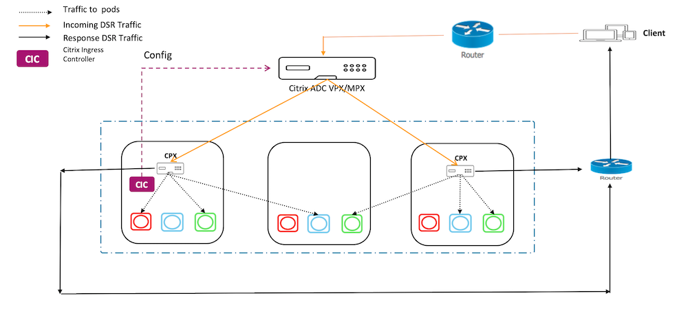
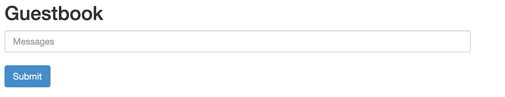

# Deploy Direct Server Return

In a typical load-balanced system, a load balancer acts as a mediator between
web servers and clients. Incoming client requests are received by the load balancer and it passes the requests to the appropriate server with slight modifications to the data packets. The server responds to the load balancer with the required data and then the load balancer forwards the response to the client.

In a Direct Server Return (DSR) deployment, load balancer forwards the client request to the server, but the back-end server directly sends the response to the client. The use of different network paths for request and response helps to avoid extra hops and reduces the latency. Because the server directly responds to the client, DSR speeds up the response time between the client and the server and also removes some extra load from the load balancer. Using DSR is a transparent way to achieve increased network performance for your applications with little to no infrastructure changes.
For more information on DSR using Citrix ADC, see the [Citrix ADC documentation](https://docs.citrix.com/en-us/citrix-adc/13/load-balancing/load-balancing-dsrmode.html).

DSR solution is useful in the following situations:

- While handling applications that deliver video streaming where low latency (response time) matters.
- Where intelligent load balancing is not required
- When the output capacity of the load-balancer can be the bottleneck

However, when you use the DSR advanced layer 7 load balancing features are not supported.

## DSR network topology for Kubernetes using Citrix ADC

In this topology, there is an external load-balancer (Tier-1 ADC) that distributes the traffic to the ingress ADC (Tier 2 ADC) deployed inside the Kubernetes cluster over an overlay (L3 DSR IPIP). Tier-2 ADC picks up the packet, decapsulate the packet, and performs load balancing among services. The Tier-2 ADC sends the return traffic from service to the client instead of sending it via Tier-1 ADC.



## Deploying DSR for cloud native applications using Citrix ADC

Perform the steps in the following sections to deploy DSR for applications deployed on the Kubernetes cluster.

###  Deploy Citrix ADC CPX as Tier-2 ADC

This section contains steps to create configurations required on the ingress device for DSR topology.

1. Create a namespace for DSR using the following command.
	
	    kubectl apply -f  https://raw.githubusercontent.com/citrix/citrix-k8s-ingress-controller/master/example/dsr/KubernetesConfig/dsr_namespace.yaml

1. Create a ConfigMap using the following command.

	
        kubectl apply -f  https://raw.githubusercontent.com/citrix/citrix-k8s-ingress-controller/master/example/dsr/KubernetesConfig/cpx_config.yaml  -n dsr
     
    **Note:** In this example, the Citrix Node Controller network is configured as 192.168.1.0/24. Hence, the command to create IP tunnel is provided as `add iptunnel  dsr 192.168.1.254  255.255.255.0 *`. You need to specify the value according to your CNC configuration.
   

2. Deploy Citrix ADC CPX on the namespace `dsr`.

	
	    kubectl apply -f https://raw.githubusercontent.com/citrix/citrix-k8s-ingress-controller/master/example/dsr/KubernetesConfig/citrix-k8s-cpx-ingress.yml  -n dsr

###  Deploying a sample application on the Kubernetes cluster

Perform the steps in this section to deploy a sample application on Kubernetes cluster.

1. Deploy the guestbook application using the following command.

        kubectl apply -f https://raw.githubusercontent.com/citrix/citrix-k8s-ingress-controller/master/example/dsr/KubernetesConfig/guestbook-all-in-one.yaml  -n dsr 

1. Expose the guestbook application using Ingress.

	 1. Download the guestbook ingress YAML file using the following command.

	
	        wget https://raw.githubusercontent.com/citrix/citrix-k8s-ingress-controller/master/example/dsr/KubernetesConfig/guestbook-all-in-one.yaml
	

	1. Edit and provide the DSR IP or public IP address through which you access your application using the ```ingress.citrix.com/frontend-ip:``` annotations.

            ingress.citrix.com/frontend-ip: "<ip-address>"
	
    1. Save the YAML file and deploy the Ingress resource using the following command.
   
     	    kubectl apply -f guestbook-ingress.yaml -n dsr


###  Establish network connectivity between Tier-1 and Tier-2 ADCs

Perform the steps in this section to establish network connectivity between Tier-1 and Tier-2 ADCs.

1. Download the YAML to deploy Citrix Node Controller using the following command.
	
	    wget https://raw.githubusercontent.com/citrix/citrix-k8s-node-controller/master/deploy/citrix-k8s-node-controller.yaml
	
2. Edit the YAML file and provide the values for NS_IP, NS_USER, NS_PASSWORD, and REMOTE_VTEPIP arguments. For detailed information, see [Citrix Node Controller](https://github.com/citrix/citrix-k8s-node-controller).

3. Save the YAML file and deploy the Citrix Node Controller.
	
           kubectl create -f citrix-k8s-node-controller.yaml -n dsr

### Deploy the Citrix ingress controller for Tier-1 ADC and expose Citrix ADC CPX as a service. 

Perform the following steps to deploy the Citrix ingress controller as a stand-alone pod and create an Ingress resource for Tier-2 Citrix ADC CPX.

   1. Download the Citrix Ingress Controller YAML file using the following command.
	
            wget https://raw.githubusercontent.com/citrix/citrix-k8s-ingress-controller/master/example/dsr/KubernetesConfig/citrix-k8s-ingress-controller.yaml


   2. Edit the YAML file and update the following values for Citrix Ingress Controller.

        - NS_IP
        - NS_USER
        - NS_PASSWORD
  
        For more information, see [Deploy the Citrix ingress controller using YAML](https://developer-docs.citrix.com/projects/citrix-k8s-ingress-controller/en/latest/deploy/deploy-cic-yaml/#deploy-citrix-ingress-controller-as-a-pod).

   3. Save the YAML file and deploy the Citrix Ingress Controller.

	
           kubectl create -f citrix-k8s-ingress-controller.yaml -n dsr

   4. Create DSR configuration on Tier-1 ADC by creating an ingress resource for the Tier-2 Citrix ADC CPX.
	
	        wget https://raw.githubusercontent.com/citrix/citrix-k8s-ingress-controller/master/example/dsr/KubernetesConfig/vpx-ingress.yaml 
	
   5. Edit the YAML file and provide the DSR or public IP address through which user access your application using the ```ingress.citrix.com/frontend-ip:``` annotation. This IP address must be same as the IP address you have specified in step 2.
	
     	    kubectl apply -f vpx-ingress.yaml  -n dsr
	
### Test the DSR deployment

To test the DSR deployment, access the application from a browser using the IP address specified for the ```ingress.citrix.com/frontend-ip:``` annotation. A guestbook page is populated.

A sample output is given as follows:



<a name="misc"></a>


## Troubleshooting

When you test the application, it might not populate any pages even though all the required configurations are created. This is because of ```rp_filter``` rules on the host. If you experience such an issue, use the following commands on all the hosts to disable the rules.

        sysctl -w net.ipv4.conf.all.rp_filter=0
        sysctl -w net.ipv4.conf.cni0.rp_filter=0
        sysctl -w net.ipv4.conf.eth0.rp_filter=0
        sysctl -w net.ipv4.conf.cni0.rp_filter=0
        sysctl -w net.ipv4.conf.default.rp_filter=0
