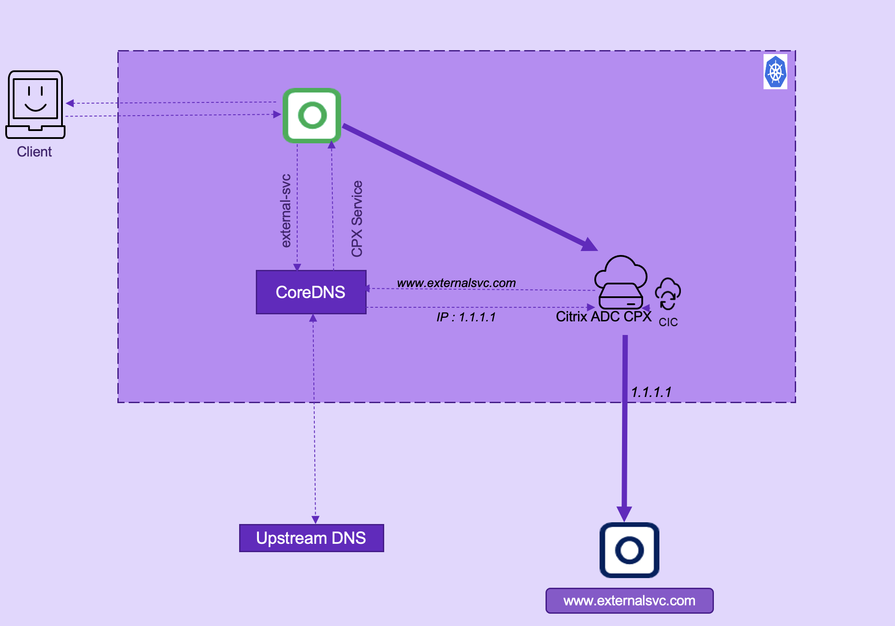

# Traffic management and observability of external services

Sometimes, all the available services of an application may not be deployed completely on a single Kubernetes cluster. You may have applications that rely on the services outside of one cluster as well. In this case, micro services need to define an [ExternalName](https://kubernetes.io/docs/concepts/services-networking/service/#externalname) service to resolve the domain name. However, in this approach, you would not be able to get features such as traffic management, policy enforcement, fail over management and so on. As an alternative, you can configure Citrix ADC to resolve the domain names and leverage the features of Citrix ADC.

## Configure Citrix ADC to reach external services

You can configure Citrix ADC as a domain name resolver using Citrix ingress controller. When you configure Citrix ADC as domain name resolver, you need to resolve:

 - Reachability of Citrix ADC from microservices
 - Domain name resolution at Citrix ADC to reach external services

### Configure a service for reachability from Kubernetes cluster to Citrix ADC

To reach Citrix ADC from microservices, you have to define a headless service which would be resolved to a Citrix ADC service and thus the connectivity between microservices and Citrix ADC establishes.

    apiversion: v1
    kind: Service
    metadata: 
     name: external-svc
    spec:
     selector:
      app: cpx
    ports:
      - protocol: TCP
        port:80

### Configure Citrix ADC as a domain name resolver using Citrix ingress controller

You can configure Citrix ADC through Citrix ingress controller to create a domain based service group using the ingress annotation `ingress.citrix.com/external-service`. The value for `ingress.citrix.com/external-service` is a list of external name services with their corresponding domain names. For Citrix ADC VPX, name servers are configured on Citrix ADC using the ConfigMap.

**Note:** ConfigMaps are used to configure name servers on Citrix ADC only for Citrix ADC VPX. For Citrix ADC CPX, CoreDNS forwards the name resolution request to the upstream DNS server.

### Traffic management and service graph plotting using Citrix ADC CPX

The following diagram explains Citrix ADC CPX deployment to reach external services. An Ingress is deployed where the external service annotation is specified to configure DNS on Citrix ADC CPX.

**Note:**
A ConfigMap is used to configure name servers on Citrix ADC VPX.



In this deployment:

1. A microservice sends the DNS query for www.externalsvc.com which would get resolved to the Citrix ADC CPX service.
2. Citrix ADC CPX resolves www.externalsvc.com and reaches external service.

Following are the steps to configure Citrix ADC CPX to load balance external services:

1. Define a headless service to reach Citrix ADC.

        apiVersion: v1
        kind: Service
        metadata:
          name: external-svc
        spec:
          selector:
            app: cpx
          ports:
            - protocol: TCP
              port: 80

1. Define an ingress and specify the external-service annotation as specified in the [dbs-ingress.yaml](https://github.com/citrix/citrix-k8s-ingress-controller/tree/master/example/load-balance/external/db-ingress.yaml) file. When you specify this annotation, Citrix ingress controller creates DNS servers on Citrix ADC and binds the servers to the corresponding service group.

          apiVersion: networking.k8s.io/v1
          kind: Ingress
          metadata:
            name: dbs-ingress
            annotations:
              kubernetes.io/ingress.class: "cpx-ingress"
              ingress.citrix.com/external-service: '{"external-svc": {"domain": "www.externalsvc.com"}}'
          spec:
            rules:
            - host:  "www.portal.externalsvc.com"
              http:
                paths:
                - backend:
                    service:
                      name: my-external-service
                      port:
                        number: 30036
                  path: /
                  pathType: Prefix

1. Add the IP address of the DNS server on Citrix ADC using ConfigMap.

   **Note:** This step is applicable only for Citrix ADC VPX.

    ```
    apiVersion: v1
    kind: ConfigMap
    metadata:
      name: nameserver-cmap
      namespace: default
    data:
      NS_DNS_NAMESERVER: '[]'
    ```
  