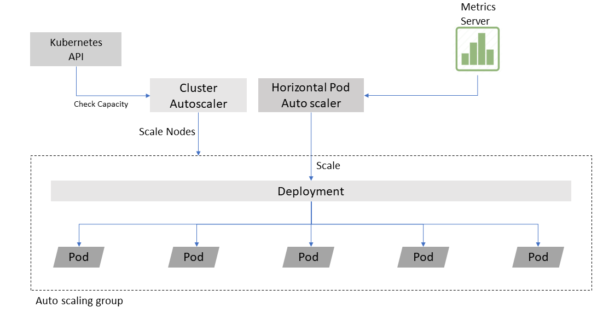
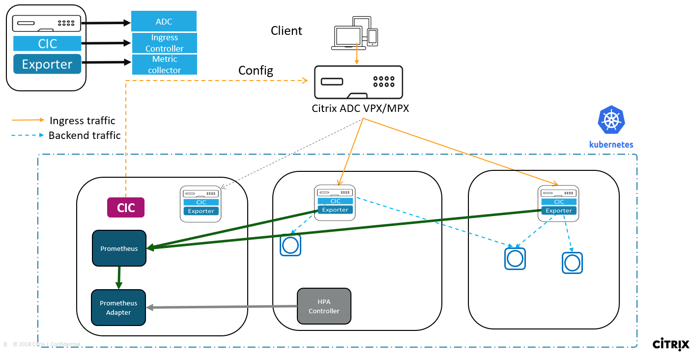

# Horizontal pod autoscaler for Citrix ADC CPX with custom metrics

While deploying workloads in a Kubernetes cluster for the first time, it is difficult to exactly predict the resource requirements and how those requirements might change in a production environment. Using Horizontal pod autoscaler (HPA), you can automatically scale the number of pods in your workload based on different metrics like actual resource usage. HPA is a resource provided by Kubernetes which scales Kubernetes based resources like deployments, replicasets, and replication controllers.

Traditionally, HPA gets the required metrics from a metrics server. It then periodically adjusts the number of replicas in a deployment to match the observed average metrics to the target you specify.

Citrix provides a custom-metric based HPA solution for Citrix ADC CPX.
By default, the metrics server only gives CPU and memory metrics for a pod.
Citrix ADC provides a rich set of in-built metrics for analyzing application performance and based on these metrics you can take a better autoscaling judgment. A custom metric based HPA is a better solution like autoscaling based on HTTP request rate, SSL transactions, or ADC bandwidth.

## Citrix ADC CPX HPA solution

Citrix ADC CPX HPA solution consists of the following components:

- Citrix ADC VPX: Citrix ADC VPX or MPX is deployed at Tier-1 and load balances the client requests among the Citrix ADC CPX pods inside the cluster.

- Citrix ADC CPX: Citrix ADC CPX deployed inside the cluster acts as a Tier-2 load balancer for the endpoint application pods. The Citrix ADC CPX pod is running along with the Citrix ingress controller and Citrix ADC metric exporter as sidecars.

- Citrix ingress controller: The [Citrix ingress controller](https://github.com/citrix/citrix-k8s-ingress-controller) is an ingress controller which is built around the Kubernetes Ingress and automatically configures Citrix ADC based on the Ingress resource configuration. The Citrix ingress controller deployed as a stand-alone pod configures the Citrix ADC VPX and other instances configures Citrix ADC CPXs.

- Citrix ADC metrics exporter: The [Citrix ADC metrics exporter]((https://github.com/citrix/citrix-adc-metrics-exporter)) exports the application performance metrics to the open-source monitoring system Prometheus. The Citrix ADC Metrics Exporter collects metrics from Citrix ADC CPX and exposes it in a format that Prometheus can understand.

- Prometheus: Prometheus is an open-source systems monitoring and alerting toolkit. Prometheus is used to collect all metrics from Citrix ADC CPXs and expose them using a Prometheus adapter which is queried by the HPA controller to keep a check on metrics.

- Prometheus adapter: Prometheus adapter contains an implementation of the Kubernetes resource metrics API and custom metrics API. This adapter is suitable for use with the autoscaling/v2 HPA in Kubernetes version 1.6+. It can also replace the metrics server on clusters that already run Prometheus and collect the appropriate metrics.

The following diagram is a visual representation of how the Citrix ADC CPX HPA solution works.

The Tier-1 Citrix ADC VPX load balances the Citrix ADC CPXs at Tier-2. Citrix ADC CPXs load balance applications. Other components like Prometheus, Prometheus-adapter, and an HPA controller is also deployed.

The HPA controller keeps polling the Prometheus-adapter for custom metrics like HTTP requests rate or bandwidth. Whenever the limit defined by the user in the HPA is reached, the HPA controller scales the Citrix ADC CPX deployment and creates another Citrix ADC CPX pod to handle the load.

## Deploy Citrix ADC CPX HPA solution

Perform the following steps to deploy the Citrix ADC CPX HPA solution.

1. Clone the citrix-k8s-ingress-controller repository from GitHub using the following command.

        git clone https://github.com/citrix/citrix-k8s-ingress-controller.git

   After cloning, change your directory to the HPA folder with the following command.

        cd citrix-k8s-ingress-controller/blob/master/hpa

2. From the HPA directory, open and edit the `values.sh` file and set the following values for Citrix ADC VPX.

   
   - `VPX_IP`: IP address of the Citrix ADC VPX 
   - `VPX_PASSWORD`: The password of the `nsroot` user on the Citrix ADC VPX
   - `VIRTUAL_IP_VPX`: The IP address on which the sample guesbook application is accessed.
  
 1. Create all the required resources by running the `create_all.sh` file.

        ./create_all.sh

    This step creates the following resources:

    - Prometheus and Grafana for monitoring
    - Citrix ADC CPX with the Citrix ingress controller and metrics exporter as sidecars
    - Citrix ingress controller as a stand-alone pod to configure Citrix ADC VPX
    - A sample [guestbook](http://www.guestbook.com) application
    - HPA controller for monitoring the Citrix ADC CPX autoscale deployment
    - Prometheus adapter for exposing the custom metrics

3. Add an entry in the `hosts` file. The route must be added in the `hosts` file to route traffic for the [guestbook](http://www.guestbook.com) application to the Citrix ADC VPX virtual IP address.
For most Linux distros, the `hosts` file is present in the `/etc` folder.

1. Send some generated traffic and verify the Citrix ADC CPX autoscale deployment.

   The Citrix ADC CPX deployment HPA has been configured in such a way that when the average HTTP requests rate of the Citrix ADC CPX goes above 20 requests per second, it autoscales. You can use the following scripts provided in the HPA folder for sending traffic:

   - `16_curl.sh` - Send 16 HTTP requests per second (lesser than the threshold)
   - `30_curl.sh` - Send 30 HTTP requests per second (greater than the threshold)
  

   1. Run the `16_curl.sh` script to send 16 HTTP requests per second to the Citrix ADC CPX.
        
          ./16_curl.sh

       Following is a Grafana dashboard which displays HTTP requests per second.
       
       
       Following output shows the HPA state with 16 HTTP RPS.
       

      
   2. Run the `30_curl.sh` script to send 30 HTTP requests per second to Citrix ADC CPX.
   
           ./30_curl.sh

      When you run this script, the threshold of 20 requests that was set has been crossed and the Citrix ADC CPX deployment autoscales from one pod to two pods. The average value of the metric `HTTP request rate` also goes down from 30 to 15 as there are two Citrix ADC CPX pods.
      
      The following diagram shows the state of HPA when the target is crossed.

      

      The following diagram shows that the number of replicas of Citrix ADC CPX have gone up to 2 and the average value of HTTP RPS comes down to 15.

       
       

      The following diagram shows a Grafana dashboard with two Citrix ADC CPXs load balancing the traffic.
     
      

2. Clean up by executing the `delete_all.sh` script.

        ./delete_all.sh

**Note:**

If the Tier-1 Citrix ADC VPX is not present, use [NodePort](https://kubernetes.io/docs/concepts/services-networking/service/#nodeport) to expose the Citrix ADC CPX service.