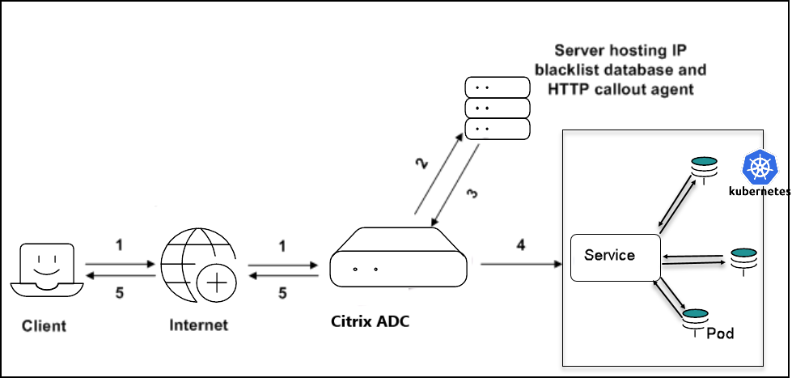
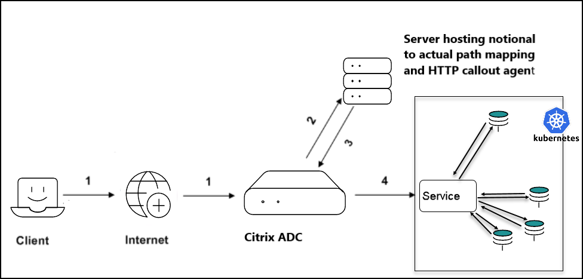

# HTTP callout with the rewrite and responder policy

An HTTP callout allows Citrix ADC to generate and send an HTTP or HTTPS request to an external server (callout agent) as part of the policy evaluation. The information that is retrieved from the server (callout agent) can be analyzed by advanced policy expressions and an appropriate action can be performed. For more information about the HTTP callout, see the [Citrix ADC documentation](https://docs.citrix.com/en-us/citrix-adc/current-release/appexpert/http-callout.html).

You can initiate the HTTP callout through the following expressions with the [rewrite and responder CRD](https://github.com/citrix/citrix-k8s-ingress-controller/blob/master/crd/rewrite-responder-policies-deployment.yaml) provided by Citrix:

- `sys.http_callout()`: This expression is used for blocking the call when the httpcallout agent response needs to be evaluated.

- `sys.non_blocking_http_callout()`: This expression is used for non-blocking calls (for example: traffic mirroring)

These expressions accept the `httpcallout_policy` name defined in the CRD as a parameter, where the name needs to be specified in double quotes.

For example: `sys.http_callout("callout_name")`.
In this expression, `callout_name` refers to the appropriate `httpcallout_policy` defined in the rewrite and responder CRD YAML file.

The following table explains the attributes of the HTTP callout request in the rewrite and responder CRD.

|Parameter|Description|
|--- |--- |
|`name`|Specifies the name of the callout, maximum is up to 32 characters.|
|`server_ip`|Specifies the IP Address of the server (callout agent) to which the callout is sent.|
|`server_port`|Specifies the Port of the server (callout agent) to which the callout is sent.|
|`http_method`|Specifies the method used in the HTTP request that this callout sends. The default value is GET.|
|`host_expr`|  Specifies the text expression to configure the host header. This expression can be a literal value (for example, 10.101.10.11) or it can be an advanced expression (for example, http.req.header("Host")) that derives the value. The literal value can be an IP address or a fully qualified domain name. Mutually exclusive with the full HTTP request expression.|
|`url_stem_expr`| Specifies a string expression for generating the URL stem. The string expression can contain a literal string (for example, "/mysite/index.html") or an expression that derives the value (for example, http.req.url).|
|`headers`| Specifies one or more headers to insert into the HTTP request. Each header  `name` and `exp`, where `exp` is an expression that is evaluated at runtime to provide the value for the named header. |
|`parameters`|Specifies one or more query parameters to insert into the HTTP request URL (for a GET request) or into the request body (for a POST request). Each parameter is represented by a `name` and an `expr`, where `expr` is an expression that is evaluated at run time to provide the value for the named parameter (name=value). The parameter values are URL encoded.|
|`body_expr`|An advanced string expression for generating the body of the request. The expression can contain a literal string or an expression that derives the value (for example, client.ip.src).|
|`full_req_expr`|Specifies the exact HTTP request, in the form of an expression, which the Citrix ADC sends to the callout agent. The request expression is constrained by the feature for which the callout is used. For example, an HTTP.RES expression cannot be used in a request-time policy bank or in a TCP content switching policy bank.|
|`scheme`| Specifies the type of scheme for the callout server. Example: HTTP, HTTPS|
|`return_type`|Specifies the type of data that the target callout agent returns in response to the callout. The available settings function as follows: TEXT - Treat the returned value as a text string. NUM - Treat the returned value as a number. BOOL - Treat the returned value as a boolean value.|
|`cache_for_secs`|Specifies the duration, in seconds, for which the callout response is cached. The cached responses are stored in an integrated caching content group named `calloutContentGroup`. If the duration is not configured, the callout responses are not cached unless a normal caching configuration is used to cache them. This parameter takes precedence over any normal caching configuration that would otherwise apply to these responses.|   
|`result_expr`| Specifies the expression that extracts the callout results from the response sent by the HTTP callout agent. This expression must be a response based expression, that is, it must begin with `HTTP.RES`. The operations in this expression must match the return type. For example, if you configure a return type of `TEXT`, the result expression must be a text based expression. If the return type is `NUM`, the result expression (result_expr) must return a numeric value, as in the following example: `http.res.body(10000).length`|
|`comment`|Specifies any comments to preserve the information about this HTTP callout.|

## Using the rewrite and responder CRD to validate whether a client IP address is blocklisted

This section shows how to initiate an HTTP callout using the rewrite and responder CRD to validate whether a client IP address is blocklisted or not and take appropriate action.

The following diagram explains the workflow of a request where each number in the diagram denotes a step in the workflow:


1. Client request

2. HTTP callout request to check if the client is blocklisted (The client IP address is sent as a query parameter with the name `Cip`)

3. Response from the HTTP callout server

4. Request is forwarded to the service if the response in step 3 indicates a safe IP address (the client IP address is not matching with the blocklisted IP addresses on the callout server).

5. Respond to the client as `Access denied`, if the response in step 3 indicates a bad IP address (the client IP address is matching with the blocklisted IP addresses on the callout server).

The following is a sample YAML file (`ip_validate_responder.yaml`) for validating a blocklisted IP address:

**Note:** You must deploy the [rewrite and responder CRD](https://github.com/citrix/citrix-k8s-ingress-controller/blob/master/crd/rewrite-responder-policies-deployment.yaml) before deploying the `ip_validate_responder` YAML file. 

```yml
apiVersion: citrix.com/v1
kind: rewritepolicy
metadata:
  name: validateip
spec:
  responder-policies:
    - servicenames:
        - frontend
      responder-policy:
        respondwith:
          http-payload-string: '"HTTP/1.1 401 Access denied\r\n\r\n"'
        respond-criteria: 'sys.http_callout("blocklist_callout").CONTAINS("IP Matched")' #Callout name needs to be given in double quotes to pick httpcallout_policy
        comment: 'Invalid access'

  httpcallout_policy:
    - name: blocklist_callout
      server_ip: "192.2.156.160"
      server_port: 80
      http_method: GET
      host_expr: '"192.2.156.160"'
      url_stem_expr: '"/validateIP.pl"'
      headers:
      - name: X-Request
        expr: '"Callout Request"'
      parameters:
      - name: Cip
        expr: 'CLIENT.IP.SRC'		
      return_type: TEXT
      result_expr: 'HTTP.RES.BODY(100)'
```


## Using the rewrite and responder CRD to update the URL with a valid path requested by the client.

This section shows how to initiate an HTTP callout using the rewrite and responder CRD when a path exposed to the client is different from the actual path due to security reasons.

The work flow of a request is explained in the following diagram where each number in the diagram denotes a step in the workflow.




1. Client request

2. HTTP callout request to get the valid path (the path requested from the client is sent as a query parameter with the name path to the callout server)

3. Response from the HTTP callout server

4. The URL request is rewritten with a valid path and forwarded to the service (where the valid path is mentioned between the tags `newpath` in the callout response).

The following is a sample YAML (`path_rewrite`) file.

**Note:** You must deploy the [rewrite and responder CRD](https://github.com/citrix/citrix-k8s-ingress-controller/blob/master/crd/rewrite-responder-policies-deployment.yaml) before deploying the `path_rewrite` YAML file.

```yml
apiVersion: citrix.com/v1
kind: rewritepolicy
metadata:
  name: getvalidpath
spec:
  rewrite-policies:
    - servicenames:
        - frontend
      rewrite-policy:
        operation: replace
        target: http.req.url
        modify-expression: 'sys.http_callout("mapping_callout")' #Callout name needs to be given in double quotes to pick httpcallout_policy
        comment: 'Get the valid path'
        direction: REQUEST
        rewrite-criteria: 'TRUE'

  httpcallout_policy:
    - name: mapping_callout
      server_ip: "192.2.156.160"
      server_port: 80
      http_method: GET
      host_expr: '"192.2.156.160"'
      url_stem_expr: '"/getPath.pl"'
      headers:
      - name: X-Request
        expr: '"Callout Request"'
      parameters:
      - name: path
        expr: 'http.req.url'		
      return_type: TEXT
      result_expr: '"HTTP.RES.BODY(500).AFTER_STR(\"<newpath>\").BEFORE_STR(\"</newpath>\")"'
```

