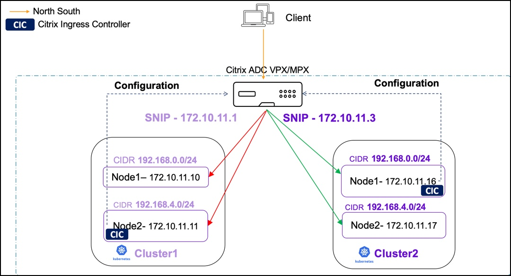

# Policy based routing support for multiple Kubernetes clusters

When you are using a single Citrix ADC to load balance multiple Kubernetes clusters, the Citrix ingress controller adds pod CIDR networks through static routes. These routes establish networking connectivity between Kubernetes pods and Citrix ADC. However, when the pod CIDRs overlap there may be route conflicts. Citrix ADC supports policy based routing (PBR) to address the networking conflicts in such scenarios. In PBR, decisions are taken based on the criteria that you specify. Typically, a next hop is specified where you send the selected packets. In a multi-cluster Kubernetes environment, PBR is implemented by reserving a subnet IP address (SNIP) for each Kubernetes cluster or the Citrix Ingress Controller. Using net profile, the SNIP is bound to all service groups created by the same Citrix ingress controller. For all the traffic generated from service groups belonging to the same cluster, the source IP address is the same SNIP.

Following is a sample topology where PBR is configured for two Kubernetes clusters which are load balanced using a Citrix ADC VPX or MPX.

## Configure PBR using the Citrix ingress controller

To configure PBR, you need one SNIP or more per Kubernetes cluster. You can provide SNIP values either using the environment variable in the Citrix ingress controller deployment YAML file during bootup or using ConfigMap.

Perform the following steps to deploy the Citrix ingress controller and configure PBR using ConfigMap.

1. Download the `citrix-k8s-ingress-controller.yaml` using the following command:

        wget  https://raw.githubusercontent.com/citrix/citrix-k8s-ingress-controller/master/deployment/baremetal/citrix-k8s-ingress-controller.yaml

2. Edit the Citrix ingress controller YAML file:
  
          - Specify the values of the environment variables as per your requirements. For more information on specifying the environment variables, see the [Deploy Citrix ingress controller](https://developer-docs.citrix.com/projects/citrix-k8s-ingress-controller/en/latest/deploy/deploy-cic-yaml/) documentation.

3. Deploy the Citrix ingress controller using the edited YAML file with the following command on each cluster.

        kubectl create -f citrix-k8s-ingress-controller.yaml

4. Create a YAML file `cic-configmap.yaml` with the required SNIP values in the ConfigMap.

    Following is an example for a ConfigMap with the SNIP values:

        
        apiVersion: v1
        kind: ConfigMap
        metadata:
            name: pbr-test
            namespace: default
        data:
            NS_SNIPS: '["192.0.2.2", "192.0.2.1"]'
        

5. Apply the ConfigMap.
   
       kubectl create -f cic-configmap.yaml

You can also specify the SNIPs using the `NS_SNIPS` environment variable in the Citrix ingress controller deployment YAML file.

         - name: "NS_SNIPS"
            value: '["192.0.2.2", "192.0.2.1"]'

The following are the usage guidelines while using ConfigMap for configuring SNIP:

- Only SNIPs can be added or removed via ConfigMap. The `feature-node-watch` argument can only be enabled during bootup.

- When you add a ConfigMap:
   
    - If SNIPs were already provided using the environment variable during bootup and you want to retain them, those SNIPs should be specified in the ConfigMap along with the new SNIPs.

- When you delete ConfigMap:
  
    - All PBRs generated by ConfigMap SNIPs are deleted. If SNIPs are provided via the environment variable, PBR for those IP addresses is added.

    - If SNIPs were not provided using the `NS_SNIPS` environment variable, static routes are added since `feature-node-watch` is enabled.

### Steps to Validate PolicyBasedRoutes(PBR) configuration on the ADC after Deploying Citrix Ingress Controller(CIC)

For the Validation example, we have a two node Kubernetes cluster with Citrix Ingress Controller(CIC) deployed along with the following configmap with two SNIPs.

   

#### Following configuration is added to the ADC by Citrix Ingress Controller:

 1. An IPset of all the NS_SNIPS provided by Configmap is added.
 
       

 2. A Netprofile with SrcIP set to IPset is added.

       

 3. Servicegroup added by Citrix Ingress Controller has the Netprofile set.

       

4. Finally, Policy Based Routes(PBR) is added by Citrix Ingress Controller.
    1. The number of PBRs is (number of snips) * (number of k8s nodes). In this case it adds 4(2*2) policy based routes(PBR).
    2. PBR's srcIP is the NS_SNIPS provided to CIC by configmap, the destIP is the kubernete node's CNI overlay subnet range, the NextHop is kubernetes node's IP. 

          

5. Citrix Ingress Controllers logs can be also used to validate the configuration.
       

## Configure PBR using the Citrix node controller

You can configure PBR using the [Citrix node controller](https://github.com/citrix/citrix-k8s-node-controller) for multiple Kubernetes clusters. When you are using a single Citrix ADC to load balance multiple Kubernetes clusters with Citrix node controller for networking, the static routes added by it to forward packets to the IP address of the VXLAN tunnel interface may cause route conflicts. To support PBR, Citrix node controller needs to works in conjunction with the Citrix ingress controller to bind the Netprofile to the service group. 

Perform the following steps to configure PBR using the Citrix node controller:

1. While starting the Citrix node controller, provide the `CLUSTER_NAME` as an environment variable.  Specifying this variable indicates that it is a multi-cluster deployment and the Citrix node controller configures PBR instead of static routes.  
    
    Example:

        - name: CLUSTER_NAME 
          value: "dev-cluster"

2. While deploying the Citrix ingress controller, provide the `CLUSTER_NAME` as an environment variable. This value should be same as the value provided in Citrix node controller.

    Example:  

        - name: CLUSTER_NAME  
          value: "dev-cluster "

1. Specify the argument `--enable-cnc-pbr` as `True` in the arguments section of the Citrix ingress controller deployment YAML file. When you specify this argument, Citrix ingress controller is aware that the Citrix node controller is configuring PBR on the Citrix ADC.

    Example:

        args: 
         - --enable-cnc-pbr True          

**Note:** The value provided for `CLUSTER_NAME` in the Citrix node controller and Citrix ingress controller deployment files should match when they are deployed in the same Kubernetes cluster.

**Note:** `CLUSTER_NAME` is used while creating the net profile entity and binding it to service groups on Citrix ADC VPX or MPX.

### Steps to Validate PolicyBasedRoutes(PBR) configuration on the ADC after Deploying Citrix Node Controller(CNC).

For the Validation example, we have a two node Kubernetes cluster with Citrix Node Controller(CNC) and Citrix Ingress Controller(CIC) deployed. 

#### Following configuration is added to the ADC by Citrix Node Controller:

  1. A Netprofile is added, with srcIP set to the SNIP added by Citrix Node Controller to create the VXLAN tunnel Network between the ADC and the kubernetes Nodes.
  
   

  2. Citrix Ingress Controller makes sure to bind the Netprofile to servicegroups it creates.

   
  
  3. Finally, Policy Based Routes(PBR) is added by Citrix Node Controller.
     1. The number of PBRs is equal to number of k8s nodes. In this case it adds 2 policy based routes(PBR).
     2. PBR's srcIP is the SNIP added by CNC in tunnel network, the destIP is the kubernete node's CNI overlay subnet range, the NextHop is kubernetes Node's VXLAN Tunnel interface's IPAddress. 
         

